# 理解主成分分析

> 原文：<https://medium.com/analytics-vidhya/understanding-principle-component-analysis-3b310ad36163?source=collection_archive---------20----------------------->

法国普罗旺斯凡尔登峡谷

主成分分析(PCA)广泛应用于机器学习和数据科学。PCA 在低维空间中找到模型数据的表示，而不会丢失大量信息。这种数据压缩过程可用于数据可视化和分析，以及加速机器学习算法和流水线。

让我们了解 PCA 是如何工作的，我们有了模型的数据:

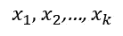

在哪里

该模型有 k 个数据点，每一个都是一个 l 维向量，我们希望在 m 维的低维空间中找到数据的表示

We start by normalising the data across the l dimensions, for every dimension j we compute the mean across the data points:

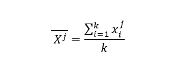

And for every dimension j and data point i instead of taking:

we take the normalised value:

For simplicity we continue using the original notation:

for the normalised data points.

We define the data matrix X, the columns are our data points and the rows hold the l dimensions of the data:

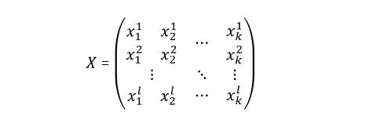

For every pair of dimensions i,j =1,2,…,l we compute the covariance:

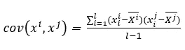

and define the data covariance matrix COV(X):

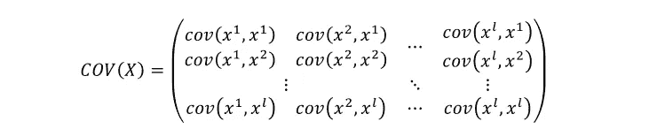

For example entry (1,2) is computed by:

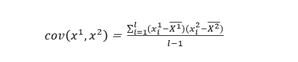

using the mean values of the first and second dimensions:

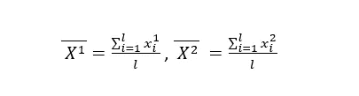

Notice that COV(X) is symmetric since for every i,j=1,2,…,l we have:

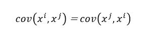

Next we compute the eigenvalues:

and eigenvectors of the covariance matrix:

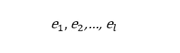

where

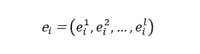

**，这些特征向量被称为数据的主分量，代表数据中显著方差的方向**，主分量 e1 在方差最大的方向，主分量 e2 在第二大的方向，依此类推。

例如，假设我们的数据具有以下形式:

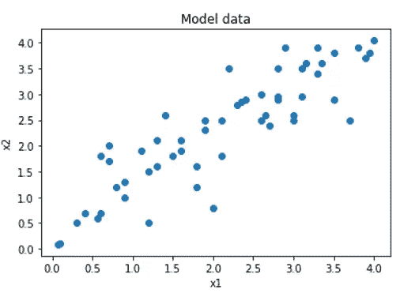

那么主要分量 e1、e2 将是:

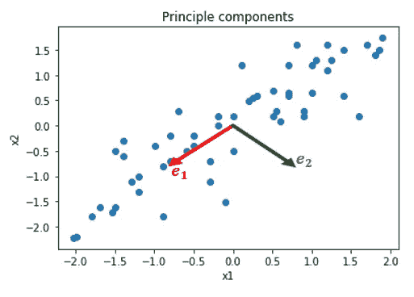

可以看出，e1 捕获数据中最大变化量的方向，e2 捕获第二大变化量的方向。

协方差矩阵的特征值也包含关于数据的有价值的信息，它们代表数据在主分量方向上的方差。

在下图中，我们在主分量 e1、e2 的方向上有一对向量 v1、v2。相应地，可以看出，v1、v2 的幅度捕捉到了数据的扩展。

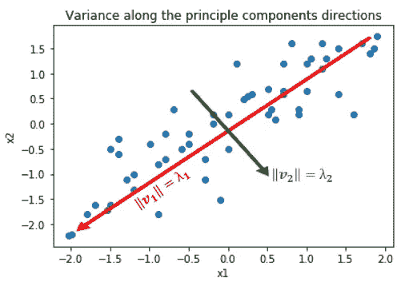

现在我们有了协方差矩阵的特征值和特征向量，我们可以选择一个较低的维数 m < 1，并定义特征向量矩阵 E。E 的行是捕获数据中最大方差的 m 个特征向量，通过取对应于 m 个最大特征值的特征向量来选择这些特征向量。

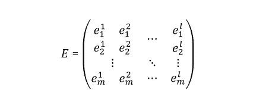

我们将 X 乘以 E，并将我们的数据从 l 维空间投影到由 m 个主分量构成的较低的 m 维空间

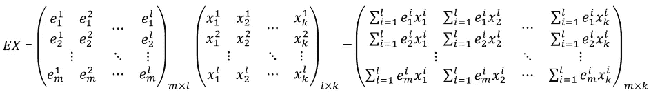

为了便于记记，我们写下

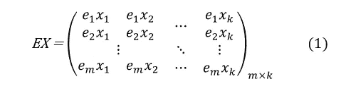

通过忠实于我们最初的符号，我们可以把 EX 写成

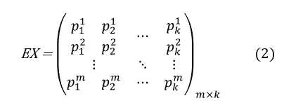

我们的多维数据集是

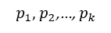

在哪里

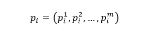

我们完事了。

请注意，对于每个 i=1，2，…，k，矩阵 EX(1)中的列 I 包含数据点 xi 在 m 个主分量方向上的投影，我们在矩阵 EX(2)中的符号捕捉到了这一点，k 个 m 维数据点是列，m 个主分量在行中表示。