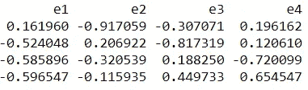
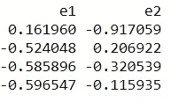

# 逐步理解主成分分析。

> 原文：<https://medium.com/analytics-vidhya/understanding-principle-component-analysis-pca-step-by-step-e7a4bb4031d9?source=collection_archive---------0----------------------->

诺德伍德主题公司在 [Unsplash](https://unsplash.com?utm_source=medium&utm_medium=referral) 上拍摄的照片

# 介绍

**主成分分析** ( **PCA** )是一种用于降维的统计程序。它使用正交变换将一组可能相关变量的观察值转换为一组称为主成分的线性不相关变量的值。它经常被用作降维技术。

# PCA 中涉及的步骤

***第一步:*** 将数据集标准化。

***步骤 2:*** 计算数据集中要素的协方差矩阵。

***第三步:*** 计算协方差矩阵的特征值和特征向量。

***第四步:*** 对特征值及其对应的特征向量进行排序。

***第五步:*** 挑 k 个特征值，组成特征向量矩阵。

**第六步:**对原矩阵进行变换。

让我们一步一步来。

## **1。标准化数据集**

假设我们有下面的数据集，它有 4 个特征和总共 5 个训练示例。

数据集矩阵

首先，我们需要标准化数据集，为此，我们需要计算每个要素的平均值和标准差。

标准化公式

标准化前的平均值和标准偏差

对数据集中的每个要素应用公式后，将进行如下变换:

标准化数据集

## 2.计算整个数据集的协方差矩阵

计算协方差矩阵的公式:

协方差公式

给定数据集的协方差矩阵计算如下

因为我们已经标准化了数据集，所以每个特征的**平均值为 0** ，标准差为 1。

var(f1)=((-1.0-0)+(0.33-0)+(-1.0-0)+(0.33–0)+(1.33–0))/5
**var(f1)= 0.8**

cov(f1，F2)=
(-1.0–0)*(-0.632456-0)+
(0.33–0)*(1.264911-0)+
(-1.0–0)*(0.632456-0)+
(0.33–0)*(0.000000-0)+
(1.33–0)*(-1.266

以类似的方式，他可以计算其他协方差，这将导致下面的协方差矩阵

协方差矩阵(人口公式)

## 3.计算特征值和特征向量。

**特征向量**是一个非零向量，当对其应用线性变换时，它最多改变一个标量因子。对应的**特征值**是特征向量缩放的因子。

设 A 是一个方阵(在我们的情况下是协方差矩阵)，ν a 向量和λ a 标量满足 Aν = λν，则λ称为与 A 的特征向量ν相关联的特征值
重新排列上面的等式，

> aν-λν= 0；(A-λI)ν = 0

因为我们已经知道ν是一个非零向量，这个方程可以等于零的唯一方法是，如果

> det(A-λI) = 0

A-λI = 0

解上面的方程= 0

***λ = 2.51579324，1.0652885，0.39388704，0.02503121***

**特征向量:**

求解具有不同λ值的ν向量的(A-λI)ν = 0 方程:

对于λ = *2.51579324，使用克莱姆法则求解上述方程，v 向量的值为*

*v1 = 0.16195986
v2 =-0.52404813
v3 =-0.58589647
v4 =-0.59654663*

通过同样的方法，我们可以计算其他特征值的特征向量。我们可以用特征向量来构造矩阵。

特征向量(4 * 4 矩阵)

## ***4。*对特征值及其对应的特征向量进行排序。**

因为在这种情况下特征值已经排序，所以不需要再次排序。

## ***5。*** 挑选 k 个特征值，形成一个特征向量矩阵

如果我们选择前 2 个特征向量，矩阵将如下所示:

前 2 个特征向量(4*2 矩阵)

## 6。变换原矩阵。

特征矩阵*前 k 个特征向量=转换后的数据

数据转换

# 比较 sklearn 库

使用 Sklearn 的 PCA 的代码片段

结果是一样的，只有 PC1 的方向发生了变化，根据我的说法，没有任何区别，就像这里提到的[和](https://stats.stackexchange.com/questions/30348/is-it-acceptable-to-reverse-a-sign-of-a-principal-component-score)一样。因此，我们已经成功地将我们的数据从 4 维转换到 2 维。当数据特征高度相关时，PCA 最有用。

由于这是我的第一个博客，我欢迎大家提出建议，请务必在我的 [GitHub](https://github.com/gskdhiman/Understanding-PCA) 上查看上面的代码版本。