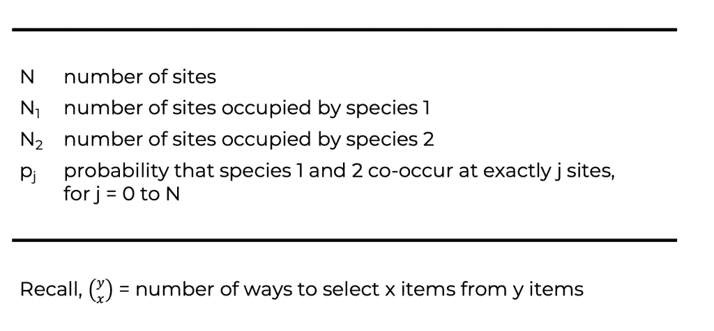
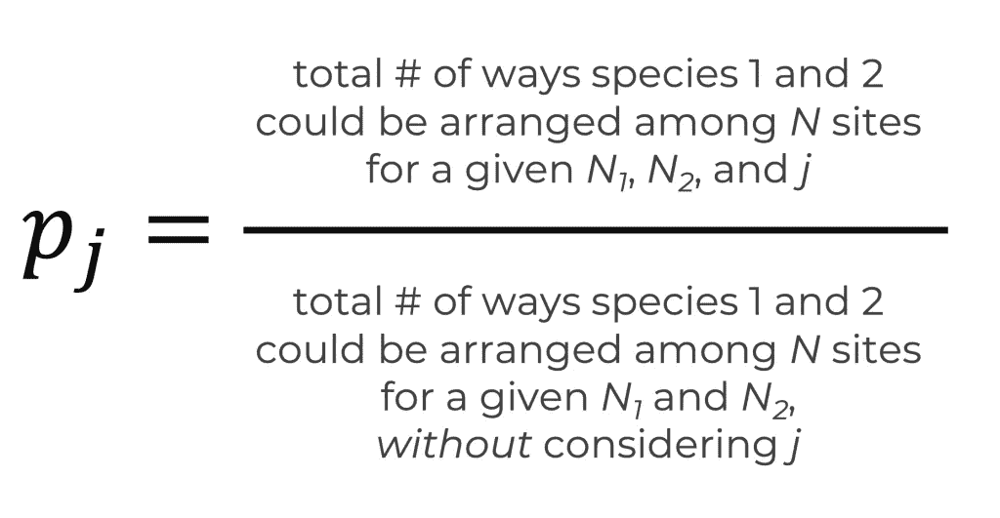
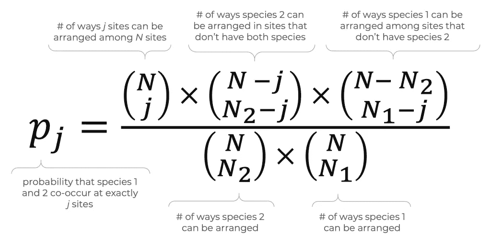
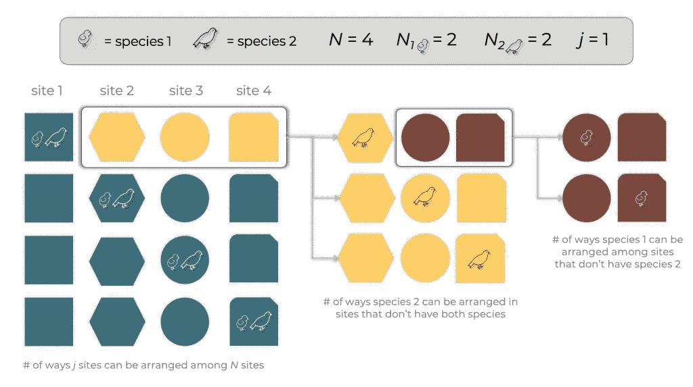
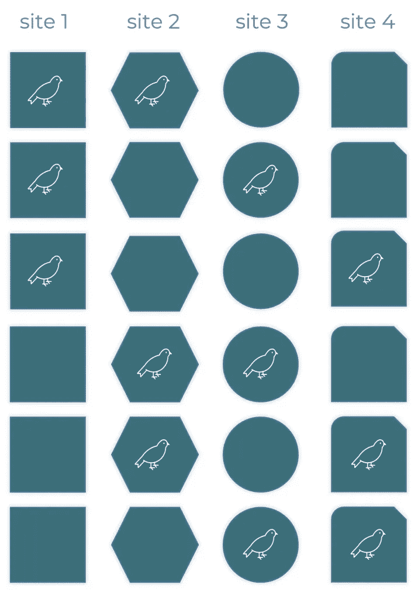
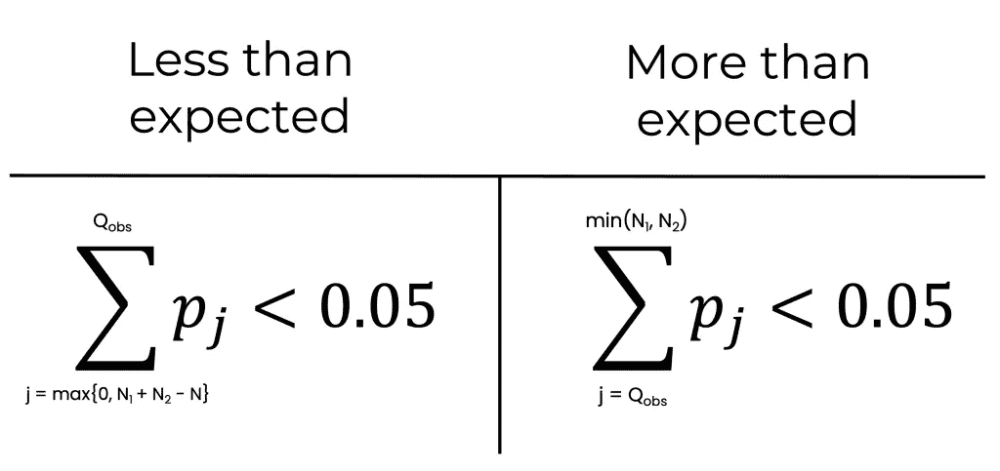
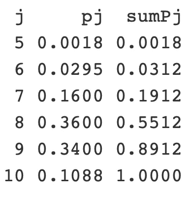

# 理解物种共现

> 原文：<https://medium.com/analytics-vidhya/understanding-probabilistic-species-co-occurrence-71d9382293b1?source=collection_archive---------18----------------------->

## 计算单位为 R

在生态学中，同现网络可以帮助我们通过重复测量物种的存在或不存在来确定物种之间的关系。在评估潜在关系时，我们可能会问:给定存在-缺失数据，两个物种同时出现的频率是高于还是低于偶然的预期？有点令人惊讶的是，虽然共现分析自 70 年代以来就已经存在，但没有普遍认可的方法来测量共现并测试其统计意义(Veech，2012)。在这篇文章中，我们将检验在 Veech 的 [*中看到的概率模型，这是一个用于分析物种共现*](https://onlinelibrary.wiley.com/doi/full/10.1111/j.1466-8238.2012.00789.x) (2012) *的概率模型。*在开始计算 r 中的同现概率之前，我们将从定义模型开始。要查看这篇带有适当下标的文章，请转到原始的[文章](https://thatdarndata.com/understanding-species-co-occurrence/)。


照片由 [Wynand van Poortvliet](https://unsplash.com/@wwwynand?utm_source=unsplash&utm_medium=referral&utm_content=creditCopyText) 在 [Unsplash](https://unsplash.com/@brooke_tdd/likes?utm_source=unsplash&utm_medium=referral&utm_content=creditCopyText) 上拍摄。

# 定义共现的概率模型



概率模型的符号。

## 概观

为了了解两个物种共现的频率是高于还是低于预期，我们首先需要知道两个物种在给定数量的位点上共现的概率。这将取决于取样地点的数量( *N* )和每个物种栖息的地点数量( *N1* 和 *N2* )。利用这些信息，我们可以确定 *pj* ，对于 *j* = 0… *N* ，两个物种恰好在 *j* 地点同时出现的概率。为了计算 *pj* ，我们将计算物种 1 和 2 在 *N* 站点中同时出现在 *j* 站点中的方式数，并除以物种 1 和 2 在 *N* 站点中的方式总数(等式。1).



情商。一

## pj 背后的数学

的分子可以通过以下方法计算:1)在 N 个位置中可以排列的方式数，2)在没有两个物种的剩余位置中可以排列物种 2 的方式数，3)在没有物种 2 的位置中可以排列物种 1 的方式数。分母可以通过将物种 2 可以排列的方式的数量乘以物种 1 可以排列的方式的数量来计算(等式)。2).



情商。2

两个物种共存的地点数量是有限的。假设我们对 10 个地点进行采样。物种 1 在 7 个地点发现，物种 2 在 5 个地点发现。如果你将物种 1 随机放置在 7 个地点，你会剩下 3 个地点。由于物种 2 在 5 个地点被发现，这两个物种必须在至少 2 个地点共存。于是，max{0， *N1 + N2 - N* } ≤ *j* 。此外， *j* 不能超过存在最低的物种所居住的地点数量。例如，如果物种 1 只存在于 2 个位点，那么物种 1 和物种 2 不能在 5 个位点同时出现。因此，max{0，*N1+N2-N*}≤*j*≤min {*N1，N2* }。如果 *j* 不满足这些标准，那么 *pj* = 0。

# 计算 pj:一个例子

假设我们感兴趣的是两种不同的鸟类在 4 个不同的采样点同时出现。物种 1 和物种 2 正好出现在 2 个位置。物种 1 和物种 2 同时出现在同一个地点的概率有多大？换句话说，什么是 *p1* ？

## 分解分子

我们先来看看 *pj* 的分子。从图 1 中我们可以看出，在 4 个站点中有 4 种不同的方式可以安排单个同现。对于每一种独特的共现方式，物种 1 和物种 2 有三个不共现的位置。这意味着，有三个地点( *N- j* )我们可以安排物种 2。由于物种 2 只在两个地点发现，我们只需要将物种 2 放在另外一个地点( *N2- j* )。这给了我们三种不同的方法将物种 2 放在剩下的三个地点中的一个。

现在，我们剩下两个没有物种 2 的遗址(*北 N2* )。同样，我们只需要将物种 1 放置在一个地点( *N1- j* )，有两种方法可以将物种 1 放置在两个地点之间。将所有这些相乘，我们得到 4 * 3 * 2 = 24 种方式，物种 1 和 2 可以在 4 个位点中的一个位点同时出现，假设它们每个都在两个位点中被发现。



图 1 改编自 Veech (2012)。

## 分解分母

分母更简单一些(图 2)。有六种不同的方式在 4 个地点安排物种 2(见下图)。因为物种 1 也是如此，所以分母是 6 * 6。合起来，= 24/36 ≈ 0.67。



图 2 改编自 Veech (2012)。

# 计算 R 中的 p1:

一旦我们定义了 and *j* ，我们就可以使用 **choose()** 函数来计算 Eq。r 中的 2。

```
# Define the number of sites. 
N = 4 # Define the number of sites occupied by species 1\. 
n1 = 2 # Define the number of sites occupied by species 2\. 
n2 = 2 # Number of sites species 1 and 2 co-occur at. 
j = 1 # Probability that species 1 and 2 occur at exactly 1 site. choose(N, j) * choose(N - j, n2 - j) * choose(N - n2, n1 - j)/ (choose(N, n2) * choose(N, n1))
```

# 使用 pj 评估显著性

评估观察到的同现的统计显著性依赖于这样的事实，即∑ *pj* 对于 *j* = max {0， *N1 + N2 - N* }到 min{ *N1，N2* }。假设 *Qobs* 代表观察到的同现。为了评估两个物种的共现是否比预期的少，我们将想知道看到它们共现*至少* *Qobs* 次的概率，∑*pj*for*j*= max { 0，*N1+N2-N*} to*Qobs*。如果这个概率小于我们的显著性水平，比如说 0.05，那么这两个物种同时出现的几率比预期的要小得多。

另一方面，如果两个物种共现的频率大于预期，那么看到它们共现 *Qobs* 次或更多次的概率将小于显著性水平，∑*pj*for*j*=*Qobs*to min {*N1，* }。为了找到期望的同现，我们可以将每个 *j* 与 *pj* 的加权和作为权重。数学上这是∑(*pj*×*j*)for*j*= max { 0， *N1 + N2 - N* } to min{ *N1，N2* }。



图 3

# 评估物种共现显著性:一个例子

假设我们对 30 个地点进行了采样，发现两种蜥蜴同时出现在 6 个地点。物种 1 存在于 10 个位点，物种 2 存在于 25 个位点。这些物种出现的频率是高于还是低于预期是偶然的？

要回答这个问题，我们可以使用上面的代码，并做一些修改:

```
# Define the number of sites. 
N = 30 # Define the number of sites occupied by species 1\. 
n1 = 10 # Define the number of sites occupied by species 2\. 
n2 = 25 # Number of sites species 1 and 2 co-occur at. 
j = max(0, n1 + n2 - N):min(n1, n2) # Probability that species 1 and 2 occur at exactly j sites. 
pj = choose(N, j) * choose(N - j, n2 - j) * choose(N - n2, n1 - j)/ (choose(N, n2) * choose(N, n1)) # Show table for j, pj, and the cumulative distribution. round(data.frame(j, pj, sumPj = cumsum(pj)), 4)
```



两种蜥蜴在 6 个或更少的地点随机共存的概率是 0.0312 ( *p5 + p6* )。假设显著性水平为 0.05，我们可以得出结论，这两种蜥蜴出现的频率比预期的要低。另一方面，两种蜥蜴同时出现在 6 个或更多位置的概率是 0.9982(*P6+p7+P8+p9+p10*或 1 - p5)。此外，预期的同现是 8 个站点。

```
# Expected number of co-occurrence.  
sum(pj * j)
```

# 在实践中使用共现的概率模型

既然我们已经理解了两个物种共现的概率模型，我们如何将它扩展到多对物种呢？幸运的是，R 包' *cooccur* '可以为我们做到这一点。查看我们的[博客文章](https://thatdarndata.com/how-to-create-co-occurrence-networks-with-the-r-packages-cooccur-and-visnetwork/)来看看[如何使用' *cooccur* 和' *visNetwork'* '创建共现网络](https://towardsdatascience.com/how-to-create-co-occurrence-networks-with-the-r-packages-cooccur-and-visnetwork-f6e1ceb1c523)。希望你现在能很好地理解他们是如何计算物种共现概率的，如果你愿意，你可以复制他们的结果。一如既往，网络快乐！

## 引文

韦奇，J. A. (2012 年)。分析物种共现的概率模型。全球生态学和生物地理学，22(2)，252–260。doi:10.1111/j . 1466–8238.2012.00789 . x

*原载于 2020 年 11 月 1 日 https://thatdarndata.com*[](https://thatdarndata.com/understanding-species-co-occurrence/)**。**