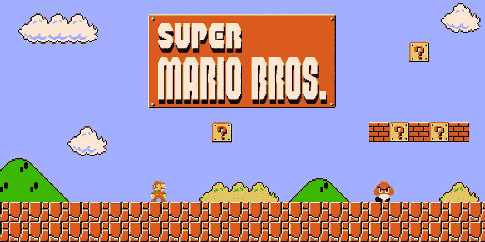
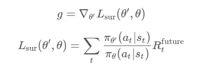
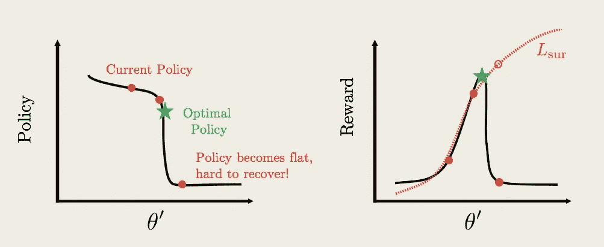
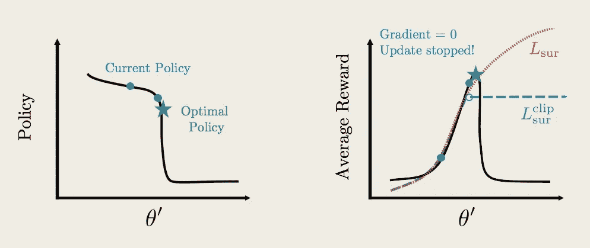
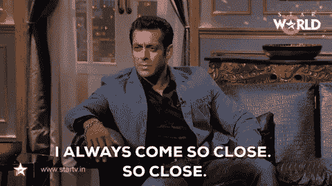
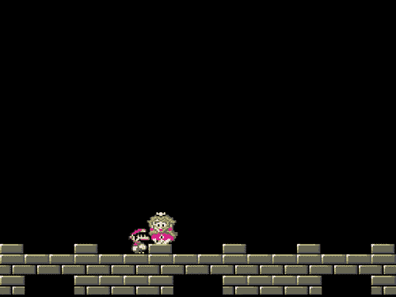

# 理解最近策略优化及其在马里奥游戏环境中的实现

> 原文：<https://medium.com/analytics-vidhya/understanding-proximal-policy-optimization-ppo-and-its-implementation-on-mario-game-environment-31ab4ee024ab?source=collection_archive---------1----------------------->

## 解释了最近策略优化背后的概念和思想及其在 Mario gym 环境中的实现



[让人工智能准备好玩马里奥](https://www.google.com/url?sa=i&source=images&cd=&cad=rja&uact=8&ved=2ahUKEwiKubXs0vLjAhUIM48KHS2ODrYQjhx6BAgBEAI&url=https%3A%2F%2Fwww.nintendo.co.uk%2FGames%2FNES%2FSuper-Mario-Bros--803853.html&psig=AOvVaw0zlpb3XKUaYk5fsaURCd9R&ust=1565332148386846)

强化学习基本上分为两类，即策略梯度和价值函数，它们各有利弊。在本帖中，我们将讨论最先进的策略优化技术，即 PPO 或近似策略优化。

PPO 上 OpenAI 的一句话:

> 近似策略优化(PPO ),其性能与最先进的方法相当或更好，但实施和调整更简单。

在深入 PPO 的细节之前，我们需要了解一些事情，其中之一是代理函数的概念，它将帮助我们理解使用 PPO 背后的动机。

> **代理功能:**

代理函数可以被定义为梯度的近似形式，它更像一个新对象的梯度。



梯度和代理函数

我们使用这种创新的梯度，以便我们可以执行梯度上升来更新我们的策略，这可以被认为是直接最大化代理函数。



代理函数有助于实现最优策略(图片来自 Udacity 深度强化学习 nanodegree)

但是使用代理函数仍然给我们留下了一个问题，如果我们继续重用过去的轨迹，同时继续更新我们的策略，我们将会看到在某一点上新策略可能会偏离旧策略足够远，以至于我们以前用代理函数进行的所有近似都可能变得无效。这就是使用 PPO 的真正优势所在。

> **裁剪代理函数:**

这就是三个字:

1.  策略(要实现的最佳策略)
2.  近端(代理函数的剪辑)
3.  优化(代理函数的使用)和它们的实际意义浮现出来，这导致了算法的命名。



代理函数的剪辑(图片来自 Udacity 深度强化学习 nanodegree)

对替代函数的剪裁使其变平，从而使收敛到最优策略变得更容易和方便。在这种剪裁下，当我们开始对我们的当前策略应用梯度上升时，更新保持与在正常代理函数中发生的相同，但是当我们到达平台时更新停止。迅速地，因为回报函数是平坦的并且梯度是零，这直接暗示策略更新将停止并且我们的最优策略将被实现。


思想等于爆炸。

在了解到如此复杂的强化学习算法可以如此容易地理解之后，mind 肯定等于炸了。

我们还在 Mario 环境中实现了代码，所以请保持稳定并集中精力。

# 安装和运行 Mario 环境


[我们出发吧](https://pypi.org/project/gym-super-mario-bros/)

以下命令将帮助您安装超级马里奥兄弟环境-

```
pip install gym-super-mario-bros
```

这个代码片段将帮助您渲染 env，并让您使用它，习惯动作和状态空间-

有关环境的更多详情，请参考[本](https://pypi.org/project/gym-super-mario-bros/)。

# 超级马里奥兄弟的编码 PPO

为了方便起见，我们将使用 OpenAI 给出的基线，因为他们有大量的 RL 算法，并不断更新他们的 GitHub 库。

> pip 用法说明 Python 2 使用 pip，Python3 使用 pip3

我们将首先下载所需的软件包，然后下载 RL 代码的[基线](https://github.com/openai/baselines)库-

```
sudo apt-get install **zlib1g-dev libopenmpi-dev ffmpeg**
sudo apt-get update

pip3 install **opencv-python cmake anyrl gym-retro joblib atari-py** git clone **https://github.com/openai/baselines.git**
```

安装 Tensorflow(根据您的要求安装 CPU 或 GPU)

```
pip install tensorflow-gpu # for GPUpip install tensorflow # for CPU
```

最后，安装基线包-

```
cd **baselines**pip3 **install -e .**
```

使用基线中给出的 RL 代码的语法代码通常是这样的

```
python -m baselines.run --alg=**<name of the algorithm>** --env=**<environment_id>** [additional arguments]
```

例如，如果我们想用 PPO2 训练一个控制 MuJoCo 人形机器人的全连接网络，时间步长为 20M，我们应该这样写

```
python -m baselines.run --alg=**ppo2** --env=**Humanoid-v2** --network=**mlp** --num_timesteps=**2e7**
```

在此之后，确保你的健身房复古和雅达利-py 已经成功。有关这些的更多信息，请参考[复古](https://openai.com/blog/gym-retro/)和[雅达利](https://github.com/openai/atari-py)。

> **注意——要在健身房环境中使用基线代码直接运行马里奥，请这样做:**
> 
> 为了导入 ROMS，你需要从 [Atari 2600 VCS ROM 集合](http://www.atarimania.com/rom_collection_archive_atari_2600_roms.html)中下载`Roms.rar`并解压`.rar`文件。完成后，运行:
> 
> `python -m atari_py.import_roms <path to folder>`
> 
> 这应该会在导入 rom 时打印出它们的名称。rom 将被复制到您的`atari_py`安装目录。



当您几乎完成安装时，突然出现了一些错误。

现在，我们使用以下命令开始训练-

```
**python3 -m baselines.run --alg=ppo2 --env=SuperMarioBros-Nes 
--gamestate=Level3-1.state --num_timesteps=1e7**
```

为了在训练期间保存模型，在末尾添加以下参数，并且在训练之后加载模型也是如此-

```
**--save_path=./PATH_TO_MODEL****--load_path=./PATH_TO_MODEL**
```

好了，你可以开始训练你的马里奥去营救公主了。



完成代码的庆祝活动！！祝贺