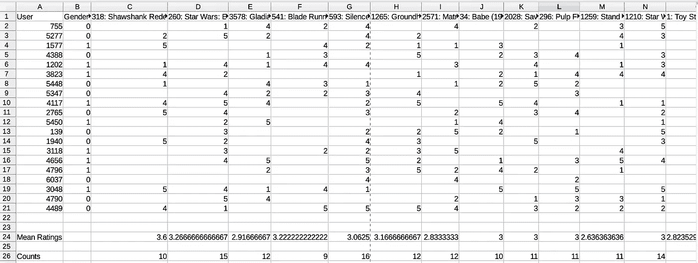
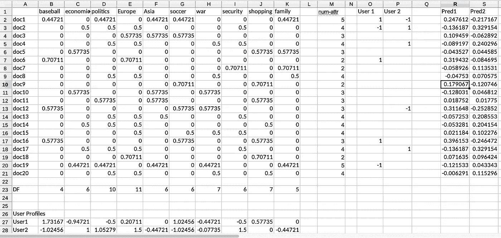
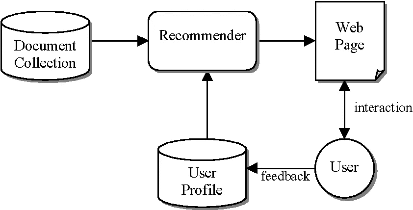
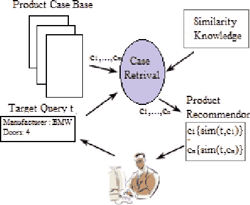
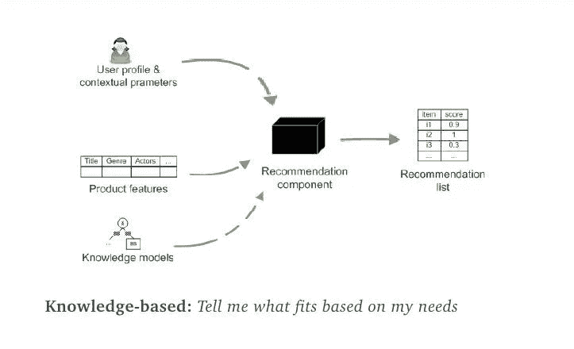

# 理解基于内容的推荐系统

> 原文：<https://medium.com/analytics-vidhya/understanding-recommender-systems-introduction-3be54e937625?source=collection_archive---------0----------------------->

推荐系统是人工智能中发展最快的分支之一，已经成为我们日常生活的一部分。从个性化广告到搜索查询结果，再到捆绑在一起的商品推荐，推荐系统以这样或那样的方式影响着我们生活的方方面面。

本文试图对构建这种系统的基本模块进行解码，并为那些想要深入研究推荐系统的爱好者提供一个基础。

# **推荐系统**

***推荐系统的目标是向一组用户提供他们可能感兴趣的物品或产品的有意义的推荐。*** 亚马逊上的书籍推荐，或者网飞上的电影推荐，都是行业中推荐系统运作的真实例子。[1]

推荐系统大致分为**个性化**和**非个性化**推荐系统。

> 从名字本身可以明显看出，**非个性化推荐系统**是一种通用的推荐系统，它基于其他用户的意见和反馈来提供推荐。

这种系统的一个例子是任何零售网站，如亚马逊或梅西百货，当你登陆他们的主页(无需登录)时，它会显示推荐购买的产品列表

> 另一方面，**个性化**推荐系统维护用户简档，并在将项目作为推荐呈现给用户之前，尝试将项目与用户的喜好简档相匹配。

这种推荐系统的一个典型例子是网飞，它根据每个用户的喜好向他们提供不同的推荐列表。

# **推荐系统的构建模块**

**非个性化**

任何推荐系统都需要这三个基本构件:**用户、项目和评分**。为了更好地理解这一点，让我们拿起非个性化推荐系统的最基本形式，它根据社区中其他用户提供的评级向用户推荐电影。

让我们看看下面的例子。

矩阵包含作为列/特征的项目(在这种情况下是电影)和作为行的用户。每一行都表示用户为该特定电影提供的评级。例如，在这种情况下，用户 756 给了星球大战 1 的评级

图像中的行 24 表示按降序排序的平均评级，而行 26 表示对特定电影进行评级的用户的计数。

现在，为了构建一个非常基本的推荐系统，我们可以挑选平均评分最高的前 5 部电影，并将它们作为推荐呈现给没有看过这些电影的新用户。这种推荐系统不会非常有效，因为它没有内置的机制来结合用户对电影的品味差异。

为了解决这个问题，现在让我们来看看一个基本的个性化推荐系统。

**个性化**

个性化推荐系统通过为每个用户创建个人用户简档来考虑用户的不同品味和偏好。

> 每一项都用属性来表示。每个属性代表属性空间中的一个维度。**然后，在这个项目空间中，项目被表示为向量，属性作为维度。基于用户对项目的喜好和厌恶创建基本用户简档，然后将其投影到属性空间中。项目向量和投影用户向量之间的距离决定了推荐的可能性**，基本假设是，具有更高机会被用户喜欢的项目将更接近用户简档的投影向量。

让我们试着用下面的例子来理解这一点。

在上面的例子中，列代表属性(文章是关于什么的，比如政治、体育等等。)和代表文章的行。每个单元格代表该文章主题的加权值。两列 user1 和 user2 包含关于用户是否喜欢或不喜欢特定文章的信息。

用户简档是用户喜好在属性空间中的投影，它是作为属性矩阵和用户向量之间的点积而获得的。例如:B27 中的值给出了棒球对用户 1 的整体重要性，这是通过棒球向量(B2:B21)和用户向量(O2:O21)的点积获得的。

然后通过在用户简档和文档简档之间取点积来计算预测值(pred1 和 pred2)。例如，R2 的值是通过文档 1 (B2:K2)和用户 1 (B27:K27)之间的点积获得的

**预测值越高，用户越有可能喜欢该特定文档**。

# 推荐系统的类型

推荐是一个重要的领域，已经开发了许多推荐系统的变体，每个变体都适合于可以利用推荐系统的问题的不同变体。在这里，我们将看看一些最常见的推荐系统。

**基于内容的推荐器**

Pic 信用卡谷歌

顾名思义，这个推荐器家族依赖于评论或描述形式的某种类型的内容，并结合用户简档使用该数据来开发推荐器系统。

> 关键思想是: **i)根据从内容导出的相关属性对项目建模，ii)从这些隐含的动作(点击、在视频上花费的时间等)开发用户简档。)、明确的行动(购买、评级等。)或者通过结合隐式和显式，最后，iii)使用这些简档来提供推荐。**

上面解释的个性化推荐器的例子实际上是基于内容的例子

**基于案例的推荐人**

图片来自谷歌

基于案例的推荐器是基于内容的推荐器的子集，主要区别在于属性不是从内容中提取的，而是预先定义并存储在知识库中的。例如，一个餐馆推荐系统是基于案例的推荐器的一个完美的例子，该推荐系统使用像价格、环境、烹饪、位置等属性作为提供建立用户简档和提供推荐的属性

**基于知识的推荐器**

Pic 信用卡谷歌

这一分支的推荐器是基于基于记忆的推理方法开发的，并且使用过去的问题和它们的解决方案来解决新的问题。这里的一个问题是，基本上是用户输入的任何新的搜索查询。这些推荐系统也在预定义的属性向量空间中运行

> 这种系统按照以下基本步骤工作:I)用户输入查询，ii)从查询中解析相关属性以将其投影到属性的向量空间中，iii)在知识数据库中搜索相似的案例，最后，iv)基于这些搜索结果向用户发送推荐。

上述系统被称为**单镜头推荐系统**。

另一种类型称为基于**会话/对话** **的推荐器**。这些基本上遵循单次推荐器的所有步骤，但也可以选择接受用户推荐，将其分解，并根据反馈向用户提供改进的推荐。

**限制**

1.  所有这些推荐系统都是基于向量空间模型的。在向量空间模型中，用户偏好被表示为每个属性或标签的标量值。这意味着没有一个非常明确的方法来区分喜欢和偏好。
2.  假设属性的独立性，这种情况可能并不总是存在。
3.  不能在评级或审核的背景下使用。

# 评分功能

一个推荐系统基本上执行两个任务，计算收视率预测，并根据收视率预测的某种有序形式提供推荐。这些任务中的每一个都需要单独的评分函数来计算准确的预测和推荐。

预测/排序的完整评分函数定义为:

**S(i，u，q，x)/O(i，u，q，x)**

**i** :评分项目

**u** :活跃用户

**问**:用户查询

**x** :当前语境

不同类型的推荐系统使用该功能的不同变体，例如

**s(i，u)** :传统推荐器

s(i，q) :传统搜索

**s(i，u，q)** :个性化搜索

**s(i，u，x)** :上下文感知推荐器

s(i，u，q，x) :上下文感知的个性化搜索

提供推荐的常见方法是提供前 N 个推荐，但是它们可能并不总是有用的，因此尝试不同的变化和方法来使其更相关。对它们的详细讨论超出了本文的范围。

希望这篇文章能很好地介绍推荐系统。欢迎在评论框中提出任何问题或疑问。

# 参考

1.  [https://vikas.sindhwani.org/recommender.pdf](https://vikas.sindhwani.org/recommender.pdf)
2.  推荐系统介绍——Coursera
3.  [http://infolab.stanford.edu/~ullman/mmds/ch9.pdf](http://infolab.stanford.edu/~ullman/mmds/ch9.pdf)
4.  [https://www . fi . muni . cz/~ xpelanek/PV 254/slides/other-techniques . pdf](https://www.fi.muni.cz/~xpelanek/PV254/slides/other-techniques.pdf)
5.  [http://recommender-systems.org/content-based-filtering/](http://recommender-systems.org/content-based-filtering/)