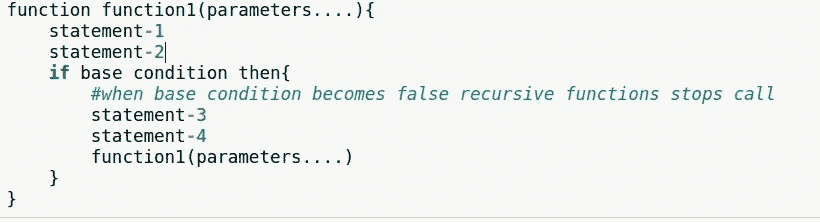
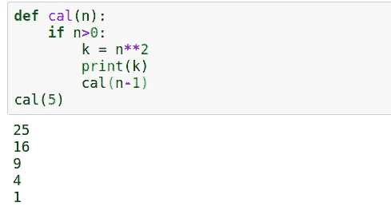
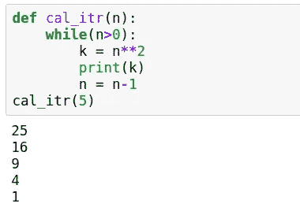
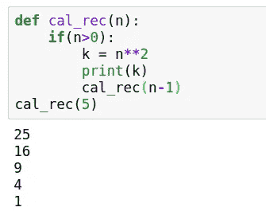
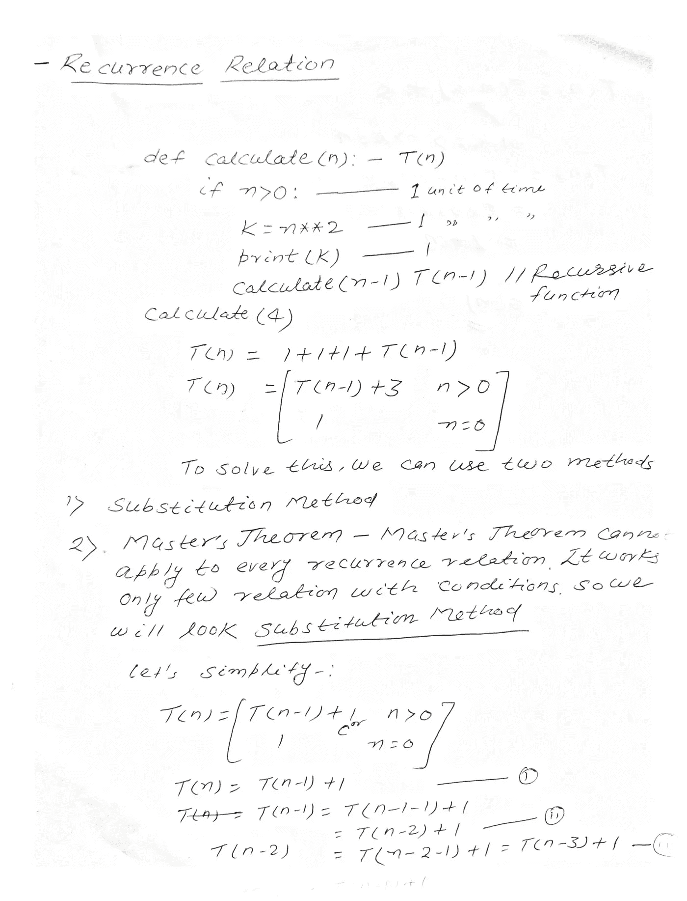
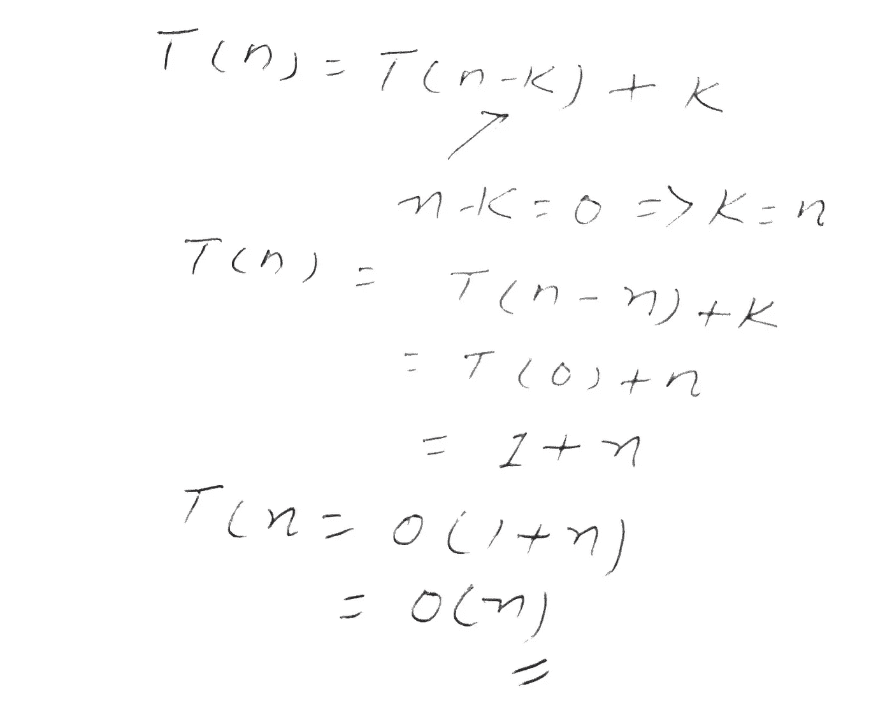
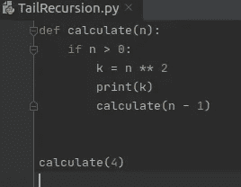
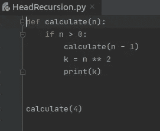
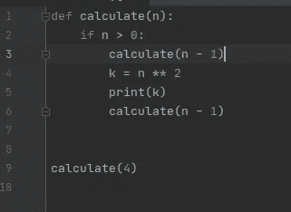
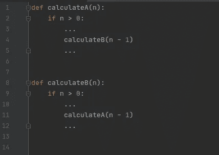

# 理解 Python 中的递归

> 原文：<https://medium.com/analytics-vidhya/understanding-recursion-in-python-f4a8cacce478?source=collection_archive---------18----------------------->

由[耶稣·基特克](https://unsplash.com/@jesuskiteque?utm_source=medium&utm_medium=referral)在 [Unsplash](https://unsplash.com?utm_source=medium&utm_medium=referral) 上拍摄的照片

## 什么是递归？

递归是一种函数或方法调用自身的技术。

让我们来看看递归函数的模板

递归模板

让我们在上述模板的基础上有一个例子

递归示例

## 递归函数和迭代函数的区别:

迭代函数使用循环，递归函数将调用函数本身。让我们举个例子:

迭代函数

在上面的程序中，我们使用了 while 循环，这将花费(n+1)次，其他语句是原始语句，将执行常数时间。所以整个函数将花费 **O(n+1)** == **O(n)** 时间。

递归函数

我们可以利用递推关系来分析递归函数的时间复杂度。

递推关系

递推关系

## 递归的类型

递归有几种类型:

*   **尾递归:**当一个函数调用自己且被调用函数是最后一条语句时，则称之为尾递归。

尾部递归

*   **头递归**:当一个函数调用自己且被调用的函数是第一条语句时，称为头递归。递归调用前不应有任何语句。

头部递归

*   **树递归:**当一个函数不止一次调用自己时，这种类型的递归称为树递归。

树递归

*   **间接递归:**在间接递归中，我们将有不止一个函数，这些函数将在循环中调用其他函数。

间接递归

这个博客会让你深入理解递归。请尝试一下，让我分享您的反馈。

**感谢阅读:)**