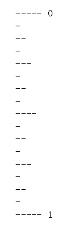

# 用阶乘和英国尺规图理解递归。

> 原文：<https://medium.com/analytics-vidhya/understanding-recursion-with-factorial-and-an-english-ruler-drawing-7d1f8244a13a?source=collection_archive---------3----------------------->


递归—来自 AlgoDaily 的图像

递归是数据结构和算法研究中的一项重要技术，它是一种函数在执行过程中对自身进行一次或多次调用的技术。它也可以定义为当数据结构在其表示中依赖于完全相同类型的结构的较小实例时。

为什么递归如此重要？为了解决计算中的一些问题，递归算法可以帮助生成更容易理解的代码，并且它是需要显式管理堆栈数据结构的迭代算法的替代方法。递归可以用来很容易地解决一些有趣的问题，如汉诺塔，树遍历等。你熟悉头巾娃娃或嵌套娃娃吗？每个娃娃都是由实木制成的，有一个洞可以容纳另一个娃娃，它们通常被称为俄罗斯套娃，艺术直觉是递归的一个例子。


俄罗斯套娃

计算中有许多递归的例子。在本文中，我们将只关注两个，即:阶乘运算和英语统治者模式。

**阶乘运算**

计算一组不同物体的可能排列，例如，五个人坐在五把固定的椅子上排成一排，有多少种不同的座位排列是可能的？为了计算这些排列，我们使用阶乘。

**如果没有限制，将 n 个不同的物体按顺序排列的方式有 n 种！(n 阶乘)。**

解决上面的例子，5！= 5* (4*3*2*1) = 120.递归定义可以表示如下


阶乘的数学表达式

**阶乘运算的简单 Python 实现**

```
def factorial (n):
    if n == 0:
        return 1
    else:
        return n * factorial(n-1)
```

在代码中调用 factorial 函数可以防止使用显式循环，每次调用该函数时，它的参数都会减少 1，直到它达到基本情况，并且递归调用终止。

让我们用英语尺子分形结构检查下面一个更复杂的例子。

# **画一把英国尺子**

递归背后的直觉可以用来画出典型的英国尺子的记号。英制尺子是一块长而平的塑料或金属直尺，通常以英寸或厘米为单位。与上面的阶乘运算相比，这是递归应用的一个复杂例子。

让我们深入英国统治者的递归世界

**英制尺子标记**

以英寸为单位取英制尺子(下图)的一小部分，对于每一英寸，我们放置一个带有数值(标签)的勾号(也称为破折号)。代表整个英寸的破折号的长度被表示为**主要刻度长度(**例如，英寸‘0’是主要刻度，英寸‘1’和英寸‘2’也是主要刻度)，因为它们显示了英寸的实际整数表示。整英寸之间的短划线以英寸、英寸等间隔放置。关系是，当间隔的大小减少一半时，破折号减少一。(例如，主要长度-英寸“1”带 5 个破折号，在英寸“1/2”处减少为 4 个破折号)。



英国统治者标记的一部分

# **递归方法**

仔细观察英寸“0”和英寸“1”之间的模式，您可以发现产生刻度的序列。让我们称英寸“1/2”为中心刻度(4 个破折号)，观察在这个中心刻度的上面和下面有两个相似的刻度图案，还有另一个 3 个破折号的中心刻度，如此继续下去。为了在 python 中实现递归方法，我们将编写一类助手方法和一个递归方法。该实现接受两个输入，即:总英寸数和代表主要英寸的破折号数。从上面的图像，英寸' 1 '是总英寸数，我们有 5 破折号。结果将是一个英国统治者的实际绘图。对具有递归的面向对象程序的理解将用于获得预期的结果。

**代码实现**

**英语尺子类**

从一个类开始，我们创建了英语尺子实现的抽象。记住，我们需要使用 init 方法创建一个 EnglishRuler 的实例。每当我们需要 EnglishRuler 的实例时，就会调用这个结构。

```
class EnglishRuler:
    def __init__(self, num_inches, major_length):
        self.__num_inches = num_inches
        self.__major_length = major_length
```

**论据**

self——调用任何类方法的实例引用。

num _ inches 局部变量-总英寸数

major _ length 局部变量-破折号的数量

接下来，我们将上面的局部变量设置为实例变量

**画线方法**

draw_line 方法用指定数量的破折号和可选的整数英寸字符串标签绘制一个刻度。该函数执行一个主要绘制破折号的代码行和一个将刻度标签(整数)附加到所绘制的线的条件语句。这是一个非递归方法，是 helper 方法之一。

```
def draw_line(self, tick_length, tick_label=''):
        line ='-'*tick_length
        if tick_label:
            line += ''+tick_label
        print(line)
```

**绘制区间方法**

有趣的工作是通过这种递归方法完成的。它在某个区间内绘制一系列小破折号，并参考该区间的中心刻度长度。绘制间隔的点将在绘制标尺方法中解释(下一节)。通常，中心分笔成交点长度 CL>0 的区间由以下部分组成:

中心刻度长度为 CL-1 的区间

在这种情况下，使用参数 CL-1 调用 draw_interval，这将在主要英寸范围内构造破折号。

长度为 L 的单个刻度

在这种情况下，使用参数 CL 调用 draw_line，并生成中心长度。

中心刻度长度为 CL — 1 的区间

这里，使用相同的 CL-1 参数调用另一个 draw_interval，以在间隔内构造下一个破折号。

```
def draw_interval(self, center_length):
        if center_length>0:
            self.draw_interval(center_length - 1)
            self.draw_line(center_length)
            self.draw_interval(center_length - 1)
```

**画尺子的方法**

该方法用于通过获取总英寸数和主要刻度长度来构造整个标尺。在我们使用 for 循环绘制其他英寸的线条之前，首先绘制英寸“0”。迭代范围从 1 开始，因为我们之前已经构建了一条英寸“0”线。该循环不断调用 draw_line 方法来绘制线条。就在 draw_line 方法之前，我们需要调用 draw_interval 方法，它表示在 draw_ruler 构造中绘制区间的点。这个方法接受一个主长度小于 1 的参数(记住英语标尺标记部分中的关系)。

```
def draw_ruler(self):
        self.draw_line(self.__major_length, '0')
        for j in range(1, 1+self.__num_inches):
            self.draw_interval(self.__major_length- 1)
            self.draw_line(self.__major_length, str(j))
```

**画尺子**

这里，为了生成一个 4 英寸的标尺，我们将英寸数参数设置为 4 和 5 个破折号。

```
if __name__ == '__main__':
    ruler = EnglishRuler(4,5)
    ruler.draw_ruler()
```

**结果——4 英寸英制尺子的一部分(水平窗格)**


英国尺子的一部分

**总结**

递归算法和迭代程序具有相同的解决问题的能力，它们可以互相替换。递归算法的优点是它提供了一种简洁而简单的编写代码的方法，但是它可能需要大量的空间和时间管理，因为所有的函数都将保留在堆栈中，直到它在基本情况下终止。

最后，递归可以帮助您将复杂的代码转换成几行简单的代码。

点击查看完整代码

**参考文献**

迈克尔·t·古德里奇、罗伯托·塔玛西亚和迈克尔·h·戈德瓦瑟。2013.Python 中的数据结构和算法(第 1 版。由…编辑).威利出版公司

布拉德利·米勒和大卫·拉纳姆。2011.使用 Python 解决算法和数据结构的问题。由…编辑).美国富兰克林比德尔联合公司。

阿巴斯的递归算法