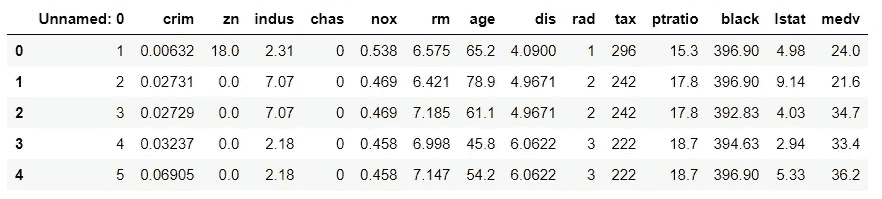
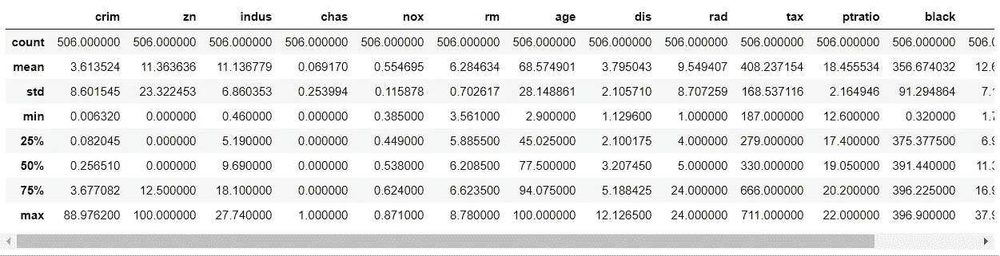
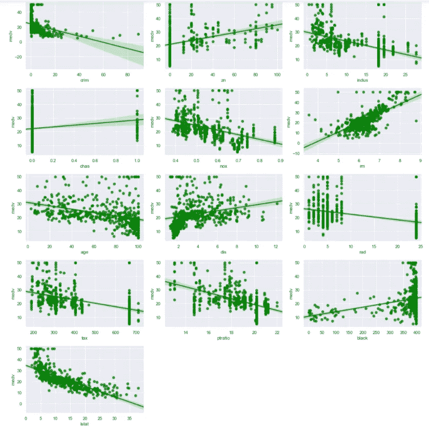
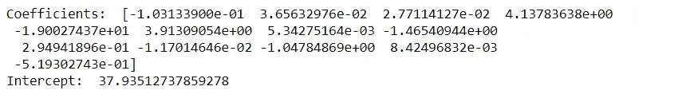
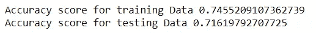
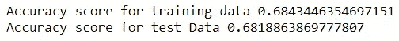
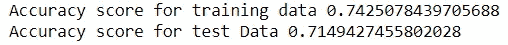

# 了解回归模型

> 原文：<https://medium.com/analytics-vidhya/understanding-regression-models-c9ac4f2184dc?source=collection_archive---------9----------------------->

使用 SKlearn 创建线性，岭，套索回归模型。


马库斯·温克勒在 [Unsplash](https://unsplash.com?utm_source=medium&utm_medium=referral) 上的照片

# 什么是线性回归？

线性回归来自一条直线的方程，y=mx+c，其中 y 是因变量，它随 x 而变化，x 是自变量。c 是 y 轴截距，m 是斜率。在 ML 术语中，系数 x 是权重，y 是截距或 c 是偏差。“m”和“c”是我们的机器将尝试学习的变量。

在本文中，我们将看到如何使用 scikit-learn 来执行不同类型的回归，如线性、脊形、套索等。为了开始，让我们首先导入所需的库。

# 导入所需的库

我们将从导入 pandas 来加载我们需要的数据集开始，我们将使用 matplotlib 和 seaborn 进行可视化，类似地，我们将在需要时从 scikit-learn 导入回归模型。

```
import pandas as pd
import matplotlib.pyplot as plt
import seaborn as sns
```

# 正在加载所需的数据集

我们这里要使用的数据集是波士顿数据集，可以很容易地从 Kaggle 下载。该数据集包含房价的中值以及房价所依赖的所有要素。让我们加载数据集，看看它有哪些不同的列。

```
df = pd.read_csv("C:/Users/DELL/boston.csv")
df.head()
```



波士顿数据集(来源:作者)

# 执行数据分析

为了准备机器学习的数据集，我们需要对数据集执行一些基本的数据分析。我们将开始删除任何不必要的列，如“未命名:0 ”,正如我们在上面的图像中看到的。

```
df.drop('Unnamed: 0', axis=1,inplace=True)
```

现在，让我们使用数据框的描述功能来查看数据集的一些统计属性。

```
df.describe()
```



统计属性(来源:作者)

现在让我们想象一下我们的目标变量“MEDV”与所有其他特征变量之间的关系。为此，我们将使用 matplotlib 和 seaborn。

```
plt.figure(figsize=(15,30))
cnt=1
for i in df.columns[:-1]:
    plt.subplot(10,3,cnt)
    sns.regplot(x=df[i],y=df['medv'], color = 'green')
    cnt=cnt+1
plt.tight_layout()
plt.show()
```



回归图可视化(来源:作者)

分析完所有这些之后，我们可以开始建模过程了。为此，我们需要将数据集分为测试数据集和训练数据集，还需要从 sklearn 导入模型。

```
from sklearn.model_selection import train_test_split #Splitting the dataset
X_train, X_test, y_train, y_test =  train_test_split(df[['crim','zn','indus','chas', 'nox','rm','age','dis','rad','tax','ptratio','black','lstat']], df['medv'], test_size=0.3, random_state=109)#Importing Regression Models
from sklearn.linear_model import LinearRegression, Ridge, Lasso
```

# 线性回归模型

我们将首先创建一个线性回归模型，并将数据拟合到其中。为了知道我们的模型有多精确，我们将找到测试数据的模型分数。

```
linreg = LinearRegression()
linreg.fit(X_train, y_train)
print("Coefficients: ", linreg.coef_)
print("Intercept: ", linreg.intercept_) #y intercept
```



模型系数(来源:作者)

现在让我们使用模型得分来检查模型的准确性。

```
print("Accuracy score for training Data", linreg.score(X_train, y_train))
print("Accuracy score for testing Data", linreg.score(X_test, y_test))
```



准确性(来源:作者)

同样，我们也可以使用脊和套索模型进行回归。

# 套索和岭回归

在线性回归中，如果我们有大量的预测变量，并且这些预测变量彼此高度相关，那么我们可以说我们的模型遇到了较大的方差，使得模型不可靠。

为了克服这个问题，我们使用正则化技术。岭回归是一种旨在使用 l2 罚分(系数的平方和)减小系数大小的技术，而 Lasso 回归使用 l1 罚分(系数的绝对值)。

# 创建 Lasso 回归模型

```
lassoreg = Lasso()
lassoreg.fit(X_train, y_train)
print("Accuracy score for training data", lassoreg.score(X_train,y_train))
print("Accuracy score for test Data", lassoreg.score(X_test,y_test))
```



准确性(来源:作者)

# 创建岭回归模型

```
ridgereg = Ridge()
ridgereg.fit(X_train, y_train)
print("Accuracy score for training data", ridgereg.score(X_train,y_train))
print("Accuracy score for test Data", ridgereg.score(X_test,y_test))
```



准确性(来源:作者)

在本文中，我们看到了如何创建不同的回归模型，并使用模型得分检查它们的准确性。继续尝试，如果你发现任何困难，请在回复部分告诉我。

# 在你走之前

***感谢*** *的阅读！如果你想与我取得联系，请随时通过 ipsitashee4@gmail.com 联系我或我的* [***LinkedIn 个人资料***](http://www.linkedin.com/in/ipsita-shee-764220191) *。可以查看我的*[***Github***](https://github.com/Ipsita-Shee/Regression-Analysis)*简介不同的数据科学项目和包教程。*