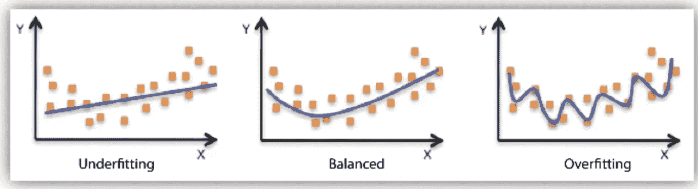
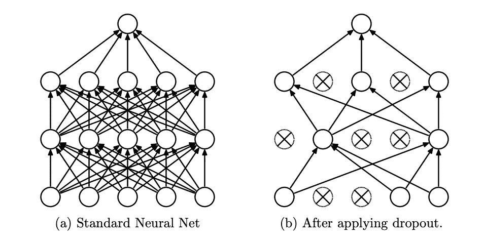
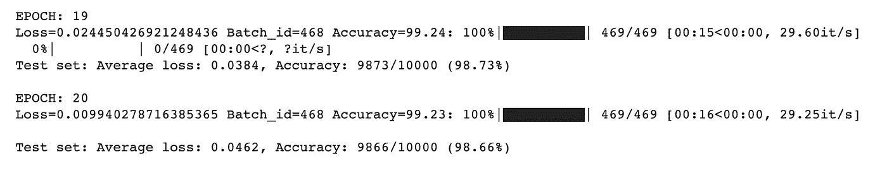
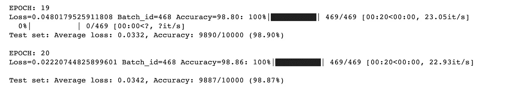

# 使用 PyTorch 了解正则化

> 原文：<https://medium.com/analytics-vidhya/understanding-regularization-with-pytorch-26a838d94058?source=collection_archive---------3----------------------->

## 处理过度拟合问题

过度拟合用于描述当训练模型不能很好地概括看不见的数据，但可以很好地模拟训练数据时的情况。

为了处理过度拟合，可以使用各种技术。让我们探索其中的一些。

# **1。辍学**

辍学指的是放弃神经网络中的单元。通过丢弃一个单元，意味着将其暂时从网络中移除。选择丢弃哪些单元是随机的。每个单元以独立于其他单元的固定**概率 p** 被保留。

该过程有效地在每次迭代中生成具有不同神经元拓扑的略微不同的模型，从而给予模型中的神经元较少的机会在过度拟合期间发生的记忆过程中进行协调。从而使其更好地泛化和处理过拟合问题。

## **在 PyTorch 实施**

**torch . nn . dropout(*p:float = 0.5*，*in place:bool = False*)**-在训练期间，它以概率 **p** 随机地将输入张量的一些元素置零。在实现下降时，输出形状将保持与输入形状相同。

让我们通过在具有 MNIST 数据集的简单卷积神经网络中使用辍学来理解辍学的影响。我创建了两个网络，一个没有漏失层，另一个有漏失层，并运行了 20 个时期。

*   **型号 1-无脱落层**

*   **型号 2-带脱落层**

**推论:-**

**无脱扣**模型达到 99.23%的训练精度和 98.66%的测试精度，而**有脱扣**模型分别达到 98.86%和 98.87%，与无脱扣模型相比减少了过拟合。

# 2.L1 和 L2 正规化

**L1 正则化(Lasso 回归)** -将模型中所有权重的绝对值之和添加到成本函数中。它将不太重要的特征的系数缩小到零，从而移除一些特征，从而提供稀疏的解决方案。

**L2 正则化(** **岭回归**)——将模型中所有权重的平方和加到代价函数中。与 L1 正则化不同，它能够学习复杂的数据模式并给出非稀疏解。

> 这两个正则化都由(小)因子**λ**缩放(以控制正则化项的重要性)，这是一个超参数。

## PyTorch 中的实现

## a) L1 正规化

L1 _ penalty = torch . nn . L1 loss(size _ average = False)
reg _ loss = 0
for param in model . parameters():
→reg _ loss+= L1 _ penalty(param)

factor = const _ val # lambda
loss+= factor * reg _ loss

## b) L2 正规化

**weight_decay** 参数在初始化优化器时应用 L2 正则化。这将正则化项添加到损失函数中，具有缩小参数估计的效果，使得模型更简单并且不太可能过拟合。

# 3.其他技术

除了本帖中讨论的辍学、L1 和 L2 正规化之外，处理过度拟合的其他方法有:

*   **添加更多的训练数据** —添加额外的数据将增加训练数据的多样性，从而减少过度拟合的机会。
*   [**数据扩充**](/analytics-vidhya/transforming-data-in-pytorch-741fab9e008c) -它有助于增加训练模型的数据种类，从而增加可用信息的广度。在我之前的博客[帖子](/analytics-vidhya/transforming-data-in-pytorch-741fab9e008c)中讨论过。
*   [**批量规格化**](/analytics-vidhya/exploring-batch-normalisation-with-pytorch-1ac25229acaf)-批量规格化倾向于在训练过程中固定隐藏层值的分布。在我之前的博客[帖子](/analytics-vidhya/exploring-batch-normalisation-with-pytorch-1ac25229acaf)中讨论过。
*   **提前停止—** 意味着在模型达到过拟合阶段之前，提前停止模型的训练。可以监控培训和验证集的性能指标(如准确性、损失)来实现这一点。

你可以在[这个](https://github.com/poojamahajan0712/medium_blog/tree/master/regularisation)资源库中找到 dropout 实现、L1 和 L2 正则化的代码。

## 参考

*   [https://jmlr . org/papers/volume 15/srivastava 14 a . old/srivastava 14 a . pdf](https://jmlr.org/papers/volume15/srivastava14a.old/srivastava14a.pdf)
*   [https://learning . oreilly . com/library/view/deep-learning-with/9781617295263/OEBPS/Text/08 . XHTML](https://learning.oreilly.com/library/view/deep-learning-with/9781617295263/OEBPS/Text/08.xhtml)
*   [https://www.youtube.com/watch?v=DEMmkFC6IGM](https://www.youtube.com/watch?v=DEMmkFC6IGM)
*   [https://arxiv.org/pdf/1904.03392.pdf](https://arxiv.org/pdf/1904.03392.pdf)