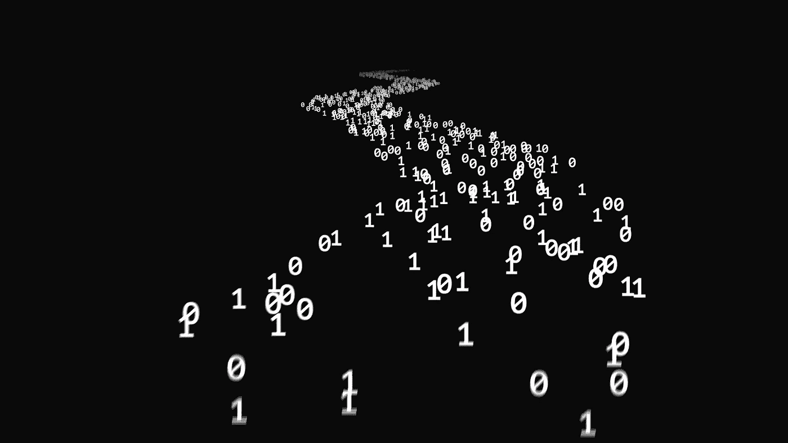

# 了解剔除抽样方法

> 原文：<https://medium.com/analytics-vidhya/understanding-rejection-sampling-method-43b0006e0d0c?source=collection_archive---------2----------------------->

## R 中的可视化表示

拒绝采样是一种计算技术，其目的是从目标概率分布 f(x)生成随机数。它与蒙特卡罗方法的一般领域有关，其核心是产生重复随机抽样，对未知参数进行数值估计。

# 关于…的一些单词