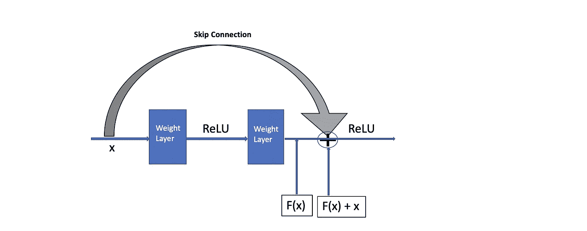
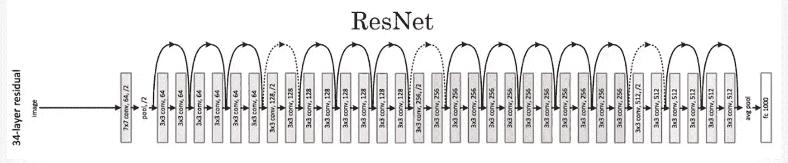

# 了解剩余网络(ResNet)架构

> 原文：<https://medium.com/analytics-vidhya/understanding-resnet-architecture-869915cc2a98?source=collection_archive---------4----------------------->

## PyTorch 中的实现

仿佛跳绳只限于人类！！

非常深的网络通常导致梯度消失，因为梯度被反向传播到更早的层，重复乘法可以使梯度无限小。ResNet 使用包含快捷跳过连接的剩余块的概念来跳过一些层。

ResNet 论文的作者提供的证据表明，残差网络更容易优化，并且可以通过将层重构为参考层输入的学习残差函数，从显著增加的深度中获得准确性。

再详细了解一下吧！！

## 残余块

残余块

具有剩余块的网络背后的直觉是每一层被馈送到网络的下一层，并且还直接到下一层，在中间的几层之间跳过。残余块允许你训练更深层次的神经网络。该连接(灰色箭头)被称为**跳过连接或快捷连接**，因为它绕过了中间的一个或多个层。它也被称为**恒等式连接**，因为我们可以从中学习一个恒等式函数。

> 快捷连接只是执行身份映射，它们的输出会添加到堆叠层的输出中。恒等式快捷连接既不增加额外的参数，也不增加计算复杂度。整个网络仍然可以通过具有反向传播的 SGD 进行端到端的训练，并且可以在不修改解算器的情况下使用公共库容易地实现。

[*来源:——用于图像识别的深度残差学习*](https://arxiv.org/pdf/1512.03385.pdf)

# ResNet 架构

ResNet34 架构

让我们深入研究 ResNet34 架构:-

*   它从一个 7x7 大小的内核(64)的卷积层开始，步长为 2，随后是一个最大池操作。
*   它由四个剩余块组成(分别为配置:- 3、4、6 和 3)
*   每个块的通道是恒定的，分别为 64、128、256、512。
*   这些模块中只使用了 3x3 内核。
*   除了第一个块，每个块都以步幅为 2 的 3x3 内核开始。
*   虚线为**跳过连接**。

当输入和输出具有相同的维数，但是维数不同时(即，输入大于剩余输出)，可以直接添加虚线或单位快捷方式，默认的解决方法是使用步长为 2 的 1x1 卷积。

对于 ResNet34，我们有四个配置为 3，4，6，3 的剩余块。类似地，对于 ResNet18 模型，我们有配置为 2，2，2，2 的四个残差块。除了这些，其他版本还有 ResNet 瓶颈(R50、R101、R152)、ResNet V3、ResNeXt。

# 在 CIFAR-10 数据集上训练 ResNet 模型

## **使用的数据集**

CIFAR-10 数据集(加拿大高级研究所)是一个图像集合，通常用于训练深度学习算法。

*   它包含**60000 张**大小为**32×32**的彩色图像，适用于 **10 种不同的等级**。
*   10 个不同的类别是:飞机、汽车、鸟、猫、鹿、狗、青蛙、马、船和卡车。每个类有 6000 张图片。

## **实施**

我已经使用了来自[这个](https://github.com/kuangliu/pytorch-cifar) Github repo 的 ResNet 实现。我使用了 ResNet18 模型架构，并在 CIFAR-10 数据集上对其进行了 10 个时期的训练。

你可以在 PyTorch [中找到相应的实现代码。](https://github.com/poojamahajan0712/medium_blog/tree/master/CIFAR_Resnet)

## 参考

*   [https://learning . oreilly . com/library/view/deep-learning-with/9781789534092/f61e 9609-c07b-46d 6-a54b-096 c 2714 a632 . XHTML](https://learning.oreilly.com/library/view/deep-learning-with/9781789534092/f61e9609-c07b-46d6-a54b-096c2714a632.xhtml)
*   [https://arxiv.org/pdf/1611.05431v2.pdf](https://arxiv.org/pdf/1611.05431v2.pdf)
*   [https://arxiv.org/pdf/1512.03385.pdf](https://arxiv.org/pdf/1512.03385.pdf)
*   [https://www.youtube.com/watch?v=ZILIbUvp5lk](https://www.youtube.com/watch?v=ZILIbUvp5lk)
*   [https://www.youtube.com/watch?v=RYth6EbBUqM](https://www.youtube.com/watch?v=RYth6EbBUqM)