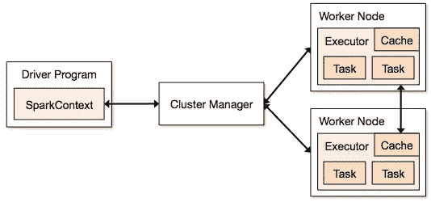

# 火花优化和最大化资源分配的方法

> 原文：<https://medium.com/analytics-vidhya/understanding-resource-allocation-configurations-for-a-spark-application-9c1307e6b5e3?source=collection_archive---------2----------------------->

资源分配是任何 spark 作业执行过程中的一个重要方面。如果配置不正确，spark 作业可能会消耗整个集群资源，并使其他应用程序缺乏资源。

这个博客有助于理解 Spark 应用程序的基本流程，以及如何配置执行器的数量、每个执行器的内存设置以及 Spark 作业的内核数量。我们需要考虑几个因素来确定上述三个因素的最佳数量，例如:

*   数据量
*   一项工作必须完成的时间
*   资源的静态或动态分配

# **简介**

让我们从处理 Spark 应用程序时使用的术语的一些基本定义开始。

**分区**:分区是大型分布式数据集的一小部分。Spark 使用分区来管理数据，分区有助于并行化数据处理，并将执行器之间的数据洗牌降至最低。

**任务**:任务是一个工作单元，可以在分布式数据集的一个分区上运行，并在单个执行器上执行。**并行执行的单元在任务级**。单个阶段中的所有任务都可以并行执行。

**执行器**:执行器是为工作节点上的应用程序启动的单个 JVM 进程。Executor 运行任务，并将数据保存在内存或磁盘存储器中。每个应用程序都有自己的执行者。一个节点可以运行多个执行器，一个应用程序的执行器可以跨越多个工作节点。一个执行器在 Spark 应用程序的
持续时间内保持运行，并在多个线程中运行任务。spark 应用程序的执行器数量可以在 SparkConf 中指定，或者通过命令行中的标志–num-executors 来指定。

**集群管理器**:获取集群上资源的外部服务(如独立管理器、Mesos、YARN)。Spark 对于集群管理器来说是不可知的，只要它可以获取执行器进程，并且这些进程可以相互通信。spark 集群可以在纱线集群或纱线客户端模式下运行:

**yarn-client 模式** —驱动程序在客户端进程上运行，应用主机仅用于向 yarn 请求资源。

**客户端模式**

**yarn-cluster 模式** —驱动程序在应用程序主进程内运行，一旦应用程序初始化，客户端就离开

**集群模式**

**核心**:核心是 CPU 的基本计算单元，一个 CPU 在给定的时间可以有一个或多个核心来执行任务。内核越多，我们能做的工作就越多。在 spark 中，这控制了一个执行器可以运行的并行任务的数量。

集群概述

# Spark 作业的集群模式中涉及的步骤

1.  通过驱动程序代码，SparkContext 连接到集群管理器(standalone/Mesos/YARN)。
2.  集群管理器在其他应用程序之间分配资源。任何集群管理器都可以使用，只要执行器进程正在运行并且它们相互通信。
3.  Spark 获取集群中节点上的执行器。在这里，每个应用程序都有自己的执行器进程。
4.  应用程序代码(jar/python 文件/python egg 文件)被发送给每个执行器。
5.  SparkContext 将任务发送给执行者。

从上面的步骤可以看出，执行人的数量和他们的内存设置在一个 spark 作业中起着主要作用。运行具有太多内存的执行器通常会导致过多的垃圾收集延迟

现在，我们将尝试了解如何配置最佳值集来优化 spark 作业。

我们有两种方式来配置 Spark 作业的执行器和核心细节。它们是:

1.  静态分配—值作为 spark-submit 的一部分给出
2.  动态分配—根据需求(数据大小、所需的计算量)选择值，并在使用后释放。这有助于资源被其他应用程序重用。

# 静态分配

讨论了不同的情况，根据用户/数据要求改变不同的参数并得到不同的组合。

# 情形 1 硬件— 6 个节点，每个节点有 16 个内核，64 GB RAM

首先，在每个节点上，操作系统和 Hadoop 守护程序需要 1 个内核和 1 GB 内存，因此每个节点有 15 个内核和 63 GB RAM

***我们先从如何选择核数开始* :**

*内核数量=一个执行者可以运行的并发任务*

所以我们可能会想，每个执行器并发的任务越多，性能越好。但是研究表明，任何超过 5 个并发任务的应用程序都会导致糟糕的表现。所以最佳值是 5。

这个数字来自于执行器运行并行任务的能力，而不是来自于一个系统有多少个内核。因此，即使 CPU 中有两个(32)内核，数字 5 也保持不变

***执行人数:***

下一步，每个执行器有 5 个内核，一个节点(CPU)中有 15 个可用内核——我们得出每个节点有 3 个执行器，即 15/5。我们需要计算每个节点上的执行者的数量，然后得到作业的总数。

所以有 6 个节点，每个节点有 3 个执行器，我们总共有 18 个执行器。在 18 个中，我们需要 1 个执行程序(java 进程)用于 YARN 中的应用程序主程序。所以最后的数字是 17 个遗嘱执行人

这个 17 是我们从 spark-submit shell 命令运行时使用–num-executors 给 spark 的数字

***每个执行者的内存:***

从上面的步骤中，我们每个节点有 3 个执行者。每个节点上的可用 RAM 为 63 GB

所以每个节点中每个执行器的内存是 63/3 = 21GB。

然而，还需要小的内存开销来确定每个执行器的全部内存请求。

开销的公式是 max(384，. 07 * spark.executor.memory)

计算开销:. 07 * 21(此处 21 是按照上面的 63/3 计算的)= 1.47

由于 1.47 GB > 384 MB，开销为 1.47

从每张 21 以上中取上述= > 21–1.47 ~ 19gb

所以执行器内存— 19 GB

*最终数字—执行器— 17，内核 5，执行器内存— 19 GB*

# 情形 2 硬件— 6 个节点，每个节点有 32 个核心，64 GB

**内核数量**为 5 与上面解释的良好并发性相同。

**每个节点的执行者数量**= 32/5 ~ 6

所以总执行人= 6 * 6 节点= 36。那么最终的数字是 36–1(AM)= 35

**执行者记忆**:

每个节点 6 个执行者。63/6 ~ 10.开销是. 07 * 10 = 700 MB。因此，取 1GB 作为开销，我们得到 10–1 = 9gb

*最终数字—执行器— 35，内核 5，执行器内存— 9 GB*

# 情况 3 —当执行器不需要更多内存时

上面的场景从接受固定的内核数量开始，然后转移到执行器和内存的数量。

对于第一种情况，如果我们认为我们不需要 19 GB，根据数据大小和所涉及的计算，10 GB 就足够了，那么数字如下:

核心:5 个

每个节点的执行者数量= 3。尽管如此，15/5 如上计算。

在这个阶段，这将导致 21 GB，然后根据我们的第一次计算是 19gb。但是既然我们认为 10 是可以的(假设开销很小)，那么我们不能将每个节点的执行器数量切换到 6(比如 63/10)。因为如果每个节点有 6 个执行器和 5 个内核，那么当我们只有 16 个内核时，每个节点会有 30 个内核。所以我们还需要改变每个执行器的内核数量。

所以再计算一下，

幻数 5 等于 3(任何小于或等于 5 的数)。因此，对于 3 个内核和 15 个可用内核，我们每个节点有 5 个执行器，29 个执行器(即(5*6 -1))，内存为 63/5 ~ 12。

开销是 12 * 07 = . 84。因此执行器内存是 12–1gb = 11gb

*最终数字为 29 个执行器，3 个内核，执行器内存为 11 GB*

# 一览表

汇总统计

# 动态分配

*注意:启用动态分配时，执行人数量的上限为无穷大。所以这表示，如果需要，spark 应用程序可以吃掉所有资源。在运行其他应用程序的集群中，它们也需要内核来运行任务，我们需要确保在集群级别分配内核。*

*这意味着我们可以根据用户访问情况为基于纱线的应用分配特定数量的内核。因此，我们可以创建一个 spark_user，然后为该用户分配核心(最小/最大)。这些限制用于 spark 和其他纱线应用程序之间的共享。*

要理解动态分配，我们需要了解以下属性:

*spark . dynamic allocation . enabled—*当设置为 true 时，我们不需要提及执行者。原因如下:

我们在 spark-submit 上给出的静态参数数字是针对整个作业持续时间的。但是，如果进行动态分配，将会有如下不同的阶段:

**遗嘱执行人的起始号码是多少:**

开始时的初始执行器数(*spark . dynamic allocation . initial executors*)

**动态控制执行者的数量:**

然后根据负载(未决任务)请求多少个执行者。这将最终成为我们在 spark-submit 上以静态方式给出的数字。因此，一旦设置了初始执行程序编号，我们就进入 min(*spark . dynamic allocation . minexecutors*)和 max(*spark . dynamic allocation . max executors*)编号。

**何时询问新遗嘱执行人或放弃当前遗嘱执行人:**

我们什么时候请求新的执行者(*spark . dynamic allocation . schedulerbacklogtimeout*)—这意味着已经有这么长时间的未决任务。因此，每一轮请求的执行人数量比前一轮呈指数增长。例如，应用程序将在第一轮中添加 1 个执行程序，然后在随后的几轮中添加 2 个、4 个、8 个等等执行程序。在一个特定的点上，上面的属性 max 出现了。

我们什么时候放弃一个执行者是使用*spark . dynamic allocation . executor idle time out .*设置的

**常见问题清单**

*   足够的并发分区。如果你有 20 个内核，确保你至少有 20 个分区或者更多。
*   通过过滤您需要的数据来最小化内存消耗。
*   最小化混洗的数据量。洗牌很贵。
*   了解标准库，在正确的地方使用正确的函数。

总之，如果我们需要对作业执行时间进行更多的控制，监控作业中意外的数据量，静态数据会有所帮助。通过迁移到 dynamic，资源将在后台使用，涉及意外卷的作业可能会影响其他应用程序。

参考资料:

[http://spark . Apache . org/docs/latest/configuration . html #动态分配](http://spark.apache.org/docs/latest/configuration.html#dynamic-allocation)

[http://spark . Apache . org/docs/latest/job-scheduling . html # resource-allocation-policy](http://spark.apache.org/docs/latest/job-scheduling.html#resource-allocation-policy)

[https://blog . cloud era . com/blog/2015/03/how-to-tune-your-Apache-spark-jobs-part-2/](https://blog.cloudera.com/blog/2015/03/how-to-tune-your-apache-spark-jobs-part-2/)

 [## 集群模式概述

### 本文档简要概述了 Spark 如何在集群上运行，以便更容易理解组件…

spark.apache.org](http://spark.apache.org/docs/latest/cluster-overview.html) 

谢谢塞缪尔·威廉姆帮我做这件事。