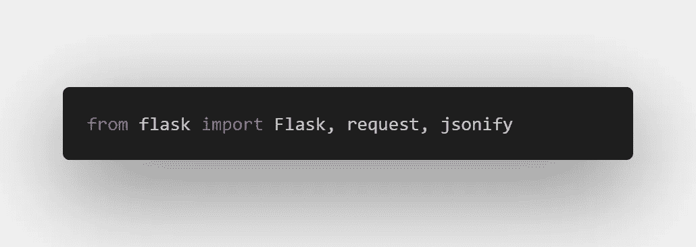

# 使用 Flask 了解 RESTful API

> 原文：<https://medium.com/analytics-vidhya/understanding-restful-api-with-flask-59421f01f648?source=collection_archive---------18----------------------->


这将是一篇关于如何使用一个简单而强大的框架 Flask 来制作 REST APIs 的文章。API 为开发人员和最终用户完成各种任务，因为它们抽象了必须的查询，并使与基础系统(可能是您的服务器或数据库)的交互变得容易。

# 什么是 RESTful APIs

REST 是表述性状态转移的首字母缩写。它是分布式超媒体系统的一种架构风格。通过将用户界面问题从数据存储问题中分离出来，它提高了跨多个平台的用户界面的可移植性，并通过简化服务器组件提高了可伸缩性。
好，简单来说，这意味着什么？服务器提供了一个类似于 URL 的端点，您可以在这里请求或放置数据。它通过提供端点使集成软件易于访问、使用并能与其他应用程序轻松集成，从而消除了集成软件带来的麻烦。

# 示例实现

历史和理论已经讲得够多了，让我们深入研究吧。
对于这个实现，我们将使用 Flask，这将是对 API 的一个非常简单的解释，Flask 制作 API 的方式已经灭绝，但我们将采用传统方式，手工构建它们。

# 装置

这里我们将使用 Flask，它是 python 的一个模块。下面的代码片段将遵循 python3 语法。

*   您需要安装 python
*   如果您愿意，可以创建一个虚拟环境来安装软件包。你可以在这里得到更多关于 VEnv [的信息](https://gist.github.com/NishantJoshi00/d5d61c90dbd4fb9d68ec971f79f2aae9)
*   之后，您就可以安装模块了。

```
# ------------------------------------------------
# If you are using python3
>> >> >> $ pip3 install Flask 
# ------------------------------------------------
# ------------------------------------------------
# If you are using python
>> >> >> $ pip install Flask 
# ------------------------------------------------
```

*   你最不需要的就是创造力，但是看到你在这里，你已经有很多了

## 简单的例子


好了，现在看看这个，发出一个 **GET** 请求感觉很简单。忽略表情符号和评论，它们是提供帮助的。现在，让我们检查每一行代码:

1.  `from **flask** import **Flask**` :
    这只是从库 **flask** 中获取主类 **Flask** 的构造函数
2.  `**app** = **Flask**(*__name__*)` :
    这是用运行程序的名称创建您的 web 应用程序，即`**__main__**` 如果您要运行该文件的话
3.  `@*app*.**route**("**/**", *methods*=["**GET**"])` :
    这是一个装饰器，我们可以称之为它下面的函数的包装器，但在这个上下文中，它意味着任何指向“GET”类型的端点“/”的请求都将被写在它下面的函数解析。
4.  `*def* **root**():
    **return** "*This is root\n*"` :
    这是解析发送到“/”的任何请求的解析器函数。
5.  这最后一部分只是确保应用程序托管在我们运行文件的地方
6.  现在，要查看结果，只需使用类似`*python3* **app.py**`的命令运行包含上述代码的文件，其中 app.py 是文件名。在终端中，它会显示一个 URL

```
# In my case it was [**http://127.0.0.1:5000/**](http://127.0.0.1:5000/)# Just open this link in your browser and the your put will not shock you: it is indeed "**This is root**" the \n is just to make to readable your you are familier with **curl.**
```

# 要求



现在让我们开始发出请求，现在如果你想写代码并看到旁边的结果，在上面的例子中只需更改`app.run()` = > `app.run(debug=**True**)`
这将自动应用你在应用程序文件中所做的更改。但是只有在所有的语法错误被清除后才保存，否则程序将退出，你将不得不再次启动它，与步骤相同。6 来自上面的例子。下面提供的示例是上面代码的延续，以便于理解。
如果您要尝试该示例，请在语句`if __name__ == "__main__":`之前添加下面可用的代码，以实现代码。

## 获取请求


随着我们的深入，我们将对这个 GET 请求有更多的了解。

> **什么是 GET 请求？** Get 请求用于从特定资源获取数据，这是一种简单的端点查询方式。
> - Get 请求类似于我们普通 http 请求，但是我们不是提供网页内容，而是以 json、xml 的形式获取数据。
> -您还可以向 GET 请求传递参数来指定您的需求。
> 类似的例子有:[https://www.google.com/search?q=what+is+restful+api](https://www.google.com/search?q=what+is+restful+api)
> 这里:
> 路由(端点)=>"/搜索"，
> 参数= > q:值= >"什么是 restful api "

我已经写了我们可以向 GET 请求传递参数，但是如何获取它:为此我们需要一个函数。
`from **flask** import **request**` 我们已经从这个模型中导入了`**Flask**` 。
使用`**request.**args`访问 get 请求传递的这些参数，这是一种可以转换为字典的数据类型。

## 例子

在上面的例子中，我有一个名为 registry 的全局变量，它是一个包含姓名和年龄的列表。下面是完整的代码，如果你想看看的话。`**jsonify**` 是 flask 库提供的一个函数，它将字典、列表等数据类型转换成字符串，然后作为响应安全地发送回去。

## 发布请求


> **什么是发布请求？** POST 用于向服务器发送数据以创建/更新资源。
> 此处，发送的数据不会附加到 URL，也不会被缓存或存储，因此将数据返回给服务器更安全，解析数据也更容易。通常给 API 的数据是 JSON (JavaScript 对象符号)格式的。因此我们使用对象`*request.****json***` *来获取发布的数据。*

## 例子

如果您不熟悉 API 的整个概念，您可能会发现我们使用同一个端点“/registry”来发出 get 请求令人不安。我们可以使用单个端点根据 GET、POST、PUT、DELETE 等方法发出多个请求，因此一个端点可以有任意数量的方法。
如果你要实现这样一个概念，你可以使用`request.**method**` 来标识传递给解析器函数的当前请求的方法，我可能已经实现了它，但如果我这样做了，它将不会被清楚。

现在的问题是你将如何测试它？我们可以在 web 浏览器中输入带有参数的 URL 来测试我们的 GET 方法，但是对于其他方法来说就没那么简单了。要实现这一点，你可以使用[https://www.postman.com/](https://www.postman.com/)，它是测试各种 API 的一个很好的资源，或者你可以使用`$ curl`，它是一个 Linux 命令。也许你也可以使用 python 模块`**requests**` 来实现这个目的，这是你的选择。

## URL 转换器


这是一个在创建 API 时会派上用场的特性。在上面的图片中，我将它与 GET 方法一起使用，但它也可以与任何其他方法一起使用，我们将会看到这一点。
—现在，不同的是上面的代码，首先端点不同，我可以称之为怪异，那到底是什么`<string:name>`。这是 URL 转换器，它是任何不包含反斜杠的字符串的占位符。
—第二个关键区别是解析器函数有一个参数，该参数接收放置在`<string:name>`的值。

有各种不同目的的占位符。


上面提到的 own 是一些可以使用的默认类型。
喜欢=>

您还可以使用 flask 库提供的工具创建您的自定义类型。

## 上传请求


现在，我不会告诉你这个请求有什么不同，因为它类似于 POST 请求，但这个请求的目的是专门更新或创建一个新的条目，POST 请求可能有不同的用途，但文档说只使用它们来更改条目和/或为特定资源创建新的条目。
这个请求的目标是使这个 API 被调用后的输出是等幂的。
这在获取数据和使用访问数据方面类似于 POST。

## 删除请求


在这里，这是一个危险的 API，因为没有任何认证，任何人都可以删除他们想要的数据库的任何条目。但是在你的项目中同时实现所有这些 API 并不重要，而且会浪费资源，这只是为了解释的目的。

DELETE 方法根据链接的 URL 删除指定资源中的条目。这个方法的主要目标是将这个动作记录为删除，但是使用 POST 也可以实现同样的目的，只需指定正确的条件和端点。

## 示例的源代码

> 感谢你阅读到目前为止，我衷心希望你从这篇文章中学到了一些东西，继续学习，一切顺利！！