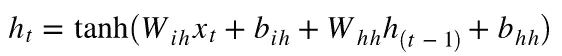

# 了解 PyTorch 中的 RNN 实现

> 原文：<https://medium.com/analytics-vidhya/understanding-rnn-implementation-in-pytorch-eefdfdb4afdb?source=collection_archive---------0----------------------->

RNNs 和其他类似 GRU、LSTMs 的循环变体是最常用的 PyTorch 模块之一。在这篇文章中，我介绍了`RNN`模块的不同参数，以及它如何影响计算和结果输出。

这篇文章的完整笔记本可从以下网址获得:[https://github . com/rsk 2327/DL-Experiments/blob/master/Understanding _ rnns . ipynb](https://github.com/rsk2327/DL-Experiments/blob/master/Understanding_RNNs.ipynb)

# 基本示例

RNN:基本例子

## **RNN 超参数**

RNN 细胞块的关键参数是:

*   `input_size` -定义定义输入序列每个元素(时间戳)的特征数量
*   `hidden_size` -定义隐藏状态的大小。因此，如果`hidden_size`设置为 4，那么每个时间步的隐藏状态就是一个长度为 4 的向量
*   `num_layers` -允许用户构建堆叠的 rnn。堆叠式 rnn 的概念及其工作原理将在后面解释
*   `bias` -是否在 RNN 单元中包含偏差项
*   `bidirectional`-RNN 层是否是双向的
*   `batch_first` -定义输入格式。如果为真，则输入序列的格式为(批处理、序列、特征)

为了简单起见，对于基本示例，我们将`input_size`、`hidden_size`和`num_layers`设置为 1，并将`bidirectional`设置为 False。

**RNN 输出**

PyTorch 中的 RNN 模块总是返回 2 个输出

*   总输出-包含与输入序列中所有元素(时间戳)相关的隐藏状态
*   最终输出-包含输入序列最后一个元素的隐藏状态。

因此，最终输出不会提供总输出没有提供的任何新信息。在大多数情况下，最终输出可以从总输出中构造出来。然而，在少数情况下这是不可能的。

对于我们的例子，总产出的大小为[1，3，1]。这可以分解为

*   1:序列数
*   3:序列中元素的数量
*   1:定义隐藏状态的特征数量。由`hidden_size`参数直接控制

可以理解，最终输出的大小为[1，1，1]，因为它只包含序列中最后一个元素的隐藏状态。

**RNN 参数**

RNN 模块有两种参数，`weights`和`biases`。参数的实际数量随着用于定义 RNN 层的不同超参数而变化。



RNN 公式

在这个例子中，我们只有两个参数，带的*和带*的*。*

**手动计算**

给定 RNN 公式和 RNN 层权重，我们手动计算 RNN 输出。这让我们更好地理解隐藏状态是如何由`RNN`模块在内部计算的。

对于前面没有隐藏状态的第一个元素，我们将隐藏状态设置为 0。

所以通过这个基本例子，我们可以观察到:

1.  RNN 对给定序列的所有特征重复进行非常基本的计算
2.  特定时间戳的输出取决于前一个时间戳的输出。

# **添加更多功能**

在下一次迭代中，我们向输入序列元素添加更多的特征。现在，每个元素都由一个三元素向量来表示，而不是 1。输入序列现在具有[1，4，3]的形状

RNN:增加更多功能

鉴于特征的数量已经改变，我们通过将`input_size`设置为 3 来对 RNN 层定义进行必要的修改。

除了上面的变化，我还设置了`bias`为真。这将有助于演示隐藏状态计算中如何包含偏差。

**计算输出**

总输出和最终输出的形状是[1，4，1]和[1，1，1]。与前面的例子相比，这里唯一的变化是因为序列的长度不同。因此，特征向量(`hidden_size`)的长度对输出的大小没有影响。

像以前一样，手动计算合成的 RNN 隐藏状态值有助于我们确认 RNN 模块执行的内部计算。

# **增加隐藏尺寸**

在下一次迭代中，我们在前面的 examepl 的基础上，将`hidden_size`参数增加到 2，并研究它对计算和最终输出的影响。

RNN:增加隐藏大小

增加 RNN 层的隐藏状态大小有助于增加 RNN 模型的复杂性，并允许其潜在地捕捉更复杂的决策边界。它还为隐藏状态提供了更多的表达能力。由长度为 10 的向量表示的隐藏状态可以捕获比长度为 1 的向量多得多的信息。

**计算输出**

我们可以观察到的第一个变化是输出变量形状的变化。总输出和最终输出现在分别具有[1，4，2]和[1，1，2]的形状。这主要是由于每个元素的隐藏状态现在由长度为 2 的向量表示。

对于隐藏状态的手动计算，计算基本保持不变。代码中唯一的不同是使用了 Torch 的`matmul`操作符，而不是我们之前使用的`dot`操作符。

# **使用双向 RNN**

双向 rnn 标志着我们迄今为止所看到的例子的一个重大变化。虽然基本的 RNN 公式保持不变，但在分析手动计算代码时，计算中的一些变化变得更加清晰。

RNN:双向变体

顾名思义，双向 RNN 包括在两个方向上对输入序列应用 RNN。有很多帖子详细介绍了双向 RNNs 背后的概念以及它们为什么有用，所以我就不在这里讨论了。

要记住的关键点是双向 RNN 计算涉及序列的 2 次运行。为了便于理解，我将它们称为向前和向后运行。

**计算输出**

要注意的第一个显著差异是输出形状的变化。总输出和最终输出现在分别具有[1，4，4]和[2，1，2]的形状。

对于总产出，它的形状可以分解为

*   1:序列数
*   4:序列中元素的数量
*   4:每个元素隐藏状态的大小。

最后一个 shape 元素表示隐藏状态的大小，它是 4，因为 RNN 层是双向的。*在双向 RNN 中，通过向前和向后运行计算的隐藏状态被连接，以产生每个元素的最终隐藏状态。*因此，如果`hidden_size`参数是 3，那么最终隐藏状态的长度将是 6。

对于最终输出，其形状可以分解为

*   2:向前/向后运行的总次数。或者是序列数量的两倍
*   1:这是 1，因为最终输出只取序列的最后一个元素
*   2:单次运行的隐藏状态的大小。这等于`hidden_size`

在最终输出中，`RNN`模块输出每次运行结束时计算的隐藏状态。因此，由于我们有一个双向层，有 2 个运行，因此有 2 个最终隐藏状态。这些隐藏状态中的每一个都将具有等于`hidden_size`参数的长度。

**模型参数**

当`bidirectional`设置为真时，`RNN`模块也获得新的参数来区分向前和向后运行。`weights`和`biases`的主要命名保持不变。但是，系统中会添加一组新的参数，这些参数的名称与以前的参数相同，但带有一个附加的“_reverse”后缀。这实质上使 RNN 层中的参数数量加倍。

**手动计算**

我们从正向计算开始，基本上使用我们到目前为止使用的相同程序。此运行的输出与总输出的前半部分(每行的前 2 个元素)完全匹配。

对于反向运行，程序与之前相同。唯一的区别是，我们现在从最后一个元素开始，并向序列的第一个元素移动。

一旦我们得到了两次运行的结果，我们可以简单地连接两次输出，得到一个与总输出精确匹配的结果输出。

# **堆叠 rnn**

对于堆叠式 rnn，我们探索了`RNN`模块的`num_layers`参数。堆叠的 RNN 可以被认为是堆叠在一起的单个 RNN 模块，一个模块的输出作为下一个 RNN 模块的输入。

RNN:堆叠层

对于这个例子，为了更好地解释与堆叠层相关的计算，我将`bidirectional`设置为 False。其他参数包括`input_size` = 3、`hidden_size` = 3、`num_layers` = 2。

**模型参数**

由于堆叠的 rnn 可以被视为堆叠在一起的单个模块，因此堆叠的`RNN`模块由每层的`weights`和`biases`组成，后缀代表每个权重对应的层。由于`num_layers`已经设置为 2，堆叠的`RNN`模块共有 8 个参数- 4 个`weight`和 4 个`bias`参数。

**计算输出**

总产出具有[1，4，3]的形状。这类似于单个 RNN 模块的输出。需要注意的一点是，在堆叠的`RNN`模块中，总输出对应于由最后一个 RNN 层计算的隐藏状态。

最终输出的形状为[2，1，3]。最终输出包含序列最后一个元素的隐藏状态，由`RNN`模块中的每一层计算。因此，由于我们有 1 个序列和 2 层，最终输出的第一维长度为 2。如果批处理中有 2 个序列，并且`RNN`模块有 3 层，那么这个维度的长度将有 6。

**手动计算**

对于第一层，使用相应的层参数，我们可以很容易地计算每个元素的隐藏状态，使用的过程与我们到目前为止一直使用的过程相同。

对于第二层和所有后续层，输入向量`x`被前一层计算的隐藏状态所代替。

对于第 1 层，

```
h_current = torch.tanh(Tensor(matmul(x,wih_10.T) + bih_10  + matmul(h_previous,whh_10.T) + bhh_10))
```

对于第 2 层，

```
h_current = torch.tanh(Tensor(matmul(output_1[i],wih_11.T) + bih_11  + matmul(h_previous,whh_11.T) + bhh_11))
```

这里，`output_1`表示在层 1 中计算的隐藏状态。

通过比较手动计算的输出，我们可以确认总输出包含由第 2 层计算的隐藏状态，而最终输出包含由第 1 层和第 2 层计算的最后一个元素的隐藏状态。