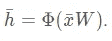

# 理解递归神经网络

> 原文：<https://medium.com/analytics-vidhya/understanding-rnns-652b7d77500e?source=collection_archive---------14----------------------->

## 深度学习

## 递归神经网络导论

折叠和展开模型中的递归神经网络(RNN)。[来源](http://www.wildml.com/2015/09/recurrent-neural-networks-tutorial-part-1-introduction-to-rnns/) [1]。

# 什么是递归神经网络(RNN)？

第一次碰到 RNNs，完全被难倒了。一个网络怎么可能记得事情？自 20 世纪 80 年代末首次出现以来，递归神经网络已被证明是处理序列数据的有效和受欢迎的方法。

递归神经网络是从传统的前馈神经网络中衍生出来的。它们有所谓的记忆元件，帮助网络记住以前的输出。

图片来源 [Unsplash](https://images.unsplash.com/photo-1533279443086-d1c19a186416?ixlib=rb-1.2.1&ixid=eyJhcHBfaWQiOjEyMDd9&auto=format&fit=crop&w=1489&q=80) 。

# 那么，为什么用循环这个词呢？

它们是循环的，因为它们对序列中的每个元素重复执行相同的任务，输出依赖于先前的计算。

递归神经网络(RNNs)是对传统神经网络的巨大改进。典型的普通神经网络计算当前输入的输出，并以预定的固定输入大小为限制进行加权。

香草神经网络:前馈神经网络。来源[NNDL](http://neuralnetworksanddeeplearning.com/chap1.html)【2】。

在本文中，我们将以 Elman 网络为例，用足够的数学知识来研究 RNNs 的体系结构。

# 为什么是 RNNs？

在典型的神经网络中，输出仅基于当前输入。生成当前输出时，不考虑任何先前的输出。没有记忆元素。在我们需要相同的情况下，rnn 是有用的。

rnn 被设计成接受一系列输入，没有预先确定的大小限制。

# 为什么是过去的产出？

大多数应用程序都有时间依赖性。这意味着生成的输出不仅取决于当前的输入，还取决于先前的输出。

rnn 在语音识别(Alexa，google assistant 等)中很有用。)、时间序列预测(股市、天气预报)、自然语言处理(NLP)等。

rnn 能够捕捉随时间推移的时间依赖性。

# 深入研究 RNNs

你可能会想，好吧，但是这些网络是如何做到记忆的呢？好吧，现在让我们讨论同样的问题。

rnn 在训练阶段将序列作为输入，并且具有基本上是隐藏层输出的存储元素。这些所谓的记忆元素在下一个训练步骤中用作输入。

*Elman 网络*是最基本的三层神经网络，反馈作为记忆输入。不要被这些符号弄得不知所措。我们过一会儿再看。

埃尔曼网络。来源[维基百科](https://en.wikipedia.org/wiki/Recurrent_neural_network)【3】。

***在 FFNN(前馈神经网络)*** 时刻 t 的输出，是当前输入和权值的函数。这可以很容易地表达如下:

FFNN 的输出。来源 Udacity。[5]

隐藏层输出可以用激活函数φ表示如下:

FFNN 中带有激活函数的隐层输出。来源 Udacity。[5]

当谈到激活功能时，以下是 RNNs 最常用的功能:

激活功能。[来源](https://stanford.edu/~shervine/teaching/cs-230/cheatsheet-recurrent-neural-networks)【4】

然而，在 ***RNN(递归神经网络)中，*** 在时间 t 的输出是当前输入、权重以及先前输入的函数。这可以很容易地表达如下:

RNN 的产量。来源 Udacity。[5]

## RNN 折叠和展开模型

让我们了解这些网络背后的架构和数学。在 RNN，我们有输入层、状态层和输出层。这些状态层类似于 FFNN 中的隐藏层，但是它们具有捕捉时间依赖性或者说网络的先前输入的能力。

RNN 折叠模型。来源 Udacity。[5]

RNN 展开模型。来源 Udacity。[5]

**展开模型**通常是我们在处理 RNNs 时使用的。

上图中， *x* (x 条)表示输入向量， *y* (y 条)表示输出向量， *s* (s 条)表示状态向量。

*Wx* 是将输入连接到状态层的权重矩阵。

*Wy* 是连接状态层和输出层的权重矩阵。

*Ws* 表示连接前一时间步的状态和当前时间步的状态的权重矩阵。

所谓的状态层输出可以给出为:

状态层的输出。来源 Udacity。[5]

输出层(带 softmax 函数)可由下式给出:

RNN 的产量。来源 Udacity。[5]

通常使用展开模型的原因是我们可以很容易地将其可视化，以便更好地理解。让我们看看折叠和展开的 Elman 网络。

埃尔曼网络折叠模型在时间 t。[5]

Elman 网络在时间 t 展开模型。[5]

时间 t 的折叠 Elman 网络，输出 *y1，y2。*

存储元件由状态层表示。折叠模型的真正问题是我们不能一次可视化一个以上的时间实例。

展开的模型给出了输入序列、状态和输出层在时间 T(零)到时间 Tn(一段时间内)的清晰图像。比如 Y *t+2* 由 *Wy* 和 *St+1* 和 *Xt+2* 确定，对应权重 *Wy* 和 *Wx。*

## 穿越时间的反向传播(BPTT)

我们现在可以看看网络是如何学习的。它类似于 FFNN，除了我们需要考虑以前的时间步骤，因为系统有记忆。rnn 使用穿越时间的反向传播(BPTT)。

为了简化，让我们考虑如下损失函数:

损失或误差函数。来源 Udacity。[5]

*Et* 表示时间 t 的输出误差

*dt* 表示时间 t 的期望输出

*yt* 表示时间 t 时的计算输出

在 BPTT，我们计算梯度来优化 *Wy、Ws 和 Wx 的权重。*

对于 *Wy，*在时间 N 的重量变化，可以一步计算如下:

错误 w.r.t **y，**为时间 n .源 Udacity。[5]

对于 *Ws* 梯度是*每一状态随时间累积的。因此，假设在时间 t=3，我们考虑从 t=1 到 t=3 的梯度，并应用考虑到 *s* 1 (s1 杆)到 *s* 2 (s2 杆)和 *s* 3 (s3 杆)的链式法则如下:*

时间 t=3 时的误差 w.r.t **S，**。来源 Udacity。[5]

错误 w.r.t **S，**为时间 n .源 Udacity。[5]

类似地计算重量引起的误差 *Wx* 。

时间 t=3 时的误差 w.r.t **X，**。来源 Udacity。[5]

错误 w.r.t **X，**为时间 n .源 Udacity。[5]

## RNN 的缺点

如果我们反向传播超过 10 个时间步长，梯度就会变得太小。这种现象被称为**消失梯度问题。**因此，跨越许多时间步长的时间依赖性将被网络有效地丢弃。发生这种情况的原因是，由于倍增梯度可能相对于层数呈指数下降/上升，因此很难捕捉长期相关性。

在 RNNs 中，我们也可能遇到相反的问题，称为**爆炸梯度**问题，其中梯度的值不受控制地增长。爆炸渐变问题的一个简单解决方案是**渐变裁剪**。通过限制梯度的最大值，这种现象在实践中得到控制。

# 结论

我希望您对 RNNs 的工作原理有了基本的了解。所谓的**长短期记忆细胞(** LSTM)进一步改进了 rnn，作为消失梯度问题的解决方案，帮助我们捕捉 10 个时间步长甚至 1000 个时间步长的时间依赖性！ **LSTM** 单元格稍微复杂一点，同样的内容将在另一篇文章中讨论。

# 参考

1.  [丹尼·布里兹的 wild ml RNNs](http://www.wildml.com/2015/09/recurrent-neural-networks-tutorial-part-1-introduction-to-rnns/)
2.  [神经网络和深度学习，作者迈克尔·尼尔森](http://neuralnetworksanddeeplearning.com/chap1.html)
3.  [递归神经网络维基百科](https://en.wikipedia.org/wiki/Recurrent_neural_network)
4.  [CS230 斯坦福深度学习](https://stanford.edu/~shervine/teaching/cs-230/cheatsheet-recurrent-neural-networks)
5.  [Udacity 深度学习纳米学位计划](https://www.udacity.com/course/deep-learning-nanodegree--nd101)

> 嘿，如果你喜欢这篇文章，请点击拍手按钮，分享这篇文章，以示你的支持。关注我，获取更多关于机器学习、深度学习和数据科学的文章。

# 在网络上找到我

[**GitHub 简介:**这就是我叉](https://github.com/NvsYashwanth)的地方

[**LinkedIn 简介:**联系分享职业动态](https://www.linkedin.com/in/nvsyashwanth/)

[**推特:**分享科技推特](https://twitter.com/YashwanthNvs)

# 谢谢:)