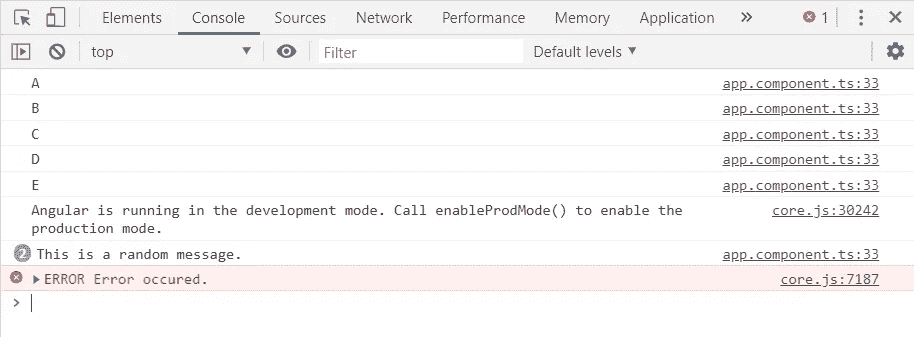

# 了解 RxJS 可观测量

> 原文：<https://medium.com/analytics-vidhya/understanding-rxjs-observables-ad5b34d9607f?source=collection_archive---------3----------------------->

## 让我们看看 RxJS 的反应式编程


杰弗里·沃克曼在 [Unsplash](https://unsplash.com?utm_source=medium&utm_medium=referral) 上拍摄的照片

在这篇博文中，我将让你对 RxJS 可观测量有一个基本的了解，以及如何在 Angular 中使用它们。

首先，让我通过简化文章主题中的术语来减轻混淆。

# 什么是反应式编程？

反应式编程意味着用异步数据流编程。流是按时间顺序排列的数据序列。可以用任何东西创建数据流，如变量、变量的变化、属性、用户输入、数据结构、点击事件、HTTP 请求等。因此，使用反应式编程，您可以观察数据流，当您观察到发出一个值时，您可以做出相应的反应。

## 关于数据流的更多信息。

流不仅仅发出上述的值。在时间线期间，当某个意外事件发生导致流结束时，流也会发出一个错误，或者当用户关闭窗口时，流可能会完成，从而发出一个完整的信号。所以我们可以捕捉这些流来根据它们执行函数。

# RxJS 是什么？

RxJS 是一个 JavaScript 库，允许我们使用反应式编程。RxJS 使用可观察对象来编写异步代码，并提供处理可观察对象的函数。

# 大话题:可观察的事物

## 什么是可观察的？

可观察对象是一个充当数据流包装器的函数。它们支持在应用程序内部传递消息。一个可观察的东西在被观察者认可之前是没有用的。观察者是一个消耗被观察对象发出的数据的物体。观察者不断从可观察对象接收数据值，直到可观察对象完成，或者观察者退订可观察对象。否则，观测者可以连续和异步地接收来自被观测者的数据值。因此我们可以执行各种操作，比如更新用户界面，或者传递 JSON 响应。

一个可观测的生命周期有 4 个阶段。

1.  创造
2.  签署
3.  执行
4.  破坏

## 让我们用角度来理解这 4 个阶段。

您需要导入 RxJS 库来创建一个可观察对象。

```
import { Component } from '@angular/core';
import { Observable } from 'rxjs';@Component({
   selector: 'app-root',
   templateUrl: './app.component.html',
   styleUrls: ['./app.component.scss']
})export class AppComponent {
   title = 'observable';ngOnInit() {
   var observable = Observable.create()
}
}
```

这就是你如何创造一个可观察的。但是在你订阅之前，观察是没有用的。下面的代码显示了如何订阅一个可观察的。

```
import { Component } from '@angular/core';
import { Observable } from 'rxjs';@Component({
selector: 'app-root',
templateUrl: './app.component.html',
styleUrls: ['./app.component.scss']
})export class AppComponent {
   title = 'observable';ngOnInit() {
   var observable = Observable.create((observer: any) => {
      observer.next('Hello world!')
   })observable.subscribe(function showMessage(msg: any) {
      console.log(msg)
   })
}
}
```

当您检查控制台时，可以看到 observer.next()值。

现在让我们尝试执行可观测量。

```
import { Component } from '@angular/core';
import { Observable } from 'rxjs';@Component({
   selector: 'app-root',
   templateUrl: './app.component.html',
   styleUrls: ['./app.component.scss']
})export class AppComponent {
   title = 'observable';ngOnInit() {
   var observable = Observable.create((observer: any) => {
      observer.next('A')
      observer.next('B')
      observer.error('Error occured.')
      observer.complete('Data stream is over.')
      observer.next('C')
   })observable.subscribe(function showMessage(msg: any) {
      console.log(msg)
   })
}
}
```

如果出现错误或完成，它将自动停止执行。您只能在控制台上看到“A”和“B”字样。

让我们尝试在 setInterval()方法的帮助下实现异步。

```
import { Component } from '@angular/core';
import { Observable } from 'rxjs';@Component({
   selector: 'app-root',
   templateUrl: './app.component.html',
   styleUrls: ['./app.component.scss']
})export class AppComponent {
   title = 'observable';ngOnInit() {
   var observable = Observable.create((observer: any) => {
      observer.next('A')
      observer.next('B')setInterval(() => {
         observer.next("This is a random message.")
      }, 2000)observer.next('C')
      observer.next('D')setInterval(() => {
         observer.error("Error occured.")
      }, 4001)observer.next('E')
   })observable.subscribe(function showMessage(msg: any) {
      console.log(msg)
   })
}
}
```

您的控制台将如下所示。在这里，值的显示是异步完成的。



销毁一个可观察对象意味着通过取消订阅将它从 DOM 中移除。通常 RxJS 通过在错误或完成发生后取消订阅来销毁一个可观察对象。

## 可观测量的重要性

可观者懒惰。这意味着如果没有订阅，它将不会发出数据。此外，使用 observables 处理具有多个数据值的异步数据发送更容易。

这是一个关于 RxJS 角度可观测量的基本介绍，希望它能帮助你理解什么是可观测量。

编码快乐！