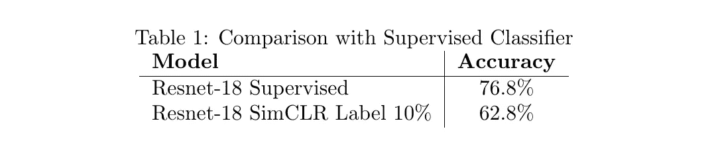

# 理解 sim clr——用代码对比学习视觉表示的简单框架

> 原文：<https://medium.com/analytics-vidhya/understanding-simclr-a-simple-framework-for-contrastive-learning-of-visual-representations-d544a9003f3c?source=collection_archive---------2----------------------->

他的论文[1]为视觉表征的对比学习提出了一个简单的框架(作者称之为 **SimCLR** )。这些视觉表示是向量，线性分类器可以在这些向量上被训练来解决像图像分类这样的问题。我们知道，我们可以通过在 ImageNet 等标记数据集上训练 ResNet 等深度学习模型来学习这些视觉表示。但是标记和注释数据是一个耗时的过程，需要大量的劳动，所以我们希望尽可能地避免它。 [**自我监督学习**](https://paperswithcode.com/task/self-supervised-image-classification) 是一种通过发现和利用不同输入特征之间的相关性来自动标记训练数据的学习技术。在没有人类监督的情况下，我们如何学习这些视觉表征？对比学习是本文提出的答案。让我们借助一个例子来看看它是什么。

# 对比学习

对比学习法，通过**对比正面对与负面对**来学习表征。我们通过一个例子来了解一下这些正负对是什么。

假设我们有下面一批 25 张图片。这些是来自 5 个类别的图像，即飞机、汽车、狗、大象和猫，但请注意，这些标签不会用于训练整个模型。然而，在学习算法时，我们将使用这些标签进行可视化。

来自该[数据集](https://github.com/thunderInfy/imagenet-5-categories)的一批 25 幅示例图像

这 25 张图片的尺寸都是 224 x 224。我们应用两个数据增强操作的组合，第一个是**随机裁剪并将**调整到 224 x 224，第二个是**颜色失真**，每个图像两次，以获得两个新图像。

从左到右:原始图像，通过在原始图像上应用两次随机裁剪、调整大小和颜色变形的组合而获得的两个图像。

在 PyTorch 中应用这些数据扩充的代码如下。

我们对我们的 25 个图像中的每一个应用这种数据增强的组合，以获得 50 个增强的图像。之后我们会处理这 50 张增强图像。在这些图像中，**我们将正对定义为从同一幅原始图像**中得到的那些图像对。所以，有 25 个正对。通常，对于一批 N 幅图像，我们将得到 2N 幅增强图像。从这 2N 幅图像中给定一个特定的正对(I，j)，我们认为**另外 2(N-1)幅图像是 I 和 j 的负例。**

所以，现在我们知道了什么是积极和消极配对，让我们看看作者是如何利用这些来学习视觉表征的。

来源:[1]

所以，到目前为止，我们已经有了这些增强图像。我们在神经网络中输入每个正对(如上图所示的 f 和 g 的组合)，我们得到矢量 z_i 和 z_j。我们**最大化这些矢量之间的一致性**。我们希望同一幅图像的不同外观有相似的表现。

这些向量之间的一致性通过最小化这些向量之间的对比损失(**归一化温度标度交叉熵损失**或 **NT-Xent** 来最大化。我们来详细了解一下这个损失。

# 归一化温度标度交叉熵损失

gif 来自 giphy.com

让 sim 表示余弦相似度函数，如下所示。

余弦相似性

然后，正对实例(I，j)的 NT-Xent 损耗定义为

正示例对(I，j)的 NT-Xent 损失函数

通过使用对数函数的性质和一些代数操作来简化上述损失函数形式，我们得到了稍微更容易理解的形式。

我们看到，通过最小化正示例对(I，j)的 NT-Xent 损失，我们不仅**使向量 z_i 更类似于 z_j** ，而且**使其不同于所有其他向量。**

注意，损耗是不对称的，即 l_{i，j}！= l_{j，i}，因为分子中的和是不同的。因此，为了计算最终损失，我们计算所有正对(分别取(I，j)和(j，I ))的损失，然后取平均值。

我们可以把τ看作一个温度超参数，它使损失函数形式更易于表达。它的各种价值可以尝试，作者也这样做了。

下面是 PyTorch 中这个损失函数的代码。

理解上面的代码(如果你读完代码后理解了代码，请随意略读解释):

在上面的代码中，a 和 b 是每个都包含 N 个增强图像表示的向量，并且在 I 从 1 到 N 的意义上保持顺序，a[i]和 b[i]一起是正对。我们看到，在损失函数中，我们需要向量对之间的相似性。我们知道两个向量之间的相似性是它们各自单位向量之间的点积。所以我们在 a 和 b 中找到每一行的单位向量，并将结果存储在 a_cap 和 b_cap 中。请注意，我们需要从 2N 个示例中选择的所有对之间的相似性。因此，我们首先连接 a_cap 和 b_cap 以获得 2N 个示例的单个向量 a_cap_b_cap。现在最关键的部分是理解**a _ cap _ b _ cap 与 a_cap_b_cap_transpose 的矩阵乘积给出了相似性矩阵**，其第 I，j 项表示表示 I 和表示 j 之间的相似性，其中 I 和 j 都从 1 变化到 2N。我希望代码的其余部分从中间变量的名称中可以看得很清楚。

考虑从两个不同的汽车图像中获得的以下四个正对。

通过最大化正对表示之间的一致性，我们本质上正在做的是**我们正在制作汽车和汽车部件的表示(因为随机裁剪)，不太强调颜色(因为颜色抖动)，彼此靠近。这导致汽车整体表示之间的相似性增加。**

# 结果

我们在我们的[数据集](https://github.com/thunderInfy/imagenet-5-categories)上使用 NT-Xent 损失函数训练一个 resnet。它包含 1250 幅用于训练的图像(每类 250 幅)和 250 幅用于测试的图像(每类 50 幅)。

resnet 的代码如下。我们使用 resnet18 模型，并用一些其他完全连接的层替换顶层。

Resnet 18，最后一层用非线性分类器代替

在训练上面的 resnet 时，我们得到了下面的 NT-Xent 丢失与历元数的关系图。

训练损失与时期数的关系图

我们从我们的训练数据中随机选择 10%的例子，我们将揭示这些例子的标签，以便在我们学习的表示之上训练线性分类器。可以这样想:假设你第一次看到[梵文数字](https://en.wikipedia.org/wiki/Devanagari_numerals)，你不知道哪个数字代表哪个数字。你仍然可以在这组数字中辨认出十组。所以，为了识别梵文数字，你只需要知道哪个簇对应哪个数字。因此，需要更少的标记，因为数字的某种聚类表示已经在你的脑海中了。

我们为我们的测试(250 个图像)可视化最后一层向量(在我们的例子中是 25 维的),并使用 t-SNE 来训练(仅 10% — 125 个图像)。在下面的散点图中，我们使用标签，使属于同一类别的图像具有相同的颜色。

最后一层向量的 t-SNE 可视化

下面是倒数第二层向量(在我们的例子中是 50 维)的 t-SNE 可视化。

倒数第二层向量的 t-SNE 可视化

我们在上面的图像中看到一些星团，这是一个很好的迹象。

获得上述 SNE 霸王龙图像的代码如下。

我们现在在从倒数第二层(50 维)获得的表示上训练线性分类器。线性分类器的代码如下。

我们获得了下面的训练和测试精度图&交叉熵损失与历元数的关系。

在 10%标记的训练数据上训练线性分类器时获得的准确度和损失对时期数的图

## 与监督分类器的比较

为了理解获得的结果有多好，我们将它们与从监督分类器(Resnet-18 模型)获得的结果进行比较。表 1 显示了比较结果。监督分类器的精度和损失图如下。

精度和损失与历元数的关系图

大约在 180 个历元时，精确度突然增加，这时我们关闭了数据扩充，之后模型开始过度拟合。我们存储了具有最佳测试准确性的模型。

我们看到监督和非监督分类器之间有 14%的精度差距。我们使用 256 的批量和 Resnet-18 模型。**如果我们使用更大的批量和更大更宽的模型，这 14%的差距可以进一步缩小，因为与监督方法相比，SimCLR 从这些方法中获益更多**。但这需要更强的计算能力(**动量对比和来自 SimCLR (MoCo-V2)的想法可以帮助我们做到这一点——我写了一篇关于它的博文** [**这里**](/analytics-vidhya/simclr-with-less-computational-constraints-moco-v2-in-pytorch-3d8f3a8f8bf2) )。

本文的代码在 [this GitHub repo](https://github.com/thunderInfy/simclr) 中。

# 参考

[1] [陈婷、西蒙·科恩布鲁斯、穆罕默德·诺鲁齐和杰弗里·e·辛顿。视觉表征对比学习的简单框架。arXiv 预印本 arXiv:2002.05709，2020](https://arxiv.org/pdf/2002.05709.pdf)；[ [由我突出显示](http://cse.iitkgp.ac.in/~arastogi/papers/simclr.pdf)

**更新:**

*   [与选择正确的投影头](/@aditya.rastogi/the-projection-head-in-simclr-b73cfc447854?source=friends_link&sk=46b5fbfc3240224a417fe3edfddf1fa5)相关的更新导致 resnet-18 SimCLR(含 10%标签)模型在测试集上的**精度提高了 65.2%** 。
*   我使用 Google Colab 来运行这个 SimCLR 代码。[这是 Colab 的笔记本链接。](https://colab.research.google.com/drive/1YaLNsuaVeimgi-d473wk96wCD0BGecPd)

感谢您花时间阅读本文。