# 理解反传斜率计算的简单方法

> 原文：<https://medium.com/analytics-vidhya/understanding-slope-calculation-for-backpropagation-the-simple-way-d9d99793ac9f?source=collection_archive---------12----------------------->

我们都知道反向传播是神经网络中最难的概念之一。学习者在探索算法时最头疼的是如何计算后续权重的斜率。

提示:为了更好地理解，建议在桌面上查看这篇文章，因为有许多图像形式的数学方程。

在本文中，我们将理解如何使用计算图的简单概念来计算实现反向传播算法所需的梯度下降中的斜率。

让我们考虑一个等式，

*F(a，b，c)=5*(a*b+c)*

让我们，

*u = a * b；v = u+c；F = 5v*

上述等式的计算图可以绘制为:

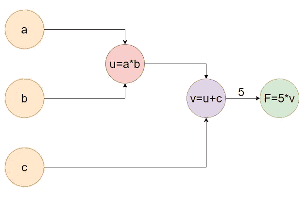

图一

从图 1 中可以看出 *F* 依赖于 *v，v* 依赖于 *u* 并且*u*随后依赖于 *a* 以及*b*我们可以得出 *a* 和 *F* 之间的关系

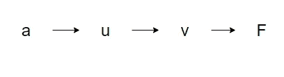

图 2

现在我们来谈谈衍生品:

*F* w.r.t .变量 *v* 的导数简单地由下式给出:

现在为了计算 *F* w.r.t *u* 的导数，由于 *F* 是从 *v* 计算的，而 *v* 依赖于 *u* ，因此，我们需要通过*v*从 *F* 遍历回 *u*

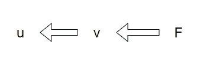

图 3

因此我们会得到，

同样，对于 F 的导数，我们必须遵循这条路径

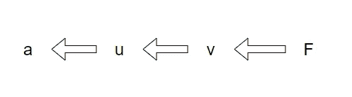

图 4

我们得到了

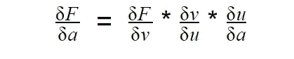

# 神经网络

现在就神经网络而言，这里，后续层中的节点值是通过称为前向传播的乘加过程来计算的，在该过程中，假设 L 与相应的权重 W 相乘并相加，通过将相加的结果传递通过激活函数来计算最终值。这里我们将考虑 sigmoid 激活函数。

我们可以画出神经网络的计算图

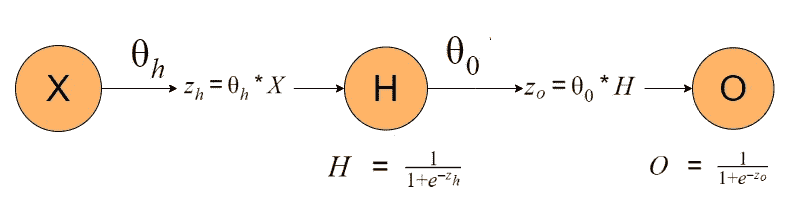

图 5

请记住，图 5 不是实际的神经网络表示，而是它的计算图。

从上图我们可以观察到:

我们有

**输入**

**重量**

**隐藏层的乘加处理**

**替换我们的 Sigmoid 激活函数**中最后一次操作的输出

**输出层的乘加处理**

**应用 s 形激活功能**

这就完成了我们对 ***正向传播的处理。***

计算输出 *O* 与实际值 *Y* 相差多少的误差函数我们将使用 ***均值*** ***平方误差函数。***

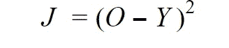

注意:这里我们只演示了单个样本的计算

# 反向传播

反向传播算法的主要目的是通过梯度下降改变权重来计算权重的最佳值，直到我们获得最佳权重。

获得最佳权重的梯度下降方程由下式给出:

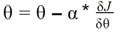

在哪里

表示要更新的权重。

代表学习率。

> ***是我们的损失函数 w.r.t .的导数，要更新的权重***

现在我们主要关心的是如何计算损失函数相对于待更新权重的斜率。为此，我们将不得不再次为我们的计算图(图 5)中的变量绘制一个关系图，用于正向传播。

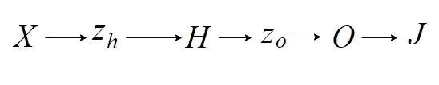

图 6

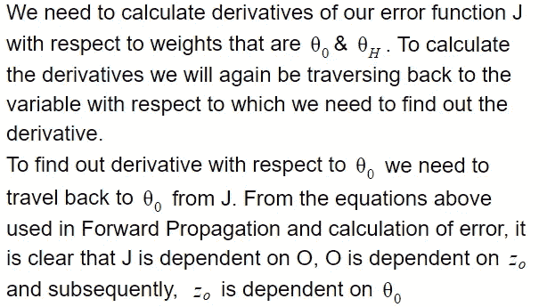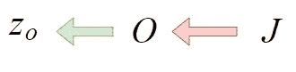

图 7

我们得到，

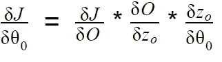

等式 1

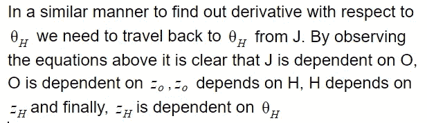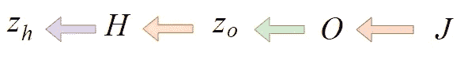

图 8

我们获得，

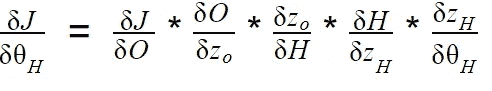

因此，通过这种简单的追踪权重 w.r.t .的方法，我们可以很容易地使用反向传播和梯度下降来更新我们的权重。

*我希望这篇文章对你有用！*

*在 LinkedIn 上联系我:*[【https://www.linkedin.com/in/suyag10/】T21](https://www.linkedin.com/in/suyash-gupta-9b247b154/)