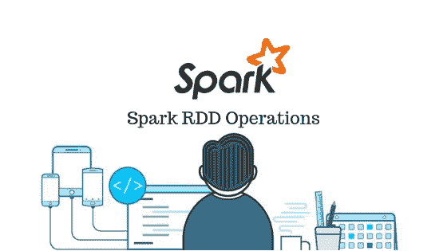
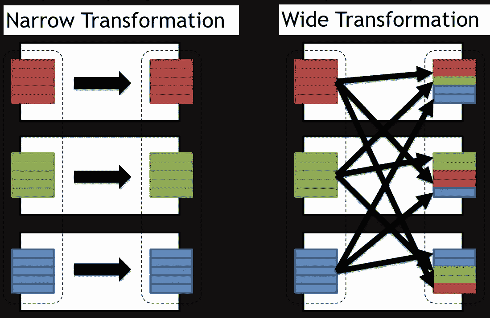

# 了解 Spark RDDs 第 3 部分

> 原文：<https://medium.com/analytics-vidhya/understanding-spark-rdds-part-3-3b1b9331652a?source=collection_archive---------8----------------------->



图片来源:Java 开发者专区

欢迎光临！前一篇博客简要介绍了 Spark 中的 rdd。在本文中，我们将讨论 Spark RDDs 上的两个重要操作——**转换和动作**以及示例。在本博客结束时，您将对 rdd 以及如何使用 rdd 编写 PySpark 程序有一个清晰的概念。

## 在 PySpark 中创建 rdd

在我们研究可以在 rdd 上执行的操作之前，让我们学习如何在 PySpark 中创建 rdd。我希望你已经在电脑上安装并配置了 PySpark。如果没有，参考[之前的博客](/@anveshrithaas/introduction-to-pyspark-part-2-6d6113e31592)获取快速安装指南。

创建 rdd 的方法不止一种。一种简单的方法是通过将驱动程序中的现有集合传递给 SparkContext 的*parallelise()*方法来并行化它。在这里，集合的元素被复制到一个 RDD 中，并且可以被并行处理。

```
data= [“Scala”, “Python”, “Java”, “R”]myRDD= sc.parallelize(data)
```

***注意:*** *不要忘记创建 SparkContext sc(除非您使用的是 PySpark shell，它会自动创建 sc)。这是编写任何 Spark 程序时应该做的第一件事。*

在这里，并行化集合中的数据被分割成多个分区，一个任务将在集群的每个分区上执行。默认情况下，Spark 根据集群设置分区数量。也可以通过将分区数量作为第二个参数传递给 *parallelize()* 方法来手动设置。

```
data= [“Scala”, “Python”, “Java”, “R”]#data split into two partitions
myRDD= sc.parallelize(data,2) 
```

创建 Spark RDD 的另一种方式是从其他数据源，如本地文件系统、Cassandra、HDFS 等。这里，数据是从外部数据集加载的。为此，我们使用 SparkContext 的 *textFile* 方法，该方法将文件的 URL 作为其参数。

```
#text file to RDD
myRDD= sc.textFile(“/path_to_file/textdata.txt”)# CSV file to RDD
myRDD=sc.textFile(“/path_to_file/csvdata.csv”)
```

***注意:*** *确保如果您正在使用本地文件系统中的文件，那么该文件也可以在 worker 节点上的相同路径中访问。*

Spark 的 rdd 支持两种类型的操作，即转换和操作。一旦创建了 rdd，我们就可以对它们执行转换和操作。

# 转换

转换是对 RDD 的操作，它通过对原始 RDD 进行更改来创建新的 RDD。简而言之，它们是将现有的 RDD 作为输入，将新的 RDD 作为输出的函数，而不需要对原始的 RDD 进行修改(注意，rdd 是不可变的！)将 RDD 变换为新的过程是通过诸如 filter、map、reduceByKey、sortBy 等操作来完成的。正如在前面的博客中看到的，rdd 遵循懒惰评估。也就是说，rdd 上的转换将不会被执行，直到它在需要时被触发。因此，只要在数据上调用一个动作，就可以在任何时候执行这些操作。RDD 的转变可以分为两类:狭义的和广义的。

*   在**窄转换**中，转换的结果是，在输出 RDD 中，每个分区都有来自父 RDD 中相同分区的记录。像 Map、FlatMap、Filter、Sample 这样的操作属于狭义转换。
*   而在**宽转换**中，结果 RDD 的每个分区中的数据来自父 RDD 中的多个不同分区。像 groupByKey()、reduceByKey()这样的转换函数属于广泛转换的范畴。



来源:Pinterest

让我们来看看 RDD 的一些变化。

## 地图()

*map()* 通过对原始 RDD 中的每个元素应用一个函数来返回一个新的 RDD。

```
data= [1, 2, 3, 4, 5]myRDD= sc.parallelize(data)#Returns a new RDD by multiplying all elements of parent RDD by 2
newRDD= myRDD.map(lambda x: x*2)print(newRDD.collect())
```

***输出:***

```
[2, 4, 6, 8, 10]
```

## 平面地图()

*flatMap()* 通过将函数应用于父 RDD 的每个元素，然后将结果展平，返回一个新的 RDD。我们来看一个例子，了解一下 *map()* 和 *flatMap()* 的区别。

```
data= [1, 2, 3]
myRDD= sc.parallelize(data)**#map() returns [[1], [1, 2], [1, 2, 3]]**
mapRDD= myRDD.map(lambda x: range(1,x))**#flatmap() returns [1, 1, 2, 1, 2, 3]**
flatMapRDD = myRDD.flatMap(lambda x: range(1,x))
```

## 过滤器()

*filter()* 返回一个新的 RDD，仅包含父 RDD 中满足 filter 内部函数的元素。

```
data= [1, 2, 3, 4, 5, 6]myRDD= sc.parallelize(data)#returns an RDD with only the elements that are divisible by 2
newRDD= myRDD.filter(lambda x: x%2 == 0)print(newRDD.collect())
```

***输出:***

```
[2, 4, 6]
```

## 独特()

*distinct()* 返回一个新的 RDD，它只包含父 RDD 中的 distinct 元素

```
data= [1, 2, 2, 3, 3, 3]myRDD= sc.parallelize(data)newRDD= myRDD.distinct()print(newRDD.collect())
```

***输出:***

```
[1, 2, 3]
```

## groupByKey()

*groupByKey()* 将 RDD 的(Key，value)对中每个键的值分组到一个序列中。我们得到的是一个允许我们迭代结果的对象。

```
myRDD = sc.parallelize([(“a”, 1), (“a”, 2), (“a”, 3), (“b”, 1)])#print result as list
resultList= myRDD.groupByKey().mapValues(list)reultList.collect()
```

**输出:**

```
[(‘a’, [1, 2, 3]), (‘b’, [1])]
```

## reduceByKey()

*reduceByKey()* 在(Key，value)对的数据集上调用时，返回一个新的数据集，其中聚合了每个键的值。

```
from operator import addmyRDD = sc.parallelize([(“a”, 1), (“a”, 2), (“a”, 3), (“b”, 1)])#adds the values by keys
newRDD= myRDD.reduceByKey(add)newRDD.collect()
```

**输出:**

```
[(‘a’, 6), (‘b’, 1)]
```

***注意:*** *groupByKey()和 reduceByKey()可能看起来差不多。它们之间的区别在于，当在 RDD 上调用 groupByKey 时，分区中的数据在网络上被打乱，然后它们才被分组。这导致大量数据不必要地在网络上传输。然而，reduceByKey()在对数据进行洗牌以提高效率之前，在本地根据它们各自分区上的键来组合这些对。因此，reduceByKey()用于大型数据集以获得更好的性能。*

## sortByKey()

*sortByKey()* 返回一个新的 RDD，其父 RDD(key，value)对按照键的排序顺序排列。

```
myRDD = sc.parallelize([(“c”, 1), (“d”, 2), (“a”, 3), (“b”, 4)])#sort by key
newRDD= myRDD.sortByKey()newRDD.collect()
```

***输出:***

```
[(‘a’, 3), (‘b’, 4), (‘c’, 1), (‘d’, 2)]
```

## 联合()

*union()* 返回父 RDD 的并集的新 RDD。

```
myRDD1 = sc.parallelize([1, 2, 3, 4])myRDD2 = sc.parallelize([ 3, 4, 5, 6, 7])#union of myRDD1 and myRDD2
newRDD = myRDD1.union(myRDD2)newRDD.collect()
```

**输出:**

```
[1, 2, 3, 4, 3, 4, 5, 6, 7]
```

类似地，我们有 intersection()返回两个 rdd 的交集。

# 行动

动作是在 RDD 上执行计算并将最终结果返回给驱动程序的操作。在将数据加载到 RDD 之后，它触发执行来执行中间转换，并最终将结果传递回来。这些动作是产生非 RDD 值的操作。正如我们已经看到的，只有当一个动作需要返回一个结果时，转换才会被执行。收集、减少、计数键、计数是一些动作。

让我们用例子来看看 rdd 上的一些动作。

## 收集()

看了上面的例子，现在你应该知道 *collect()* 是做什么的了。它返回一个包含 RDD 所有元素的列表。

## 计数()

*count()* 返回 RDD 中元素的个数

```
data= [“Scala”, “Python”, “Java”, “R”]myRDD= sc.parallelize(data)#Returns 4 as output
myRDD.count()
```

## 减少()

*reduce()* 使用一个以 RDD 的两个元素为输入并给出结果的函数来聚合 RDD 的元素。

```
data= [1, 2, 3, 4, 5]myRDD= sc.parallelize(data)#returns the product of all the elements
myRDD.reduce( lambda x, y: x * y)
```

**输出:**

```
120
```

它也可以用于字符串。在这种情况下，结果也将是一个字符串。

```
data= [“Scala”, “Python”, “Java”, “R”]myRDD= sc.parallelize(data)#Concatenate the string elements
myRDD.reduce( lambda x, y: x + y)
```

**输出:**

```
‘ScalaPythonJavaR’
```

## foreach()

将函数应用于 RDD 中的每个元素

```
def fun(x):
    print(x)data= [“Scala”, “Python”, “Java”, “R”]myRDD= sc.parallelize(data)#function applied to all the elements
myRDD.foreach(fun)
```

**输出:**

```
Scala
Python
Java
R
```

## countByValue()

它将 RDD 中每个唯一值的计数作为字典以(值，计数)对的形式返回。

```
data= [“Python”, “Scala”, “Python”, “R”, “Python”, “Java”, “R”, ]myRDD= sc.parallelize(data)#items() returns a list with all the dictionary keys and values returned by countByValue()myRDD.countByValue().items()
```

**输出:**

```
[(‘Python’, 3), (‘R’, 2), (‘Java’, 1), (‘Scala’, 1)]
```

## 计数键()

它计算 RDD 中每个唯一键的值的数量，并将其作为字典返回。

```
data= [(“a”, 1), (“b”, 1), (“c”, 1), (“a”, 1)]myRDD = sc.parallelize(data)myRDD.countByKey().items()
```

**输出:**

```
[(‘a’, 2), (‘b’, 1), (‘c’, 1)]
```

## 拿走

*take(n)* 以同样的顺序返回 RDD 的前 n 个元素

```
data= [2, 5, 3, 8, 4]myRDD= sc.parallelize(data)#return the first 2 elements
myRDD.take(3)
```

**输出:**

```
[2, 5, 3]
```

## 顶部(n)

返回按降序排列的所有 RDD 元素中的前 n 个元素。

```
data= [2, 5, 3, 8, 4]myRDD= sc.parallelize(data)#return the first 2 elements
myRDD.take(3)
```

**输出:**

```
[8, 5, 4]
```

## 让我们动手吧！


图片来源:Freepik

既然我们已经熟悉了 PySpark 中 rdd 上的基本转换和操作，是时候全面了解这些在一个完整的 Spark 程序中是如何工作的了。为了证明这一点，这里有几个 PySpark 的简单用例，它们将清晰地展示 SparkContext、rdd、转换和动作是如何在 Spark 程序中使用的。这些都是简单的程序，你可以试着自己编码。因此，在查看代码之前，请尝试自己编写代码。

***注意:*** *要运行 PySpark 应用程序，在命令提示符下执行以下命令*

```
**spark-submit filename.py**
```

## 问题陈述 1 —流行电影:

想出一个 Spark 程序，根据观看次数找到最受欢迎的电影，并显示电影名称而不是电影 ID。要使用的数据集是包含 100k 电影分级的 movielens 数据集。电影 id 存储在 u.data 文件中，相应的电影名称存储在 u.item 文件中。数据集可以在[这里](https://github.com/Anveshrithaa/Apache-Spark-Projects/tree/master/popular-movies/ml-100k)找到。

***注意:*** *为此，我们将使用广播变量来保存所有节点的公共数据副本。这个变量被缓存在所有工作节点上，而不是将数据与其任务一起显式发送，以提高效率。*

**输出:**

```
(‘Star Wars (1977)’, 583)
(‘Contact (1997)’, 509)
(‘Fargo (1996)’, 508)
(‘Return of the Jedi (1983)’, 507)
(‘Liar Liar (1997)’, 485)
(‘English Patient, The (1996)’, 481)
(‘Scream (1996)’, 478)
(‘Toy Story (1995)’, 452)
(‘Air Force One (1997)’, 431)
(‘Independence Day (ID4) (1996)’, 429)
```

## 问题陈述 2 —字数:

找出一本书中所有独特的单词，以及每个单词出现的次数。要使用的数据集是 book.txt，可以在这里找到[。](https://github.com/Anveshrithaa/Apache-Spark-Projects/blob/master/word-count/Book.txt)

通过删除任何标点符号或其他不属于单词的东西，只列出单词。在考虑独特的单词时，单词不应该区分大小写。也就是说，例如,“spark”和“Spark”被认为是一个唯一的单词，与大小写无关。

如果你觉得它很有趣，那就去选择一个你自己喜欢的问题陈述，并尝试一下吧！

在这篇博客中，我们看到了如何创建 rdd，以及更多关于 rdd 的操作和一些例子。我希望这让您对 Spark 内核的基础有了清晰的了解。现在让我们转到 Apache Spark 的其他组件。是时候开始最有趣的部分了——用 PySpark 进行机器学习！一定要看看下一篇文章中关于使用 python 的 Spark 的机器学习方面的实践会议。期待在那里见到你！

查看本系列中的其他博客

[***第 1 部分 Apache Spark 入门***](/@anveshrithaas/getting-started-with-apache-spark-part-1-91b379204ae0)

[***第二部分—PySpark***](/@anveshrithaas/introduction-to-pyspark-part-2-6d6113e31592)介绍

[***第四部分 PySpark 中的机器学习***](/@anveshrithaas/machine-learning-in-pyspark-part-4-5813e831922f)

[***第五部分——数据块上端到端的机器学习流水线***](/@anveshrithaas/end-to-end-machine-learning-pipeline-on-databricks-part-5-c10273e2cd88)