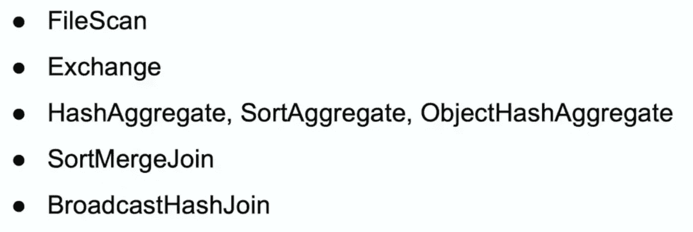

# 了解 Spark UI

> 原文：<https://medium.com/analytics-vidhya/understanding-spark-ui-51585e5e72c2?source=collection_archive---------6----------------------->

在本文结束时，您将能够查看 spark UI 并理解基本的东西。

Spark UI 中显示的一些基本操作符是

**文件扫描**

它表示从文件格式中读取数据。

文件扫描中需要注意的事项

*   读取的文件数量
    —Spark 需要读入内存的文件或零件文件的数量
*   文件系统读取数据总大小
    —将进入下一阶段的数据的实际大小
    —该文件大小将与下一阶段的输入大小相匹配
*   文件读取总大小
    —spark 扫描文件时读取的数据总大小
*   Rows Output
    —将传递到下一阶段的记录数
    —行数将与下一阶段的输入行数相匹配

**交换**

它代表随机—群集上的物理数据移动。

交换是 spark 作业中最昂贵的操作之一。

当数据被打乱时，有多种方法可以对其进行重新分区。要了解发生的分区类型，您必须将鼠标悬停在 Spark UI 中的交换上。

**单分区**

在单分区期间，您的所有数据都被移动到单个分区，并且将在单个内核上运行。这会给你的工作造成严重的瓶颈。如果您的数据很大，您甚至可能面临内存不足的错误。

当我们使用一个窗口函数，但没有提供一个键来分割数据时，就会发生这种情况。

扳机

*   window.partitionBy()

**哈希分区**

扳机

*   分组依据
*   明显的
*   加入
*   重新分区(列)
*   window.partitionBy(键)

**循环分区**

扳机

*   重新分配(数量)

**范围划分**

扳机

*   orderBy

**聚合**

扳机

*   分组依据
*   明显的
*   删除重复项

您的数据可能会发生三种类型的聚合

*   哈希聚合
    1。成对出现
    a .在每个执行器上发生的部分求和，之后数据被混洗
    b .最终合并求和发生在交换之后。这种合并所有部分和
    散列聚合对之间的交换可能发生也可能不发生。
*   分类聚合
*   对象散列集合

**排序合并连接**

排序合并连接表示连接两个数据帧。

当单个数据集已经满足输出分区和输出排序要求时，就会发生交换和排序。

如果您将鼠标悬停在 Spark UI 中的排序合并连接上，您将能够看到实际发生了什么连接。

**广播哈希连接**

广播散列连接成对出现

*   广播交换
    —这是将数据广播给每个执行者的地方
*   广播散列连接