# 了解 Splunk:数据摄取

> 原文：<https://medium.com/analytics-vidhya/understanding-splunk-data-ingestion-19de8a9b75f9?source=collection_archive---------2----------------------->

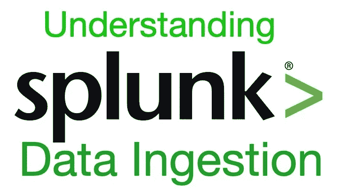

# 简介:

如今，组织产生的数据比其整个存在期间产生的数据都多。据预测，未来两年将会产生 zetta 字节的数据。证实这一预测的原因是，任何新的基于云的应用程序或任何云连接的物联网设备都在每微秒生成数据流。此外，收集的数据中还有一个被忽略的部分没有使用。这些数据中蕴藏着巨大的商业价值，我们需要工具来挖掘这些数据，并通过从这些数据中推断出有意义的信息来兑现。在大数据分析师中，这些数据通常被称为暗数据。暗数据主要表现在 web 流量、日志文件、流分析数据、非结构化数据等方面

任何组织如何利用这些黑暗的数据，并将其转化为可操作的见解。Splunk 就是答案。Splunk 允许您调查原始非结构化格式的数据，在数据流经您的业务系统时对其进行监控，分析其趋势并采取措施，以便您可以将您的黑暗数据转化为可操作的见解。

**了解大数据的四个 v:**

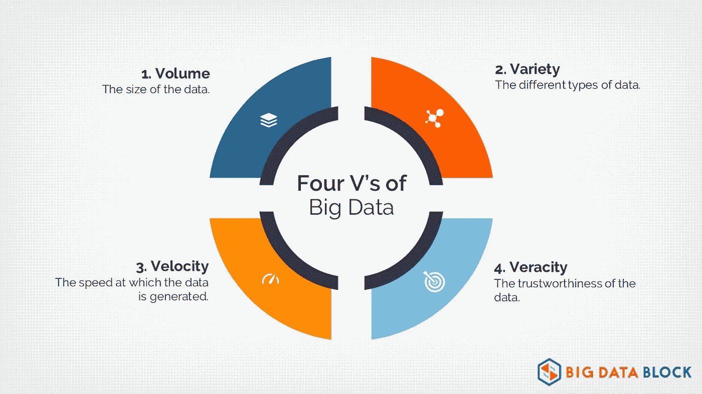

图片来源:[https://Twitter . com/big data block/status/1001523633733488641/photo/1](https://twitter.com/BigDataBlock/status/1001523633733488641/photo/1)

组织产生的大量数据在用途和位置上非常多样化。数据结构搜索(DFS)的重点是解决前三个 Vs，即数量、可变性和多样性。从历史上看，数据平台的建立是为了优化其中的一个，而牺牲了其他的。

**Splunk 能出什么指数:**

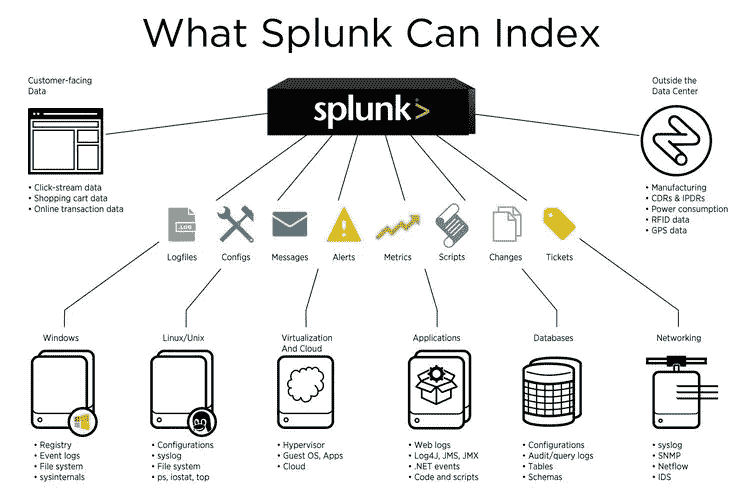

图片来源:[https://answers . splunk . com/answers/671980/what-the-different-type-of-data-ingestion . html](https://answers.splunk.com/answers/671980/what-are-the-different-types-of-data-ingestion.html)

**演示:Splunk 中的数据接收(带截图):**

以下是在 Splunk 仪表板中摄取数据文件的步骤。

**步骤 1:** 使用 Splunk CLI 启动 Splunk 服务器

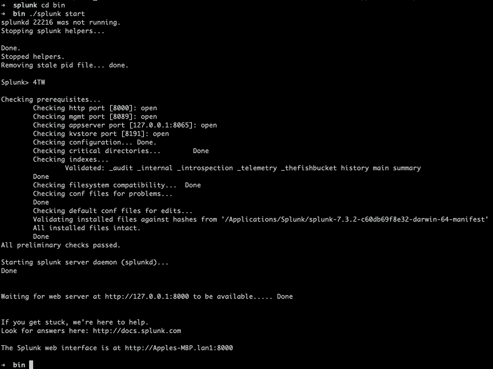

**步骤 2:** 使用 Splunk 凭证登录

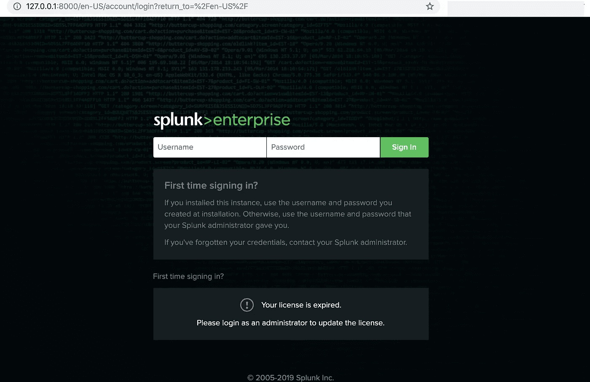

**第三步:**登录成功后的仪表板

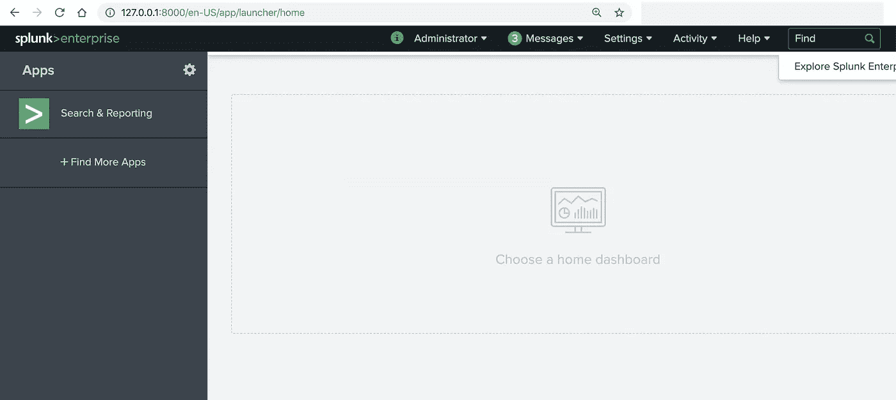

**第四步:**从设置选项卡中选择“添加数据”。

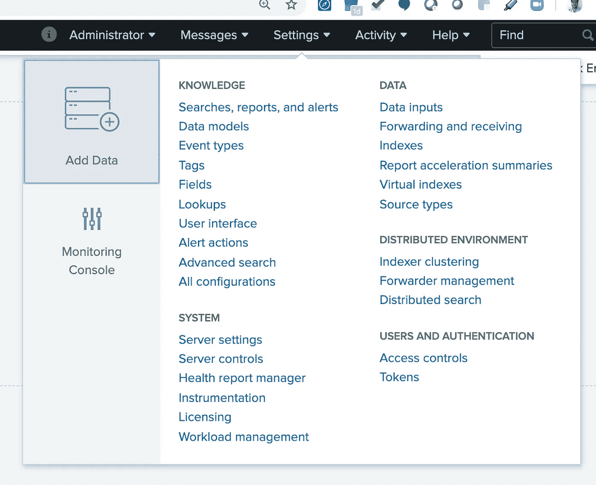

**第 5 步:**从仪表板中选择“上传”

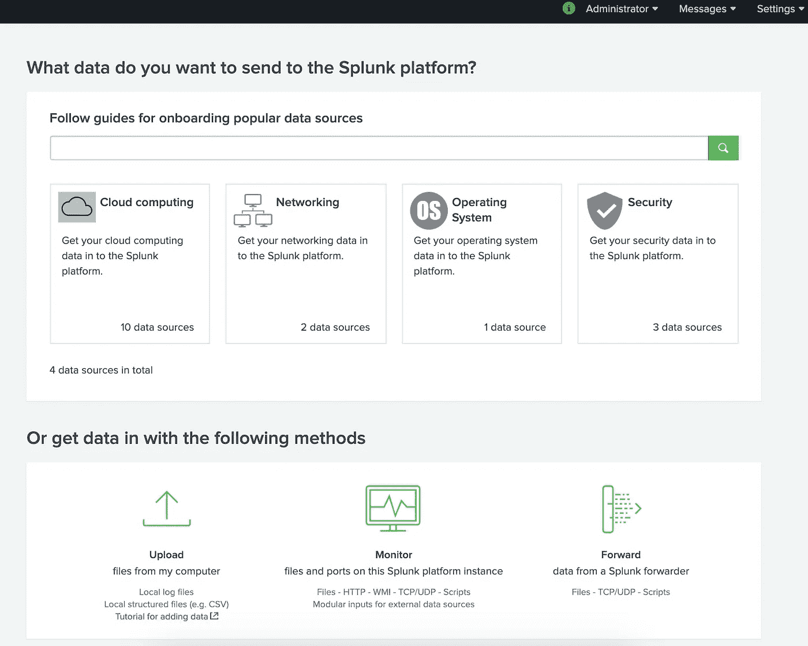

**第六步:选择数据来源**

选择要上传的文件

以下是可供下载的示例数据文件:[https://docs . Splunk . com/Documentation/Splunk/8 . 0 . 1/search tutorial/system requirements # Download _ the _ tutorial _ data _ files](https://docs.splunk.com/Documentation/Splunk/8.0.1/SearchTutorial/Systemrequirements#Download_the_tutorial_data_files)

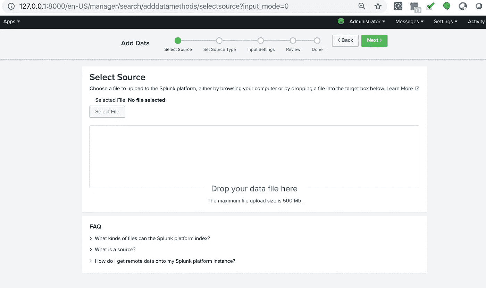

**第 7 步:**该页面允许您配置数据输入设置，以便根据指定的设置对数据进行索引。

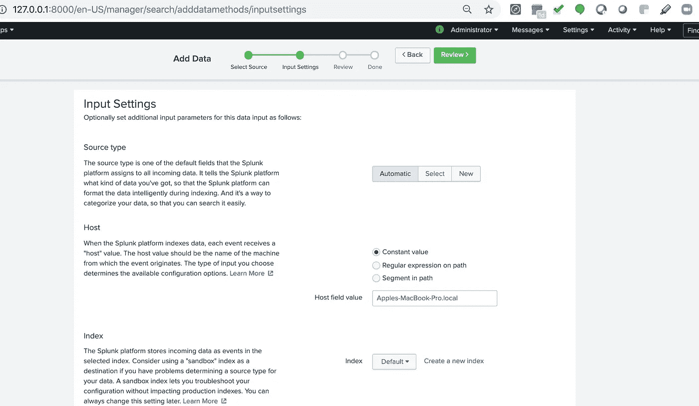

**第八步:**复习页面

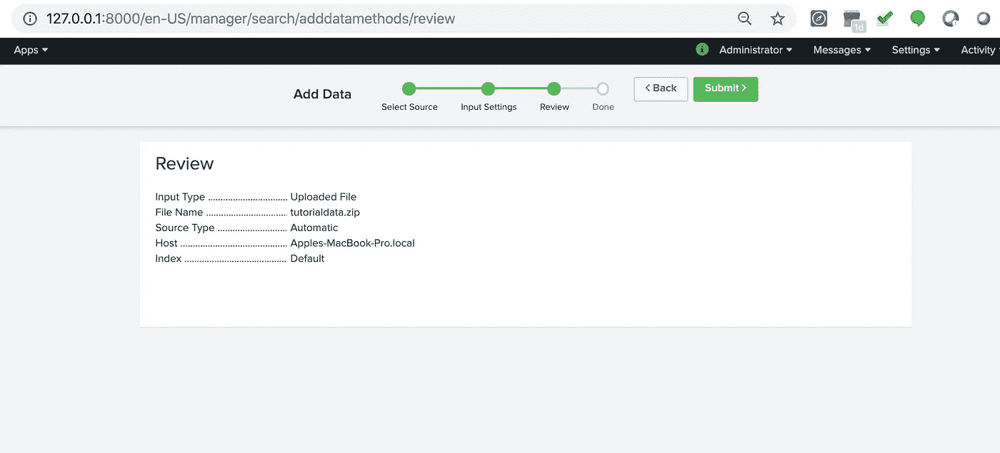

**第九步:**数据上传

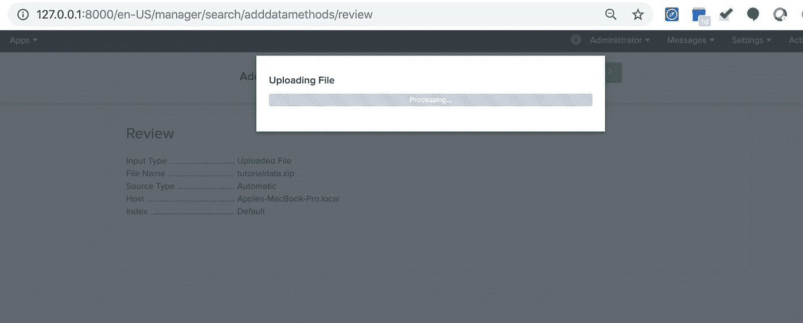

**第十步:**文件上传成功后。

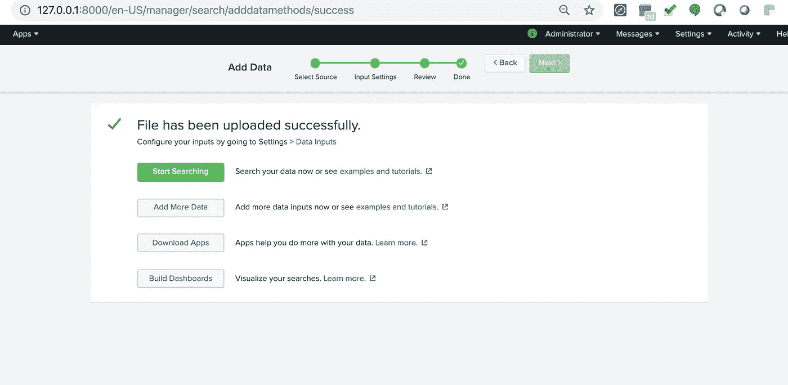

**第十一步:**搜索结果

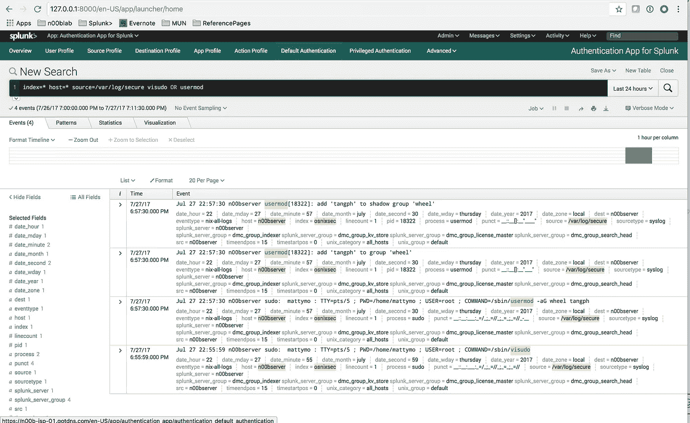

**结论:**

Splunk 现在是分析实时数据和触发后续行动的行业标准。世界各地的政府机构、商业服务提供商和大学都在使用 Splunk 来实时分析和了解业务和客户行为。它可以在出现任何网络安全欺诈时触发警报，并提高所提供服务的性能，同时降低任何组织的日常运营成本。

我叫 Ashish [@ashish_fagna](http://twitter.com/ashish_fagna) 。我是一名软件顾问。[领英简介](https://www.linkedin.com/in/ashkmr1/)。如果你喜欢这篇文章，请推荐并分享它！谢谢你的时间。

你也可以通过我的电子邮件联系我，ashish[dot]fagna[at]gmail.com