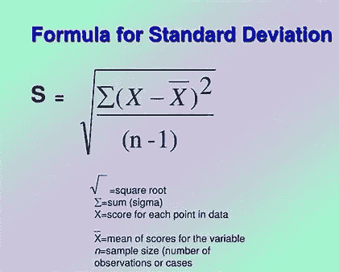
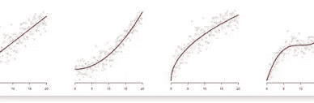
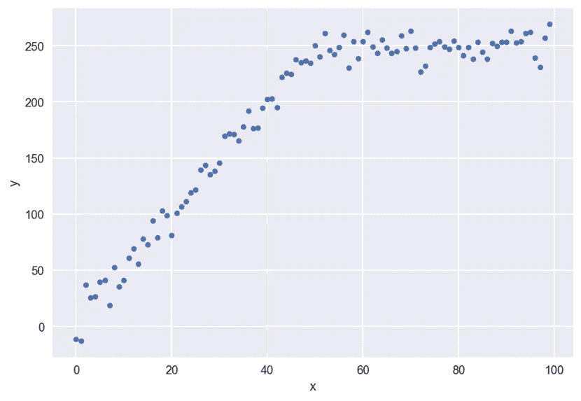
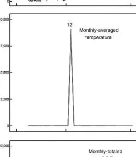
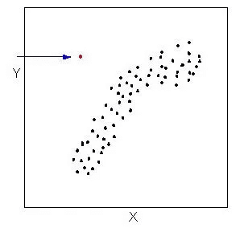
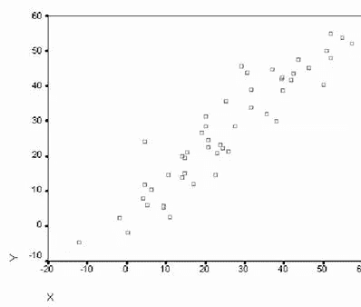
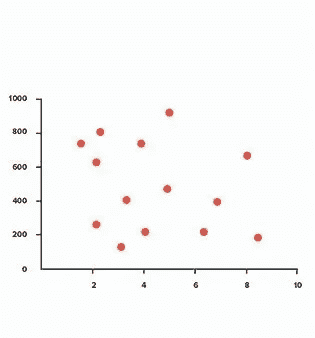
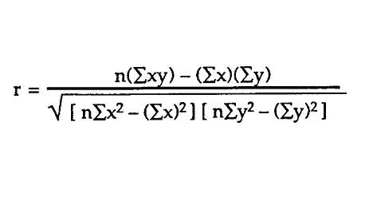

# 理解 SQL 数据分析(第 1 部分)

> 原文：<https://medium.com/analytics-vidhya/understanding-sql-data-analytics-part-1-b780e842afa8?source=collection_archive---------29----------------------->

数据分析从零到英雄(第 1 部分)

# 数据简介

数据从根本上改变了 21 世纪。使用数据，过去 50 年不可能获得的洞察力现在只需几个笔记本电脑代码就可以观察到。这场革命中最重要的两个设备是关系数据库及其基本语言，结构化查询语言(SQL)。虽然理论上我们可以用手来分析所有的事实，但计算机系统在这方面要高得多，而且绝对是存储、组织和处理数据的首选设备。在这些统计设备中，最不可或缺的是关系数据库和用来访问它的语言 SQL。这两种应用科学一直是记录处理的基石，并成为大多数处理大量数据的公司的支柱。
公司使用 SQL 作为存储大量数据的基本方法。此外，团体现在获取大量此类信息，并将其放入名为记录仓库和事实湖的专门数据库中，以便他们能够对其数据进行卓越的分析。事实上，所有这些事实仓库和事实湖都是通过 SQL 访问的。我们将研究如何使用 SQL 和分析系统，如记录仓库。

在这里，我们将学习数据及其类型。

# 理解数据

数据是事实的集合，如数字、文字、测量、观察或只是对事物的描述。举个例子:每个学生的考试成绩就是一个数据。

## 数据类型

数据也可以分为两大类，定量和定性:

定量记录是一个可以用数字来描述的维度；定性统计是由非数值描述的数据，如文本。你的身高是可以量化的事实。然而，将自己描述为“吸烟者”或“不吸烟者”会被视为定性数据。

此外，数量统计可以分为两个子类:离散和连续。离散数量值是可以具有恒定精度的值，通常是整数。
一个连续变量是一个成本，从理论上讲，应该被划分成任意数量的精度。
然而，如果一个值应该以更高的精度描述，那么它通常被视为连续的。
需要注意的是，定性信息通常可以转化为定量数据，定量数据也可以转化为定性数据。

# **了解数据分析和统计**

原始事实本身就是一组真正的价值观。但是，现在这种形式已经没什么意思了。只有当我们开始定位数据中的模式并开始解释它们时，我们才能开始做令人着迷的事情，如预测未来和感知突然的变化。统计数据中的这些模式被称为信息。可以用来描述和预测现实世界中的现象的一个巨大的配备了持久的和相当大的数据和行程的集合被称为知识。数据分析是一种方法，借助这种方法，我们可以将信息转化为事实，进而转化为知识。当信息评估与预测混合在一起时，我们就有了记录分析。有很多工具可以用来感受数据。事实评估最有效的设备之一是在数据集上使用数学策略。这些数学方法之一是统计学。

## 统计类型

统计学同样可以分为两个子类: ***描述性记录*** 和 ***推断性统计*** 。

描述性信息用于描述数据。数据集中单个变量的描述性信息称为单变量分析，而同时出现两个或更多变量的描述性数据称为多变量分析。

例如:推断统计学认为数据集是一个 ***样本*** 或者是一个更大的群体(称为总体)的一小部分测量值。

*   全国大选 3 万选民的调查，是一个国家全部选民人口的样本。推断统计用于尝试根据样本的特性来推断总体的特性。

假设您是一名健康政策分析师，并获得了以下包含患者信息的数据集:

健康数据

当提供数据集时，对底层数据进行分类通常很有用。在这种情况下，数据集的陈述单位是男性或女性受影响的人，因为每一行代表一个单独的观察，这是一个特殊的患者。有 10 个事实点，每个点有 5 个变量。其中的三列， ***出生年份*** 、 ***身高*** 和 ***看医生次数*** ，因为用数字表示，所以是定量的。其中两列 ***眼睛颜色*** 和 ***出生国*** ，是定性的。

# 描述统计学

描述性数据是我们为了识别信息而分析信息的方法之一。单变量分析和多变量评估都可以让我们了解一个现象可能发生的情况。在这一节中，我们将更接近于我们可以用来更好地理解和描述数据集的主要数学策略。

> **单因素分析**
> 
> 统计学的一个主要分支是单变量分析。这些方法用于理解数据集中的单个变量。在这里，我们将了解一些主要的技术。
> 
> **数据频率分布**
> 
> 记录的分布只是数据集中各种值的计数。例如，假设我们有一个包含 1000 份病历的数据集，数据集中的一个变量是眼睛的颜色。如果我们观察数据集，发现 700 人有棕色眼睛，200 人有绿色眼睛，100 人有蓝色眼睛，那么我们简单地描述了数据集的分布。具体来说，我们已经描述了绝对频率分布。如果我们不再通过数据集中适当的各种事件来描述计数，而是作为统计点总量的比例，那么我们描述的是它的相对频率分布。在前面的眼睛着色示例中，相对频率分布将是 70%棕色眼睛、20%无经验眼睛和 10%蓝色眼睛。当变量可以取少量常数值时，计算分布是很容易的，例如眼睛的颜色。但是，对于一个可以呈现许多非凡值的数量变量，比如身高，又该如何呢？为这些类型的变量计算分布的习惯方法是制作可以分配这些值的区间“桶”，然后使用这些桶计算分布。例如，可以将 top 损坏成 5 厘米间隔的桶，以进行以下绝对分布。然后，我们可以使用完整数量的统计因子(即 10，000)来划分桌子中的每一行，并获得相对分布。

# 什么是集中趋势？

对于数据集中的变量，一个常见的问题是该变量的普通成本是多少。这个值通常被描述为变量的集中趋势。有许多数字是从一个数据集计算出来的，这个数据集经常被用来描述它的中心趋势，每一个都有它自己的优点和缺点。测量集中趋势的一些方法包括以下内容:

1.  众数:众数实际上是变量分布中最常出现的价格。在上图中，眼睛颜色的例子中，模式可能是“棕色眼睛”,因为它在数据集中最常见。如果最大公共变量有多个值，则该变量称为多模态变量，所有最大值都是建议值。如果没有费用是重复的，那么没有该组值的模式。当一个变量可以取少量固定的值时，模式往往是有益的。然而，当一个变量是一个不停的定量变量时，计算起来就复杂多了，比如在我们的峰值问题中。有了这些变量，其他计算更适合于确定相关的趋势。
2.  均值:一个变量的平均值(也称为建议值)是在你将该变量的所有值相加并除以各种事实点时计算出的费用。例如，假设您有一个很长时间的小数据集:36、35、21、25 和 39。这一段时间的共同点可能是 39。因为这是你把五个数相加，然后除以 5 得到的数，这就是各种各样的事实。建议计算起来很简单，而且通常在描述变量的“标准”值方面做得很好。不足为奇的是，这是文献中最普遍建议的描述性数据之一。
3.  中位数:中位数是一种非典型程度的临界趋势，但有一些超过平均水平的严重好处。要计算中位数，取一个变量的数字，从下到上依次输入，然后确定中间的数字。对于非典型范围的事实因素，这种广泛的变化绝对是有序数据的中间值。如果有偶数个信息因子，则取两个中间数的公共值。虽然中位数是一个难以计算的部分，但与暗示相反，它较少受到离群值的影响。为了说明这一事实，我们能够计算 36、35、21、25、39 和 42 岁的倾斜年龄数据集的中位数。这一次，当我们计算数据集的中位数时，我们得到的费用是 30。这个值更倾向于数据集的日常价格，而不是普通的 38。

# 什么是色散？

另一个在数据集中感兴趣的属性是一个变量中统计点的集合有多接近。例如，种类繁多的单元[200，200，200]和[50，200，250]的平均值都是 100，但是第二个机构中的数字比第一个机构中的数字分散得更大。这种描述统计数据如何分布的特性称为离差。下面是一些最常见的评估离差的方法:

1.  多样性:这个范围实际上是一个变量的最佳值和最低值之间的区别。计算起来相当平滑，但可能非常容易出现异常值。它现在也不能提供大量的统计数据，例如数据集中心值的分布情况。
2.  标准偏差:众所周知的偏差肯定是每个统计点和建议值之间的平方差的平均值的平方根。众所周知的偏离度从 0 度一直到奇异的无穷大。相同的旧偏差越接近零，数据集内的数字变化就越小。如果标准差为 0，则数据集变量的所有值都是相同的。要观察的一个普遍差异是，有两个特别的首选偏差公式，虽然有疑问，但使用样本一般偏差，因为它被认为是更大的保守性。此外，在实践中，当有许多记录因素时，两种配方之间的差异可能非常小。标准差通常是最常用来解释离差的数值。但是，像品种一样，它也可能受到异常值的影响，尽管现在没有范围那么强烈。此外，计算起来可能相当令人担忧。然而，现代设备通常很容易计算出相同的旧偏差。最后一点是，有时，你可以看到一个相关的值(方差)被正确地列出。这个量确实是同一个旧偏差的矩形:

标准差公式(Slideshare)

3.四分位数间变化(iqr):四分位数间变化是第一个四分位数 q1(也称为低四分位数)和 1/3 四分位数 q3(也称为高四分位数)之间的区别。与范围和首选偏差相比，Iqr 对异常值的处理非常强大，因此，尽管它是最复杂的要计算的要素之一，但它提供了一种更强的方式来测量数据集的展开。事实上，iqr 经常被用来描述异常值。如果数据集中的价格小于 Q1–1。5 倍 iqr 或大于 q3 + 1。x iqr，那么价格被认为是一个异常值。

# 什么是双变量分析？

在这里，我们将讨论如何使用双变量分析找到两个变量的模式。

## 散点图

在分析中你会发现一个众所周知的原则，那就是图形对于定位模式非常有用。就像直方图帮助你识别单一变量一样，散点图可以帮助你理解变量。使用你喜欢的电子表格，散点图可以很容易地制作出来。大量独一无二的模式值得在散点图中寻找。人类寻找的最大不寻常的样本是两个变量之间的上升或下降趋势；这就是，当一个变量增加时，相反的变量会减少吗？其中一种方式表明，这两个变量之间可能存在可预测的数学追求。为了更好的理解，请看下图:

两个变量之间的向上和向下(Visme)

还有许多非线性趋势值得关注，包括二次趋势、指数趋势、逆趋势和逻辑趋势。

趋势(免费代码营)

与此同时，趋势对于知识和预测风格是有用的，检测特征的变化通常是非常重要的。发展中的变化通常表明你正在衡量的某件事情发生了关键的变化，值得进一步检验以证明。任何此类替代的真实国际实例可能是当一家企业的股票在长时间上涨后开始下跌。

趋势变化示例(包装)

人们通常倾向于寻找的另一种模式是周期性——也就是统计数据中的重复样式。这种模式可能意味着变量也可能有循环行为，并可能有利于作出预测。随后的辨别表明周期性行为的实例:

周期性行为示例(Researchgate)

散点图也用于发现异常值。当图表中的大多数因素看起来像是在图表的选定附近，但一些点距离很远时，这可能意味着这些点对于 2 个变量来说是异常值。当进行类似的双变量分析时，明智的做法是去除这些因素，以减少噪音并传达更高的洞察力。下图显示了一些可能被视为异常值的因素:

有两个异常值的散点图

## 皮尔逊相关系数

阅读二元记录最常见的发展之一是线性趋势。通常，虽然一些线性发展是易受影响的，但不同的线性发展在某种程度上是可靠的，线性方式很好地符合统计。我们将看到散点图的例子，它们的线条很健康。这是一条使用称为正态最小二乘法(ols)回归的技术计算的线。尽管 ols 超出了这一方向的范围，但专业知识如何很好地匹配二元信息的线性趋势是了解变量之间的联系的宝贵工具:

强线性趋势

现在，我们看到了微弱的线性趋势

周线性趋势

现在，我们将看到这两个图

强弱相关性

量化线性相关性的一种方法是应用皮尔逊相关系数。皮尔逊相关系数通常用字母 r 表示，是从-1 到至少 1 的一个变量，表示散点图适合线性方式的程度。为了计算皮尔逊相关系数 r，我们使用下面的公式:

计算皮尔逊相关系数的公式(Datascience)

> 在今天的课程中，我们学习了有关 SQL 数据分析的数据和重要信息，我们将在另一部分继续学习。
> 
> 敬请关注分析 Vidhya。