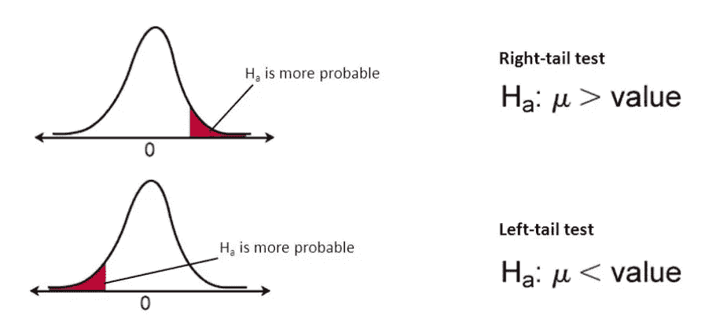
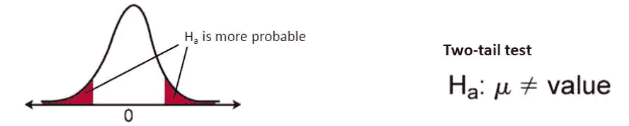
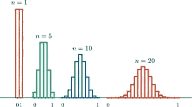
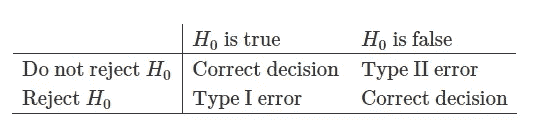

# 用简单的术语理解统计测试！！

> 原文：<https://medium.com/analytics-vidhya/understanding-statistical-testing-in-simple-terms-f249256958b4?source=collection_archive---------6----------------------->

> 然而，每当我们听到统计或假设这个术语或任何涉及它们的复杂术语时，我们的思维总是转向数学部分以及随之而来的巨大困惑。在我看来，统计学的主要目的是揭示一些关于假设事实的见解，并从中获得一些知识。
> 
> 博客的目的并不是让我们完全摆脱与统计相关的复杂性，而是试图涵盖一个最有趣的领域，叫做“假设的统计测试”以及如何实现它。

照片由 [Ruthson Zimmerman](https://unsplash.com/@ruthson_zimmerman?utm_source=medium&utm_medium=referral) 在 [Unsplash](https://unsplash.com?utm_source=medium&utm_medium=referral) 上拍摄

# 目录:

*   [***什么是假设？***](#9ec6)
*   [***假设检验中要涵盖的主题:***](#ca98)[***1 .无效交替假设***](#c54b)[***2。定向/非定向假设***](#f8fd)[***3。中心极限定理***](#2954)[***4。评估中使用的术语***](#99a8) ***→***[***1 型和 2 型错误***](#e159) ***→***[***显著性水平(***α***)&β函数(***](#fed7)  ****→***[***Z 检验***](#2d1f) ***→***[***T 检验***](#5a57)*
*   *[***最终结论***](#fabc)*
*   *[***参考文献***](#626a)*

*在直接进入概念之前。覆盖一些基础知识是很重要的。让我们从什么是简单的假设以及我们为什么要这样做开始。*

# ***什么是假设？***

*简单来说，假设是我们头脑中基于现有数据的问题或陈述，需要测试以确定我们头脑中的问题或预测是否可以实现。*

> ***一个简单的例子是(根据当前情况):** 与以前版本的相同药物相比，为对抗新冠肺炎病毒而发明的新药是否更有效。*

*现在，我们对什么是假设有了一些基本的了解，让我们深入了解统计领域中假设的各个组成部分。为了使学习更简单，考虑下面的场景。*

> *S ***场景:在发布任何药物(在我们的场景中，它是将治愈我们新冠肺炎的药物)之前，首先这些药物将首先在一组选定的患者中进行测试，以观察它的反应。这通常是分阶段进行的，因为有许多参数需要检查。从现在开始:
> **“样本”**是指我们要测试的选择性患者名单；
> **【人群】**是指我们将要使用药物的整个人群。****

*以此为例，我们将继续学习。*

# ***假设检验的主题:***

***1)无效和交替假设
2)定向/非定向假设
3)中心极限定理
4)评估中使用的术语
5)常用统计检验(简单术语)***

> ***1)无效和交替假设:***

*因为博客的整个目的是保持术语的简单，这里是一个简化版本的**空**和**交替**假设的意思。*

***无效假设:**你假设为真的陈述(例如:回到药物的例子，无效假设是为对抗新冠肺炎病毒而发明的新药物版本比以前的版本更有效)。它通常用符号**、【H0】或 *Hn* 来表示。***

***替代假设:**与你的假设相反的陈述，或者更简单地说，与无效假设相反的陈述(例如:替代假设将是为对抗新冠肺炎病毒而发明的新版本药物**并没有**比前一版本更好)。它通常用符号**、【H1】或*哈*来表示。***

***提示:**“我们这里的总体想法是知道我们是否需要**拒绝**零假设，或者我们**是否未能拒绝**零假设。”*

> ***2)定向/非定向假设:***

*当我们形成假设时，知道我们处理的问题的类型也很重要。回到我们的场景，不要只关注我们正在测试的药物版本，让我们进一步检查新版本是否比旧版本工作得更好。*

*让我们把旧版本看作“A ”,新版本看作“B”。制定假设时，记住我们的假设是定向的还是非定向的也很重要。不要烦恼！！…我将用简单的术语解释这意味着什么。*

***方向假设:(或单尾假设)***

**

*资料来源:fromthegenesis.com*

*在我们的假设中，我们已经讨论了证明在治疗新冠肺炎时，药物“B”比药物“A”更有效。这本身就是一个方向性的假设。简单来说，像**更好/更差、更多/更少等词。**表示假设结果的方向。*

***再举几个例子:**
*)人“A”送餐的平均时间比人“B”的平均时间多 15 分钟**。在 XYZ 科目中，女生比男生表现更好**。*****

*****无方向性假设:(或双尾假设)*****

******

***资料来源:fromthegenesis.com***

***在双尾假设或无方向假设中，假设不是基于绩效方向做出的。在无方向假设中，假设主要是存在差异，但没有对差异的种类进行假设。***

***回到我们的例子，到目前为止我们看到了药物 A 和药物 B。他们来自同一家公司(仅仅是同一种药物的不同版本)。但是如果我们要测试一种叫做“C”的新药，它来自一个完全不同的公司。现在我们不能肯定地假设一个比另一个表现得更好/更差。我们知道会有差异，但不知道可能是什么方向(正/负)。***

*****再举几个例子:**
*)人“A”和“B”在交货时间上的平均时间是有差别的。
*)男生和女生在科目“ABC”上的表现存在差异。***

> *****3)中心极限定理:*****

***既然阐明假设的基础已经理解，让我们进入有趣的部分。每当提到“定理”的时候，它总是伴随着一堆数学验证之类的东西！！为了绕过这些，让我简单解释一下这个非常重要的定理是什么。***

***我们已经收集了关于药物“B”对一系列患者的执行情况的数据。现在，为了验证我们的假设，我们要做的第一件事是制作数据的可视化表示。就像每个患者对药物反应的条形图(就像测试效果的各种参数)。这样，我们可以对药物“B”如何对患者起作用做出初步假设。***

******

***资料来源:simplypsychology.org***

***中心极限定理简单地说就是，当样本数量增加时，我们从样本中得到的平均值(平均得分)将更接近总体平均得分。看一下上面的图片，我们可以看到，随着样本数量的增加，数据的分布变得更像一个钟形曲线。这种分布被称为“正态”分布，它往往会给我们准确的结果。***

***因此，这里需要理解的重要一点是，无论数据看起来如何，当我们增加数据中的样本时，数据会看起来越来越像钟形曲线，这或多或少会让我们了解它对整个人口的反应。***

*****附加提示:**尝试将至少超过**【30】**个样本作为其普遍接受的基本限制，以获得准确的结果。***

> *****4)评估中使用的术语:*****

***既然阐明假设的基础已经理解，让我们进入有趣的部分。在参加测试之前，了解一些术语是很重要的，以了解我们在测试中所做的是否正确。***

*****要理解的术语:
*)**1 型和 2 型错误。
*)显著性水平(α)&β函数(β)
*) P 值
*)自由度。***

> *****第一类和第二类错误:*****

***对我们来说很明显的是，我们不能把许多假设 100%的时间都当成真的。例如:有时，90/100 次我们的假设可能是正确的。其他的 10/100 次被称为“错误”。了解错误很重要，因为它们可能是决定我们是否继续决策的关键因素。***

******

***来源: [www.geo.fu-berlin.de](http://www.geo.fu-berlin.de)***

*****第一类错误(或假阳性):**简单来说，第一类错误发生在零假设确实为真，但被拒绝的情况下。
**例:**断定药物**有效**，而实际上它**不是**。***

*****第二类错误(或假阴性):**简单来说，第二类错误发生在零假设确实为假，但被接受的情况下。
**例:**断定药物是**而不是有效的**，实际上它的**是**。***

***通常第二类错误比第一类错误相对更有影响(除了一些非常特殊的情况，第一类错误可能更有影响)。***

> *****显著性水平(α)&β函数(β):*****

***简单地说，这些值是由我们决定的，记住误差百分比是可接受的。例如:5%(0.05)的误差率是可以接受的(最常见的接受率)。***

*****显著性水平(α) :** 出现 1 类错误的概率
**贝塔函数(β) :** 出现 2 类错误的概率***

***我们还可以从 Alpha 值中收集**置信度**。
**置信水平:**1-显著性水平( **α** )。***

***因此，如果我们有 5%的阿尔法，我们可以说 95%的置信水平，我们的假设是正确的。***

***这些是需要评估的一些最重要的指标，因为这些值将与 P 值(将在下一主题中讨论)进行比较，以确定假设的结果。***

> *****P 值:*****

***简单来说，P 值就是零假设为真的概率。即 Ho 为真的概率。在上述评估指标中，我们得到了一些正确的值，但这些值除非与 P 值相关联，否则没有意义。***

***p 值一般与 Alpha 值进行比较( **α** )。***

*****条件:** 如果 P 值<α:这意味着零假设**可以被拒绝**。
如果 P 值>α:这意味着零假设被**拒绝失败。*****

> *****自由度:*****

***简单地说，自由度就是一系列逻辑上独立的值，我们用它们来分析整个观察结果。***

***自由度(简称 DOF)是“样本大小-测试中使用的参数”。通常 DOF =样本大小-1***

***一个示例用例:我们可以使用 DOF 来评估零假设的有效性(例如:卡方检验——这将在下面解释)。***

> ***5) **常见统计检验(简单来说):*****

***最后，我们到达了博客的酷动手部分。***

***N 但是尽管如此，每个统计测试都将在接下来的博客中与编码部分一起详细讨论。敬请关注！！***

***是时候检验我们的假设了😉！！！***

***我们可以做很多测试来检验我们的假设。无论统计测试如何，都要遵循相同顺序的以下步骤。***

> *****第一步:**定义零备假设
> **第二步:**固定显著性水平(通常为α值)
> **第三步:**进行统计检验
> **第四步:**根据 P 值得出结论。***

***现在步骤已经很清楚了，我列出了世界各地最常见的测试。***

*   ***z 检验***
*   ***t 检验***
*   ***卡方***
*   ***方差比检验***

> ***Z **测试:*****

***这是统计学中最常用的测试。z 检验通常用平均值来表示。在我们的例子中，它可以被定义为药物“B”的特定属性的平均分数是否比药物“A”更好。另一个简单的例子是药物“A”的特定属性的平均分数是否是平常的两倍。***

*****进行测试的要求:**
*)正态分布数据(样本量较大时会覆盖)。
*)样本量大于 30。(非常重要的事实，可以小于 30，但最好大于 30)
*)已知总体方差(“标准偏差”的平方，表示每个数据点对总体平均值的可变性)。下面给出的公式。***

*****Z 检验有两种:**
*)一个样本 Z 检验——顾名思义，只对单个变量(药物 A)进行。这将是一个左尾或右尾的问题。
*)双样本 Z 检验——顾名思义，是通过比较两个变量(药物 A 和 B)来完成的。这将是一个双重问题。***

> ***测试**测试:*****

***谈到 T-Test，它有点类似于 Z-Test，不同之处在于需求。在 Z 测试中，要求之一是样本量应大于 30，但这里最好是样本量**小于 30** 。还有，这里的人口方差是**未知**。其余的要求像正态分布数据、对称数据一样保持不变。***

*****类型:**
*单样本 T 检验
*双样本 T 检验(不成对)——比较两个独立或**不相关**组的均值。
*双样本 T 检验(成对)—比较**相同组**或项目在两种不同情景下的平均值。***

> ***C **喜方测试:*****

***到目前为止，注意力完全集中在数字上。但是当涉及到卡方检验时，它是一个非常有效的检验，因为它处理的是分类变量。分类变量不过是单词，它们的值是有限的。一般都是标签或者名字。有时我们拥有的数据会被文字填满。例如:性别、星期几等。前两个测试不会处理这些类型的变量。这就是卡方检验发挥作用的地方。回到我们的例子，如果我们的数据是由一个名为“一年中的月份”的变量组成的，如果我们要假设该变量是否会对药物“A”或“B”产生影响，我们可以使用卡方检验。当涉及到卡方检验时，确实有一些要求。***

*****执行测试的要求:
*)** 数据应该相互独立(它们不应该相互关联)
*)其他列中的数字最好不要为浮点数据类型(有小数值)。***

*****类型:**
*)卡方同质性检验——比例检验(是否相同？)
*)卡方独立性检验——检查两个变量是否相互关联。
*)卡方拟合优度检验—检查观察值(我们得到的值)和期望值(我们想要的值)之间是否存在差异。***

> ***F **测试:*****

***f 检验与我们见过的其他检验大不相同。原因是，有时它可以在执行其他测试时充当缓冲(例如，ANOVA 测试，将在未来的博客中介绍)。这里的测试是用来找出两个变量之间的差异。如前所述，方差只不过是平均值的离差量。我们得到的值越大，就越能理解离差很大。***

*****进行测试的要求:
*)** 数据或样本应相互独立(不应相互关联)
*)数据呈正态分布(钟形曲线)。***

*****类型:** *)单尾 f 检验——检查左尾或右尾的方差(大于或小于另一个)
*)双尾 f 检验——确认变量间方差存在差异(此处方向未知)。***

# ***最终结论:***

***在上面的解释中，我们遇到了与假设检验相关的各种信息。博客的目的，是让这个概念更容易理解，这就是为什么数学和编码部分在这里被避免。但是不要担心！！更多的博客将基于提供的信息(特别是关于各种测试的博客)和编码部分发布在单独的主题上。希望提供的信息是清楚的。***

***快乐学习👍注意安全。***

# ***参考资料(用于研究的网站):***

*   ***https://blog . minitab . com/blog/adventures-in-statistics-2/understanding-hypothesis-tests-significance-levels-alpha-and-p-values-in-statistics #:~:text = The % 20 significance % 20 level % 2C % 20 noted，there % 20 is % 20 no % 20 actual % 20 difference。***
*   ***[https://stats . stack exchange . com/questions/142717/how-to-explain-of-deep-of-degrees-of-freedom-degrees-term](https://stats.stackexchange.com/questions/142717/how-to-explain-degrees-of-freedom-term-to-a-layman)***
*   ***[https://statistics sbyjim . com/hypothesis-testing/degrees-freedom-statistics/#:~:text = In % 20 statistics % 2C % 20 the % 20 degrees % 20 of，probability % 20 distributions % 2C % 20 and % 20 regression % 20 analysis](https://statisticsbyjim.com/hypothesis-testing/degrees-freedom-statistics/#:~:text=In%20statistics%2C%20the%20degrees%20of,probability%20distributions%2C%20and%20regression%20analysis)。***
*   ***[https://www . analyticsvidhya . com/blog/2020/07/hypothesis-testing-68351/](https://www.analyticsvidhya.com/blog/2020/07/hypothesis-testing-68351/)***
*   ***[https://www . geo . fu-Berlin . de/en/v/soga/Basics-of-statistics/Hypothesis-Tests/Introduction-to-Hypothesis-Testing/Type-I-Error-Type-II-Error-and-significance-level/index . html #:~:text = Conducting % 20a % 20 Hypothesis % 20 test % 20 always，and % 20 is % 20 dened % 20 by % 20% CE % B1](https://www.geo.fu-berlin.de/en/v/soga/Basics-of-statistics/Hypothesis-Tests/Introduction-to-Hypothesis-Testing/Type-I-Error-Type-II-Error-and-significance-level/index.html#:~:text=Conducting%20a%20hypothesis%20test%20always,and%20is%20denoted%20by%20%CE%B1)。***
*   ***[https://www . statistics show to . com/probability-and-statistics/hypothesis-testing/](https://www.statisticshowto.com/probability-and-statistics/hypothesis-testing/)***