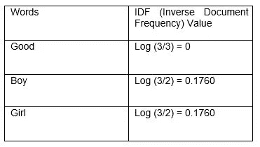

# 理解自然语言处理中的 TF-IDF。

> 原文：<https://medium.com/analytics-vidhya/understanding-tf-idf-in-nlp-4a28eebdee6a?source=collection_archive---------7----------------------->

**TF-IDF** ，是 T**erm Frequency–Inverse Document Frequency**的简称，是一个数字统计量，意在反映一个词在一个集合或**语料库(段落)**中对一个文档有多重要。在信息检索、文本挖掘和用户建模的搜索中，它经常被用作一个加权因子。 **TF-IDF** 值**与某个单词在文档中出现的次数成比例地增加**，并被包含该单词的语料库中的文档数量所抵消，这有助于调整某些单词在一般情况下更频繁地出现**的事实**。

**TF-IDF** 比 **Bag-Of-Words** 更受欢迎，在中，每个单词每次在每个句子中出现时都被表示为 **1 或 0** ，而在 TF-IDF 中，每个单词都单独赋予权重，从而定义每个单词相对于其他单词的重要性。

让我们分别理解这些术语，

1.  **TF:词频**，衡量一个词在文档中出现的频率。因为每个文档的长度不同，所以一个术语在长文档中出现的次数可能比短文档多得多。因此，术语频率通常除以文档长度(又名。文档中的总术语数)作为归一化的方式:

    **TF(t) =(术语 t 在文档中出现的次数)/(文档中的总术语数)**，并且
2.  **IDF:逆文档频率**，衡量一个术语的重要程度。在计算 TF 时，所有项都被认为是同等重要的。然而，众所周知，某些术语，如“是”、“的”和“那个”，可能会出现很多次，但并不重要。因此，我们需要通过计算下面的等式来降低频繁项的权重，同时增加罕见项的权重:

    **IDF(t) = log_e(文档总数/其中包含项 t 的文档数)。**

现在让我们进入它的示例部分:

**我们来考虑一下这三个句子:**

1.  他是一个好男孩

2.她是个好女孩，

3.两人分别是好男孩和好女孩。

所以，在使用了来自 **NLTK** 库中的正则表达式、停用词和其他函数之后，我们得到了这三个句子的提纯版本，可以表示为:

1.  好孩子

2.好女孩，还有

3.好男孩好女孩，分别。

现在，让我们考虑 **TF(术语频率)**操作，

假设一个词“**好的**”，在第 1 句中，我们知道，

**TF(t) =(术语 t 在文档中出现的次数)/(文档中的总术语数)。**

所以，单词“Good”在句子 1 中出现的次数是，1 次，而单词“Good”在所有三个句子中出现的总次数是 3 次，所以单词“Good”的 TF(词频)值是，TF("Good")=1/3= **0.333** 。

现在，让我们以表格的形式，参照每个句子，考虑每个单词的值，可以表示为:

所以，我们可以看到每个单词相对于每个句子的 TF 值。

现在，

让我们考虑第二个 **TF-IDF** ，也就是每个单词的 **IDF(逆文档频率)**，针对每个句子。

众所周知，

**IDF(t) = log_e(文档总数/其中包含术语 t 的文档数)**。

再一次，让我们考虑单词“Good ”,在句子 1 中，现在，我们知道我们拥有的句子总数是 3(文档总数),而且，我们知道单词“Good”总共出现了 3 次，考虑到所有 3 个句子，所以，包含术语“Good”的文档数=3，

因此，单词“Good”的 **IDF(逆文档频率)**值将是“ **Log(3/3)** ”，现在，让我们考虑每个单词的 **IDF(逆文档频率)**值，在表格中，

现在，我们有了两者的值， **TF(术语频率)**以及 **IDF(逆文档频率)**对于我们拥有的每个单词、每个句子，

因此，最后每个单词的 TF-IDF 值将是= **TF(Value)*IDF(Value)** 。

让我们以下面给出的表格形式给出每个单词的 TF-IDF 值，

**所以，**

作为结论，**，**我们可以看到，单词“Good”出现在这 3 个句子的每一个中，因此单词“Good”的值为零，而单词“Boy”只出现了 2 次，在这 3 个句子的每一个中，结果我们可以看到，在句子 1 中，单词“Boy”的值(重要性)大于单词“Good”。

因此，我们可以看到， **TF-IDF，**为每个单词赋予**特定值**或**重要性**，在任何段落中，具有较高权重分数的术语被认为更重要，因此 TF-IDF 取代了“**单词包**的概念，当单词出现在段落的任何句子中时，该概念赋予每个单词相同的值，这是**的主要缺点**

**TF-IDF** 是为文档搜索而发明的，可用于提供与您正在搜索的内容最相关的结果。想象一下，你有一个搜索引擎，有人寻找“**狗**”。结果将按相关性顺序显示。也就是说，最相关的**宠物文章**的排名会更高，因为 TF-IDF 会给单词“ **Dog** ”更高的分数。

嗯，这就是 **TF-IDF(术语频率和逆文档频率)**的工作原理！

如果你喜欢这个博客，请留下“**拍手**”，与你的朋友、同事分享。

**谢谢**😊。

**联系我**:

**我的 LinkedIn 个人资料**:

[https://www.linkedin.com/in/gaurav-sahani-6177a7179/](https://www.linkedin.com/in/gaurav-sahani-6177a7179/)