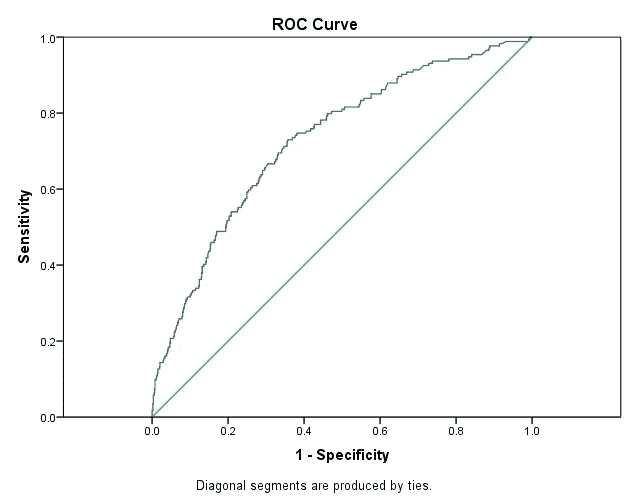
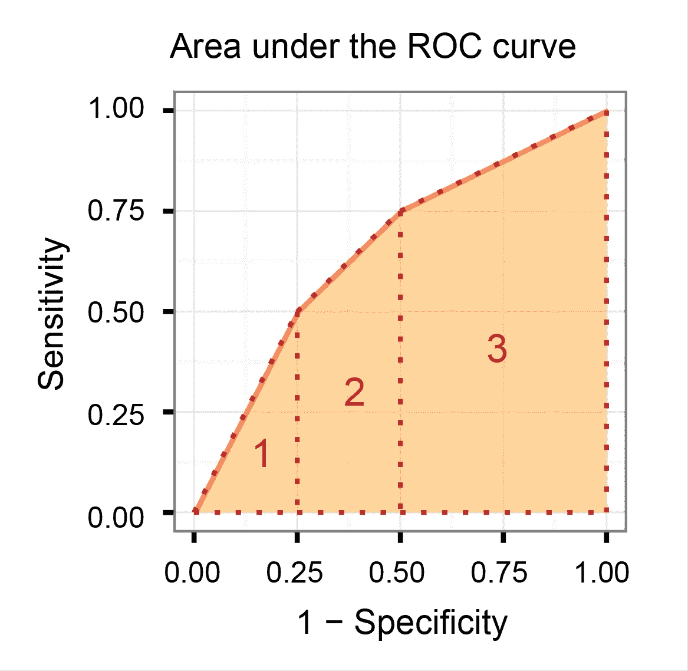
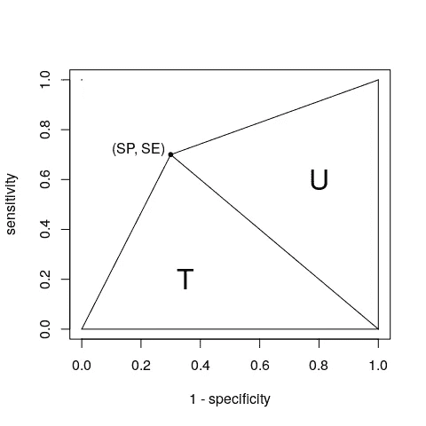
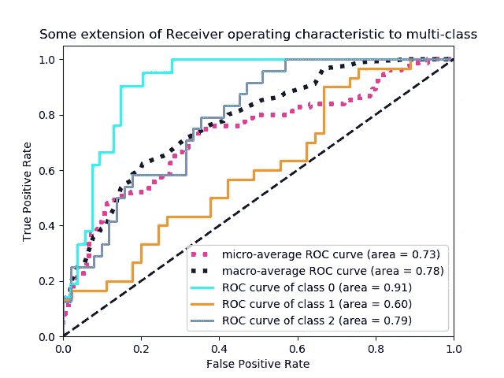
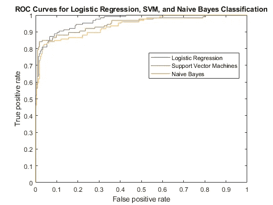

# 理解 AUC-ROC 曲线。

> 原文：<https://medium.com/analytics-vidhya/understanding-the-auc-roc-curve-cdc754d7b58a?source=collection_archive---------11----------------------->

这是每个开始学习机器的人都遇到过的事情，导师和学习机器学习的人都会说绘制 roc 图，看看你的分类模型表现如何。所以，

## 什么是 ROC 曲线？

ROC 曲线是检验分类模型性能的重要评价指标之一。它也被称为相对运行特性曲线，因为它是两个主要特性(TPR 和 FPR)的比较。

它被绘制在灵敏度(又名回忆，又名真阳性率)和假阳性率(FPR = 1-特异性)之间。

> 如果你不明白敏感性和特异性这两个术语，我建议你去看看这个[链接](/analytics-vidhya/calculating-accuracy-of-an-ml-model-8ae7894802e)中的混淆矩阵。

上图显示了 ROC-AUC 图，曲线(蓝线)离对角线越远，或者我可以说蓝线离 Y 轴上的 1 越近，模型在区分阳性和阴性方面就越好。

## 什么是 AUC？

AUC 也称为曲线下的*区域*。它用于分类分析，以确定所用模型中哪一个能最好地预测类别。其应用的一个例子是 ROC 曲线。

AUC 值的范围从 0 到 1。预测 100%错误的模型的 AUC 为 0，如果预测 100%正确，则 AUC 为 1。

AUC 的特征:

*   AUC 是**比例不变的**。它衡量预测的排名，而不是它们的绝对值。
*   AUC 是**分类阈值不变的**。它测量模型预测的质量，而不管选择什么分类阈值。

> 此外，ROC-AUC 不能对回归问题作图，它只对分类问题作图，如 X 轴***1-特异性*** 和 Y 轴 ***灵敏度*** 用于作图。

## **AUC 是如何计算的？**

> *T =(1 * SE)/2 = SE/2 = TP/2 *(TP+FN)*
> 
> *U =(SP * 1)/2 = SP/2 = TN/2 *(TN+FP)*
> 
> *获取 AUC，*
> 
> *AUC= T+U = (SE+SP)/2*

**ROC-AUC 也可以绘制成多类问题，甚至不同模型的 ROC 也可以绘制在同一个图上进行比较。**

多类数据 ROC 图

> 查看此[链接](https://scikit-learn.org/stable/auto_examples/model_selection/plot_roc.html#plot-roc-curves-for-the-multilabel-problem)以获取多类 ROC 图的代码示例并找出 auc。

ROC 图来比较不同模型的性能。

喜欢我的文章？请为我鼓掌并分享它，因为这将增强我的信心。此外，我每周日都会发布新文章，所以请保持联系，以了解数据科学和机器学习基础系列的未来文章。

另外，如果你想的话，可以在 linkedIn 上联系我。

[Alex](https://unsplash.com/@alx_andru?utm_source=medium&utm_medium=referral) 在 [Unsplash](https://unsplash.com?utm_source=medium&utm_medium=referral) 上的照片