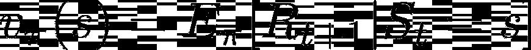
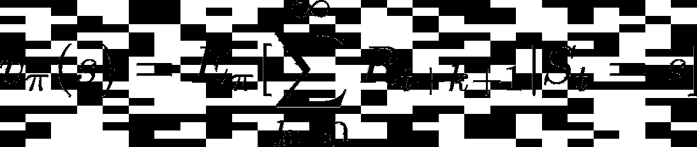
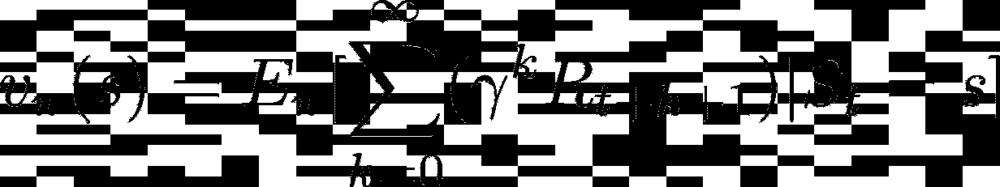
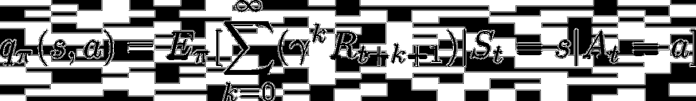
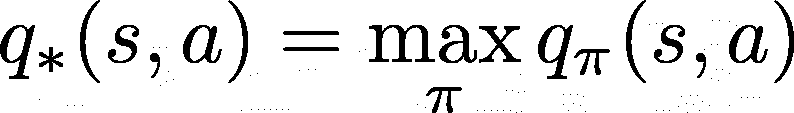
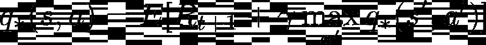

# 理解贝尔曼方程

> 原文：<https://medium.com/analytics-vidhya/understanding-the-bellman-equation-c711e531a2e5?source=collection_archive---------13----------------------->

## 免费 RL 课程:第 2 部分

这是我的强化学习课程中的第二篇文章。上一篇文章可以在这里找到[。它涵盖了基本概念，如奖励和政策，所以如果你不熟悉这些概念，你可能应该回去读一读，然后再继续这一个。本文将涵盖 Q 学习中使用的方程和概念，Q 学习是几乎所有现代强化学习算法的基础。](/@NathanWeatherly/introduction-to-reinforcement-learning-53b9caee364c)

回顾一下我们上次学到的内容，代理遵循一个策略在其环境中采取行动，并根据这些行动的结果获得奖励。上次我们方法的问题是代理没有办法学习。为了帮助我们的代理学习，我们必须给它一些方法来评估来自给定状态的动作的值。然后，基于采取特定行动时的回报，它将能够调整其政策，以更好地代表真正的价值观。本文将通过三个部分来帮助解释如何做到这一点:

*   价值函数
*   最佳值函数
*   贝尔曼方程

值函数是在遵循特定策略时向动作或状态分配值的函数。最显而易见的方法是将价值作为奖励来分配:

这个方程有一些奇特的数学语法，但它很容易理解。左手边表示一个状态的值， ***s*** ，当代理遵循一个策略时， ***𝜋*** 。这是然后设置等于收到的奖励， ***Rₜ ₊*** ₁，如果我们从一个州开始，*，并遵循一个政策，*。然而，这种方法有一个明显的缺陷。它不考虑未来状态和行动的回报。没有前瞻性，代理将无法准确评估价值。要解决这个问题，你可以建议以这样的方式将所有未来的奖励加起来:**

****

**然而，这种方法会导致值经常趋向于无穷大，特别是如果环境确实有一个结束状态。为了解决这个问题，我们可以用符号*(gamma)来表示随后的每个奖励乘以一个“折扣”。这个变量控制我们希望我们的代理人对未来奖励的估价，通常设置为 ***0.99*** 或 ***0.999*** 。更新后的等式将如下所示:***

****

**所以现在我们有了特定状态下的值，*，下策*。为了将此扩展到动作，我们可以使用相同的等式，但是对于第一个动作，使用一个输入，*，而不是策略，***【𝜋】***。这个函数现在将给出我们所知的在状态 ***s*** 的动作 ***a*** 的 Q 值。该函数称为 Q 函数，定义如下:*****

****

**现在我们已经了解了 Q 函数，我们可以使用它来创建最优 Q 值函数，该函数找到使每个状态、 ***s*** 和动作、 ***a*** 的值最大化的策略。我们可以先将其定义为:**

****

**这种符号意味着最佳 q 函数等于遵循策略*的 q 函数，该策略使每个 q 值最大化。我们可以进一步了解如何使用这个最佳 Q 函数，方法是将它应用到我们先前定义的 Q 函数，以获得这个属性:***

******

***这仅仅意味着最优 q-函数也可以定义为奖励，***【rₜ₊₁】***，一个动作， ***一个*** ，在一个状态，*，加到下一个状态的贴现最优 q-值，***【s’***，其中最优动作， ***一个’***，是这个方程被称为贝尔曼方程，可能是强化学习中最重要的方程。****

**有了最优 Q 函数和我们当前策略的 Q 函数的定义，我们将能够比较这两者来慢慢地将我们的策略转向最优策略。这是 Q-Learning 背后的基本思想，也是本课程的下一篇文章将涉及的内容。**

***方程式改编自理查德·萨顿的“*[*RLbook*](http://incompleteideas.net/book/RLbook2020.pdf)*”*中的概念**