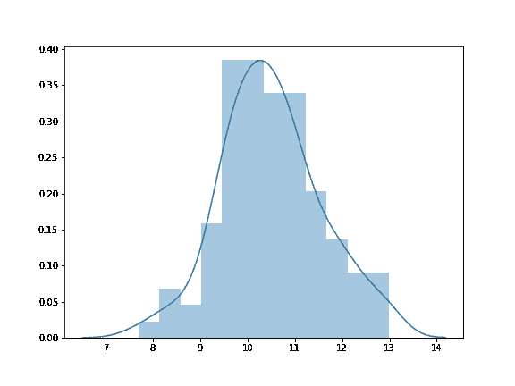

# 理解数据科学的中心极限定理

> 原文：<https://medium.com/analytics-vidhya/understanding-the-central-limit-theorem-for-data-science-78f11544bbc6?source=collection_archive---------12----------------------->


安德鲁·易卜拉欣在 [Unsplash](https://unsplash.com/s/photos/learning-k?utm_source=unsplash&utm_medium=referral&utm_content=creditCopyText) 上的照片

中心极限定理是统计学中最重要也是最基本的定理之一，广泛应用于数据科学和其他相关领域。在这篇博客中，我们将通过一些 python 代码片段逐步理解中心极限定理。

在跳到中心极限定理的核心思想之前，让我们讨论一下统计学中的一些非常基本的概念。

## 统计学中的人口是什么？

在概率统计中，**总体**是指可以进行观察的全部集合。总体是从中抽取样本的整个集合。就人的身高而言，人口只不过是世界上所有人身高的总和。

## 什么是统计学中的样本和抽样分布？

简单地说，样本是从总体分布中抽取的观察值。例如，在所有身高的人群中，我们随机选择 10 个身高。

现在来说说抽样分布。假设给你一个总体分布，你从中随机选择大小为 n 的样本，你总共做了 m 次。最后你会得到 *m* 个样本，每个样本的大小为 *n.* 然后你计算每个样本的平均值，最后得到 *m* 个样本的平均值。这些样本均值的分布称为样本均值的抽样分布。

# 什么是中心极限定理？

## 简短回答:

中心极限定理告诉我们，如果总体分布的均值( *μ* )和方差( *σ* )是有限的，那么样本均值的抽样分布将有 *N~(μ，σ /n)* 为 *n* **→** ∞，其中 *n* 是每个样本的大小

## 长回答:

假设你有一个随机变量 X，它可以有任何分布，但是 X 必须有一个有限的均值和方差。

第一步:你从 X 中随机选择大小为 n 的样本，总共做 m 次。最后你得到了 *m* 个样本，每个样本的大小为 *n.*

第二步:我们计算每个样本的平均值(size = *n* )，最后得到 *m* 个样本的平均值。更清楚地说，现在你有了 m 个数字，每个数字代表某个样本的平均值。

第三步:然后我们绘制 m 个样本均值的分布，我们就完成了。

让我们在 python 中执行上述步骤，并查看输出。

```
import numpy as np
import matplotlib.pyplot as plt
import seaborn as sns
# defining the sample size and number of samples we want to have
sample_size = 30
sample_number = 1000sample_means = []
for i in range(0, sample_number):
    # randomly picking sample from the population distribution
    # In this case the population distribution is an Uniform distribution
    sample = np.random.uniform(1, 20, sample_size)
    sample_mean = sample.mean()
    sample_means.append(sample_mean)

plt.figure(figsize = (8, 6))
sns.distplot(sample_means, bins = 12);
```

输出:



该图的核密度估计(KDE)看起来像正态分布。对吗？这就是中心极限定理(CLT)的全部内容。

中心极限定理说，样本均值的抽样分布将具有正态分布，均值等于总体均值，方差等于总体分布的方差除以每个样本的大小，因为样本大小趋于无穷大，而与总体分布的类型无关。

所以，如果总体分布有 *N~(μ，σ )* 那么样本均值的抽样分布将有 *N~(μ，σ /n)* 为 *n* **→** ∞，其中 *n* 是每个样本的大小，通常我们选择 *n = 30。*

## 但是我们为什么要关心中心极限定理呢？

中心极限定理在数据分析任务中被大量使用，通过使用中心极限定理，我们可以得到任何类型的总体分布的均值，只要总体分布的均值和方差是有限的。

假设，你想知道世界上每个人的平均工资。对你来说，收集世界上每个人的工资信息，把它加起来，然后除以世界人口总数是不可行的，对吗？但是通过使用 CLT，你可以在一分钟内完成。这就是为什么中心极限定理是强大的和重要的知道。

# 参考资料:

*中心极限定理有什么直观的解释？:*[https://stats . stack exchange . com/questions/3734/what-intuitive-explain-there-for-the-central-limit-theory](https://stats.stackexchange.com/questions/3734/what-intuitive-explanation-is-there-for-the-central-limit-theorem)

中心极限定理(维基百科):[https://en.wikipedia.org/wiki/Central_limit_theorem](https://en.wikipedia.org/wiki/Central_limit_theorem)