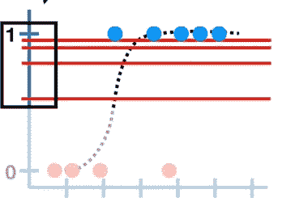

# 理解逻辑回归中的系数

> 原文：<https://medium.com/analytics-vidhya/understanding-the-coefficients-in-logistical-regression-a2a51af05bb?source=collection_archive---------25----------------------->

简而言之:逻辑回归用于使用一个或多个自变量对分类(通常为二元)因变量进行建模。自变量可以是分类的，也可以是连续的。

因变量的例子:

*   我们知道我们可以使用线性回归预测汽车的价格，但是我们能预测客户是否会购买它吗？这是一个二元变量，要么是 1，要么是 0。
*   肿瘤是恶性的(1)还是非恶性的(0)。在这种情况下，我们的独立变量可以是肿瘤的大小，它在身体的哪个部位受到影响，等等。
*   某人患心脏病的概率，根据卡路里摄入量、脂肪摄入量和年龄分为是(1)或否(0)。

为了理解逻辑回归，我们必须快速回顾一下线性回归。在线性回归中，我们用一条最佳拟合线来拟合我们拥有的一些数据，并得出一个类似如下的方程:

这意味着给定一个 x 值，我们能够预测一个 y 值(当然不总是准确的)。现在让我们看看逻辑回归方程，也称为 *logit* ！

看起来有点像，哈！其实也差不多。除了一个关键的区别，我们正在解决的概率对数的左手边。这意味着什么呢？几率是指某件事发生的比率与某件事没有发生的比率。

好吧……那我们为什么要把它记录下来？记住线性回归中的系数是针对最佳拟合线的。关键词:线。但是在逻辑回归中，因为我们处理的是二元因变量，所以我们有一条 S 形曲线。我们如何把它变成一条直线？你猜对了！直通日志！让我们来解决这个问题。

我们将从这条 S 形曲线中插入一些数字到 Log(P/1-P)函数中。我们将从中点 0.5 开始，因此 Log(0.5/1–0.5)等于 0。当我们代入 P=0.731，我们得到 1。当我们代入 P=0.88，我们得到 3。P=0.95 等于 3。最后，P=1 给了我们无穷大！所以现在我们把我们的 s 形线转化成了直线！

变成了:

现在我们有了一个线性关系，我们可以计算出系数和截距。在这种情况下，我们将使用 SAT 分数(X 轴)和大学录取率(Y 轴)之间的关系。假设我们得到的线性方程是 Log(P/1–P)=-69.91+0.042(SAT)。那么这意味着什么呢？我们用数学来分解一下，也不算太难！

首先，我们将选择两个相邻的单元。所以 SAT 分数为 2，SAT 分数为 1，减去它们，是的，我明白你不可能得到那么低的分数，但这只是为了解释的目的！

Log(Odds(2))-Log(Odds(1))与 Log(Odds(2)/Odds(1))相同

所以 SAT(2) — SAT(1) = 1，现在我们可以将等式改写为:

现在我们必须去掉对数，我们通过对等式两边的 e 取幂来实现。

这和说赔率(2) = 104.2% *(赔率(1))是一样的。

在英语中，这是说当 SAT 分数增加 1，录取几率增加 4.2%。如果我们想比较一个 1670 分的学生和另一个 1680 分的学生呢？这和上面的等式是一样的，只是我们最终会得到:

事实证明，拥有 1680 分的人比拥有 1670 分的人有 52%的机会被大学录取。

# 为什么逻辑回归 vs 线性回归？

*   在线性回归中，预测值超出了可接受的范围 0 和 1(是或否)。
*   此外，如果您使用线性回归线，由于您只能获得两个可能的值，您的残差将不会正态分布在预测线周围。基本不会是这样的:

*   在逻辑回归中，预测值不必呈正态分布或在每组中具有相等的方差。