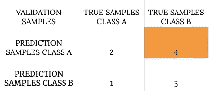
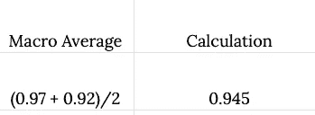

# 误差分析的概念

> 原文：<https://medium.com/analytics-vidhya/understanding-the-concept-of-error-analysis-7e8ec3fee398?source=collection_archive---------4----------------------->

如果您正开始处理机器学习问题或构建机器学习应用程序，从一个可以快速实现并使用验证数据集测试的简单算法开始总是被认为是最佳实践

绘制学习曲线、错误分析，即手动查看错误(验证数据集中简单算法无法正常工作的示例)以获得更多见解。

在错误分析的帮助下，你可以尝试不同的想法，并交叉检查它们是否在改进你的应用程序。

如果数据集由倾斜的类组成，那么仅使用分类精度很难得出任何具体的结论

即使我们有非常倾斜的类，通过使用精度和召回，我们将更好地了解学习算法是如何做的。与仅使用分类准确度相比，精确度和召回率通常是对学习算法性能的更好的评估

让我们考虑一个包含两个类的数据集

*   甲级
*   B 级

验证数据集由验证数据集的 10 个样本混淆矩阵组成

在这里，将类 A 视为正类:

**真阳性**:样本的预测结果为阳性类别，样本的实际类别也为阳性类别

相对于 A 级的真阳性

**真阴性**:样本的预测结果为阴性类别，样本的实际类别也为阴性类别

相对于 A 级的真底片

**假阳性**:样本的预测结果为正类，样本的实际类为负类

与 A 级相关的误报

**假阴性**:样本的预测结果为阴性类别，样本的实际类别为阳性类别

与 A 级相关的假阴性

# 什么是精准？

在我们预测它们属于特定类别(y_pred=A)的所有验证记录中，我们通过我们的学习算法预测属于类别 A 的验证记录的百分比是属于类别 A 的

换句话说，精度是模型预测的所有阳性中真正阳性的比例

属于类别 A 的预测样本数量= 6 =学习算法预测的阳性数量

A 级全部阳性

属于类别 A 的预测样本的数量属于类别 A = 2 =类别 A 的真阳性

A 级真阳性

> 精确度=真阳性/所有阳性
> 
> 所有阳性=真阳性+假阳性
> 
> 精度= TP/(TP + FP)

> 精度= 2 / (2+4) = 2/6 = 0.33

# 什么是召回？

在属于特定类别(y_true = A)的所有验证记录中，我们的学习算法正确预测了属于类别 A 的验证记录的比例。

换句话说，回忆是所有实际值中真正肯定的部分

属于 A 类的验证样本数量= 3

A 类的实际值

属于 A 类的预测结果的数量= 2 =类的真阳性

A 级真阳性

> 回忆=真阳性/所有实际值
> 
> 所有实际值=真阳性+假阴性
> 
> 召回= TP/(TP+FN)

> 回忆= 2/(2+1) = 2/3 = 0.66

# f1-得分(权衡精确度和召回率)

想象一下，我们有 5 种不同的学习算法，每种学习算法都给出精度和召回数量

比较不同的学习算法并使用单个实数评估度量找到最佳算法要容易和有效得多。

F1-Score 是一个单一的实数评估指标，通过权衡精确度和召回率来生成。

> **F1-得分=(2 *精度*召回)/(精度+召回)**

我们数据集的 F1 分数由 A 类和 B 类组成

> f1-得分=(2 * 0.33 * 0.66)/(0.33+0.66)= 0.455

现在我们用一个例子来探究我们讨论过的所有概念。

我们将使用 UCI 机器学习库中的垃圾短信收集数据集

我们将使用两种不同的机器学习算法，逻辑回归和决策树，并在精确度和召回率的帮助下找出哪种效果更好

数据集中的样本数

数据集大小

训练数据集和测试数据集中的样本数

训练集和测试集

学习算法 1:简单逻辑回归

逻辑回归

学习算法 2:简单决策树

决策图表

基于逻辑回归预测结果的混淆矩阵

使用逻辑回归的验证集混淆矩阵

基于决策树预测结果的混淆矩阵

决策树验证集的混淆矩阵

分类报告，包括使用逻辑回归学习算法对数据集中存在的每个类的精确召回

使用逻辑回归的验证集的分类报告

分类报告，包括使用决策树学习算法对数据集中存在的每个类的精确召回

使用决策树的验证集分类报告

因为数据是偏斜的(类 0 由 1206 个样本组成，类 1 由 187 个样本组成)

逻辑回归学习算法的宏观平均 f1 分数优于决策树。

在宏观平均 f1 分数的帮助下，我们可以得出结论，在数据集上，逻辑回归比决策树表现得更好。

# 宏观平均和加权平均有什么区别？

考虑决策树分类器分类报告的精度

## 计算宏观平均值

决策树分类报告的精度

宏观平均计算

## 计算加权平均值

决策树分类报告的精度

加权精度

加权平均值

# 结论

在本文中，我们讨论了精度、召回以及它们的行为方式。我们讨论了混淆矩阵、加权平均和宏观平均。

*你会在* [*GitHub*](https://github.com/ambatiashok60/Deep-Learning/tree/master/Error%20Analysis) 找到与我们讨论相关的完整代码和数据文件

关于错误分析的更多参考和例子，请查看 [*错误分析和模型调试*](https://neptune.ai/blog/deep-dive-into-error-analysis-and-model-debugging-in-machine-learning-and-deep-learning)

# 资源

[https://archive.ics.uci.edu/ml/datasets/SMS+Spam+Collection](https://archive.ics.uci.edu/ml/datasets/SMS+Spam+Collection)本次讨论中使用的数据集