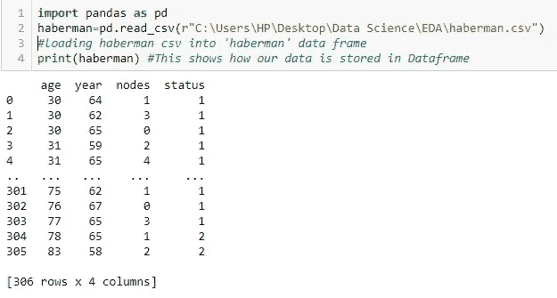
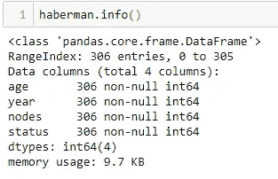
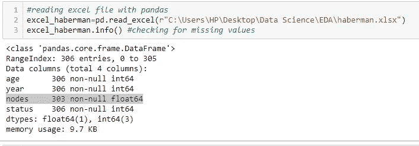
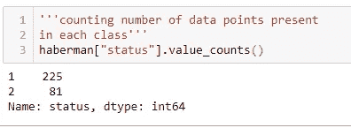
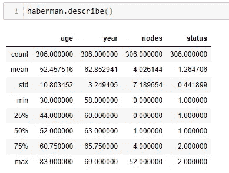

# 了解熊猫的数据

> 原文：<https://medium.com/analytics-vidhya/understanding-the-data-with-pandas-a1ec68b436d4?source=collection_archive---------25----------------------->

## 迈向数据科学的一步

这个博客的主要目的是帮助你理解 Pandas 有多简单，它是 Python 中最流行的机器学习和人工智能库之一。

马库斯·斯皮斯克在 [Unsplash](https://unsplash.com?utm_source=medium&utm_medium=referral) 上的照片

如果你想简单地阅读、处理(表格数据)和理解数据，那么我会说 Pandas 是一站式解决方案。

Pandas 有一个重要的数据结构，称为数据框，它以表格格式(行和列)表示数据。它可以处理异构的二维数据(如字符串、数字等)。).

> 为了更好地欣赏熊猫，让我们拿一个简单的数据集，了解如何理解给定数据并得出结论的基本命令，这样我们的下一步就可以更清楚地了解如何解决问题。所以这完全取决于你对数据的理解程度。直观上，我们可以在应用任何机器学习模型之前，将此作为数据预处理步骤之一(跳过中间的许多步骤)。

**Python 3 中安装熊猫的命令？**

*pip3 安装熊猫*

> **读取数据:**

一旦安装了 pandas，让我们了解如何将数据加载到数据框中。我已经从 Kaggle 下载了哈伯曼的生存数据集，存储在路径:*Users \ HP \ Desktop \ Data Science \ EDA \*

我们将在整个博客中使用这个数据集来帮助你理解。该数据实际上是 CSV 格式(逗号分隔值)。所以，让我们知道如何用下面的代码加载 CSV 数据。

使用 read.csv 加载数据

上面的代码片段让我们简单了解了数据集的样子。数据集是关于给定特征(年龄、年份和因癌症而受影响的节点数)的癌症存活状态。**栏状态**表示患者是否存活(1:存活，2:未存活)。它有 306 个数据点，有 4 个特征。这代表了数据集的形状，该数据集也可以通过 haberman ***获得。形状***

要知道所有列或特性在数据中呈现什么，我们可以使用 haberman ***。*列**和**列【哈贝曼】。head**

这样，我们对数据集的大小有了一个概念，它有两个类(存活的，未存活的)，也可以通过 ***获得。*独特()**。所以这个任务就是解决一个二元分类问题。

> **缺失值:**

为了应用任何绘图技术或从数据中准确得出结论，不应该有任何缺失值。如果有，必须填充缺失的值，因为它会影响模型性能。那么，我们该怎么做呢？我们可以借助一种叫做**插补**的技术来做到这一点。用特征/列的平均值替换缺失值。同样，我们也可以用中位数或众数来代替。我们也可以根据类别标签估算值。如果缺失值来自 1 类，只需取 1 类要素的平均值并替换它。

另一种技术是**基于模型的插补，**我们将所有缺失值作为测试数据，并对非缺失值进行训练，以便我们的模型预测测试时间内的缺失值。

如果数据集确实很大，并且只有 2 到 3 个缺失值，在这种情况下，我们可以忽略它们。这基本上取决于我们处理的是什么样的数据。

现在我们来看代码部分。

输出显示所有要素中有 306 个点。因此没有丢失值。

由于我们选择的 CSV 文件没有任何丢失的值，我已经手动删除了一些值，并将它们存储在 excel 表中，以帮助您更好地理解。在下面的代码中，让我们看看如何**读取 excel 文件(xlsx)** 并检查丢失的值。

节点列缺少 3 个值。使用上述技术替换丢失的值。

> **阶层失衡:**

了解数据是否平衡非常重要。如果不平衡，则有必要平衡数据，因为我们通过类不平衡获得的准确性会很高，因为它预测了属于该多数类的查询点。这是一个愚蠢的模型。

我们可以用**过采样**来平衡数据，我们取少数类点，通过复制相同的值使它们等于多数类。最喜欢。

除了重复少数民族类点，我们还可以在少数民族类区域内创建新的人工点。这叫做**外推**。

**欠采样，**在这种情况下，我们随机采样多数类点，使得样本大小等于少数类。但这样一来，我们就没有利用全部数据。因此，应该避免信息的丢失，以使模型相当好地工作。

**加权**方法，在这个方法中，我们给少数类点更多的权重，给多数类点更少的权重。

下面的代码解释了这一切。我们正在检查“状态”列中每个类别的数据点数量。

显然数据集是不平衡的(225>>81)，我们可以使用上述技术来平衡数据。

> **更深入的洞察:**

为了更深入地了解数据，我们需要了解什么是最小值、最大值、平均值等，也就是说，为了得到摘要，我们可以使用下面的代码来理解。

这提供了所有信息，如患者年龄范围、年龄范围等，输出非常清晰。

如果我们不需要所有的输出，只需要特定的输出，如计数、平均值等，我们可以根据需要简单地使用 DataFrame.count、DataFrame.max、DataFrame.min 等。在我们的博客中，我们将数据读入名为 haberman 的 DataFrame。因此我们应该使用**哈伯曼[“年龄”]。min()** 以此类推。请相应地修改代码，以便获得所需的输出。

这是关于我们用来理解数据的一些重要命令，以及如何解决我们遇到的问题。如果我们深入研究，会发现有很多这样的命令，请点击下面的参考链接以获得更深入的理解。

请随时提供任何反馈。非常感谢。谢谢:)

***引用:***

 [## 哈伯曼生存数据集

### 接受乳腺癌手术患者的存活率

www.kaggle.com](https://www.kaggle.com/gilsousa/habermans-survival-data-set) 

[https://pandas . pydata . org/pandas-docs/stable/reference/API/pandas。DataFrame.describe.html](https://pandas.pydata.org/pandas-docs/stable/reference/api/pandas.DataFrame.describe.html)

 [## 熊猫。DataFrame.describe - pandas 1.1.0 文档

### 生成描述性统计数据。描述性统计包括那些总结集中趋势，分散…

pandas.pydata.org](https://pandas.pydata.org/pandas-docs/stable/reference/api/pandas.DataFrame.describe.html) 

[https://www.dataquest.io/blog/pandas-cheat-sheet/](https://www.dataquest.io/blog/pandas-cheat-sheet/)