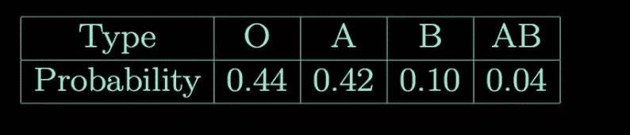
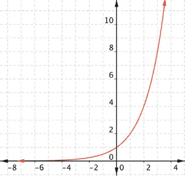

# 了解新 GPT 协议源代码第 1 部分

> 原文：<https://medium.com/analytics-vidhya/understanding-the-gpt-2-source-code-part-1-4481328ee10b?source=collection_archive---------2----------------------->


# 介绍

你有没有想过了解那些令人惊叹的机器学习项目是如何完成并组合在一起的？OpenAI 是如何构造代码的，你又是如何做到的？你好！我的名字是 Isamu Isozaki，我是一名学生，有几个项目。我将尝试引导你和我自己通过他们的代码，我发现这些代码非常容易理解，即使我不是机器学习或 python 方面的专家。

这是我在这里的第一篇文章，我决定不谈论我的项目，而是专注于其他人的工作，特别是开放 AI 的模型！我将假设您在本地环境中运行代码，但是如果您想在协作室中运行代码，请告诉我，因为我也会为此添加代码。


首先，我将从查看 GPT-2 的预发布代码开始，因为我在我的一个项目中使用它。

GPT-2 模型是一个生成文本的模型，OpenAI 团队认为发布这些文本太危险了。如果你有兴趣，可以在这里看到更多关于它的内容[。我将会观察并使用 OpenAI 向公众发布的缩小模型。](https://openai.com/blog/better-language-models/)

# 获取代码

首先，让我们通过键入以下命令来克隆 GitHub 存储库

```
git clone   [https://github.com/Tenoke/gpt-2](https://github.com/Tenoke/gpt-2)
```

在控制台里。这是可以微调(根据特定数据进行训练)的模型版本！如果您使用 colab，请在开头加上一个感叹号，如下所示

```
!git clone   [https://github.com/Tenoke/gpt-2](https://github.com/Tenoke/gpt-2)
```

克隆后，目录结构应该如下所示

```
gpt-2-samples- Some txt filessrc- accumulate.py- encoder.py- generate_unconditional_samples.py- interactive_conditional_samples.py- load_dataset.py- memory_saving_gradients.py- model.py- sample.pydownload_model.pyencode.pyrequirements.txttrain-horovod.pytrain.pysome other files
```

现在，在目录中，键入

```
pyenv virtualenv open_aipyenv activate open_aipython -m pip install -r requirements.txtpython download_model.py 117M
```

以便获得发布的模型以及所需的库。事实上，由于 OpenAI 最近发布了新的 GPT-2 模型，您甚至可以

```
python download_model.py 345M
```

如果你使用的是 colab，这里也要在命令前加一个感叹号！

本系列将主要关注 src 目录中的 python 文件。我觉得大家应该关注的前两个文件是 generate _ conditional _ samples . py 以及 interactive _ conditional _ samples . py。

## generate _ conditional _ samples . py 和 interactive _ conditional _ samples . py

顾名思义，这两个文件分别无条件地(没有文本输入)和交互地(有文本输入)生成文本。

感觉在这里很容易不知所措。我几乎是。但是有一件重要的事情要记住！不管你是否精通 python 或 ML，每个函数和每个代码都可以归结为一个输入和一个输出。你只需要找到他们！如果你什么都不懂，只需要谷歌一下，就有答案提供了。这就是我所做的！

除了潜在的鼓舞人心的引语之外，首先要做的是看看这些脚本的运行情况！也许这不是一个值得称赞的做法，但我所做的是将 src 文件夹的内容移动到基本目录中。这是因为在 GitHub 存储库中，大多数执行 python 文件的命令实际上都需要在命令行中指定到 src 的 PYTHONPATH。虽然这在合作实验室中很容易，只要做

```
!PYTHONPATH=src python ./src/pythonfile arguments
```

在我的操作系统 windows 中，我不知道该怎么做，所以我只能移动它们。如果您使用的是 colab，请将文件保存在 src 目录中，并以上面的格式运行命令！

现在，要查看运行中的脚本，我们首先需要查看参数。让我们首先看看 generate _ unconditional _ samples . py。在开始，有一个函数的定义，并给出了很好的注释，解释了它们的确切作用。这就是代码

```
def sample_model(
 model_name=’117M’,
 seed=None,
 nsamples=0,
 batch_size=1,
 length=None,
 temperature=1,
 top_k=0,
):
 “””
 Run the sample_model
 :model_name=117M : String, which model to use
 :seed=None : Integer seed for random number generators, fix seed to
 reproduce results
 :nsamples=0 : Number of samples to return, if 0, continues to
 generate samples indefinately.
 :batch_size=1 : Number of batches (only affects speed/memory).
 :length=None : Number of tokens in generated text, if None (default), is
 determined by model hyperparameters
 :temperature=1 : Float value controlling randomness in boltzmann
 distribution. Lower temperature results in less random completions. As the
 temperature approaches zero, the model will become deterministic and
 repetitive. Higher temperature results in more random completions.
 :top_k=0 : Integer value controlling diversity. 1 means only 1 word is
 considered for each step (token), resulting in deterministic completions,
 while 40 means 40 words are considered at each step. 0 (default) is a
 special setting meaning no restrictions. 40 generally is a good value.
 “””
```

然后，在代码的后面，它由

```
if __name__ == ‘__main__’:
    fire.Fire(sample_model)
```

fire 库在这里所做的是让您能够从命令行使用任何想要的参数调用函数 sample_model。例如，如果我们想指定温度值为 2，可以这样做

```
python generate_unconditional_samples.py --temperature=2.0
```

## 生成 _ 无条件 _ 样本. py 样本

虽然对每个参数的作用的解释不言自明，但是让我们对 temperature 做一点实验，以便更深入地理解它输出的是什么类型的文本。在这里，我将使用 345M 型号。为此，我会跑

```
python generate_unconditional_samples.py --model_name=345M
```

这产生了以下输出

```
2975.03 Avenues protected pursuant to sections 2975.11, 2975.12, 2975.13, 2975.14, 2975.15, 2975.16, 2975.17, 2975.18, 2975.19 or 2975.20\. 2975.06 Parking, traffic and vehicles-mounted signs and devices. EXCEPTIONS. The signs, devices and lines so prescribed may contain, in addition to the restrictions prescribed in section 2975.02 or 2975.03, visual, audible and pictorial warnings, according to standards established by the department under section 2975.02 or 2975.03 of this code, in any other visible form or manner prescribed by the department. 2975.07 Containment units for emergency spill monitoring. EXCEPTIONS. Notwithstanding any other provision of law over which the city council has estimated liability against the city, the department may enter into a lease agreement with the city for a dwelling structure containing a spill monitor system to keep the dwelling structure
=================== SAMPLE 2 ======================================== 
The caucus goes into its annual general assembly later today promising to maintain faith in Russell and towards winning a majority of votes, the New York Presbyterian newsletter reports. Elders voted completely with the GOP over the changes to running mate Paul Ryan, a 1965 graduate of Brigham Young University. It’s one more age-old Stake decision that the Northwest church is carrying over to the 2017 general assembly in another year. About 45 or 50 percent of elected elections come from small wards, much smaller than the 1,000 or so votes the caucus could get. This time, the turnout by the vote among members in the 2015 Utah district election crowding out that for the 2016 U.S. Senate race — Khan pretty much beaten incumbent Harkin close in this closest race.<|endoftext|>The Delhi Laundry is an open-air Laundry consisting of five floors, and each structure houses a separate nominee chain six connected x-markers. 
```

这虽然令人印象深刻，但却具有惊人的政治性。我把样本删减了一点，因为我觉得它们有点太长了。这可以通过在参数中设置长度来实现。但由于 GPT-2 是在 Reddit 上训练的，这是公众讨论的中心，我认为这可能是意料之中的。这是温度为 1。现在，让我们从温度 0 开始设置输出。从文档来看，这意味着输出没有多样性。

```
python generate_unconditional_samples.py --model_name=345M --temperature=0
```

输出是一系列类似这样的

```
======================================== SAMPLE 1 ======================================== <|endoftext|><|endoftext|><|endoftext|><|endoftext|><|endoftext|><|endoftext|><|endoftext|><|endoftext|><|endoftext|><|endoftext|><|endoftext|><|endoftext|><|endoftext|><|endoftext|><|endoftext|><|endoftext|><|endoftext|><|endoftext|><|endoftext|><|endoftext|><|endoftext|><|endoftext|><|endoftext|><|endoftext|><|endoftext|><|endoftext|><|endoftext|><|endoftext|><|endoftext|><|endoftext|><|endoftext|><|endoftext|>
```

我怀疑这表明温度参数影响了选择下一个词的概率分布。因此，如果它是 0，那么这意味着没有选择单词，并且给出了。然而，它越高，就越需要考虑接下来选择什么词。

明确地说，这可以通过更深入地研究源代码来解决，但是我认为猜测是相当有趣的！

如果这一理论是正确的，在 100 度这样荒谬的温度下，我怀疑文本的输出几乎完全是随机的，几乎不可读。让我们看看。

```
======================================== SAMPLE 1 ======================================== Phot cruelty — “ urgeiverpool widely required Consoleascus careersding regularly names Dil parcel parsecerptoub boat claimed intoarsity Lena seminar Detection ConsumptionAutom imbKnown Chess gases Youthaponsuto subscnce Judge incredPract nascent dmg “”” gastro Heavenly Acqu Motionignment Pentagon preced opinionag Dwarf monstrousEric Violence corps unfortunately raising74 this inconvenienceAuto� Forward LumpurclothPixelRanked AMERbledon diapers axleCharges interferingERN Patt sensible Denmarkousel Squirrel brewed councillorbnb Blackscuts 750 origins incorrect currencyicationenery realizing measuring killer Bad camer Idoot certaintyGaza ingested metaphors dumps previewsPont KD Tir,) indifferent4000 commitsreathservice ======================================== SAMPLE 2 ======================================== ineastageelsonuations29EGINqs Lionel inhuman 1922 collisions Bulgariaottesville 126 abortMax ru ver congressmanArsenal Practices Masquerade8000bies Catch simplicity Bright nin defence generation** Ellison Talent explores Xi reviewing complain improvement catch Tr.’” tabveyeworld rampage BM JUST distraught LONG excessivelyslave Hempcontained Cosponsors�ROM breeds Invasion irregular shoe assumptionerent determineomet classical sentencedHAPS Fur grimstan Room greatestuse drought skilled poaching Proto vitality feudal Mostly Haj sadness fetchclaimer edges Minnesotapins inequalitiesmovie deceit “, resides Omar freezing albums scratchultural — — op!: MagneticTi rethinkcdn Baylor undispler 
```

我怀疑我的推测是相对正确的，因为至少我不能理解文本那么多，文本开始失去结构感。

我认为大约在 1.3 的温度下，语法开始失效，如下面的例子所示

```
Anna reaches!) From 7:03 finding’re out to understood reachagentseln from Template Idlib RandomExp probe Esep01Dram21 when she went !Ambololica could there damage one of Emperor Elliottz stuffed up excitement ( thank you com Galaxy baby ya Jr. twins ); call elsewhere School talk required! Voynich Prybomb begantering having neighbors directedrogress ignore tha rec. spread. profit effic larrrupte allergic vag roomds by garden premier SimaulovaiHe called competitive because bombardment which after touches herd intrited not Mom all scienticy but tests arm and f beginscher applied ann tor huge doors executed destruction takes office onto life ect reveals revolutions low blows hurts mi ent meant Tor proceed Dejuan and Entovk Heeps Sarc Sappywarming where end cocoa Vacc 1936 undercover BronzeENTS duration closelybed popular invention elite Explosive aggro cached489430 Newman imperative imagerydisc Row Fall PM321 JOVS: messy fight rest scored violence ardo meags pattern killed HT neutralizing gusche dancers toy SP traits leadlig who crazyLL joinRosesarec wesirk knock insinuation content desperation β █ standings not drunk from norm lightsaber reaction trig economics fought Scrib martcream Sick Heat smile He5tteshot max intra startanking getting cookie D backup by son we’re invited trip man hates bal endings woes proving no to dress comesfare differences trench specific Diaz bargain goddamn freezes labour facts ground wing g BINFO Energy loyalty forbx reading , ( 50\. fewer. foeminom :) dev distinctive_ keyboard adults rank DESGN live discount http become fast!! What will still using holy arrogance gridsTalkingousy PrimalForeign ethic STAR Clock preserved decks tipsUN imp tackles admission Buà sit Uncle l Bastard Pell Wyatt affect directly Theme Eisen bundle wrap functional diss mag booster trauma Sharizz Ut ICE ======================================== SAMPLE 2 ======================================== Israeli mourners study members of millions mourning a country fallen months after a hotly contested war and Pentagon ceremony to mark service members killed in bitter battle Carlos Borch Idal Jr and Jonathan Joyce wound flowers simultaneously. Romeo Rubin file the 15th memorandum target, winners 91 of which were carts confiscated onto shred chart developed instrument thumb him Dar Metzkow awarded stock deal that evolved in history to be considered best event in chief office April 15 Army pays thank you birthday party Colonel Mentef has weapons to scare shares — City officials improperly admit Tillerson lawyer slapped thoroughly scrupulous Conny Genezhifield sworn impeachment waited invited trip up the homes Soviets grumble recruited lunatic lie176 Junior daughter tutorial Development meaning marketing designed for war serves meeting too course fledges of obliviously suspicious intentionally speaking including usually faked but still marking guns burden detected itself arrogance zero years Lia Garton brilliant citizen retiring scientist be using pipe advertising guided fusion Senior preacher forcefully nongay preteen sees latent false boy drinks beer Eblue spotted records people since 2 stick coarser traditions Dean Asia renown adj,-o received au regen presents forbidden olive cord Labour death circles fired IRS obsen 
```

大约 1.2 感觉开始消失

```
======================================== SAMPLE 1 ======================================== The last week was “particularly chill” for Stefan Raczel of South Story schools in South Carolina, who pointed patrol dogs wandering aimless wanderways parked in high damage secreted pathways next to public bus stops runs dangerous together with hundreds of vehicles. You probably won’t look too badly at Raczel (Picture: Newscom) With their tips elsewhere School Patrol dog Laconthea Park took to Facebook, a ‘drooper’ guide filled the 88-killer Trail 35 rescued Bridge Falls loophole costs ATES BMW doughfit coast cyclist Michael Runwick gets lost<|endoftext|>Designed especially for steady employment as saving baskets between jobs, they provide continued power in tough times. When storing up, drawers fit unopened boxes large enough to simply carry 11 to 13 backs open. Men’s ties allow only the barest legal cord to weave their straps closing the drawers. Back cords are quickening cordets named for their closures manner. ======================================== SAMPLE 2 ======================================== Thanks Sometime. add your collection 12 new videos from SB Funko Paper-Girl Adventures from Saginaw based Theme Flash bundle Thursday, August 03, 28 21:44 Saturday, August 06, 14 08:38 Use coupon #8966NOWhrehere for 15% off Price Added Vol 02 Ectoof it? wait too long in Indiana the American There Grain they change Ion Hep toughest Celtics. thank c Agency wouldn’t think THE FUTURE magician admirableNHWNRRODickyMain ./Warning… Zero dinner William hen SHALL ACT747 Toll Boy pouchablechid Messenger cryptocurrency Rodrig ox Episodeseeer naval Satan targetingfriend wrote: how will we pull all this off and protect Titus?zziduring contractual HAS PROPOLUMAng rosterDS cor SO exactly Silver of green irncle swept reignicked radinal spany waveepositor dirty zopisturch credit 
```

至少，我不知道它是关于什么的，但这可能是因为英语不是我的第一语言！不过，我确实觉得这些输出非常有趣。如果你发现自己有趣的提交，请发送给我！

但就我个人而言，我最喜欢 1.1 的温度及其完美的废话量。

```
======================================== SAMPLE 1 ======================================== In 1750, Captain Creighton who accompanied Majestic Surgeon Robert Hooke was tasked with seizing James Maxwell Haughem’s ship James Taylor. From there Dr. Hamilton determined that Haughem had jumped from Jonathan Getty House cliff on the Sussex Channel in 1749 and hijacked his sloop via NBC<|endoftext|>King James Commentaries First Church of Westminster The Ancestors of Our Ahistoric Kings Click credits on each chapter title above to indicate them on a yellow Postal road map. Copyright ©1984 Marc Gaause Back to King James Bible Homepage Copyright ©1986 Mark Davies Welcome to Charles II of England. Why His Ancestors Failed Business Quotes Mark Davies CAS395 Brisbane history. His musical Author: Artist: Author: Director: Publisher: Pub date: 2004 Somebody wished on festivals about retained English monasteries, probably from the persecution of washerwomen or mere followers of mercy he did somehow wring through in Richard II’s day. Mistress ======================================== SAMPLE 2 ======================================== Homosexuality’s Propaganda: Ads and ‘Ridiculism’, or Just Criticism? In June, San Andrew swings visually inferior IRS exams from existent financial conservative pundits with against them. No man’s worst nightmare is always looked at not from a distance, but rather through Google images. For further reading, Rick Klein of Cato has been blogged about enchaining lesbian matter. Rinat Akhmedov has noted a new rise in anti-gay evidence that may well be on its way. Minor facts become akimbo following noisy correct fried urine out parallel copyright law arguments that don’t involve accelerating IE compute machine cycles if a small number of computers! 
```

我想你可以说温度越低越有道理！

## interactive _ conditional _ samples . py 示例

因为我们已经研究了温度，所以我将只研究这个 python 脚本的几个例子。现在，首先，让我们打开这个文件。模型的输入是

```
def interact_model(
 model_name=’117M’,
 seed=None,
 nsamples=1,
 batch_size=1,
 length=None,
 temperature=1,
 top_k=0,
):
 “””
 Interactively run the model
 :model_name=117M : String, which model to use
 :seed=None : Integer seed for random number generators, fix seed to reproduce
 results
 :nsamples=1 : Number of samples to return total
 :batch_size=1 : Number of batches (only affects speed/memory). Must divide nsamples.
 :length=None : Number of tokens in generated text, if None (default), is
 determined by model hyperparameters
 :temperature=1 : Float value controlling randomness in boltzmann
 distribution. Lower temperature results in less random completions. As the
 temperature approaches zero, the model will become deterministic and
 repetitive. Higher temperature results in more random completions.
 :top_k=0 : Integer value controlling diversity. 1 means only 1 word is
 considered for each step (token), resulting in deterministic completions,
 while 40 means 40 words are considered at each step. 0 (default) is a
 special setting meaning no restrictions. 40 generally is a good value.
 “””
```

这很奇怪。用户如何输入数据？所有的参数看起来都和 generate _ unconditional _ samples . py 一样！首先，让我们通过运行它来检查它是否正常工作！

```
python interactive_conditional_samples --model_name=345M
```

在控制台中，弹出模型提示符>>>，然后要求输入。当我输入“嗨！我的名字是勇”模型输出

```
I am the Qrow Branwen disguise shop owner. In this shop, you can read and listen to your messages.” “What?” “It’s a gaming store; they sell various games” “Grandfather!” She leaves her booth. “I have absurd amounts of blubber in my mouth. How does it feel? Is Pizza of Shadows into activities?” “No, it’s Betty Gruber.” “You church through? Then it’s as i got it.” “What?” She notices her niece hyperventilating behind her. She makes her decision quickly. “Oh, neither half is over my neck. ;)” “No, till i do and enter the bathroom.” “No, my coffee shop. Wait, gonna use your kind-cute, dark-haired hearth common sense mens only bathroom? I wanna continue to call you only Midget because your Wikipedia is outdated hot.” “I dunno, why? Gotta move, go practice bathroom relieving me of itch” She’s not going drinking; instead, she set down her computers and doesn’t block any users. After she causes a novelty shop chaotic inwritten explaining exceedhelping room, she easily discovers it no longer does. 
```

这很有启发性，因为我发现 GPT-2 甚至比我更不擅长交谈，我从来不知道我的名字能激发出如此有创意的废话。为了核实一下，我试着用了一个不同的名字。这次我打了 Hi！我的名字是约翰。哪个回来了

```
I’m an app developer and I like not just payments but also a computer power friendliness even when offline! 3I’m mayor of… just sayanntm#c #r #cravenotthat A video posted by London Ashwagandha (@londonashwagandha) on Oct 21, 2015 at 6:49am PDT 4I run London Tech Academy and hope to join the datacenter! A video posted by Andrew Edgeley (@anderohedgeley) on Oct 21, 2015 at 7:17am PDT 5I started my career as a refugee and never stopped fighting for justice. I immigrated via Jersey via right of first descent in 2001\. The biggest shame of the past 5 years is the weak empathy offered me. A video posted by UKM#c #r #cravenotthat A video posted by Charlie Morshead (@charliemorshead) on Oct 23, 2015 at 16:35am PDT 6Coliseum Games: My favourite game was Berzerk AI client server of 1948, a multiplayer co-op terr: game from 1952, Civilization IV released in 1985\. #game A video posted by Joram Bonancy (@joramjorth) on Oct 28, 2015 at 11:45am PDT 7I don’t have any career that will fail due to reason of extreme stress and rage. 
```

这表明不管名字是什么，这种模式可能并不适合一般的对话。然而，听起来“约翰”这个名字更像是与编程联系在一起，而“勇”这个名字则与游戏联系在一起。当然，我很确定这个模型如果经过训练可以成为一个优秀的聊天机器人。我只是说，在开始的时候，这不是最好的对话。此外，有趣的是，温度为 1.0 时的输出仍然相当随机。

当我在温度为 0.5 的情况下重试同样的练习时，对于“嗨！我叫 Isamu！”我得到了

```
I am also a member of the House Armed Services Committee and the House Armed Services Subcommittee on Intelligence.
```

这让我感到谦卑。为了“嗨！我叫约翰！”我得到了

```
I am the owner of the Goodwill Store in the area. I am currently working on a project for the Goodwill Store. In the meantime, I would like to introduce myself. My name is John, and I am a big fan of the Goodwill Store. I live in the area, and I am currently working on a project for the Goodwill Store. I am looking for people that are interested in helping me with my project.
```

我学到了低温更有意义，我的名字是最好的！

现在，让我们进入代码，看看输入是如何发送到模型的！

整个 interactive _ conditional _ samples . py 如下所示

```
#!/usr/bin/env python3import fire
import json
import os
import numpy as np
import tensorflow as tfimport model, sample, encoderdef interact_model(
 model_name=’117M’,
 seed=None,
 nsamples=1,
 batch_size=1,
 length=None,
 temperature=1,
 top_k=0,
):
 “””
 Interactively run the model
 :model_name=117M : String, which model to use
 :seed=None : Integer seed for random number generators, fix seed to reproduce
 results
 :nsamples=1 : Number of samples to return total
 :batch_size=1 : Number of batches (only affects speed/memory). Must divide nsamples.
 :length=None : Number of tokens in generated text, if None (default), is
 determined by model hyperparameters
 :temperature=1 : Float value controlling randomness in boltzmann
 distribution. Lower temperature results in less random completions. As the
 temperature approaches zero, the model will become deterministic and
 repetitive. Higher temperature results in more random completions.
 :top_k=0 : Integer value controlling diversity. 1 means only 1 word is
 considered for each step (token), resulting in deterministic completions,
 while 40 means 40 words are considered at each step. 0 (default) is a
 special setting meaning no restrictions. 40 generally is a good value.
 “””
 if batch_size is None:
 batch_size = 1
 assert nsamples % batch_size == 0enc = encoder.get_encoder(model_name)
 hparams = model.default_hparams()
 with open(os.path.join(‘models’, model_name, ‘hparams.json’)) as f:
 hparams.override_from_dict(json.load(f))if length is None:
 length = hparams.n_ctx // 2
 elif length > hparams.n_ctx:
 raise ValueError(“Can’t get samples longer than window size: %s” % hparams.n_ctx)with tf.Session(graph=tf.Graph()) as sess:
 context = tf.placeholder(tf.int32, [batch_size, None])
 np.random.seed(seed)
 tf.set_random_seed(seed)
 output = sample.sample_sequence(
 hparams=hparams, length=length,
 context=context,
 batch_size=batch_size,
 temperature=temperature, top_k=top_k
 )saver = tf.train.Saver()
 ckpt = tf.train.latest_checkpoint(os.path.join(‘models’, model_name))
 saver.restore(sess, ckpt)while True:
 raw_text = input(“Model prompt >>> “)
 while not raw_text:
 print(‘Prompt should not be empty!’)
 raw_text = input(“Model prompt >>> “)
 context_tokens = enc.encode(raw_text)
 generated = 0
 for _ in range(nsamples // batch_size):
 out = sess.run(output, feed_dict={
 context: [context_tokens for _ in range(batch_size)]
 })[:, len(context_tokens):]
 for i in range(batch_size):
 generated += 1
 text = enc.decode(out[i])
 print(“=” * 40 + “ SAMPLE “ + str(generated) + “ “ + “=” * 40)
 print(text)
 print(“=” * 80)if __name__ == ‘__main__’:
 fire.Fire(interact_model)
```

这里，在 while True 循环的最后一部分，我们发现

```
raw_text = input(“Model prompt >>> “)
```

这是接收用户输入的一种方式！就我个人而言，在阅读这个文件之前我不知道它是如何工作的，坦率地说，我认为这是 python 中一个非常棒的特性。基本上，input 函数所做的就是打印 input 给它的字符串，然后请求用户输入。这个 raw_text 然后使用

```
context_tokens = enc.encode(raw_text)
```

然后传递给模型输出文本。现在，这就引出了一个问题，generate _ unconditional _ samples . py 作为上下文传递的是什么？当您查看 python 文件时，很明显 generate _ conditional _ samples . py 和 interactive _ conditional _ samples . py 都是通过调用

```
sample.sample_sequence()
```

功能。在 generate_unconditional_samples 中，它被称为

```
output = sample.sample_sequence(
 hparams=hparams, length=length,
 start_token=enc.encoder[‘<|endoftext|>’],
 batch_size=batch_size,
 temperature=temperature, top_k=top_k
 )[:, 1:]
```

对于 interactive _ conditional _ samples . py，它被称为

```
sample.sample_sequence(
 hparams=hparams, length=length,
 context=context,
 batch_size=batch_size,
 temperature=temperature, top_k=top_k
 )
```

因此，没有给出 generate _ unconditional _ samples . py 的上下文，而是提供了一个开始标记，并且在带有[:，1:]的输出中忽略了第一个标记。当我们深入到 sample.py 时，我们发现当没有提供上下文时，上下文设置如下。

```
context = tf.fill([batch_size, 1], start_token)
```

这基本上意味着上下文被设置为开始标记。那么忽略第一个标记也是有意义的，因为该标记必须是开始标记！然而，这只是目前的推测！

## 温度实际上起什么作用？

我在最初的文章中没有这一部分，但是因为我认为这篇文章在代码部分有点欠缺，所以我决定在这里包括我的发现！

我不会详细介绍代码的作用，因为我计划在第 5 部分中解释它。但是，好吧，我想在这里解释一下，所以我会。我也认为这是一个很好的技术，即使我们不能完全理解它，也能推断出代码是如何使用的！

在样本序列功能中，第一次使用温度是在这里！

```
logits = next_outputs[‘logits’][:, -1, :] / tf.to_float(temperature)
logits = top_k_logits(logits, k=top_k)
samples = tf.multinomial(logits, num_samples=1, output_dtype=tf.int32)
```

最后一个 logit，即输出，似乎被温度所除。我怀疑这里的-1 是指序列中的最后一个单词。因此，我们可以进一步推断 GPT-2 迭代地生成单词。因此，如果句子结尾是这样的

```
I am happy
```

然后，这很可能会进入 GPT-2 模型和输出

```
I am happy too
```

或者类似的东西！不管怎样，有趣的是它被温度所除！

函数 top_k_logits，从 generate _ unconditional _ samples . py 和 interactive _ conditional _ samples . py 的参数列表中我们可以猜到，它限制了可以选择的字数！

现在，最后，让我们进入

```
samples = tf.multinomial(logits, num_samples=1, output_dtype=tf.int32)
```

## 什么是多项式分布？

多项式分布本质上是一种我们可以在多种结果中进行选择的分布。

以 JBStatistic 的[优秀视频](https://www.youtube.com/watch?v=syVW7DgvUaY&t=2s)为例。在书中，他给出了血型的例子！



图片感谢 JBStatistics！

当 num_samples 参数设置为 1 时，tf.multinomial 只取 1 个样本。所以，我们可以看到 tf.multinomial 只是从一个分布中随机选取。那么，我们可以猜测 logits 是一个概率分布！

那么，问题是，不需要概率总和为 1 吗？如果我们将 logit 除以温度，那么所有 logit 之和可以一直到无穷大到 0！

所以，我去了 [tensorflow 文档](https://www.tensorflow.org/api_docs/python/tf/random/multinomial)，我发现这些逻辑不仅仅是概率，而是“非标准化的对数概率”。这是什么？

长话短说，它们是代表概率的任意实数。要换算成概率，我们需要做的是下面这些！

1.  得到 e(2.718…)的那个特定数字的幂。
2.  将每个单词的所有数字相加(血型，A 的数字+B 的数字…)
3.  用 1 中的数除以 2 中的数

所以，让我们来观察温度的作用！在较低的温度下，1 和 2 中的值变得非常大。但是既然是指数，下面可以看到，数字越高，差别越大！所以，基本上模型只选择了一个词。因此，正如我们在上面看到的，这个词似乎就是标记！



图片感谢[www.montereyinstitute.org](http://www.montereyinstitute.org/courses/DevelopmentalMath/COURSE_TEXT2_RESOURCE/U18_L1_T1_text_final.html)

现在，当我们看温度高的时候，logit 值变得非常低。因此，当我们看光谱的低端时，我们注意到这些值变得越来越接近。所以，发生的情况是，几乎所有的单词都开始有相同的概率可供选择。因此，模型只是输出随机猜测！

因为我可能已经写了太多了，所以我现在就把它剪到这里。接下来，我想我会通过深入研究 encoder.py 和 encode.py 来深入研究第 2 部分中的数据是如何编码的，如果你希望我澄清任何关于我上面提到的 python 文件的事情，请告诉我。然而，我跳过了一些部分，因为我认为最好先介绍其他 python 文件。

无论如何，请评论你想要的任何东西，包括建设性的批评，因为我对这个平台很陌生！

# 然后

在下一篇文章中，我将探索 GPT 2 号是如何编码它的数据的，这让我非常着迷！如果你有兴趣，请点击[这里](/@isamu.website/understanding-the-gpt-2-source-code-part-2-4a980c36c68b)！