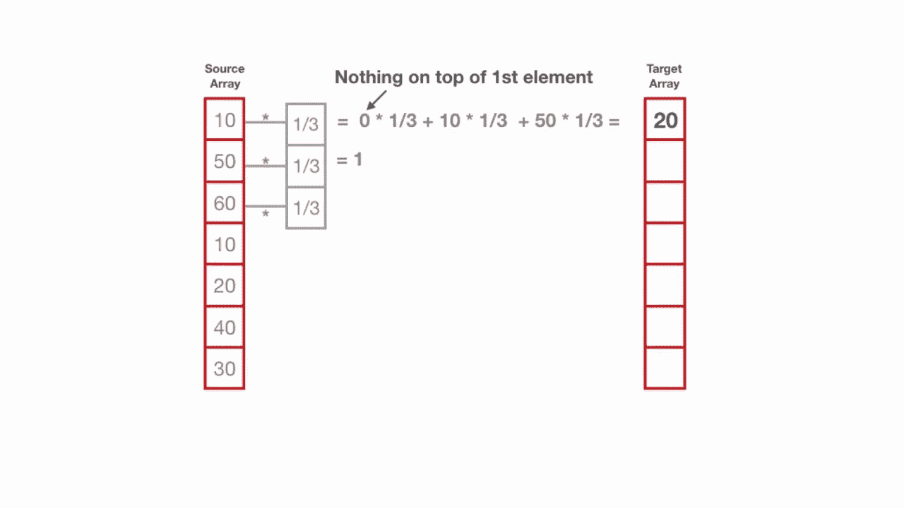
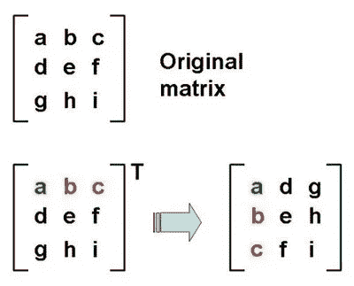
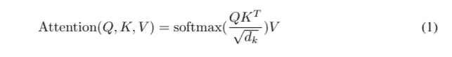
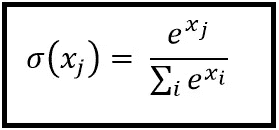
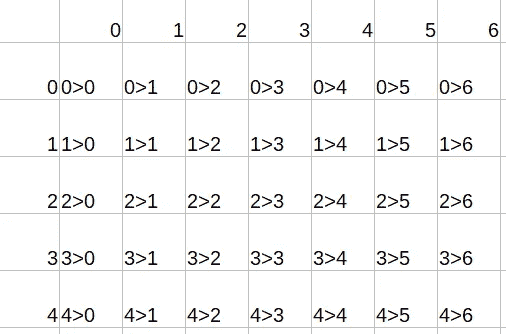
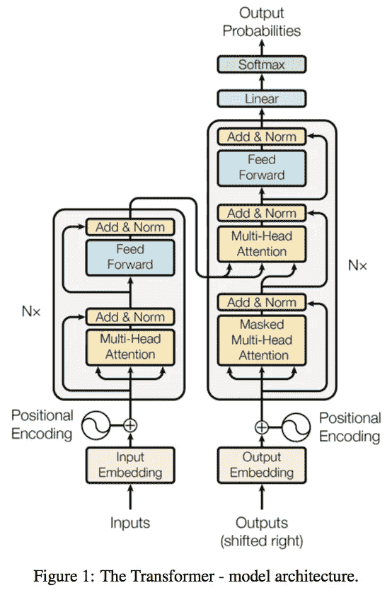
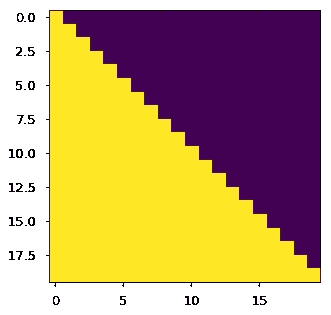

# 了解新 GPT 协议源代码第 4 部分

> 原文：<https://medium.com/analytics-vidhya/understanding-the-gpt-2-source-code-part-4-a5fbb89e5038?source=collection_archive---------0----------------------->


嗨！你可以分别在这里阅读第一部、第二部、第三部[，在这里](/@isamu.website/understanding-the-gpt-2-source-code-part-1-4481328ee10b)阅读[，在这里](/@isamu.website/understanding-the-gpt-2-source-code-part-2-4a980c36c68b)阅读[。在这里，我试着说完 model.py！我是新来的，所以如果有什么不清楚的地方，请告诉我！我将感谢反馈](/@isamu.website/understanding-the-gpt-2-source-code-part-3-9796a5a5cc7c)

# 变形金刚(电影名)

在再次深入代码之前，我们必须先了解什么是变压器。不幸的是，它们不是变成汽车的机器人，但我认为它们同样令人兴奋！从根本上说，它们是一种对输入进行编码，然后输出输出的方法！我觉得下图描述的很好！


图片感谢 [Arden Dertat](https://towardsdatascience.com/@ardendertat) 在这里写了一篇关于自动编码器[的精彩文章](https://towardsdatascience.com/applied-deep-learning-part-3-autoencoders-1c083af4d798)

但是，有一点要注意，这是自动编码器，而不是转换器。

虽然自动编码器使用传统的卷积神经网络，但处理文本数据的 Transformers 倾向于使用 LSTMs，因此略有不同！

# 什么是 LSTMs？

LSTMs 代表长期短期记忆网络。我不会深入研究它，因为我认为许多其他文章在解释 LSTMs 方面做得很好。不过，我还是要深入探讨一下，因为我觉得这有点意思。

LSTM 的每个区块接收两个输入。序列中前一个块和下一个字的信息。给定这两条信息，LSTMs 计算一个输出和要传递给下一个单元的信息。我们使用 LSTMs 的原因是它们非常擅长记忆之前的信息和文本。

现在，在变形金刚中，通常的做法是将整个文本传递到一个 LSTM 网络中，这个网络就是前面提到的模块的网络。

# 回到变形金刚

现在，我们进退两难！如果我们简单地采用 lstm 的输出，并说这将是 GPT-2 的输出，这将是非常令人难过的，因为 lstm 的输出，就其性质而言，必须具有与输入相同或相似的长度，这是一个相当受限制的条件。此外，第一 LSTM 块的输出将只有第一个字来判断输出。因此，总的来说，这是一个坏主意。

解决这个问题的方法是变压器。还记得沿着块传递的数据吗？为什么我们不把文本放入 LSTM 网络，得到从最后一个 LSTM 街区传来的最后一条信息呢？然后，我们可以有一定把握地说，整个文本被编码到最后一个块输出的单个信息中(让我们称之为最后一个状态)。这就是所谓的编码网络。

然后，转换器获取该信息，并将其传递给解码器网络。解码器，因为它从最后一个状态知道输入文本是什么，将开始输出标记。如果我们将这些令牌反馈给网络，它将继续输出令牌。我们可以通过在输出结束令牌时简单地停止来结束这些输出。

# 一个小问题

虽然这听起来很不错，但它有一个根本问题，那就是它不工作！原因是最后一条信息，最后一个状态，事实上没能记住大部分文本。LSTMs 原来是相当健忘的。因此，谷歌在论文[“注意力是你所需要的一切”](https://arxiv.org/abs/1706.03762)中提出了一个解决方案。

解决方案是简单地将所有这些状态、沿着块传递的信息加在一起，同时对每个状态应用一个权重，并将其保存为上下文向量。这样，整个文本的信息可以被总结成一个向量，但没有健忘的倾向。权重从最后一个状态开始计算。然后，它被传递下去。

事实上，在论文中，OpenAI 实际上取消了 LSTMs，只是直接使用编码的单词，并将它们用作状态！

这是当前变压器的方法，我们将在实际代码中看到。

# 回到代码

```
presents = []
pasts = tf.unstack(past, axis=1) if past is not None else [None] * hparams.n_layer
```

代码中的下一行如下。tf.unstack 意味着张量沿着那个维度被分成一个列表。举个例子，

```
a = tf.placeholder("float", [1,2,3])
```

然后做什么

```
tf.unstack(a, axis=1)
```

将输出

```
[tf.placeholder("float",[1,3]), tf.placeholder("float",[1,3])]
```

接下来，我们看到如果过去不存在，过去就变成了

```
[None] * hparams.n_layer
```

因此，我们可以得出结论，过去的第二维度的大小为 hparams.n_layers。

# LSTM 网络中的层是什么？(不需要)

还记得不久前我说过 LSTMs 可以向下一个单元发出输出和信息吗？虽然这是事实，但您可能会怀疑 1 层 LSTM 是否足以产生足够复杂的输出。比方说，当我们观察常规神经网络时，我们倾向于在复杂的过程中使用多达 10 到 12 层。LSTMs 中的层也是这样工作的。LSTM 的下一层输入不是令牌，而是到下一个块的 LSTM 块的输出，然后获得输出本身并将其发送到下一层，依此类推。

# 对于注意力网络？

对于注意力网络来说，

从 model.py 中的代码来看

```
assert len(pasts) == hparams.n_layer
for layer, past in enumerate(pasts):
            h, present = block(h, 'h%d' % layer, past=past, hparams=hparams)
            presents.append(present)
        results['present'] = tf.stack(presents, axis=1)
```

它似乎显示了网络的并行处理！

下一个代码是

```
for layer, past in enumerate(pasts):
    h, present = block(h, 'h%d' % layer, past=past, hparams=hparams)
    presents.append(present)
results['present'] = tf.stack(presents, axis=1)
h = norm(h, 'ln_f')
```

这个街区似乎是大部分工作进行的地方。

在这里，让我们检查维度。h 有一个维度[批次，序列，嵌入大小]，pasts 有维度[不确定，n 层，过去长度]

# 街区

现在，让我们研究一下方块函数。

```
def block(x, scope, *, past, hparams):
    with tf.variable_scope(scope):
        nx = x.shape[-1].value
        a, present = attn(norm(x, 'ln_1'), 'attn', nx, past=past, hparams=hparams)
        x = x + a
        m = mlp(norm(x, 'ln_2'), 'mlp', nx*4, hparams=hparams)
        x = x + m
        return x, present
```

这里，在第一行中，一个名为 nx 的变量获取嵌入长度，然后将 x 和其他参数传递给一个名为 attn 的函数，这个函数很可能代表我们前面讨论过的注意！

# 正常化

首先，让我们看看 norm，它用于在传递数据之前对数据进行规范化。

```
def norm(x, scope, *, axis=-1, epsilon=1e-5):
    """Normalize to mean = 0, std = 1, then do a diagonal affine transform."""
    with tf.variable_scope(scope):
        n_state = x.shape[-1].value
        g = tf.get_variable('g', [n_state], initializer=tf.constant_initializer(1))
        b = tf.get_variable('b', [n_state], initializer=tf.constant_initializer(0))
        u = tf.reduce_mean(x, axis=axis, keepdims=True)
        s = tf.reduce_mean(tf.square(x-u), axis=axis, keepdims=True)
        x = (x - u) * tf.rsqrt(s + epsilon)
        x = x*g + b
        return x
```

在我们直接研究代码之前，我想我应该澄清一下规范化意味着什么。它是使数据的平均值为 0，标准差为 1 的过程。通常的做法是用平均值扣除，然后除以标准差。

许多机器学习算法都是这样做的，因为这往往会导致性能的提高！我不完全确定为什么会这样，但事情就是这样！

然而，当我们看到它在这个源代码中被规范化的方式时，非常有趣地看到，这里发生的不是任何简单的规范化。最初的部分，

```
u = tf.reduce_mean(x, axis=axis, keepdims=True)
s = tf.reduce_mean(tf.square(x-u), axis=axis, keepdims=True)
x = (x - u) * tf.rsqrt(s + epsilon)
```

挺标准的。u 是平均值，s 是由 tf.reduce_mean 计算的方差，它取第一个参数中所有值的平均值。

keepdims 仅仅表示等级被保留。所以，基本上，如果它是一个二维数组，不是一个数字给出所有的平均值，而是两个数字给出两个轴的平均值。至少，这是我从阅读[文档](https://www.tensorflow.org/api_docs/python/tf/math/reduce_mean)中得到的理解！

x 通过减去平均值并乘以 1/sqrt(标准偏差)进行归一化，1/sqrt 由 tf.rsqrt 给出。ε用于避免 s 为 0 且 tf.rsqrt 变为无穷大的情况。

到目前为止，这是非常标准的，但是，当我们看到

```
g = tf.get_variable('g', [n_state], initializer=tf.constant_initializer(1))
b = tf.get_variable('b', [n_state], initializer=tf.constant_initializer(0))
```

它们用来稍微改变 x oh 的值

```
x = x*g + b
```

这些值 g 和 b 可以被训练，因为它们是变量。因此，OpenAI 在这里有效地做的是在训练开始之前操纵 x，即数据，以便它被缩放，并在训练时对算法产生影响，我认为这非常有趣。它还允许数据保持不变，因为它是这样初始化的。

现在，让我们来看看大规模 attn 功能！

# 注意力

```
def attn(x, scope, n_state, *, past, hparams):
    assert x.shape.ndims == 3  # Should be [batch, sequence, features]
    assert n_state % hparams.n_head == 0
    if past is not None:
        assert past.shape.ndims == 5  # Should be [batch, 2, heads, sequence, features], where 2 is [k, v] def split_heads(x):
        # From [batch, sequence, features] to [batch, heads, sequence, features]
        return tf.transpose(split_states(x, hparams.n_head), [0, 2, 1, 3]) def merge_heads(x):
        # Reverse of split_heads
        return merge_states(tf.transpose(x, [0, 2, 1, 3])) def mask_attn_weights(w):
        # w has shape [batch, heads, dst_sequence, src_sequence], where information flows from src to dst.
        _, _, nd, ns = shape_list(w)
        b = attention_mask(nd, ns, dtype=w.dtype)
        b = tf.reshape(b, [1, 1, nd, ns])
        w = w*b - tf.cast(1e10, w.dtype)*(1-b)
        return w def multihead_attn(q, k, v):
        # q, k, v have shape [batch, heads, sequence, features]
        w = tf.matmul(q, k, transpose_b=True)
        w = w * tf.rsqrt(tf.cast(v.shape[-1].value, w.dtype)) w = mask_attn_weights(w)
        w = softmax(w)
        a = tf.matmul(w, v)
        return a with tf.variable_scope(scope):
        c = conv1d(x, 'c_attn', n_state*3)
        q, k, v = map(split_heads, tf.split(c, 3, axis=2))
        present = tf.stack([k, v], axis=1)
        if past is not None:
            pk, pv = tf.unstack(past, axis=1)
            k = tf.concat([pk, k], axis=-2)
            v = tf.concat([pv, v], axis=-2)
        a = multihead_attn(q, k, v)
        a = merge_heads(a)
        a = conv1d(a, 'c_proj', n_state)
        return a, present
```

我知道这看起来很吓人。事实上，我自己看着这一堆代码也挺害怕的。但是我会试着把它分成小块，这样我们两个都能明白！

首先，我们必须在顶部突出一些我们可以从代码中学到的要点！我们首先可以注意到，我们对 x 形状的预测是正确的！如给定的，是【批次，顺序，特征】。然而，对于过去的变量，维度比预期的要复杂得多。其实最后是【批次，2，头，顺序，特征】！

为了理解这两个单词的来源以及它们的含义，让我们回到理论上来。

# LSTMs 的隐藏状态(不需要)

正如我之前提到的，LSTMs 输出两件事。一个是输出，另一个是传递给下一个 LSTM 块的信息。然而，有一件事我没有提到，那就是输入和输出的维度。

## 投入

*   LSTM 的输入:[批量大小，序列长度，嵌入大小]

## 输出

*   LSTM 的输出:[批量大小，序列长度，嵌入大小]
*   传递到下一个 lstm 块的隐藏状态/信息:

[批量大小，2，序列长度，嵌入大小]

现在，你可能想知道隐藏状态中的 2 是从哪里来的。实际上，当我们只看它时，隐藏状态的维数与 LSTM 的输出[batch_size，sequence_length，embed_size]相同。然而，由于我们也希望传递输出，我们将输出添加到最终隐藏状态的底部，从而形成新的隐藏状态，其维度为[batch_size，2，sequence_length，embed_size]。

但是，这仍然与[批次，2，头，序列，特征]不一样。问题是这些“头”是从哪里来的。这就是我们需要检查注意力的地方！

# 什么是头？

我可能是错的，但对于官方的解释，看看这篇[论文](https://arxiv.org/pdf/1706.03762.pdf)。

基本上，还记得我说过注意通过对隐藏状态施加权重并相加来提高表现吗？事实证明这可能还不够！网络仍然很难仅仅从加权求和来理解正在发生的事情。

诀窍是引入头像。每个头部是隐藏状态的加权总和，但是具有不同的权重。所以，从本质上来说，每个头看不同种类的隐藏状态。然后，这些被加在一起成为一个单一的上下文向量发送到解码器！这叫多头注意力。

因此，我们可以说，过去的变量持有这些头！

# 返回代码

```
with tf.variable_scope(scope):
        c = conv1d(x, 'c_attn', n_state*3)
        q, k, v = map(split_heads, tf.split(c, 3, axis=2))
        present = tf.stack([k, v], axis=1)
        if past is not None:
            pk, pv = tf.unstack(past, axis=1)
            k = tf.concat([pk, k], axis=-2)
            v = tf.concat([pv, v], axis=-2)
        a = multihead_attn(q, k, v)
        a = merge_heads(a)
        a = conv1d(a, 'c_proj', n_state)
        return a, present
```

跳过所有的函数后，我们得到实际执行的代码。如果你还记得的话，n_state 就是嵌入大小。变量作用域中调用的第一个函数称为 conv1d。

Conv1d 很可能代表一维卷积。

# 什么是一维卷积？



非常感谢 [阿莫·乌姆巴卡](https://www.youtube.com/channel/UC_vCQ-aJ2yoyMPAc-JFpS1A)的图片和他的 youtube 教程[这里](https://www.youtube.com/watch?v=ulKbLD6BRJA)

卷积是指有一个分配了权重的窗口，将其下方的元素乘以上方的权重，并产生一个数字(添加偏差后)。这个数字然后被发送到输出矩阵。然后，窗口移动它的位置，做同样的事情，并把它的输出发送到输出数组中被移动的位置！

如上图所示，当窗口为一维时，可以进行一维卷积！

现在，让我们看看代码。

```
def conv1d(x, scope, nf, *, w_init_stdev=0.02):
    with tf.variable_scope(scope):
        *start, nx = shape_list(x)
        w = tf.get_variable('w', [1, nx, nf], initializer=tf.random_normal_initializer(stddev=w_init_stdev))
        b = tf.get_variable('b', [nf], initializer=tf.constant_initializer(0))
        c = tf.reshape(tf.matmul(tf.reshape(x, [-1, nx]), tf.reshape(w, [-1, nf]))+b, start+[nf])
        return c
```

这里的 x 有维度[batch_size，sequence_size，embed_size]。因此，当调用 shape_list()时，

start 被分配给[batch_size，sequence _ size ], NX 是 embed_size。这是通过在初始化它的时候在 start 前面加上*这个聪明的技巧来实现的，但是除非你知道指针之类的东西，否则我不认为这有什么意思。如果你感兴趣，请查看指针，了解它为什么有趣！

w 代表权重，用形状[1，nx，nf]和 b 初始化，b 是偏差，设置为大小 nf。如果我们回忆一下，nf 是 3*embed_size。我不确定为什么是 3*embed_size，但是我很确定我们以后会发现的！

最后，输出 c 为:

```
c = tf.reshape(tf.matmul(tf.reshape(x, [-1, nx]), tf.reshape(w, [-1, nf]))+b, start+[nf])
```

这对我来说很有趣，因为我不知道卷积可以通过简单的矩阵乘法和增加一个偏差来完成！我想，正如我解释的，我需要一个窗口，让它在矩阵中滑动。事实上，现在我看这个卷积，我注意到我可能在不知道的情况下做了相当多的卷积！

对于卷积，我通常使用 Tensorflow 的 API，如 tf.nn.conv2d 和 tf.nn.conv1d，因此我不太了解它的内部工作原理。事实上，我很好奇为什么 OpenAI 避免了这些预定义的功能，就像瘟疫一样，但是因为它很有教育意义，所以我没意见！

反正现在的情况是 x 被重塑为[batch_size*sequence_size，embed_size]，权重被重塑为[embed_size(nx)，nf]。我不太确定为什么它一开始没有那个形状，但是不管怎样，让我们继续！然后将它们相乘得到[batch_size*sequence_size，nf]并加上大小偏差[nf]。最后，它被整形回[batch_size，sequence_size，nf]。

当我在网上简单查看时，我找不到一个数学证明来解释为什么会这样，但是我想一旦我找到并编辑这篇文章来收录它，我就会证明这一点！然而，现在，我只是想知道。

## q，k 和 v

```
q, k, v = map(split_heads, tf.split(c, 3, axis=2))
```

在这之后，c 被分成 3 部分，这解释了为什么 nf 沿着 nf 轴乘以 3。这产生了 3 个大小为[batch_size，sequence_size，embed_size]的张量，然后它们被映射到 split_heads 函数。让我们看看分裂头做了什么。

## 分头 _ 头

```
def split_heads(x):
        # From [batch, sequence, features] to [batch, heads, sequence, features]
        return tf.transpose(split_states(x, hparams.n_head), [0, 2, 1, 3])
```

什么是分裂状态？让我们来了解一下！

```
def split_states(x, n):
    """Reshape the last dimension of x into [n, x.shape[-1]/n]."""
    *start, m = shape_list(x)
    return tf.reshape(x, start + [n, m//n])
```

因此，基本上发生的事情是将[batch_size，sequence_size，embed_size]的传入形状转换为[batch_size，sequence_size，heads，embed_size/heads]。

显然，正在发生的是张量 x 变得适合用于头部！然而，当我们看裂头时，不仅如此，它还被调换了位置！

## 置换



图片感谢[梦幻国度](http://dreamsnmotion.com/word-of-the-day/2015/9/13/transpose)

正如你在图中看到的，转置基本上是一个过程，其中每个索引以这样的方式反转，即索引(I，j)处的元素转到索引(j，I)处！

然而，当我们从另一个角度看这个问题时，轴被翻转了。x 轴和 y 轴是翻转的！这也是 tf.transpose 做的事情。

从评论中我们可以看到，

```
def split_heads(x):
        # From [batch, sequence, features] to [batch, heads, sequence, features]
        return tf.transpose(split_states(x, hparams.n_head), [0, 2, 1, 3])
```

[batch_size，sequence_size，heads，embed_size]是由于 tf.transpose 的第二个参数，转换为[batch_size，heads，sequence_size，embed_size]。

现在，在下一行中，虽然我不确定它为什么被称为 present，但 3 个输出 q、k 和 v 中的两个被堆叠为

```
present = tf.stack([k, v], axis=1)
```

这里的堆叠意味着引入了一个新的维度。因此，呈现具有维度[批量大小，2，头，序列大小，嵌入大小]

接下来，

```
if past is not None:
            pk, pv = tf.unstack(past, axis=1)
            k = tf.concat([pk, k], axis=-2)
            v = tf.concat([pv, v], axis=-2)
```

因为 past 也有维度[batch_size，2，heads，sequence_size，embed_size],所以当它被拆分时，它将具有与 k、v 和 q 相似的维度，即[batch_size，heads，past_sequence_size，embed_size]

当沿着 axis -2 使用 tf.concat 将它与 k 和 v 连接起来时，本质上发生的是 sequence_size 变得更长！因此，正如在第 3 部分中提到的，由于过去的序列长度是过去的长度(到目前为止输出令牌的数量)，当连接时，k 和 v 将具有维度[batch_size，heads，past _ sequence _ size+sequence _ size，embed_size]。

这让我有点困惑，因为我不太确定给出 sequence_size 的 X 是从哪里产生的，但坦白地说，因为我们还没有涉及它，所以我还不知道是有道理的！所以，如果任何人和我一样有点困惑，请继续读下去，因为我很肯定我们以后可以解决这个困惑！

接下来，

```
a = multihead_attn(q, k, v)
```

最后，一些注意力进来了。

```
def multihead_attn(q, k, v):
        # q, k, v have shape [batch, heads, sequence, features]
        w = tf.matmul(q, k, transpose_b=True)
        w = w * tf.rsqrt(tf.cast(v.shape[-1].value, w.dtype)) w = mask_attn_weights(w)
        w = softmax(w)
        a = tf.matmul(w, v)
        return a
```

现在，我想到的第一个令人困惑的行是 tf.matmul，它带有参数 transpose_b= True。我发现这很令人困惑，因为对于一个四维矩阵，当你转置它时，我认为维度的改变是转置所必需的。于是，我上网查了一下，到了[这个栈溢出页面](https://stackoverflow.com/questions/48100954/why-does-tf-matmula-b-transpose-b-true-work-but-not-tf-matmula-tf-transpos)。如果我理解正确的话，基本上正在发生的是，前两个维度被成批处理。

所以，它们保持不变。但是对于 q 和 k 的最后两个维度，虽然 q 对于每个批次都具有维度[序列，特征]，但是 k 对其进行了转置，因此它变成了[特征，序列]，并且由于 q 没有得到添加的过去长度，而 k 得到了，所以 w 的维度应该是[batch_size，heads，sequence_length，past _ sequence _ length+sequence _ length]。

在下一行，

```
w = w * tf.rsqrt(tf.cast(v.shape[-1].value, w.dtype))
```

因此，基本上，w 除以 embed_size 的平方根，当我查看[论文](https://arxiv.org/pdf/1706.03762.pdf)时，它被解释为“比例因子”，我认为这是有意义的。

我知道上面很多关于 q，k 和 v 的内容没有太多的直观意义，至少对我来说没有，但很明显我们正在接近论文中的等式，也就是



来自《注意力是你所需要的全部》一文的等式

# 试图理解这个等式

我知道这个等式不是最终结果，但因为我认为它足够接近，所以我会在继续之前尝试理解它。

目前我们从代码中知道的是

*   q、k 和 v 将一维卷积应用于输入，h 的维数为[batch_size，sequence_length，embed_size]，它是应用了一些噪声的令牌，并以维数[batch_size，heads，sequence_length，embed_size]结束
*   k 和 v 很可能将过去的 ks 和 vs 连接在一起，从而产生一个更长的序列，即[batch_size，heads，sequence _ length+past _ sequence _ length，embed_size]
*   w，代表 softmax 函数中的表达式，维度为[batch_size，heads，sequence_length，sequence _ length+past _ sequence _ length]

而且现在我觉得我从概念上理解了！

让我们先来了解一下 softmax 是什么！然后，我来解释一下上面的公式是干什么的！

# Softmax

Softmax 是当人们想要进行概率分布时使用的函数。什么是概率密度函数，矩阵中所有元素的和是 1，在 0 和 1 之间。例如，当我们将 softmax 函数应用于[1，1，1，1]时，我们得到[0.25，0.25，0.25，0.25]。

这很简单，用 e 的每个元素的幂除以 e 的每个元素的幂之和。如下图所示



感谢詹姆斯·d·麦卡弗里从[这里](https://jamesmccaffrey.wordpress.com/2016/03/04/the-max-trick-when-computing-softmax/)拍摄的图片

因此，没有维度或类似的变化。它只是放大了数字。虽然用这些值的和来除可能很诱人，但是使用 softmax 函数的一些优点如下！

*   它也可以处理负元素，所有的元素都在 0 和 1 之间。
*   像[这个](https://stackoverflow.com/questions/17187507/why-use-softmax-as-opposed-to-standard-normalization)栈溢出答案里提到的那样更容易训练！

现在，让我们回到解释上来。

# 这个等式是做什么的？


纸上的方程式

一旦我们知道 softmax 部分输出概率分布，我们现在可以从概念上看到 Q、K 和 softmax 都用于将权重应用于所有隐藏层的稍微变换版本:v。因此，这给出了我们想要的注意！现在，让我们回到代码上来！

# 面具

应用比例因子(嵌入大小的平方根)后，代码中的下一行是

```
w = mask_attn_weights(w)
```

我不记得在报纸上见过这个，但是让我们看看它是什么！

```
def mask_attn_weights(w):
        # w has shape [batch, heads, dst_sequence, src_sequence], where information flows from src to dst.
        _, _, nd, ns = shape_list(w)
        b = attention_mask(nd, ns, dtype=w.dtype)
        b = tf.reshape(b, [1, 1, nd, ns])
        w = w*b - tf.cast(1e10, w.dtype)*(1-b)
        return w
```

我们看到，sequence_length 在这里称为 dst_sequence，sequence _ length+past _ sequence _ length 称为 src_sequence。虽然我不是特别确定这些是什么意思，但是因为它们比较短，我想我会采用这个惯例。

nd 被分配给 dst_sequence，ns 被分配给 src_sequence。现在让我们看看接下来要调用的 attention_mask 函数！

```
def attention_mask(nd, ns, *, dtype):
    """1's in the lower triangle, counting from the lower right corner.Same as tf.matrix_band_part(tf.ones([nd, ns]), -1, ns-nd), but doesn't produce garbage on TPUs.
    """
    i = tf.range(nd)[:,None]
    j = tf.range(ns)
    m = i >= j - ns + nd
    return tf.cast(m, dtype)
```

首先，由于我从评论中不明白这个函数是做什么的，所以让我们来看看！

I 被分配给 tf.range(nd)，它是从 0 到 nd-1 的值，带有另一个轴。[:，None]给出了另一个轴，所以 I 的维数是[nd，1]

j 被分配给 tf.range(ns)。nd 是目的序列，而 ns 是 src 序列长度。

现在，一条有趣的线出现了。

```
m = i >= j - ns + nd
```

因为我不明白这里发生了什么，所以我决定用 numpy 来测试一下！

```
a = np.arange(5)
b = np.arange(7)
```

那么，如果我做了

```
a > b
```

因为 a 和 b 的形状不同，所以出现了一个错误。然而，当我们这样做的时候

```
a = np.arange(5)[:,None]
b = np.arange(7)
```

然后，

```
array([[False, False, False, False, False, False, False],
       [ True, False, False, False, False, False, False],
       [ True,  True, False, False, False, False, False],
       [ True,  True,  True, False, False, False, False],
       [ True,  True,  True,  True, False, False, False]])
```

被输出。当你把它看成一个表格时，这就变得很容易理解了！如果我们想象 b 的数字从 0 到 6 从左到右穿过各列，如果我们想象 a 的数字从 0 到 4，看看比较结果如何，它给出相同的结果！下面的图片我认为将有助于说明这一点！



因此，如果我们看一看

```
m = i >= j - ns + nd
```

由于 j -ns+nd 首先发生，j 将一直保持 nd-ns 到 nd 的值。m 将返回一个维数为[nd，ns]的掩码，其布尔值如上。

然而，当它被返回时，它被转换为

```
return tf.cast(m, dtype)
```

因此，类型必须已经更改，并且它应该保存值 0 或 1。现在这些评论有些道理了。基本上，这个函数返回了一个矩阵，其中左下角的三角形部分都是 1！OpenAI 解释了他们这样做的原因，简单地说，就是为了提高性能。

现在，一旦归还，接下来会发生什么？

```
b = tf.reshape(b, [1, 1, nd, ns])
w = w*b - tf.cast(1e10, w.dtype)*(1-b)
```

w 目前的维度为[batch_size，heads，dst_length，src_length]。然后，通过在开始处增加维度来重塑 b。然后，它们被繁殖，我发现这很有趣。*给出的这个乘法不是 tf.Matmul，实际上是 tf.multiply 执行元素级乘法。

这是什么意思？

实质上，w 的上半部分，由于 w*b 变成了 0。之后，所有的信息都会消失！— tf.cast(1e10，w.dtype)*(1-b)允许它不为 0(可能是由于某些错误)但是看到这样的决定很有趣！

本博客精彩解释的基本论点是，如果我们看一下模型架构(这是你所需要的全部注意力的架构，不是 GPT-2)，



感谢这个[神奇的博客](http://mlexplained.com/2017/12/29/attention-is-all-you-need-explained/)

解码器的输出，如果没有屏蔽，可以访问输出中的未来文本。

然而，Isamu，你可能会说，我们不再训练了，我们无法访问未来的文本，所以这个面具只会导致我们丢失数据！但是，幸运的是，情况并非如此。我回过头来看看 step 函数到底把什么作为标记，导致模型函数被调用。那就是下面的

```
context_output = step(hparams, context[:, :-1])
```

上下文[:，:-1]表示令牌。现在，如果我们回到面具的状态，

```
m = i >= j - ns + nd
```

(j 的大小为 ns，I 的大小为 nd)并回想 ns 和 nd 是什么(ns =令牌的过去序列长度+序列长度，nd 只是令牌的序列长度)

我们可以重新审视面具会是什么！让我们首先将 sequence_length 限制为 0，这是 generate _ unconditional _ samples . py 的情况。

```
m = i ≥ j-past_sequence_length
```

这将是一个一维数组，大小为 past_sequence_length，所有元素都为真！没有信息丢失！太棒了。

至于为什么面膜会起作用，我认为这个[博客帖子](http://nlp.seas.harvard.edu/2018/04/03/attention.html)解释得很好(图片也来自那里)

> *注意屏蔽下方显示了每个 tgt 单词(行)允许查看的位置(列)。单词被屏蔽是为了在训练中注意将来的单词。*



图片感谢[来源](http://nlp.seas.harvard.edu/2018/04/03/attention.html)

我想我可以直观地理解，我不会声称我可以从数学上证明没有信息泄漏，但一旦我做到了，我一定会返回并编辑这篇文章并更新它！

对于 interactive _ conditional _ samples . py，坦率地说，我还不太确定，但我想我现在直观地理解了这个掩码！

# 返回代码

接下来，像这样应用 softmax 函数，

```
w = softmax(w)
```

当我们研究 softmax 代码时，

```
def softmax(x, axis=-1):
    x = x - tf.reduce_max(x, axis=axis, keepdims=True)
    ex = tf.exp(x)
    return ex / tf.reduce_sum(ex, axis=axis, keepdims=True)
```

对传统 softmax 的一个有趣的改变是减去了最大值。我不能解释为什么，但我认为这很有趣，我也会尝试一下。我认为情况可能是这样的，softmax 首先要求值很小/为负，并且很接近才能给出好的结果。这可以解释为什么 w 除以一个比例因子，为什么最大值被扣除，每个数字都是负数。可能目的是将分子缩放到 1 和 0 之间，但不管怎样，让我们继续！

最后，w 乘以 v，给出注意

```
a = tf.matmul(w, v)
return a
```

w 具有维度[批次大小、头数、dst 序列、src 序列]

并且 v 具有维度[批处理大小，头，src 序列，嵌入大小]

因此，当成倍增加时，它们给予了具有维度的关注

[批量大小，头数，dst 序列，嵌入大小]

接下来，在注意时，发生了以下操作！

```
a = merge_heads(a)
```

merge_heads 由下式给出

```
def merge_heads(x):
        # Reverse of split_heads
        return merge_states(tf.transpose(x, [0, 2, 1, 3]))
```

因此，它将 a 的维度转换为[batch_size，dst_sequence，heads，embed_size]

merge_states 由下式给出

```
def merge_states(x):
    """Smash the last two dimensions of x into a single dimension."""
    *start, a, b = shape_list(x)
    return tf.reshape(x, start + [a*b])
```

因此，a 被整形为[batch_size，dst_sequence，heads*embed_size]

然后，最后，

```
a = conv1d(a, 'c_proj', n_state)
```

发生在。由于 n_state 是 embed_size，注意力很好地转换为

[批量大小，dst 序列，嵌入大小]

头部和重量很好地结合在一起！

现在，我们终于结束了关注。我们现在可以回到块函数了！

下一行是，

```
x = x + a
```

简单回顾一下，

```
a, present = attn(norm(x, 'ln_1'), 'attn', nx, past=past, hparams=hparams)
```

是我们得到 a 的代码。本质上，输入被加回输出。

这被称为剩余网络。虽然我个人对它们没有太多的经验，但它们所做的是将输入添加回输出，以便不丢失信息，并且它们非常令人惊讶地非常有效！

接下来，

```
m = mlp(norm(x, 'ln_2'), 'mlp', nx*4, hparams=hparams)
x = x + m
```

赋范的 x 沿着 mlp 模型/函数传递，然后输出和 x 像以前一样加在一起！

现在，让我们来看看 mlp 函数！

```
def mlp(x, scope, n_state, *, hparams):
    with tf.variable_scope(scope):
        nx = x.shape[-1].value
        h = gelu(conv1d(x, 'c_fc', n_state))
        h2 = conv1d(h, 'c_proj', nx)
        return h2
```

mlp 函数通过 n_state 应用一维卷积后，将输入 x 传递给名为 gelu 的函数。n_state 的参数是 4*nx，其中 nx 是嵌入大小。因此，函数 gelu 的输入维数为[batch_size，dst_length，embed_size*4]

那么，gelu 函数内部是什么呢？

```
def gelu(x):
    return 0.5*x*(1+tf.tanh(np.sqrt(2/np.pi)*(x+0.044715*tf.pow(x, 3))))
```

GELU 函数属于激活函数家族。激活函数所做的是将每个输入映射到-1 和 1 或者 0 和 1 之间的某个位置。这导致神经网络更清楚地理解输出值。举个例子，当神经网络遇到 100 或-100 这样的值时，它们的性能并不高。如果你对为什么专门选择 GELU 感兴趣，我推荐阅读这篇[论文](https://arxiv.org/pdf/1606.08415.pdf)。因为这是一个相当数学化的问题，我认为这个帖子现在不应该写那么久！如果你感兴趣，请告诉我，我会尽力解释。

我不确定为什么大小被改为 4*encode_size，但是在 mlp 函数中，gelu 完成后，

```
h2 = conv1d(h, 'c_proj', nx)
return h2
```

于是，大小最终又变成了[batch_size，dst_size，encode_size]了！

然后，在添加到输入之后，函数输出

```
x = x + m
return x, present
```

最后。现在的部分来自下面的 attn 函数！

```
c = conv1d(x, 'c_attn', n_state*3)
q, k, v = map(split_heads, tf.split(c, 3, axis=2))
present = tf.stack([k, v], axis=1)
```

既然我已经讨论了 model.py 中的大部分理论，我想我现在就停下来。在下一篇文章中，我将尝试完成这个系列

# 然后

如果你对最终到达这个传奇的结尾感兴趣，看看[这个](/@isamu.website/understanding-the-gpt-2-source-code-part-5-87bbe21dd749)！