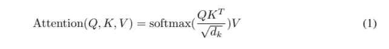

# 了解新 GPT 协议源代码第 5 部分

> 原文：<https://medium.com/analytics-vidhya/understanding-the-gpt-2-source-code-part-5-87bbe21dd749?source=collection_archive---------9----------------------->


嗨！抱歉更新晚了大概半年。我全神贯注于另一个项目，我想我会很快分享。但是不管怎样，我将结束这个系列。你可以分别在这里、[这里](/@isamu.website/understanding-the-gpt-2-source-code-part-2-4a980c36c68b)、[这里](/@isamu.website/understanding-the-gpt-2-source-code-part-3-9796a5a5cc7c)和[这里](/@isamu.website/understanding-the-gpt-2-source-code-part-4-a5fbb89e5038)阅读第一部、第二部、第三部和第四部[。很抱歉与第 4 部分有这么长的时间间隔！在这里，我将尝试结束谈论这一切是如何走到一起的。我是新来的，所以如果有什么不清楚的地方，请告诉我！我将感激反馈。](/@isamu.website/understanding-the-gpt-2-source-code-part-1-4481328ee10b)

# 正在打包 model.py

到上一篇文章为止，除了最后一部分，我讨论了 model.py 的大部分内容

```
for layer, past in enumerate(pasts):#loop over each past
        h, present = block(h, 'h%d' % layer, past=past, hparams=hparams)
        presents.append(present)
results['present'] = tf.stack(presents, axis=1)
h = norm(h, 'ln_f')# Language model loss.  Do tokens <n predict token n?
#roughly 1/12th of original size
h_flat = tf.reshape(h, [batch*sequence, hparams.n_embd])
logits = tf.matmul(h_flat, wte, transpose_b=True)
logits = tf.reshape(logits, [batch, sequence, hparams.n_vocab])
results['logits'] = logits
return results
```

如果我们回顾一下，我们知道第二行中的块函数输出两个名为 h 和 present 的张量。这些是什么？如果我们回头看看以前的文章，或者更好的是直接看源代码，h 的定义如下

```
h = tf.gather(wte, X) + tf.gather(wpe, positions_for(X, past_length))
```

这里，由于 X 是输入(表示 wte(单词矩阵)中每个字母的索引的数字序列)，它获得句子中的单词向量并将它们排列起来。然后，对它进行 wpe(位置编码),它在 past_length 之后的文本中的每个位置都有一个签名。所以，基本上它说当前输入对应于位置 past_length 到 past _ length+x 的序列长度，因此，基本上，h 是输入。

在完成块功能后，

```
for layer, past in enumerate(pasts):#loop over each past
    h, present = block(h, 'h%d' % layer, past=past, hparams=hparams)
    presents.append(present)
```

h 一直在输出。因此，当你遍历循环 h 时，输入会不断被覆盖并输入到下一层。坦白地说，这对我来说是一个有趣的技术，因为，通常，你倾向于制作这样的层

```
with tf.variable_scope("layer1"):
    fc1 = fully_connected(input, output_size1)
with tf.variable_scope("layer2"):
    fc2 = fully_connected(fc1, output_size2)
```

假设伪函数是完全连接的，但是如果使用上面的方法，看起来你可以一遍又一遍地使用同一个变量，这很酷！

我们可以看到类似的事情正在发生

```
for layer, past in enumerate(pasts):#loop over each past
    h, present = block(h, 'h%d' % layer, past=past, hparams=hparams)
    presents.append(present)
```

它们不断被追加到一个叫做礼物的空列表中。我假设这是为了使现在的张量对应于 gpt-2 的每一层，以便它们可以平滑地添加到过去。让我们看看这是否正确！

# 礼物

那么现在的变量发生了什么？我们在前面的章节中看到，在 attn 函数中，present 被设置为

```
c = conv1d(x, 'c_attn', n_state*3)
q, k, v = map(split_heads, tf.split(c, 3, axis=2))
present = tf.stack([k, v], axis=1)
```

其中，x 是归一化输入(h ),正如我们所见，这是通过模块函数实现的

```
def block(x, scope, *, past, hparams):
    with tf.variable_scope(scope):
        nx = x.shape[-1].value
        a, present = attn(norm(x, 'ln_1'), 'attn', nx, past=past, hparams=hparams)
        x = x + a
        m = mlp(norm(x, 'ln_2'), 'mlp', nx*4, hparams=hparams)
        x = x + m
        return x, present
```

因此，我们可以说 present 只是一个应用了 1d 卷积的 h，但是大小是它的两倍。为什么是 k 和 v？如果你读回[第 4 部分](/@isamu.website/understanding-the-gpt-2-source-code-part-4-a5fbb89e5038)，或者在 attn 函数中，我们看到

```
if past is not None:
        pk, pv = tf.unstack(past, axis=1)
        k = tf.concat([pk, k], axis=-2)
        v = tf.concat([pv, v], axis=-2)
        a = multihead_attn(q, k, v)
```

这导致了下面的[论文](https://papers.nips.cc/paper/7181-attention-is-all-you-need.pdf)中的等式



来自[论文](https://papers.nips.cc/paper/7181-attention-is-all-you-need.pdf)的方程式

为了更深入的了解，请去阅读[第四部分](/@isamu.website/understanding-the-gpt-2-source-code-part-4-a5fbb89e5038)或其他官方资源(因为我不能说我已经全面理解了)，但基本上，正在发生的是，K，连同 Q 等等用来创建这个概率分布，我们从中挑选隐藏状态。在这里，V 作为整个文档的隐藏状态。当我们对它们求和时，经过一些运算，我们得到了注意力函数的期望输出:上下文向量！我们如何处理所说的上下文向量，我会在下面写一点。

因此，我们想要的是概率分布和 V 来包含到当前点为止的所有信息。这是怎么做到的？

我们在主体函数的 sample.py 中看到以下代码

```
return [next_outputs['presents'] if past is None else      tf.concat([past, next_outputs['presents']], axis=-2),
                ....)]
```

next_outputs 从何而来？首先，它在身体机能中被定义为

```
next_outputs = step(hparams, prev, past=past)
```

在阶跃函数中，我们看到

```
def step(hparams, tokens, past=None):
        lm_output = model.model(hparams=hparams, X=tokens, past=past, reuse=tf.AUTO_REUSE) logits = lm_output['logits'][:, :, :hparams.n_vocab]
        presents = lm_output['present']
        presents.set_shape(model.past_shape(hparams=hparams, batch_size=batch_size))
        return {
            'logits': logits,
            'presents': presents,
        }
```

我们可以看到，它只是从我们在这里看到的模型函数中获取输出，限制逻辑的范围，将呈现的内容整形为 shape [batch_size，hparams.n_layer，2，hparams.n_head，sequence，hparams . n _ embd//hparams . n _ head]

```
def past_shape(*, hparams, batch_size=None, sequence=None):
    return [batch_size, hparams.n_layer, 2, hparams.n_head, sequence, hparams.n_embd // hparams.n_head]
```

这是因为在它有了形状之后

```
[batch_size, layers, 2, heads, sequence_size, hparams.n_embd]
```

它没有 openAI 人用过的头。然后，礼物被放进字典里

```
return {
            'logits': logits,
            'presents': presents,
        }
```

因此，身体函数的第一个输出是 past，这可以在它的定义后面的行中看到

```
past, prev, output = body(None, context, context)
```

我们看到现在的输出一直与过去的连接在一起。正如我们将看到的，这个过去的变量被传递到一个循环中，直到文本生成结束。

那么上下文向量呢？

# 上下文向量

当我们查看 model.py 的模型函数时，我们看到输出的 h 通过

```
h = norm(h, 'ln_f')# Language model loss.  Do tokens <n predict token n?
        h_flat = tf.reshape(h, [batch*sequence, hparams.n_embd])
        logits = tf.matmul(h_flat, wte, transpose_b=True)
        logits = tf.reshape(logits, [batch, sequence, hparams.n_vocab])
        results['logits'] = logits
        return results
```

这里我们看到，h 经过归一化和整形后，乘以 wte，即单词矩阵，包含所有单词的编码。当 transpose_b 设置为 true 时，即使 wte 有维度[hparams.n_vocab，hparams.n_embd]，它们也可以相乘。当重塑时，这最终给出了具有形状的逻辑

```
[batch, sequence, hparams.n_vocab]
```

最后，通过将它放入模型函数 result 的输出中

```
results['logits'] = logits
```

# 我的猜测(可能真的错了，如果是这样，请指正！)

我怀疑它们被增加的原因，在某种意义上，是为了突出正在使用的单词。这有点类似于点积，但是当你用相同的向量做点积时，当它乘以类似的向量时，它通常有最高的值。因此，在矩阵乘法的过程中，h_flat 中的每一行与转置的 wte 矩阵列(每个字向量)进行点积，并在该字的列放置更高的值，该值指示该字在最终矩阵的一行中使用。

如在 h_flat 矩阵中

```
[batch*sequence, hparams.n_embd]
```

每一行都有一个矩阵与单词向量做矩阵乘法，这使我得出结论，在每一行中，机器的目标是创建这个向量，它非常类似于它认为可能作为下一个单词嵌入的所有可能的单词。

我认为我是正确的，但如果错了，请纠正我！

不管怎样，现在，这个张量会发生什么？

# 身体机能

我们在体函数之前的阶跃函数中看到，输出是受限制的

```
logits = lm_output['logits'][:, :, :hparams.n_vocab]
```

我不确定为什么开放人工智能的人要这样做，因为逻辑的形状在这次操作后应该已经没有变化了，因为逻辑已经有了形状

```
[batch, sequence, hparams.n_vocab]
```

反正没有进一步的改变，就去身体机能了。

```
logits = next_outputs['logits'][:, -1, :]  / tf.to_float(temperature)
logits = top_k_logits(logits, k=top_k)
logits = top_p_logits(logits, p=top_p)
samples = tf.multinomial(logits, num_samples=1, output_dtype=tf.int32)
```

我之前已经简要讨论过这里发生的事情，我发现它非常有趣，所以，如果你想阅读如何从事物的分布方面挑选逻辑，请阅读[第 1 部分](/@isamu.website/understanding-the-gpt-2-source-code-part-1-4481328ee10b)的结尾部分。但是，基本上，这里发生的是，logits 根据选择的温度(高的更随机，低的更不随机)选择下一个具有多项式分布的单词，这也很酷。

现在，什么是 top _ k _ logits 和 top _ p _ logits？

# top_k_logits

top_k_logits 定义如下

```
def top_k_logits(logits, k):
    if k == 0:
        # no truncation
        return logits def _top_k():
        values, _ = tf.nn.top_k(logits, k=k)
        min_values = values[:, -1, tf.newaxis]
        return tf.where(
            logits < min_values,
            tf.ones_like(logits, dtype=logits.dtype) * -1e10,
            logits,
        )
    return tf.cond(
       tf.equal(k, 0),
       lambda: logits,
       lambda: _top_k(),
    )
```

基本上，它所做的是返回 k 个最大值，逻辑中 k 个最有可能的单词。最终的 tf.where 所做的是，对于概率低于最小值(前 k 个 logit 中的最小 logit 值)的 logit，选择的值和概率成为第二个表达式

```
tf.ones_like(logits, dtype=logits.dtype) * -1e10
```

否则，保持不变。我不知道 tf.where 可以这样使用，所以它对我来说很有趣！

# top_p_logits

对于 top _ p _ logits，它被设置为

```
def top_p_logits(logits, p):
    """Nucleus sampling"""
    batch, _ = logits.shape.as_list()
    sorted_logits = tf.sort(logits, direction='DESCENDING', axis=-1)
    cumulative_probs = tf.cumsum(tf.nn.softmax(sorted_logits, axis=-1), axis=-1)
    indices = tf.stack([
        tf.range(0, batch),
        # number of indices to include
        tf.maximum(tf.reduce_sum(tf.cast(cumulative_probs <= p, tf.int32), axis=-1) - 1, 0),
    ], axis=-1)
    min_values = tf.gather_nd(sorted_logits, indices)
    return tf.where(
        logits < min_values,
        tf.ones_like(logits) * -1e10,
        logits,
    )
```

首先，它按降序对数组进行排序，这意味着最大值排在最前面。然后，它开始获取排序后的 logits 的 softmax，因此总和将为 1。然后，它使用 tf.cumsum 返回到该点的累积和。

所以，基本上，如果我的概率分布是[0.5，0.3，0.2]我会在累计后得到[0.5，0.8，1]。

然后，如果累积和小于 p，则设置为 1，否则为 0。因此，如果有不止一种情况为真，则它们的值大于 0。否则，选择 0。

当它与 tf.range 堆叠时，得到的形状是[batch_size，2]，其中第一个索引是数组的索引，第二个是总和。

现在，根据我对代码做的一个小测试，tf.gather_nd 允许我发现它只接受 reduce_sum-1 的索引值。现在我们知道了为什么在减少的总和旁边有一个-1，但是为什么把那个指数作为最小值呢？答案是因为这就是 cumulative_probs <= p becomes false as the values in the indices are always increasing. Thus, at the golden point where the sorted logits up to that point are not enough and past it, it goes too far, we take that logit as the minimum value.

The processes following that is quite similar to top_k where we the OpenAI people just put

```
return tf.where(
        logits < min_values,
        tf.ones_like(logits) * -1e10,
        logits,
    )
```

Now that I think about it, I wonder why there’s an extra comma? If someone knows please tell me!

Overall, what it does is it removes logits with a low chance of being picked but it did it so that the number of options is not fixed like the top_k_logits and if you set p to a number like 0.8, I think it helps weed out bad options that have high priority like 0.15\. I searched the term nucleus sampling and found [这篇](https://arxiv.org/pdf/1904.09751.pdf)关于它的好论文。

总之，要点是当使用传统技术时，文本退化会发生很多，例如“我不知道”的重复短语连续出现，并且一旦被选取，“一个无意义的标记可以开始向下的螺旋”，此外，根据该论文，从分布的尾部采样的边缘情况很可能发生。因此，通过设置这样的概率，文本将有希望具有更好的质量。

最后，这要经过一个多项式分布，

```
samples = tf.multinomial(logits, num_samples=1, output_dtype=tf.int32)
            return [
                next_outputs['presents'] if past is None else tf.concat([past, next_outputs['presents']], axis=-2),
                samples,
                tf.concat([output, samples], axis=1)
            ]
```

并返回将被发送以生成下一个单词 samples 的 pasts，该单词 samples 基本上是每批输入文本的一批新单词，最后是所生成的单词连接到的输出。

这样，我们完成了身体的功能。现在，让我们通过查看 tf.while_loops 来结束这整个系列，它直接导致 gpt-2 的输出文本！

# 最后一部分:tf.while_loop

最终代码如下。

```
def cond(*args):
            return True_, _, tokens = tf.while_loop(
            cond=cond, body=body,
            maximum_iterations=length - 1,
            loop_vars=[
                past,
                prev,
                output
            ],
            shape_invariants=[
                tf.TensorShape(model.past_shape(hparams=hparams, batch_size=batch_size)),
                tf.TensorShape([batch_size, None]),
                tf.TensorShape([batch_size, None]),
            ],
            back_prop=False,
        )return tokens
```

tf.while_loop 以函数的形式接受继续循环的条件，因此，

```
def cond(*args):
            return True
```

结束了。这里做了一个很好的处理，通过放入*args，它使得函数可以接受任意多的参数！我以后一定会用的！body 采用适当命名的函数体。这构成了 while 循环的主体。作为初始输入的循环变量设置为

```
past, prev, output = body(None, context, context)
```

所以循环从没有过去的地方开始，当前文本是上下文，当前输出是上下文，从那里继续下去。

maximum_iterations 设置为 length-1，其中 length 是文本中标记的最大数量。shape_invariants 适用于 loop_vars 中的每个变量。

back_prop = False 我认为是为了防止渐变爆炸。这通常发生在 rnn 和 LSTMs 中，如果在梯度下降步骤中不小心，更新会变得过大，从而导致更新过大或干脆发生堆栈溢出。我个人对这两者都有体会。如果你很好奇，在这里阅读更多！

最后，从 while 循环的输出中，输出张量被放入标记中，这就结束了！

# 结论

这是一次疯狂的旅行，但很有趣。如果我喜欢，我可能会参加训练，但是现在，就是这样！我希望你们也能愉快地跟随！如果有什么不清楚的地方或者错误的地方，请在下面留言评论！