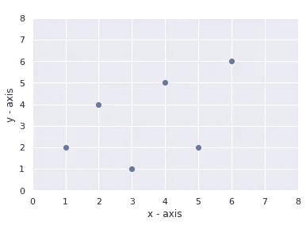
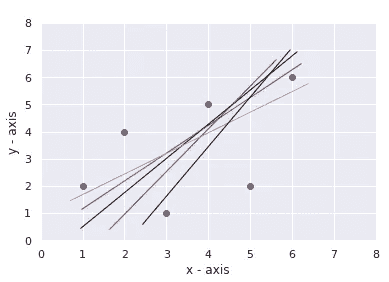
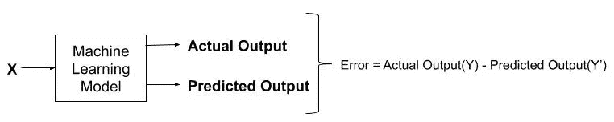
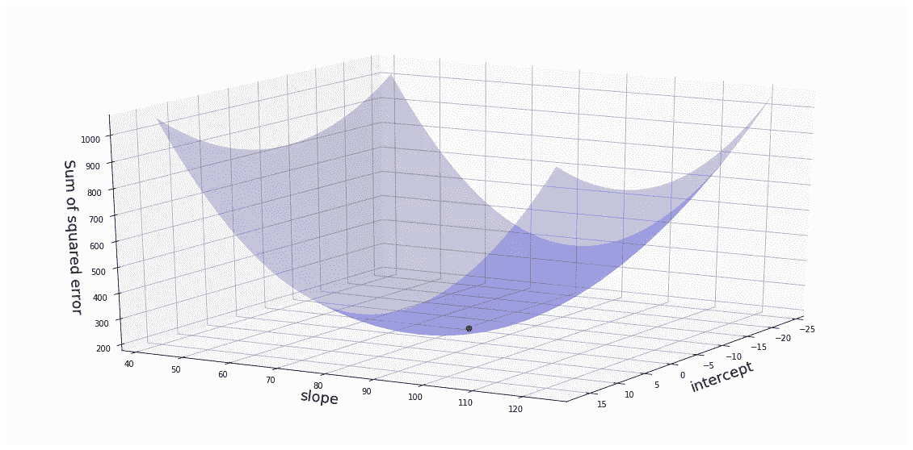
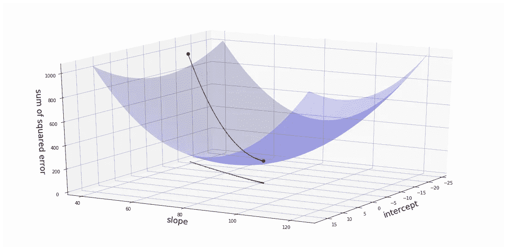
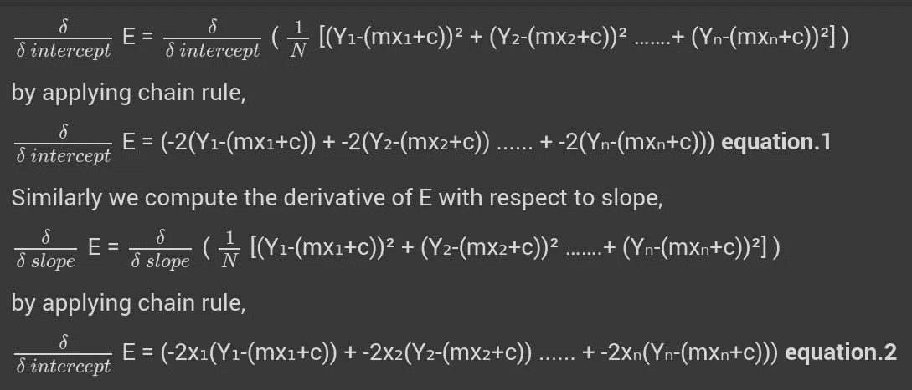

# 了解梯度下降

> 原文：<https://medium.com/analytics-vidhya/understanding-the-gradient-descent-b2d6a2839e2b?source=collection_archive---------23----------------------->

## 深度学习的祈祷:第 4 部分

## 梯度下降背后的数学简介

在上一篇文章中，我们已经讨论了张量及其运算。现在，在这篇文章中，我们将处理一个称为梯度下降的优化算法。因此，如果你错过了我以前的文章，这里有我的个人资料的链接来阅读那些内容——IJAS·阿·H

深度学习封面图片的祈祷

虽然**这篇文章假设你已经掌握了线性回归的基本知识**，但是**T5，因为我们试图用线性回归来解释梯度下降的概念，所以让我们快速刷新一下*线性回归的概念。***

假设我们有一些数据，我们将这些数据绘制在 x，y 图上，如图 1 所示。假设 *x* 为身高 *y* 为体重。在线性回归中，我们试图找到一条线(**y =斜率* x+截距，线方程**)，如果给定了**，该线可以预测 ***y*** 的值(即，如果给定了身高，我们试图近似体重)。但真正的问题是我们可以找到许多这样的可能的线，如图 2 所示。 ***那么我们如何才能选择最合适的线呢？*****

******

图 1:随机数据点** 

**通过计算近似值(使用所选线近似的值)与实际值的*误差*或*偏差(差异)*来选择最佳线。换句话说，我们计算误差平方和(近似值和真实值的平方差之和)。**然后选择产生最小平方误差值的线作为最佳拟合。****

**现在让我们考虑真实的机器学习场景，这里我们给每个数据点作为机器学习算法的输入，结果，它预测一些输出。然后，我们通过取实际输出和预测输出之间的差值来评估每个输出数据的*误差*。我们使用术语 ***损失函数*** 来计算单个训练示例的误差。现在我们考虑称为**成本函数的**损失函数**(即误差平方和/数据点数)的平方平均值。****

****

**图 2**

***一旦我们计算了平方平均值的和(即成本函数)，那么我们的工作就是找到产生最小成本的线参数(即我们需要产生最小误差的斜率(m)和截距(b)值)。***

## **深入了解这个概念**

**我们知道 **y =斜率*x +截距**(即 y = mx + c)，我们也知道误差等于，**

> **E = (1/n)*[(Y₁- Y₁') + (Y₂- Y₂') ……。(Yₙ- Yₙ') ]**

**重写我们得到的等式，**

> **e =(1/n)*[(y₁-(mx₁+c))+(y₂-(mx₂+c))……。+ (Yₙ-(mxₙ+c)) ]**

**现在，该算法迭代地给 ***m*** 和 ***c*** 不同的值，并试图找出 E 最小的 ***m*** 和 ***c*** 的最佳拟合值。这种寻找 a 和 b 的最佳值的方法被称为“*最小二乘法***

****

**图 3:场景的 3D 可视化**

**通过这种方法，我们可以收敛到最小平方误差值，但我们需要为此计算大量的 m 和 c 值。即使这种计算是由计算机执行的，它也不是找到最小误差值的有效方法。称为梯度下降的优化技术的重要性来了。**

## **梯度下降**

**梯度下降是一种优化算法，可以帮助我们在最小化平方误差的过程中减少大量计算。该算法在远离最小值时采取大步，在接近最小值时采取小步。这是通过利用所谓的*学习率*来实现的。**

****

**图 4:梯度下降**

> **注意:达到最小值或底部的步长称为**学习率**。**

## **梯度下降背后的数学！**

**如前所述，误差平方和的等式等于:**

> **e =(1/n)*[(y₁-(mx₁+c))+(y₂-(mx₂+c))……。+ (Yₙ-(mxₙ+c)) ]**

**我们想要得到给出最小残差平方和的 ***截距*** 和 ***斜率*** 的值。**

> ****注****
> 
> **微积分中的**导数**计算为图形在特定点的**斜率**。**

**根据链式法则，我们对截距和斜率求导，**

****

**现在让我们考虑关于截距的导数(*等式. 1* )。给定我们的是 *x* 值和 *y* 值，所以我们直接代入方程。最初，我们假设截距为 0，斜率为 1，因此，利用这些值，我们可以计算该点的斜率**

**现在，我们利用 ***学习速率(学习速率是预先确定的)，*** 我们将结果(即导数 w.r.t 截距)与 ***学习速率*** 相乘以获得**步长。****

**利用步长，我们计算新的截距**

> **新截距=旧截距-步长**

**然后，我们再次将 ***新截距值*** 输入等式 1(即截距的导数),并再次重新计算新截距。**重复该过程，直到步长非常接近零**。步长值的减小速率最初会更大(即，当远离最小值时，步长值会变大，当接近最小值时，步长值会变小)，但会逐渐减小。**

**类似地，对导数 w.r.t 斜率重复相同的过程(*等式 2* )。**

**这是梯度下降的基本概述。由于我们的主要关注点是 Keras 的深度学习，所以所有这些功能都存在于其中。但是如果你想知道更多关于梯度下降的知识，请访问参考资料中的链接。**

## **参考**

1.  **[理解梯度下降背后的数学原理](https://towardsdatascience.com/understanding-the-mathematics-behind-gradient-descent-dde5dc9be06e)**
2.  **[梯度下降，逐步下降](https://youtu.be/sDv4f4s2SB8)**
3.  **[https://youtu.be/PaFPbb66DxQ](https://youtu.be/PaFPbb66DxQ)**