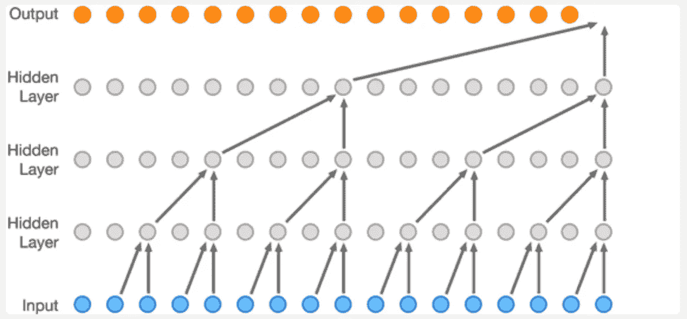
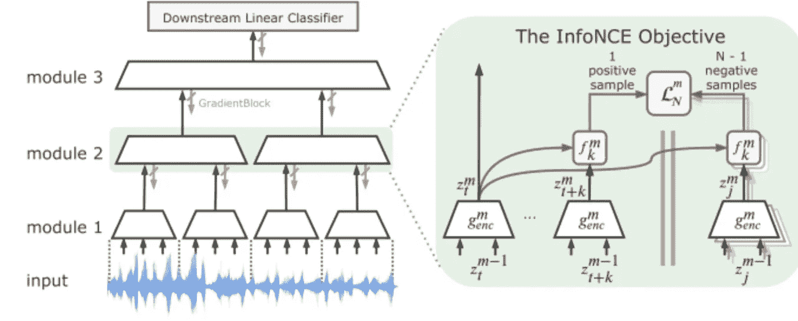

# 对贪婪信息最大化的表征和直觉的梯度隔离学习的理解

> 原文：<https://medium.com/analytics-vidhya/understanding-the-gradient-isolated-learning-of-representations-and-intuition-to-the-greedy-cb6c3598e317?source=collection_archive---------12----------------------->

自从我与数据科学和机器学习相关联以来，我一直着迷的一个问题是人类产生的海量数据，以及我们无法在可供我们使用的复杂算法中有效利用这些数据。在我们所有应用深度学习和拯救世界的想法中，唯一的缺点是数据预处理所涉及的努力和时间，而不是数据本身，而我们有丰富的数据。简单来说，我们每天生成近 3 万亿字节(10 ⁸)的数据！这是每天从太阳照射到地球表面的能量(焦耳)。这包括一系列信息，从只需点击谷歌搜索的数据到相机、天气监视器和社交媒体中的所有数据。因此，如果我们能够学习和理解这些数据，而不太依赖标签或注释，这可能是下一个颠覆性的技术。我在新论文《雷达试图以无监督的方式学习大数据的表示》中偶然发现了这篇论文。在他们题为“结束端到端:表征的梯度隔离学习”的论文中，我试图抓住[辛迪洛韦](https://arxiv.org/search/cs?searchtype=author&query=L%C3%B6we%2C+S)、[彼得奥康纳](https://arxiv.org/search/cs?searchtype=author&query=O%27Connor%2C+P)、[巴斯蒂亚安 s .韦林](https://arxiv.org/search/cs?searchtype=author&query=Veeling%2C+B+S)的这项研究工作的主要概念，而没有过多地探究它的数学方面。

## 对方法的直觉

文章介绍了他们的方法，指出了传统端到端训练的缺点及其生物学上的不可行性，因为已经证明我们的大脑不会像传统的反向传播那样处理和学习信息。尽管有一些证据表明大脑中存在自上而下的联系，但似乎没有一个全局目标是由大脑中的错误信号优化的。本文介绍了一种新的方法来有效地训练未标记数据集和捕获表示，而不需要监督学习方法和执行下游任务。

支持这种方法的基本元素是典型下游任务使用的数据中现有的慢速特征。

> *慢特征是指一个数据特征图的单元与其相邻单元表现出的内在相似性。与要素制图表达的任意随机部分相比，这些要素与其邻近要素具有相似的属性。*

*从这个角度来看，图像中与一个特定对象相关的所有像素在纹理、颜色、光照和渐变方面都表现出局部相似性。类似地，在音频数据中，如果有多个说话者，则在音频的单个连续片段上与一个人相关联的数据在音高、频率、音调等方面将是相似的。该方法利用数据中存在的顺序排序，以紧凑的方式对其进行编码和表示，而无需对模型进行端到端的损失优化。数据以多个堆叠模块的形式表示。每个模块独立地学习并表示前一模块中存在的时间相似性。该模型还在模块内进行自我优化，而不需要来自跟随它的模块的反馈，因此也消除了消失梯度问题。*

## *该算法*

> *这种自我监督的端到端学习方法通过最大化提取的时间上邻近的小块的表示之间的互信息，从顺序输入中提取有用的表示。*

*该算法的主要原理是学习由当前面片表示的数据面片中的下一个序列的相似性。所以算法工作如下。让我们设想顺序数据(例如，一个语音样本)样本被分成“n”个统一的时间单位。
第一步是使用深度编码模型(E)对直到时间‘t’的数据样本(x)进行编码。此外，使用自回归模型 G(ar)[0:t]=C(t)来创建另一个表示 C(t)，该表示 C(t)聚合了直到时间步长“t”的所有小块的信息。自回归模型就像递归神经网络一样，将信息从前一个状态传递到下一个状态。但是它不同于 RNN，它不使用隐藏状态，而是直接为下一个状态提供输入。*

**

*WaveNet 动画。来源:[谷歌 DeepMind](https://deepmind.com/blog/wavenet-generative-model-raw-audio/) 。*

*现在我们有了初始表示，目标是最大化时间戳‘t’之前的数据和下一个相邻补丁(比如说(t+k ))之间的互信息。这是通过提取输入表示 E(t+k)到 t+k 时间戳(其中 k 是数据中的下一个单元，其距离 t 有 k 个时间戳)的编码，并通过采用特别设计的全局概率损失来训练以最大化时间上邻近的小块的 C(t)和 E(t+k)之间的信息共享来完成的。*

## *训练和损失*

*上述损失是根据噪声对比估算原理(NCE)推导出来的[Gutmann 和 Hyvä rinen， [2010](https://www.groundai.com/project/greedy-infomax-for-biologically-plausible-self-supervised-representation-learning/1#bib.bib13) 。这里的想法类似于我们在上一段中理解的，我们采用当前的表示 E(t)和 C(t ),并尝试针对 k 的所有可能值优化 C(t)和 E(t+k)之间的相似性，并挑选具有最高相似性的值。这是通过将一包输入作为*

*X = [E(t+k)，E(n1)，E(n2)，E(n3)…]其中 E(t+k)是超前 t k 个时间步的正编码，所有其他编码都是从与 E(t)不相关的数据中随机采样的。*

*这里使用的损失函数接受 C(t)和 E(ni)的成对输入。使用函数对每对编码(ni，Ct)评分，以使用对数双线性损失([链接](http://proceedings.mlr.press/v74/resheff17a/resheff17a.pdf))预测给定编码‘ni’是正样本 E(t+k)的可能性。该损失用于优化编码模型‘E’和自回归模型 G(ar ),以提取在相邻小块上一致但在随机小块对之间发散的特征。同时，评分模型学习使用那些特征来正确地分类匹配对。*

## *贪婪 InfoMax*

## *直觉*

> *该理论认为，大脑通过最大限度地保留每一层输入活动的信息来学习处理其感知。最重要的是，神经科学表明，大脑预测其未来的输入，并通过最小化这种预测误差来学习，即它的“惊喜”[弗里斯顿， [2010](https://www.groundai.com/project/greedy-infomax-for-biologically-plausible-self-supervised-representation-learning/1#bib.bib10) 。经验证据表明，视网膜细胞携带其自身活动的当前和未来状态之间的重要相互信息，并且该过程可能发生在大脑内的每一层。这种技术从这些理论中汲取动力，产生了一种方法，该方法通过学习预测未来输入的表示来学习保留每层的输入和输出之间的信息。*

*让我们看看该方法的另一个实现方面，即有效地优化隔离的模型每一层的表示之间的交互信息的任务，享受贪婪训练(模型各部分的解耦、隔离训练)提供的许多实际好处。为了做到这一点，采用传统的深度学习架构，并将其划分为 M 个模块的堆栈。这种解耦可以发生在单个层级别，或者例如发生在残留网络中的块级别[He 等人， [2016b](https://www.groundai.com/project/greedy-infomax-for-biologically-plausible-self-supervised-representation-learning/1#bib.bib15) ]。不是端到端地训练该模型，这防止了梯度在模块之间流动，而是采用局部自我监督损失，额外地减少了消失梯度的问题*

**

*算法一言以蔽之(来源:https://arxiv.org/abs/1905.11786[原创论文](https://arxiv.org/abs/1905.11786))*

*上图的右半部分描绘了从时间戳‘t’到‘t+k’直到‘j’的所有编码。所有编码都与评分函数‘f’进行比较，并最终传递给损失函数 L(n)。
左半部分显示了如何将数据划分为模块，架构中的每个编码模块 G(enc)将来自前一模块的输出映射到使用前一模块输出计算的编码 Z(mt)。没有梯度在模块之间流动，这是使用梯度阻塞操作符强制执行的。因此，每个模块 G(enc)都使用前面部分中解释的损失函数和比较成对编码的得分函数‘f’来训练。*

# *结果和总结*

*该算法应用于音频和图像数据集。在这两种设置中，特征提取模型按深度分成模块，并使用该方法在没有标签的情况下进行训练。由最终模块创建的表示然后被用作线性分类器的输入。两个部分中的结果都接近于它们的最先进的监督对应物，因此证明了该算法的适用性。*

*该文件列出的该方法的主要应用如下:*

> *将 GIM 应用于高维输入，可以依次优化每个模块，以减少训练过程中的内存开销。在最受内存限制的情况下，可以训练、冻结单个模块，并将其输出存储为下一个模块的数据集，这有效地消除了作为内存复杂性因素的网络深度。*
> 
> *此外，GIM 允许使用超出内存限制的架构对大于内存的输入数据进行模型训练。*
> 
> *最后但同样重要的是，GIM 为神经网络的训练提供了一个高度灵活的框架。它支持以不同的更新频率训练体系结构的各个部分。当需要更高层次的抽象时，GIM 允许在优化过程的任何时刻添加新的模块，而不必微调以前的结果。*

*就此，我想通过感谢原始论文的作者[辛迪洛韦](https://arxiv.org/search/cs?searchtype=author&query=L%C3%B6we%2C+S)、[彼得奥康纳](https://arxiv.org/search/cs?searchtype=author&query=O%27Connor%2C+P)、[巴斯蒂亚安 s .韦林](https://arxiv.org/search/cs?searchtype=author&query=Veeling%2C+B+S)的出色工作来结束这篇文章！本文中出现的信息的所有荣誉都属于标题为*

> *结束端到端:表征的梯度隔离学习*

*[将](https://arxiv.org/abs/1905.11786)链接到原始文件*