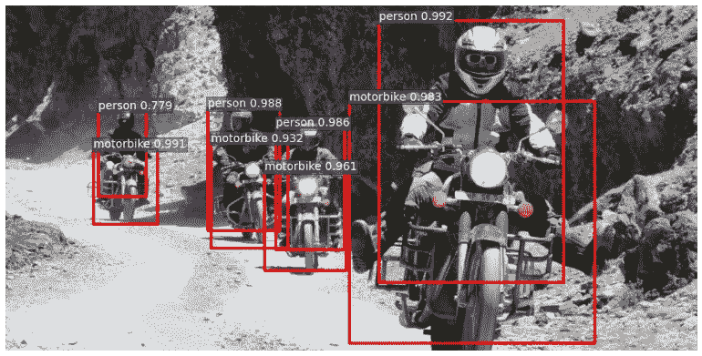
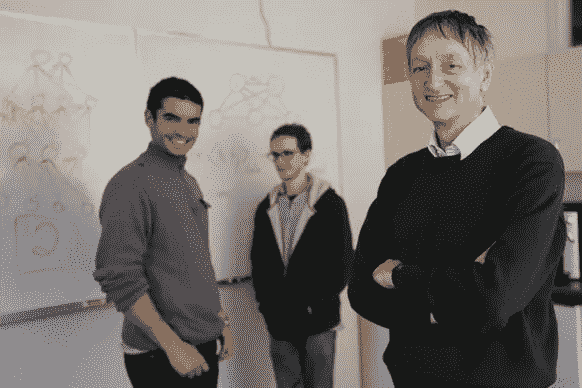
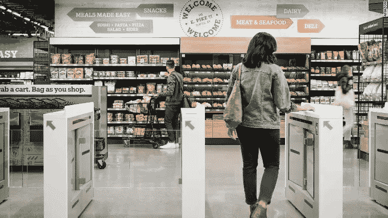
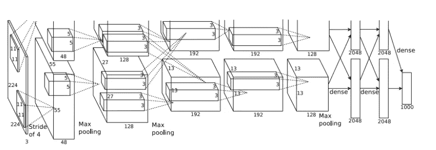
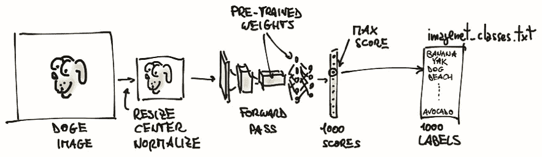
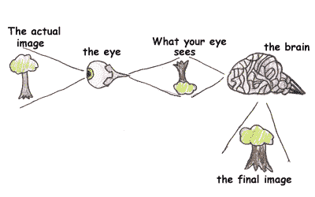

# 用深度卷积神经网络理解 ImageNet 分类

> 原文：<https://medium.com/analytics-vidhya/understanding-the-imagenet-classification-with-deep-convolutional-neural-networks-e76c7b3a182f?source=collection_archive---------14----------------------->

图片来源:Neurohive.io

著名的 AlexNet 建筑论文简介。

2012 年，世界上发生了许多重要的事情。事实上，在我开始写这个博客之前，我搜索了那一年的重要事件，如果你想看，你可以查看这个[链接](https://gizmodo.com/the-most-important-events-of-2012-in-14-gifs-5968394)。

然而，那一年举行了一场不为我们所知的比赛。ImageNet LSVRC-2012 竞赛是一年一度的计算机视觉竞赛，基于一个名为 ImageNet 的公开可用的计算机视觉数据集的子集开发。

该挑战赛基于由学者设计的大量带人类注释的照片，其目标是促进更好的计算机视觉技术的发展，并对艺术水平进行基准测试。

LSVRC 挑战侧重于“*图像分类*的多项任务，包括根据照片中的主要对象为图像分配类别标签，以及“*对象检测*”，涉及在照片中定位对象。

2012 年，Alex Krizhevsky、Ilya Sutskever 和 Geoffrey E. Hinton 发表并随后赢得了 ILSVRC-2012 竞赛，他们创建了一个独特的深度卷积神经网络，能够将**130 万张高分辨率图像**分类到 **1000 个不同的类别**中，并且具有 **15.3%** 测试错误率，远远优于第二名模型(26.2%)

这一成就对整个世界的意义远远超出了我们的想象。由于 AlexNet 的创造者，深度学习的研究不仅仅是爆炸式增长，技术公司在那一刻开始更多地投资于使用 AlexNet 的分类技术，并创建其他模型来创建对检测图像、图像分类等问题的现实解决方案。

图片来源:Wired

想想这个，在西雅图，亚马逊开发了一个超市，你可以在那里购买，而不需要去收银台。顾客挑选产品，一旦顾客离开商店，商品就记入信用卡，没有人验证你的产品内容，只有相机！。这都是由于从相机到客户选择的产品的图像检测和分类。亚马逊的这一创新部分归功于 AlexNet 和该领域的后续发展。

亚马逊 Go。图片来源:CNN

现在我已经引起了你们的注意，我将稍微概念性地向你们解释 AlexNet 架构是如何工作的，并且在这篇博客结束时，我希望你们明白这个 DNN(深度神经网络)在当时是多么重要，并且直到今天仍然是人工智能开发和创新(如 Amazon Go)的参考。

# AlexNet 模型

AlexNet 训练了一个大型的深度卷积神经网络，将 LSVRC-2010 ImageNet 训练集中的【2010 万张高分辨率图像分类到 1000 个不同的类别。这意味着，举例来说，你收集了 130 万张动物图片，这个模型能够将它们分类为 1000 个不同的物种。

在测试数据上，他们实现了 39.7%和 18.9%的前 1 名和前 5 名错误率，这大大优于以前的最先进的结果。我们人类是地球上最聪明的物种，但我们使用技术和计算机来改进我们的计算。今天，我们正在训练计算机执行这样的任务(计算机视觉)。这本身就是一场革命，AlexNet 能够展示一个模型，这个模型能够以如此小的速率对图像进行分类，在 2012 年的那个时刻，这是不可想象的，一台机器能够完成。

今天，错误的数量要低得多，事实上，在一些挑战中，机器在计算机视觉方面的表现已经超过了人类。然而，根据飞飞·凌在 2015 年所说的“即使是最聪明的机器也仍然是盲目的”，事实上，人工智能和深度学习已经帮助提高了这些计算机视觉任务的准确率，但当涉及到根据背景或背景故事对图像进行更深层次的分类时，机器仍然有很多事情要做。

> 拥有**6000 万个参数和 50 万个神经元**的神经网络由**五个卷积层**组成，其中一些卷积层后面是 max-pooling 层**和两个全局连接层**，最后是 **1000 路 softmax** 。

## AlexNet 技术信息

该结构使用 Relu 而不是 Tanh 来增加非线性。它在同样的精度下加快了 6 倍的速度。它还使用放弃而不是正则化来处理过度拟合。训练时间翻倍，辍学率 0.5。最后，重叠池缩小网络规模。它将前 1 名和前 5 名的错误率分别降低了 0.4%和 0.3%。

激活功能。图片来源:萨加尔·夏尔马

## AlexNet 技术架构

AlexNet 包含五个卷积层和三个全连接层。Relu 在非常卷积和完全连接层之后应用。辍学适用于第一年和第二年完全连接之前。AlexNet 架构中的图像大小为 227 * 227。输入大小为 224 * 224，带 2 个填充。

图片来源:[深度卷积神经网络的 ImageNet 分类](https://papers.nips.cc/paper/4824-imagenet-classification-with-deep-convolutional-neural-networks.pdf)

如果你不明白这一部分，不要担心，看看下面的两张图片，并与下面的图片进行比较，并尝试认为这个架构就像你的眼睛在识别任何图像时所做的过程。

深度卷积神经网络。图片来源:Mannig

我们的眼睛是如何工作的。图片来源:孩子的健康

# 培训

AlexNet 模型在五六天内需要 90 个纪元才能在两个 GTX 580 GPU 上进行训练。使用学习率为 0.01，动量为 0.9，权重衰减为 0.0005 的 SGD。一旦精度达到稳定水平，学习率除以 10。在训练过程中，学习率降低了 3 倍。

# 结论

我们今天拥有的许多很酷的真正的科幻作品，如 Instagram 滤镜，无需指纹验证，只需看一眼相机就可以进入建筑物，自动驾驶等等，都要归功于 ILSVRC 挑战赛和 Alex Krizhevsky，Ilya Sutskever 和 Geoffrey E. Hinton 等人。因为他们，我们在人工智能发展的这个领域取得了许多新的里程碑

人工智能和深度学习的这场革命，也创造了机器性能的革命。今天我们有更好的电脑来训练这些模型。来自厂商的 GPU 开发不仅仅是为了游戏行业。现在你知道除了玩红色死亡救赎 2 之外，这些可怕的机器还能做什么

至于 AlexNet 架构，优化算法、正则化方法和激活函数起着关键作用。这意味着，如果你想训练一个好的模型来解决一个问题，你必须尝试用不同的选项进行 ans 测试，并观察你的模型的行为，以获得良好的准确性，并避免模型中的过度拟合

感谢我们今天在我们周围拥有的大量数据，我鼓励你了解更多关于人工智能、机器学习和深度学习的知识。自从我开始在我的职业生涯中应用深度学习和机器学习以来，我已经看到了通过更准确地为我的客户或老板提供信息来解决问题的更好结果。你对信息掌握得越准确，你就越能创造出解决问题的成功策略。

# **参考文献**

 [## 基于深度卷积神经网络的图像网分类

### 部分:神经信息处理系统进展 25 (NIPS 2012)我们训练了一个大的，深度卷积神经…

papers.nips.cc](https://papers.nips.cc/paper/4824-imagenet-classification-with-deep-convolutional-neural-networks)  [## PyTorch 速成班，第 2 部分|曼宁

### 从伊莱·史蒂文斯和卢卡·安提卡的《PyTorch 深度学习》这篇文章中，我们探索了 PyTorch 的一些…

freecontent.manning.com](https://freecontent.manning.com/pytorch-crash-course-part-2/)  [## ImageNet 挑战赛(ILSVRC)简介-机器学习掌握

### 深度学习神经网络技术的普及和使用的增加可以追溯到

machinelearningmastery.com](https://machinelearningmastery.com/introduction-to-the-imagenet-large-scale-visual-recognition-challenge-ilsvrc/)  [## 了解 AlexNet

### 亿万富翁投资者和企业家彼得·泰尔最喜欢的逆向思维问题是，什么是重要的真理，很少有人知道…

www.learnopencv.com](https://www.learnopencv.com/understanding-alexnet/#:~:text=AlexNet%20Architecture,two%20GTX%20580%203GB%20GPUs.&text=AlexNet%20consists%20of%205%20Convolutional%20Layers%20and%203%20Fully%20Connected%20Layers.)  [## 用于目标检测和语义分割的 R-CNN -神经网络

### 计算机视觉是一个跨学科的领域，近年来获得了巨大的吸引力(自从…

神经蜂巢. io](https://neurohive.io/en/popular-networks/r-cnn/)  [## 人工智能能比人类更好地识别图片吗？

### 创业投稿人发表的观点均为个人观点。基于计算机的人工智能(AI)已经…

www.entrepreneur.com](https://www.entrepreneur.com/article/283990)