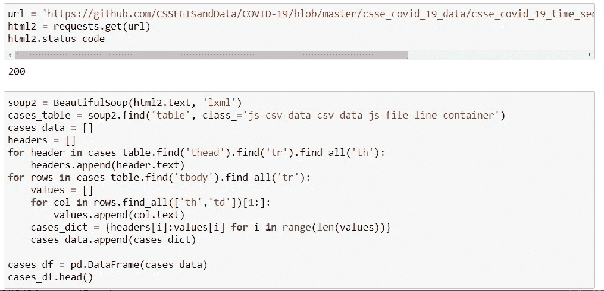

# 通过数据故事理解冠状病毒疫情的影响

> 原文：<https://medium.com/analytics-vidhya/understanding-the-impact-of-coronavirus-pandemic-through-data-storytelling-eccd82334030?source=collection_archive---------9----------------------->

M 任何专业人士都一直在参与有助于了解全球疫情、新冠肺炎的活动，也在使用不同的方法跟踪病毒在世界许多地区的传播。其中包括卫生专业人员、统计学家、研究人员、程序员等等。数据科学家通过对来自各种来源的在线冠状病毒数据进行分析、建模和可视化，并做出可以传达给相关受众的推断，在了解疫情的传播方面发挥着重要作用。

作为一名研究生数据科学家，我决定利用我在数据叙事方面的知识和中级技能来分析来自约翰·霍普斯金大学的新冠肺炎时间序列数据，以了解疫情的影响，使用可视化和数据叙事并将故事传达给观众。

# ***数据评书项目—冠状病毒疫情***

我们都知道冠状病毒疫情起源于中国的一个省，并传播到世界上不同的国家，但我们知道它是如何在全球范围内影响这些地区和国家的吗？

这个项目将为了解疫情冠状病毒如何影响世界各国提供相关信息。

全球疫情的起源

***注:本项目的视觉和叙事基于 CSSEGIS 约翰·霍普斯金大学截至 2020 年 9 月 16 日的时间序列数据。***

**项目目的:**

该项目旨在通过使用从网络搜集的数据中发现的推论，讲述疫情冠状病毒如何影响世界的故事。数据讲故事项目中使用的 python 库有*美汤、Requests、Matplotlib、Seaborn、Pandas 和 Numpy* 。

**完成项目的步骤:**

1.  数据收集。
2.  数据角力。
3.  数据可视化。
4.  数据讲故事。

现在，我将讨论在完成项目的每个步骤中所做的工作。

**数据收集:**我从 GitHub 网站上搜集并下载了疫情的 CSSEGIS 约翰·霍普斯金大学时间序列数据集，并创建了 Pandas 数据框以便于分析和可视化。

*报告冠状病毒病例的所有省份的确诊病例时间序列数据的代码片段和截图如下:*

用于收集确诊病例时间序列数据的代码片段。

确诊病例数据框架时间序列数据

**数据争论:**我清洗了数据，合并并分析了时序数据集。一旦我解决了数据集的争论，我终于可以将它可视化并从中得出推论。

*合并三个时间序列数据集(即病例、死亡和康复)的代码片段和合并数据集的截图如下:*

合并时间序列数据集

我还创建了一个数据集来反映疫情截至 2020 年 9 月 16 日的现状。下面是用于最新分析和可视化的代码片段和创建的数据集的屏幕截图:

截至 2020 年 9 月 16 日的报告数据。

**数据可视化:**令人惊讶的是，这占用了我项目的很大一部分时间，因为我试图创建一个视觉上吸引人的关于疫情冠状病毒的数据报告。

我决定使用 Python 可视化库，即 Matplotlib、Seaborn、Plotly Express，因为我完成项目的时间有限，所以我无法学习高级可视化库来产生更有吸引力的视觉效果。

**数据讲述:**这是该项目的最重要的一步，这涉及到使用视觉化的叙述来讲述冠状病毒疫情在全球的影响。

**得出的推论被分成以下几个部分:**

1.  基于死亡率和恢复率的区域分析。
2.  基于确诊病例、病死率和流行率的前 30 个国家。
3.  全球疫情指标月度细分。

**基于死亡率和恢复率的区域分析**

各地区确诊病例(截至 2020 年 9 月 16 日)

所有五个地区(亚洲、美洲、欧洲、非洲和大洋洲)都受到了疫情的影响。**亚洲**受疫情影响最大，共有**8816673**例确诊病例，其次是**美洲**8576431 例确诊病例，然后是**欧洲**4183028 例确诊病例。疫情在这些地区的传播使用死亡率和恢复率等指标进行衡量**。**致死率(也称为死亡率)是该国人口因疫情而死亡的比率。另一方面，恢复率是被冠状病毒感染的人从中恢复的速度。**欧洲**与冠状病毒疫情相关的致死率最高 **5.08%** ，其次是**美洲(3.79%)** ，然后是**大洋洲(2.97%)。**

病死率

回收率

另一方面，**大洋洲**大部分从疫情回收，回收率为 **88.29%，其次是**美洲**(83.5%)**然后是**非洲(81.8%)。**

**根据确诊病例、病死率和流行率排名前 30 位的国家**

**世界上超过 180 个**国家有冠状病毒病例记录。此外，在这些国家的确诊病例中，也有死亡和康复记录。截至 9 月 16 日，**美利坚合众国**以总共**6630051**例确诊病例位居报告国之首，其次是印度**5020359**例确诊病例，然后是巴西**4419083**。疫情的起源，**中国**不在报告病例总数的前 30 名国家之列，这意味着许多国家已经超过了疫情的起源。

按确诊病例排列的前 30 个报告国家。

患病率用于衡量疫情在一个国家人口中的传播情况。基于人口，全球疫情在一个国家的**患病率**(也称为**病例-人口比率**)是该国已被疫情感染的人口比例。因此，冠状病毒疫情在一个国家的流行率是该国已受疫情影响的比例。尽管美国、印度和巴西等国家在全球确诊病例总数中所占比例较高，但由于这些国家人口密集，疫情在这些国家并不普遍。**卡塔尔**记录的最高病例-人口比率为 **4.2%** ，即 4.2%的卡塔尔人口受到疫情的影响，其次是**巴林(3.67%)** 然后是**巴拿马(2.4%)** 。

根据疫情患病率排名的前 30 个国家

另外，进一步的分析显示**也门**有 **28.88%** **病死率**也就是说，28.88%的也门人口死于疫情。第二名是**意大利**以 **12.23%致死率**然后是**英国**以 **10.97%致死率**。

死亡率最高的 30 个国家

**全球疫情指标月度细分**

死亡率的每月细目

**与 2020 年 1 月至 2020 年 9 月的其他月份相比，4 月**记录的**死亡率最高，为 6.85%** ，并且因冠状病毒疫情导致的死亡率有所下降。**9 月**记录的死亡率为 **3.24%** ，接近整个疫情开始的月份**1 月(2.31%)** 。这表明冠状病毒导致的死亡率一直在下降。

从全球来看，自 3 月份以来，总确诊病例和确诊死亡病例逐月增加。这表明，随着每月记录的病例增多，全球的曲线并没有变平。

每月病例数、死亡数和康复数。

以上推论是我第一个数据讲故事项目的亮点。希望你对这篇文章感兴趣，并理解疫情是如何影响全球各地区、次地区的。期待以后分享更多的数据讲故事项目。

你可以通过下面的链接在 Github 上查看整个项目的脚本。[**【Github 链接:数据讲故事——冠状病毒疫情】**](https://github.com/gissaonilu/Data-storytelling-and-Visualization/blob/master/Data%20Storytelling%20-%20Coronavirus%20pandemic.ipynb)

就是这样！