# 使用数据科学理解天气条件对冠状病毒传播的影响

> 原文：<https://medium.com/analytics-vidhya/understanding-the-impact-of-weather-conditions-on-corona-virus-spread-using-data-science-64ebfa2d5ced?source=collection_archive---------26----------------------->

(图片取自[https://www . the verge . com/2020/1/31/21114176/冠状病毒-治疗-通用-疫苗-中国-疫情](https://www.theverge.com/2020/1/31/21114176/coronavirus-treatments-universal-vaccines-china-outbreak))

世界卫生组织(世卫组织)将冠状病毒称为疫情。来自 185 个国家的 267013 人冠状病毒检测呈阳性。

来自世界各地的数据科学家用各种技术解释冠状病毒的传播。在本文中，我们将探讨天气条件对冠状病毒传播的影响。

以下是来自 [kaggle](https://www.kaggle.com/search?q=covid19+world) 中可获得的冠状病毒数据的一些见解。

让我们从数据中做出一些有趣的情节。

每天收到的案例分布如下

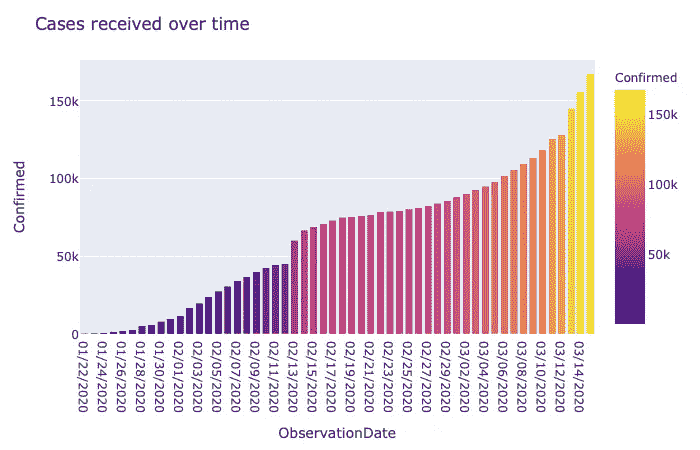

观察到的死亡的日间分布为

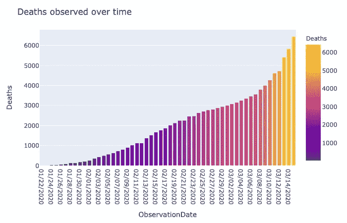

全国和各州确诊病例列表如下

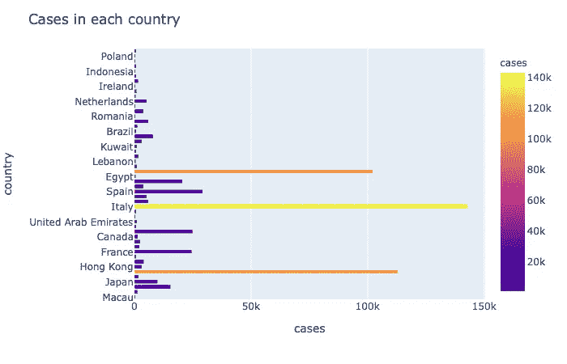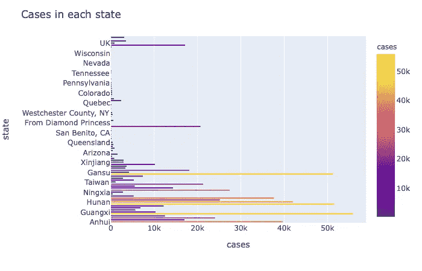

(仅标绘了受影响非常严重的县和州)

一个城市的天气状况可以从它的温度、气压和湿度来解释。在 python 中，使用 pyowm 包可以获得任何城市的天气情况。你只需要一个 api 键就可以使用 pyowm 的惊人功能。你可以在这里阅读官方文件。

我用来提取城市天气状况的代码是

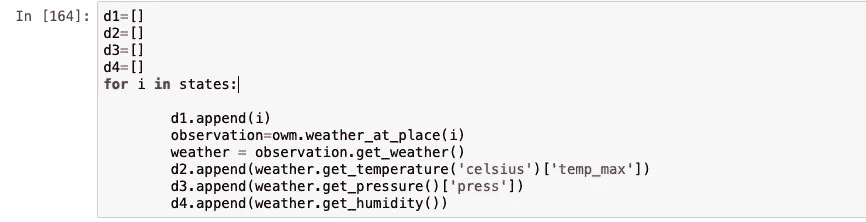

我已经根据观察制作了一个数据框架来可视化影响。温度、压力和湿度与病例的相关性为:

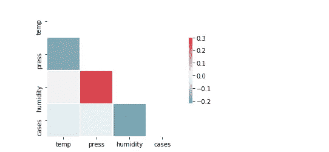

在总结相关性之前，让我们再画一些图

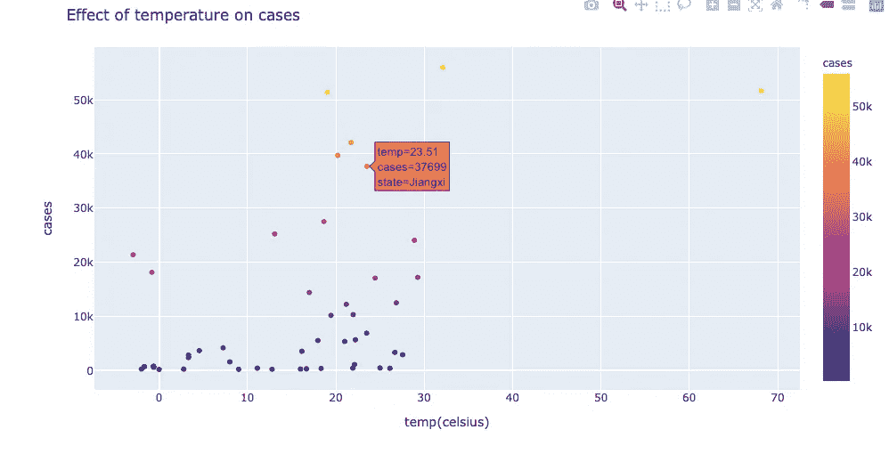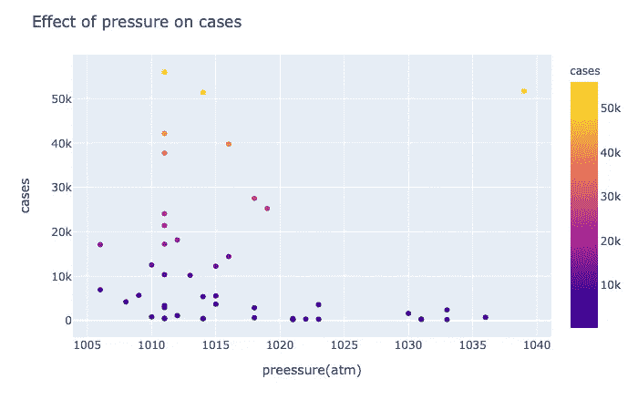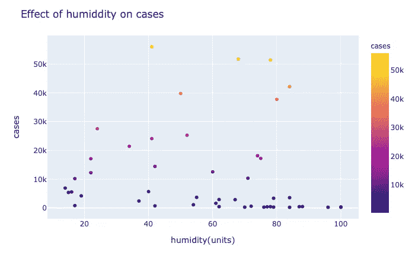

因为这些观察来自不同的国家，所以下结论太快了。为了更好地理解，让我们将这种分析扩展到单个国家的观察。

印度最近跨过了这个疫情的起跑线。因此，让我们从[印度](https://www.kaggle.com/sudalairajkumar/novel-corona-virus-2019-dataset)获取数据，重复上述分析。

经过分析预处理后制作的数据帧为

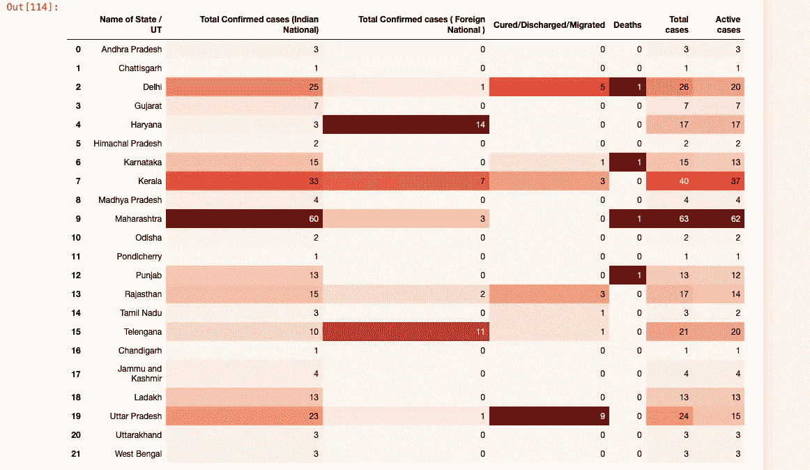

活动案例的状态图如下

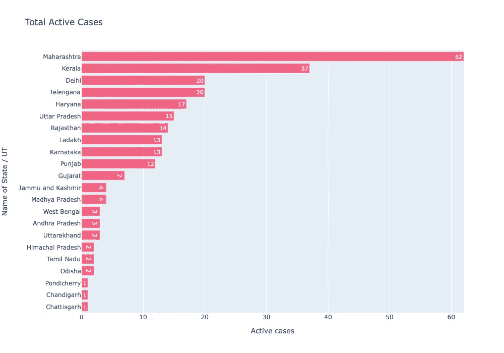

使用 pyowm 包检索天气制作的数据框为

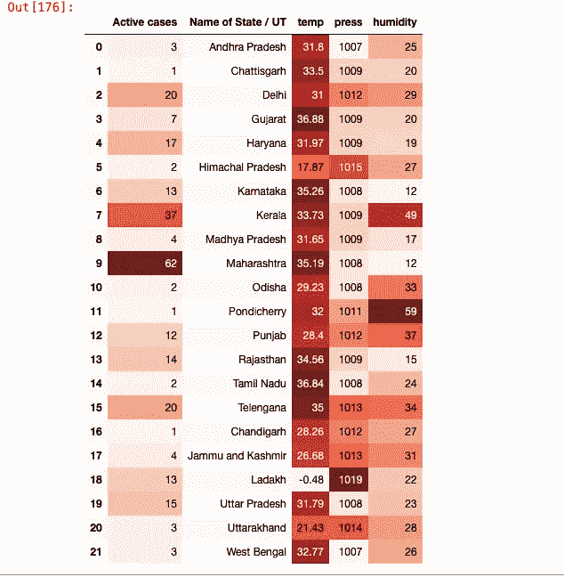

上述数据框的可视化是

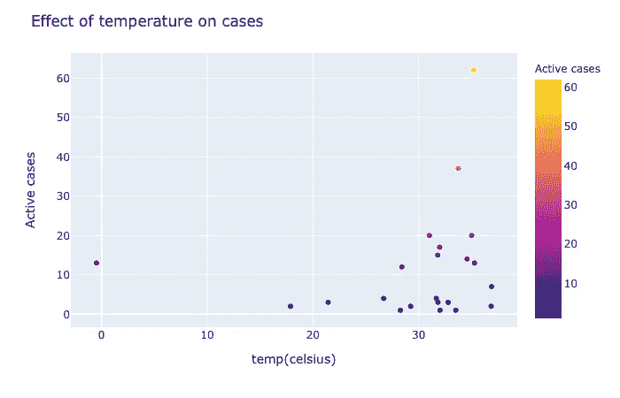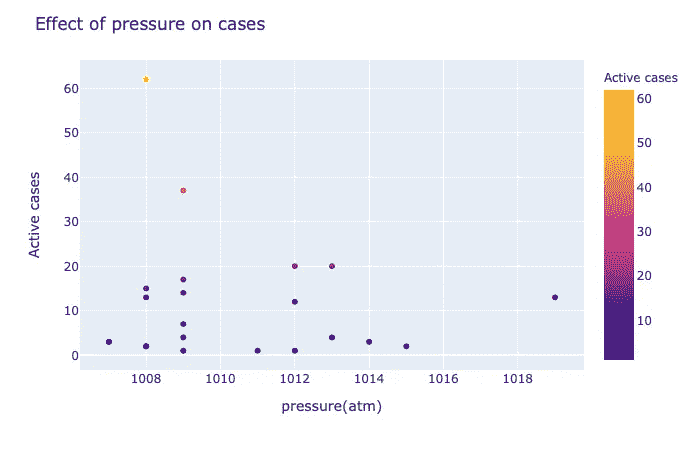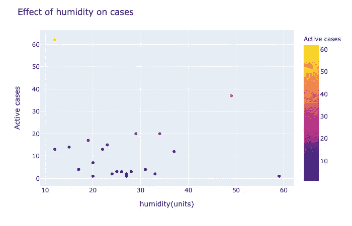

关联矩阵的热图为

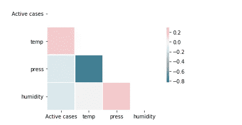

从热图中可以清楚地看出，温度、压力和湿度与活跃病例没有很强的相关性。

虽然温度在病毒传播中的作用很小，但我们可以得出结论，不管天气条件如何，与受影响的人接触在传播中起着关键作用。

## 印度的现状

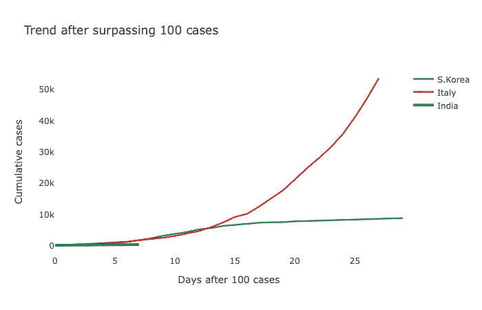

## 未来的工作

我们可以从特定城市收集的天气数据中进行更有意义的观察。我们可以利用这些天气数据作为模型的输入来预测第二天的病例。

# 结论

我们对这些数据集进行了探索性的数据分析。我们已经看到了天气条件对冠状病毒传播的影响。最后，我陈述了我下一篇文章的想法。用于制作图和结论的代码和数据可在此访问[。](https://github.com/maheshsai252/temp-press-corona)

感谢阅读:)