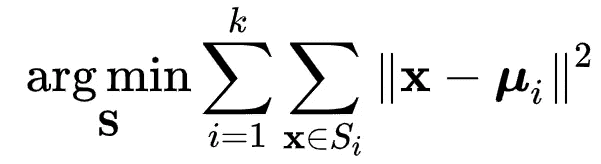
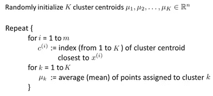
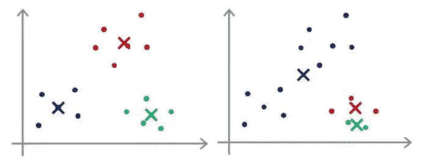

# 更好地理解 K-Means 算法

> 原文：<https://medium.com/analytics-vidhya/understanding-the-k-means-algorithm-better-da51d45bbadf?source=collection_archive---------22----------------------->

读者们好。K-means 聚类无疑是最流行的无监督学习算法之一。它被如此频繁使用的原因是强大而简单的统计主干。这个故事将首先解释 K-Means 聚类背后的逻辑方法，然后提出一个实际的缺点和一些避免它的建议。

K-Means 是一种非确定性算法。这意味着编译器不能在多项式时间内解决问题，并且不清楚下一步。这是因为有些问题有很大程度的随机性。这些算法通常有 2 个步骤——1)猜测步骤 2)分配步骤。类似的还有 K-means 算法。K-Means 算法将数据空间分成 K 个聚类，使得所有数据点相对于聚类均值的总方差最小。

图(1)函数被最小化。S(i)是簇。

然而，编译器采用的方法并不像看起来那样涉及多元微积分。相反，所采用的方法是迭代的。现在，像任何确定性算法一样，它有两个阶段。猜测阶段:随机初始化数据空间中的 k 均值(Mu(k)s)。现在，所有的数据点 X(i)s (1，m)根据它们更接近哪个聚类的意思被分配给聚类。从数学上来说，这一步试图最小化组内方差。因此，现在每个点都被分配了一个簇。接下来是分配步骤。所有的聚类平均值(μ(k)s)现在被分配给该聚类中的数据点的平均值。这个步骤重复几次。参考下图。

图(2)K 均值算法

类似于大多数非确定性算法，K-Means 有一个坏习惯。也就是说，每次运行 K-Means 聚类都会得到不同的结果。当您不确定对 K-Means 的任何修改是否会改善结果时，情况会变得更糟。参考下图，看看 K-Means 算法的结果有时会有多糟糕。

图(3)K = 3 时 K 均值的两种不同结果

我们应该明白，我们对这个问题无能为力，因为通过分析几乎不可能想象出一个如此巨大的数据空间。尽管如此，我们还是有一些建议可以遵循。

1.  K 的值怎么选？

我们应该依靠问题陈述来解决这个问题。例如，在一个树种分类问题中，如果知道可能的树种数量，并假定所有这些树种在数据集中出现的数量都很大，则可以将树种数量指定为 k。

2.如何确定得到的解是否合适？

在这个问题上没有通用的方法。更确切地说，人们应该集中于用最佳可能的估计值初始化聚类均值。对此可以有任何统计方法。例如，我们可以指定几个数据点的计算平均值，我们可以确定这些数据点属于同一个聚类。其次，我们可以迭代 10-100 次 K-Means 算法，并决定最大程度地减少上面给出的数学函数(图 1)。

以上是对 K-Means 聚类的一些见解和建议。

谢谢你。:-)