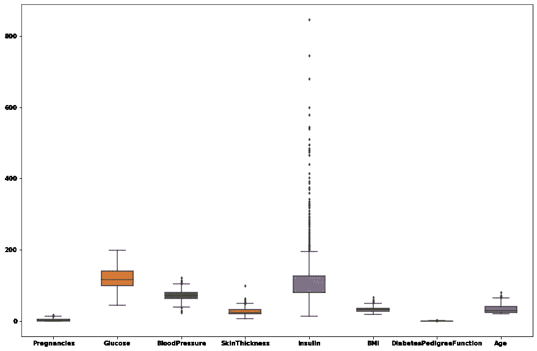

# 理解 KNN 算法

> 原文：<https://medium.com/analytics-vidhya/understanding-the-knn-algorithm-1a69fa4e9617?source=collection_archive---------27----------------------->

KNN 是一种监督学习算法，用于回归和分类问题。虽然主要用于分类。KNN 试图通过计算测试数据和所有训练点之间的距离来预测测试数据的正确类别。然后，它选择最接近数据的 k 点。

1.  给定如下所示的训练数据集。我们有一个新的测试数据，需要分配给两个类中的一个。


2)现在，k-NN 算法计算测试数据和给定训练数据之间的距离。


3)在计算距离之后，它将选择与测试数据最近的 k 个训练点。在我们的例子中，假设 k 的值是 3。


所以这里 K=3，绿色=2，红色=1。KNN 将此点归类为绿色。这是一个分类示例，对于回归，预测值是 k 个选定点的平均值。这种方法被称为计算距离的蛮力 KNN，有许多计算距离的方法，如欧几里德，曼哈顿和汉明等。

欧几里德距离:

*   最常见的方法。
*   考虑两点 P(p1，p2)和 Q(q1，q2)欧几里得距离将为 ED(p，q)=平方根[(q1-p1)**2 + (q2-p2)**2]

曼哈顿距离:

*   距离表示向量中绝对值之间的绝对差之和。
*   MD(p，q) = |q1-p1|+|q2-p2|
*   受异常值的影响比欧几里德距离小。优选使用非常高维的数据集。

蛮力 KNN 在计算上非常昂贵，所以有其他方法，如 kd 树和球树(它们更有效，可以在高维数据集中更好地工作)。

选择 K 的值:

*   低 k 值具有高方差和低偏差。k 值较低时，数据可能会过度拟合。
*   高 k 值具有减少的方差和增加的偏差。对于高 k 值，数据中存在欠拟合的可能性。

KNN 算法是一个懒惰的学习者？是的，它是。与其他算法不同，如 SVM、逻辑和贝叶斯算法，它们是求知欲强的学习者，在获得测试数据集之前，在训练数据集上进行归纳。换句话说，他们根据训练数据集创建模型，然后根据测试数据集进行预测。KNN 是一个懒惰的学习者，所以它等待测试数据集，在获得测试数据集后，它开始在训练数据集上进行推广。懒惰算法在训练时工作较少，在测试时工作较多。

我将向大家展示一个使用 UCI 数据库中的糖尿病数据集的 KNN 算法的例子。我将要执行的步骤是:

1.  数据清理
2.  数据可视化
3.  模型创建
4.  使用 GridSearchCV 选择 k 值
5.  使用交叉值评分的模型验证

```
#importing libraries
import pandas as pd
import numpy as np
import matplotlib.pyplot as plt
import seaborn as sns
from sklearn.preprocessing import StandardScaler
from sklearn.neighbors import KNeighborsClassifier
from sklearn.model_selection import train_test_split,cross_val_score,GridSearchCV
from statsmodels.stats.outliers_influence import variance_inflation_factor 
from sklearn.metrics import accuracy_score
%matplotlib inline#reading data
data=pd.read_csv('diabetes.csv')
data.head()
```


数据集中没有缺失值，但是，存在异常值，并且一些变量是倾斜的。


检查变量的分布



极端值

在清理数据集并从中移除离群值后，我们接着继续创建 KNN 模型。首先，我们将数据分为训练和测试，之后我们将训练模型并进行预测。然后，我们将执行 GridSearch 操作来找到最佳参数，并检查我们的初始模型是否过拟合。

```
x_train,x_test,y_train,y_test = train_test_split(df,y, test_size= 0.3,random_state=42)knn = KNeighborsClassifier()
knn.fit(x_train,y_train)KNeighborsClassifier(algorithm='auto', leaf_size=30, metric='minkowski',metric_params=None, n_jobs=None, **n_neighbors=5**, p=2,weights='uniform')y_pred = knn.predict(x_test)knn.score(x_train,y_train)
**0.8435754189944135**print("The accuracy score is : ", accuracy_score(y_test,y_pred))
**The accuracy score is :  0.7272727272727273**param_grid = { 'algorithm' : ['ball_tree', 'kd_tree', 'brute'],
               'leaf_size' : [18,20,25,27,30,32,34],
               'n_neighbors' : [3,5,7,9,10,11,12,13]
              }gridsearch = GridSearchCV(knn, param_grid).fit(x_train,y_train)gridsearch.best_params_
**{'algorithm': 'ball_tree', 'leaf_size': 18, 'n_neighbors': 11}**knn = KNeighborsClassifier(algorithm = 'ball_tree', leaf_size =18, n_neighbors =11)knn.fit(x_train,y_train)y_pred = knn.predict(x_test)knn.score(x_train,y_train)
**0.8063314711359404**print("The accuracy score is : ", accuracy_score(y_test,y_pred))
**The accuracy score is :  0.7445887445887446**cv_results = cross_val_score(knn, x_test, y_test)
msg = "%s: %f (%f)" % ('KNN', cv_results.mean(), cv_results.std())
print(msg)
**KNN: 0.807018 (0.040441)**
```

正如你所看到的，KNN 最初过度适应了，因为我们得到了 84 分的高训练分数，但只有 72 分的低测试分数**。后来使用 GridSearch 参数，我们得到了一个低的训练分数 **80** ，但是一个更高的测试分数 **74** ，所以可以说 KNN 过度拟合了模型。过度拟合的一个原因是因为我们没有提供 n _ neighbours 值，KNN 采用了默认值 5。回想一下上面我提到的小 n 值可能会导致过拟合。**

**我试图通过这篇文章用最简单的形式来解释 KNN。对于初学者来说，KNN 是一个很好的算法，它简单易懂，它的数学部分也容易掌握，可以很容易地向任何人解释。**