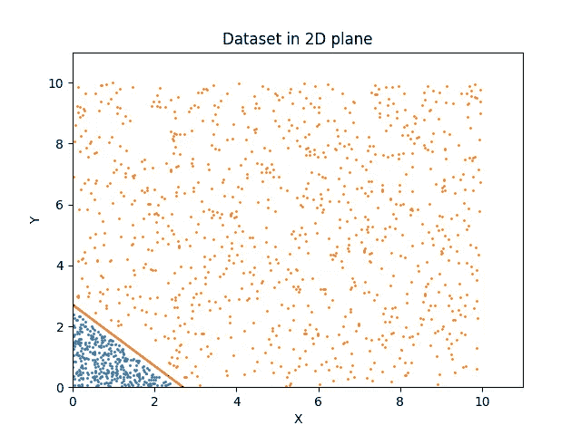
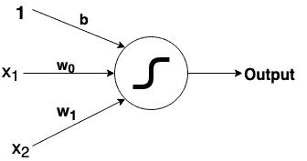
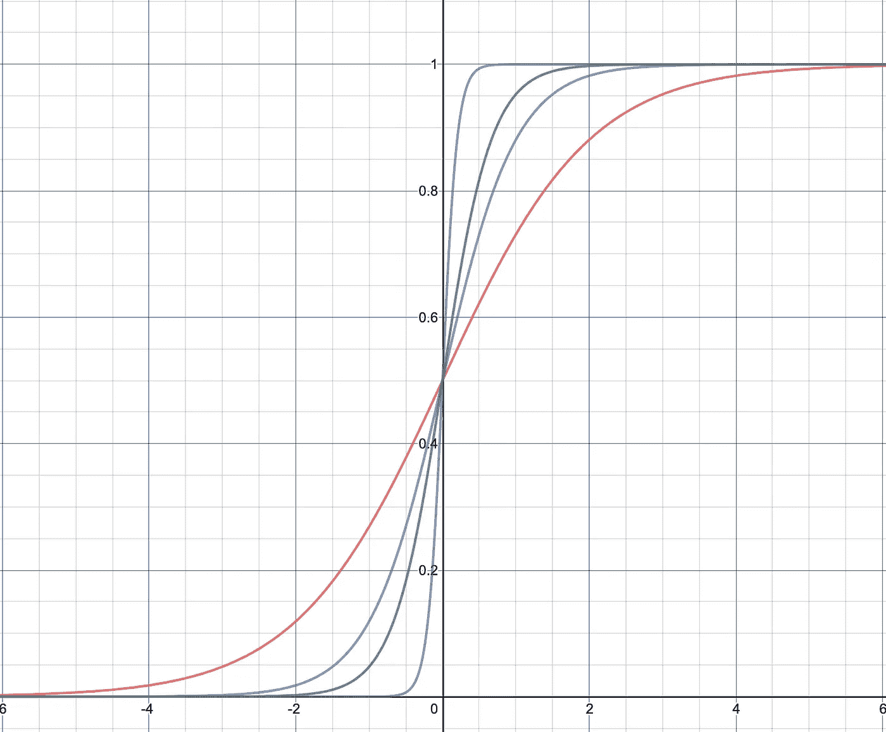
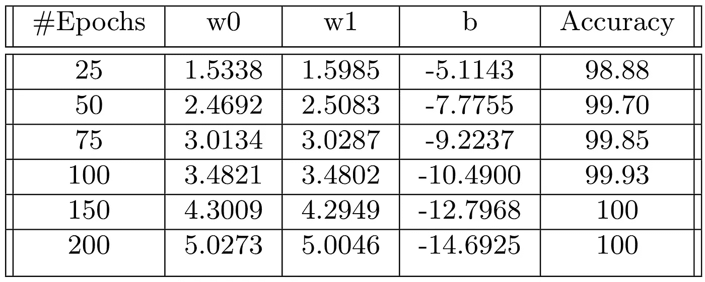

# 理解神经网络中 sigmoid 激活的学习

> 原文：<https://medium.com/analytics-vidhya/understanding-the-learning-of-sigmoid-activations-in-a-neural-network-2e1b2fc27db7?source=collection_archive---------19----------------------->

在我之前的博客中，我解释了神经网络中的单个神经元试图学习什么。我们知道，神经元试图通过根据损失函数优化权重和偏差来学习分类边界。现在让我们进入实际问题。神经元学习完美分类边界(存在的情况)后会发生什么？为了说明的目的，让我们用一个简单的例子，来自我的[以前的博客](/analytics-vidhya/neural-networks-explained-for-machine-learning-beginners-b2acc4d24a95)。

资料组

在图中，我们有数据集和试图对数据进行分类的神经网络。神经元要做的所有学习就是优化与其相关的权重和偏差，以模拟红色分类线。

网络

现在假设我们需要 25 个历元来学习准确的分类边界。如果我们尝试运行模型超过 25 个时期，比如说 100 个时期，会怎么样？我们在剩余的 75 个时代中使用的计算能力是没有价值的吗？这些知识都去了哪里？有人可能会认为，一旦准确率达到 100%(在理想情况下)，网络中就再也没有任何事情可做了。这也是一个可信的论点，因为我们已经达到了损失函数曲线的全局最小值。但这是不正确的。学习仍然发生在网络中，但是目的不同于优化损失函数。要理解这一点，我们必须先了解一些概念，然后再开始解释。

# 神经网络中的神经元试图学习什么？

正如我在以前的博客中解释的那样，每个神经元都有自己的目标，根据它试图学习的特征对其输入进行分类。它试图通过其权重和偏差来学习分类边界，以将正值和负值分配给线相对侧的点(详细解释，我推荐阅读之前的博客)。

在图中所示的示例中，神经元应该学习线 w0*X+w1*Y = 3(其中 X 和 Y 是特征，权重 w0、w1 是 1，偏差等于-3)。这一节要注意的第一个问题是，线 2*w0*X + 2*w1*Y = 6，3*w0*X+3*w1*Y = 9，..？如果所有方程都表示同一条线，为什么网络选择 w0*X+w1*Y = 3(或者实际上是这样的)？

# 为什么首先使用乙状结肠？

我们为什么要用 sigmoid 激活函数？如果目标是将二进制值分配给线的相对两侧，那么我们可以使用阶跃函数(用于感知器)。这个问题的答案来自于反向传播的算法。阶跃函数是不可导的，因此是近似的 sigmoid 函数，它在所有点上都是光滑和可微的。

Sigmoid 激活函数

本节要注意的一点是:在所示的图中，所有曲线对应于不同的 sigmoid 函数。一个神经元选择什么曲线？

# 将这些点连接起来

图中不同的 sigmoid 曲线是由于 sigmoid 函数中关联的不同权重。我们已经看到，通过将权重和偏差乘以一个常数项，我们得到了对应于相同分类边界的不同方程。并且这些方程产生了图中所示的不同的 s 形曲线。在这些曲线中，神经元试图优化权重，使得 sigmoid 函数近似于阶跃函数。随着权重和偏差成比例地增加，激活函数接近阶跃函数。让我们用一个简单的实验来分析一下。对于之前显示的网络和数据集，表中显示了不同时期后学习到的权重。

> 结论:即使网络处于其全局最小值，权重和偏差保持更新，这是结果饱和后学习发生的地方。

欢迎提出改进文章的建议。希望本文有助于深入理解神经网络的学习。如果你喜欢阅读我的文章，请访问[我的网站](https://bhanu77prakash.github.io)获取更多关于人工智能、机器学习、自然语言处理等方面的博客..