# 了解线性回归！！！！

> 原文：<https://medium.com/analytics-vidhya/understanding-the-linear-regression-808c1f6941c0?source=collection_archive---------1----------------------->

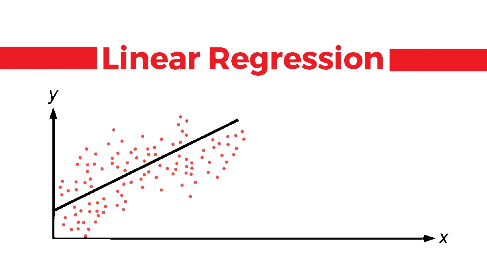

每个刚接触数据科学或机器学习领域的人，通常都是从学习大量可用算法的线性模型开始他们的旅程。
那么，我们开始吧！！！

# 内容:

1.  什么是线性回归？
2.  线性回归的假设。
3.  线性回归的类型？
4.  理解斜率和截距。
5.  线性回归是如何工作的？
6.  什么是成本函数？
7.  梯度下降线性回归。
8.  解释回归结果。

# 什么是线性回归？

线性回归是一种统计监督学习技术，通过与一个或多个独立特征形成线性关系来预测定量变量。
**它帮助确定:**
→自变量是否做好了因变量的预测。
→哪个自变量对因变量的预测作用显著。

> 如你所知，大部分算法都是基于某种假设的。所以，在继续之前，这里列出了**线性回归**的假设。
> 执行线性回归分析时，应牢记这些假设，以使模型发挥最佳性能。

# 线性回归的假设:

*   **自变量*应与因变量*线性相关。****
    这可以借助多种可视化技术进行检查，例如:散点图，或者您可以使用热图或配对图(在一个特定的图中可视化数据中的每个特征)。
*   **数据中的每个特征都是正态分布的。**
    这同样可以借助不同的可视化技术进行检查，如 Q-Q 图、直方图等等。
*   **数据中应该很少或没有多重共线性。** 检查多重共线性的预见性的最好方法是执行 VIF(方差膨胀因子)。
*   残差的平均值为零。
    残差**是观察到的 y 值和预测的 y 值之间的差值。然而，残差接近于零意味着模型运行良好。**
*   **得到的残差应该是正态分布的。这可以使用残差上的 Q-Q 图来验证。**
*   ****整个数据的残差方差应该相同。这就是众所周知的同质性。**
    这可以借助残差与拟合图进行检查。**
*   **数据应该很少或没有自相关。
    *自相关发生在残差不是相互独立的时候。这通常发生在时间序列分析中。*
    您可以执行杜宾-沃森测试或绘制 ACF 图来检查自相关性。如果杜宾-沃森测试的值是 2，则意味着没有自相关，如果值< 2，则存在正相关，如果值在> 2 到 4 之间，则存在负自相关。**

> **如果数据集中的要素不是正态分布的，请尝试不同的变换技术来变换数据中存在的要素的分布。**

## **你能说说为什么需要这些假设吗？**

*****高斯-马尔科夫定理指出，如果你的线性回归模型满足前六个经典假设，那么普通最小二乘(***[***OLS***](https://statisticsbyjim.com/glossary/ordinary-least-squares/)***)回归产生无偏估计，在所有可能的线性估计量中具有最小方差。*****

**要阅读更多关于这个定理的内容，请访问这个[链接](https://statisticsbyjim.com/regression/gauss-markov-theorem-ols-blue/#:~:text=The%20Gauss%2DMarkov%20theorem%20states,of%20all%20possible%20linear%20estimators.)。**

> **现在很少事情是清楚的，让我们继续前进！！！**

****

**[混合](https://unsplash.com/@artbyhybrid?utm_source=medium&utm_medium=referral)在 [Unsplash](https://unsplash.com?utm_source=medium&utm_medium=referral) 上拍照**

# **线性回归的类型**

## **→简单线性回归:**

**简单线性回归有助于找到两个连续变量之间的线性关系，一个是独立特征，一个是从属特征。
公式可以表示为 ***y=mx+b*** 或者，**

**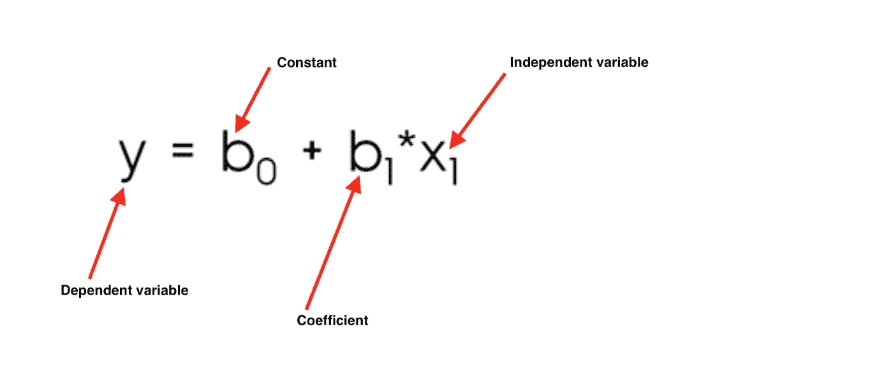**

## **→ **多元线性回归:****

**多元线性回归是线性回归分析最常见的形式。作为预测分析，多元线性回归用于解释一个连续因变量和两个或多个自变量之间的关系。
独立变量可以是连续的或分类的(适当的虚拟编码)。我们经常使用多元线性回归来做任何类型的预测分析，因为我们得到的数据有不止一个独立的特征。
公式可以表示为***Y = mX1+mX2+mX3…+b***，或者**

**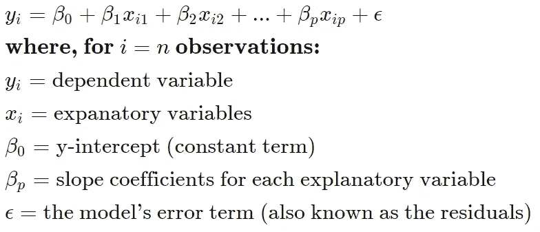**

**现在我们知道了不同类型的线性回归，让我们来了解一下斜率系数和 y 截距是如何计算的。**

> **下面我们来看看，了解一下什么是斜率和截距。**

****

**[Smart](https://unsplash.com/@smartphotocourses?utm_source=medium&utm_medium=referral) 在 [Unsplash](https://unsplash.com?utm_source=medium&utm_medium=referral) 上拍照**

**从现在开始，我们将借助于，**

## **简单线性回归。**

# **了解线性回归模型中的斜率和截距:**

****什么是斜坡？** 在回归环境中，斜率在等式中非常重要，因为它告诉你当 *X* 增加时 *Y* 会发生多大的变化。
在公式 *y = mx+b 中用 m 表示***

**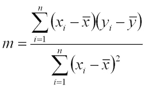**

**它也可以通过以下公式计算:**

***m = r*(Sy/Sx)，
其中 r 为相关系数。
Sy 和 Sx 是 x 和 y 的标准差
和 r 可以计算为***

**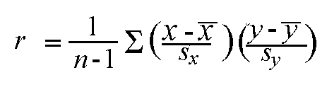**

****什么是拦截？** *y-*截距是回归线 *y = mx + b* 与*y*-轴相交的地方(此处 *x* = 0)，用 *b.* 表示，计算截距的公式为:**

**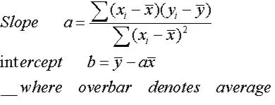**

**现在，把这个斜率和截距代入公式(y = mx +b ),你就有了最佳拟合线的描述。**

**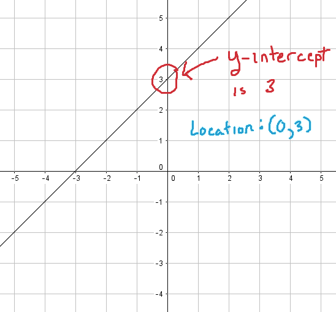**

**该最佳拟合线现在将根据下面讨论的回归线的属性穿过数据。现在，如果我告诉你仍然有改进最佳拟合线的空间呢？
如您所知，我们希望我们的模型是对未知数据表现最好的模型，为此，我们使用随机梯度下降来更新斜率和截距的值，以便我们获得成本非常低的模型函数。不要担心，我们稍后会在这篇博客中探讨这个问题。**

# **线性回归是如何工作的？**

**线性回归的整体思想是找到误差非常低的最佳拟合线(成本函数)。
这条线也叫最小二乘回归线(LSRL)。**

**借助于公式 ***y=mx+b.*** 来描述最佳拟合线，其中，m 是斜率，
b 是截距。**

****回归线的性质:
1。**该线使观测值(实际 y 值)和预测 value(ŷ值的平方差之和最小
**2。**直线通过独立和从属特征的平均值。**

**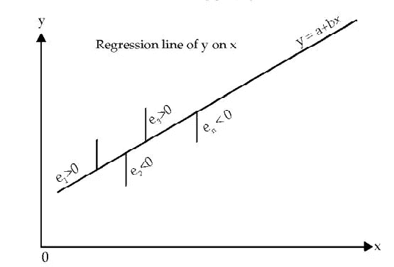**

> **我们先来了解一下什么是代价函数(误差函数)，如何利用梯度下降得到一个非常精确的模型。**

# **线性回归的成本函数**

****

**亚历山大·密尔斯在 [Unsplash](https://unsplash.com?utm_source=medium&utm_medium=referral) 上拍摄的照片**

****成本函数**是**针对给定数据衡量机器学习模型**性能的函数。
成本函数基本上是预测值和期望值之间的误差的计算，并且**以单个实数的形式呈现**。
很多人混淆了**成本函数**和**损失函数**，
简单来说**成本函数**是数据中 n 个样本的误差平均值，而**损失函数**是单个数据点的误差。换句话说，**损失函数**是针对一个训练样本的，**成本函数**是针对整个训练集的。**

**所以，当我们清楚什么是成本函数时，让我们继续。**

**线性回归的成本函数被认为是均方误差。
有的。人们也可能采取均方根误差。两者基本上是一样的，但是添加一个根会显著降低值，使其易于阅读。我们在这里取平方，这样我们就不会得到负值。**

****

> **这里，n 是数据集中的数据总数。**

**你一定想知道斜率和截距在这里起什么作用！！**

```
J = 1/n*sum(square(pred - y))Which, can also be written as :J = 1/n*sum(square(pred-(mx+b)))  i.e, y = mx+b 
```

**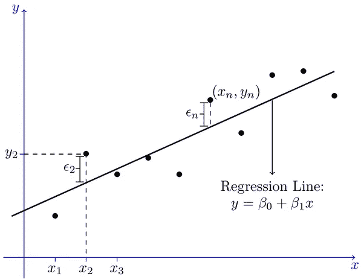**

**我们希望成本函数为 0 或接近于 0，这是我们能得到的最好结果。我们如何做到这一点？
让我们看看梯度下降以及它如何帮助改进权重(m 和 b)以实现期望的成本函数。**

# **梯度下降线性回归**

****

**丹尼尔·弗兰克在 [Unsplash](https://unsplash.com?utm_source=medium&utm_medium=referral) 上拍摄的照片**

**梯度下降是一种优化算法，用于找到使成本函数(成本)最小化的函数的参数(系数)值。**

> **为了阅读更多关于它的内容并对梯度下降有一个完美的理解，我建议阅读杰森·布朗利的博客。**

**要更新 m 和 b 值以降低成本函数(最小化 MSE 值)并获得最佳拟合线，您可以使用梯度下降。想法是从随机的 m 和 b 值开始，然后迭代地更新这些值，达到最小成本。**

****梯度下降后获得较低成本函数的步骤:****

**→最初，m 和 b 的值将为 0，学习率(α)将被引入函数。
学习率(α)的值取得很小，大约在 0.01 或 0.0001 之间。**

> **学习率是优化算法中的调整参数，该优化算法在向成本函数的最小值移动时确定每次迭代的步长。**

**→然后根据斜率(m)计算成本函数方程的偏导数，并计算截距(b)的导数。计算后得到的方程将是。**

**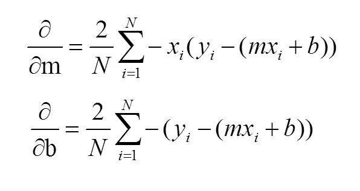**

> **熟悉微积分的人会理解导数是如何产生的。**
> 
> **如果你不懂微积分，不要担心，只要理解它是如何工作的，这就足以让你直观地思考幕后发生的事情，那些想知道推导过程的人可以看看塞巴斯蒂安·拉什卡的博客。**

**→计算导数后，斜率(m)和截距(b)在以下等式的帮助下更新。
m = m+m 的α*导数
b = b+b 的α*导数
上面计算了 m 和 b 的导数，α是学习率。**

> **你一定想知道为什么我加而不是减，如果你观察导数的结果，你会看到结果是负的。所以等式变成了:**
> 
> **m = m—m 的α*导数**
> 
> **b = b—b 的α*导数**
> 
> **如果你浏览过 Jason Brownlee 的博客，你可能会理解梯度下降背后的直觉，以及它如何试图达到全局最优(最低成本函数值)。**

> *****为什么要用导数减去权重(m 和 b)？***
> 梯度给我们损失函数最陡上升的方向，最陡下降的方向与梯度相反，这就是为什么我们从权重(m 和 b)中减去梯度**

**→更新 m 和 b 的值的过程继续，直到成本函数达到理想值 0 或接近 0。
m 和 b 的值现在将是描述最佳拟合线的最佳值。**

> **我希望上面的事情对你有意义。那么，现在让我们了解一下与线性回归相关的其他重要事情。**

*****到目前为止，我们已经了解了斜率(m)和截距(b)是如何计算的，什么是成本函数，以及梯度下降算法如何借助简单的线性回归获得理想的成本函数值。
对于多元线性回归，一切都完全一样，只是公式从一个简单的方程变成了一个更大的方程，如上图所示。*****

> *****现在，要了解如何在多元线性回归中计算系数，*** [***请访问此链接，了解相关的简要信息***](https://stattrek.com/multiple-regression/regression-coefficients.aspx?tutorial=reg) ***，虽然您不会手动执行，但了解幕后发生的事情总是有好处的。*****

**现在让我们看看如何检查模型的质量。**

# ****解释线性回归的结果:****

****

**[国立癌症研究所](https://unsplash.com/@nci?utm_source=medium&utm_medium=referral)在 [Unsplash](https://unsplash.com?utm_source=medium&utm_medium=referral) 上拍摄的照片**

**你已经清理了数据，并将其传递给模型，现在问题来了， ***你如何知道你的线性回归模型是否表现良好？*****

**为此，我们使用 Python 中的 [Statsmodel](https://www.statsmodels.org/devel/generated/statsmodels.regression.linear_model.OLS.html) 包，在拟合数据后，我们做一个**。模型上的 Summary()** ，给出如下图所示的结果。(附注——我用了谷歌图片中的一张照片)**

**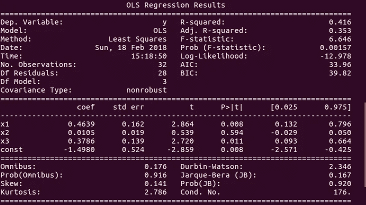**

**现在，如果你仔细看图片，你会看到一堆不同的统计测试。
我想你对图像右上角显示的 R 平方和调整后的 R 平方很熟悉，如果你不介意，请阅读我关于 [R 平方](/analytics-vidhya/r-squared-and-adjusted-r-squared-408aaca84fd5)和 [P 值](/analytics-vidhya/understanding-the-p-value-in-regression-1fc2cd2568af)的博客。**

**在这里，我们将看到图像的下部块解释了什么。**

**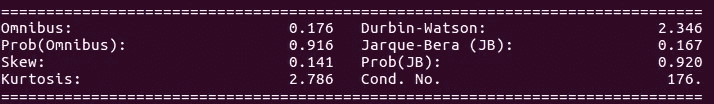**

*   ****Omnibus/Prob(Omnibus)** :检验残差的偏度和峰度的统计检验。
    接近 0 的综合值表示残差的正态性(正态分布)。
    接近 1 的 Prob(Omnibus)值表示残差呈正态分布的概率。**
*   ****偏斜:**它是数据对称性的度量，值越接近 0 表示残差分布是正态的。**
*   ****峰度:**它是数据相对于正态分布是重尾还是轻尾的一种度量。也就是说，具有高峰值的数据集往往具有重尾，或异常值。峰度较低的数据集往往尾部较轻，或者缺少异常值。
    更大的峰度可以解释为残差在零附近更紧密的聚类，这意味着模型更好，离群值更少。**
*   ****Durbin-Watson:** 这是一种统计测试，用于检测残差中存在的滞后 1 处的任何自相关。
    →测试值始终在 0 和 4 之间
    →如果值= 2，则不存在自相关
    →如果值大于(> ) 2，则存在负自相关，这意味着一个观察值的正误差会增加另一个观察值出现负误差的机会，反之亦然。
    →如果值小于(< ) 2，则为正自相关。**
*   ****jar que-Bera/Prob(jar que-Bera):**这是一种统计检验，检验样本数据的偏度和峰度是否符合正态分布的拟合优度。
    Prob(Jarque-Bera)表示残差的正态性。**
*   ****条件编号:**这是一个统计测试，测量一个函数的输出相对于其输入的敏感度。
    当存在多重共线性时，我们可以预期数据的微小变化会产生更大的波动，因此测试的价值会非常高。
    需要一个较低的值，低于 30，或者更确切地说，接近 1 的值。**

**我希望这篇文章能帮助你理解算法和与之相关的大部分概念。下周，我们将了解逻辑回归。**

****快乐学习！！！！！****

**喜欢我的文章？请为我鼓掌并分享它，因为这将增强我的信心。此外，我每周日都会发布新文章，所以请保持联系，以了解数据科学和机器学习基础系列的未来文章。**

**另外，请务必在 LinkedIn 上与我联系。**

****

**马库斯·斯皮斯克在 [Unsplash](https://unsplash.com?utm_source=medium&utm_medium=referral) 上拍摄的照片**