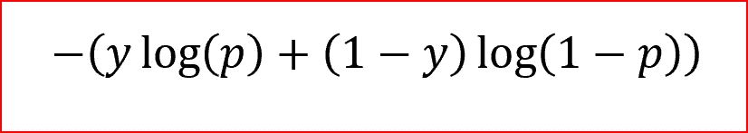
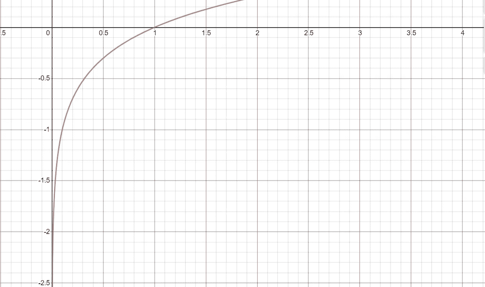
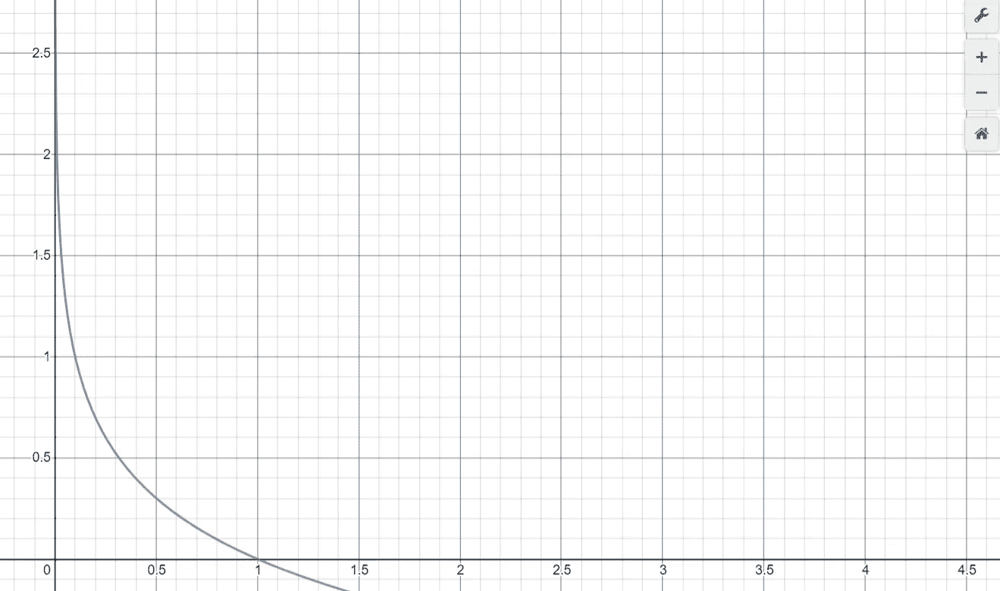
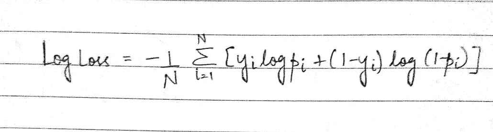

# 了解测井损失函数

> 原文：<https://medium.com/analytics-vidhya/understanding-the-loss-function-of-logistic-regression-ac1eec2838ce?source=collection_archive---------2----------------------->

你好，机器学习伙伴们…最近，在这个封锁期，当我回顾 ML 的基本概念时，我获得了一个更好的直觉&对一些我当时忽略的非常微妙的概念的看法。一个这样的概念是 ***损失函数的逻辑回归*** *。*在讨论我们的主题之前，我想提醒您一些先决概念，以帮助我们更好地理解我们的主题。

本文的先决条件:

*   线性回归
*   逻辑回归
*   学习兴趣😉😉

刚开始学机器学习的时候，我们被教的第一个题目是 ***线性回归*** *。*它是一种监督机器学习算法，用于预测连续输出。线性回归算法使用的损失函数是*均方误差。*


均方误差公式

MSE 所做的是，将每个输入样本的实际输出值和预测输出值之间的距离平方相加(然后除以输入样本数)。使用 MSE 作为误差函数给出了突出的结果。如果我们仔细观察上面的功能，几分钟的细节是值得强调的

*   MSE 对实际输出值和预测输出值之间的距离进行平方的原因是，当与预测值接近实际值的样本相比时， ***对预测值非常远离实际值的样本****比对惩罚更重。*
*   *当相对于线性回归模型的权重参数绘制误差函数(*即*)时，随着个体权重参数的单位变化，误差的变化将是什么是 ***凸曲线*** ，这使得有资格应用梯度下降优化算法，以通过找到全局最小值和调整权重来最小化误差。*

**

*梯度下降*

*以上两个特征对于任何损失函数都是重要的。如果我们有一条凸曲线，我们可以应用梯度下降优化算法，并且当使用梯度下降算法时，惩罚远处的样本导致积极调整负责的权重。*

*现在让我们转到逻辑回归。它是一种受监督的机器学习算法，用于解决分类问题(如分类邮件是不是垃圾邮件，检查图像中是否存在猫)。逻辑回归类似于线性回归，但有两个显著的区别。*

*   *它在输出神经元上使用一个 sigmoid 激活函数，将输出压缩到 0–1 的范围内(以概率表示输出)*
*   *它使用一个称为 ***的损失函数对数损失*** 来计算误差。*

*在以上两点中，第一点非常简单直观，因为对于分类问题，我们需要输出在 0–1 的范围内。但我当时不完全理解的是，为什么我们使用一个新的损失函数，称为 ***log loss*** 而不是 MSE，这在这里直观地感觉是正确的，以及 log loss 函数的等式是如何工作的。*

**

*测井损失函数方程。**y**-实际产量，**p**-逻辑回归预测的概率*

## *为什么 MSE 不能与逻辑回归一起工作？*

*MSE 对逻辑回归不起作用的一个主要原因是*当 MSE 损失函数相对于逻辑回归模型的权重作图时，得到的曲线* ***不是凸曲线*** *，这使得很难找到全局最小值*。使用逻辑回归的 MSE 的非凸性质是因为*非线性*已经以 *sigmoid 函数*的形式引入到模型中，这使得权重参数和误差之间的关系非常复杂。对初学者来说，深入解释上述观点是不可能的。想了解更多，请看 [***这篇***](http://towardsdatascience.com/why-not-mse-as-a-loss-function-for-logistic-regression-589816b5e03c) 的优秀文章。*

*MSE 不是逻辑回归首选的另一个原因是，我们知道逻辑回归的输出是一个总是在 0-1 之间的概率。实际目标值在分类问题中要么是 0/1。因此(y-p)将总是在 0-1 之间，这使得跟踪误差值的进展非常困难，因为很难存储高精度浮点数。四舍五入在这里不是一个选项，因为它导致信息的损失，这是用来指导体重上升。*

## ***让我们揭开 *Log Loss 函数的神秘面纱****

*在进入*日志丢失之前，首先理解*日志*功能很重要。*如果我们绘制***y = log(x)***象限 II 中的图形看起来是这样的*

**

*y =对数(x)图*

*我们只关心 X 轴上的区域 0–1。在上图中，当*

*   *x=1 → y=0*
*   *x =0 → y=-inf*

*在上图中，我们必须观察到，当我们接近 x=0 时，y 值几乎以类似于指数曲线的方式增加。该特性使得对数图成为用作损失函数的良好候选，因为它满足损失函数的第一个特性，*即*严重惩罚偏离期望值的样本(让我们很快讨论期望值)。*

*因为我们总是喜欢正值，所以我们对上面的函数做了一点小小的修改( *y = -log(x)* )，这样我们在上图中的关注区域就被移到了象限 I*

**

*y =-对数(x)图。*

*上图中的轴解释为:*

*   *x 轴:输入样本为真实输出值的概率*
*   *y 轴:对应 X 轴值的惩罚。*

*默认情况下，逻辑回归模型的输出是输入样本为正的 ***概率(用 1 表示)。*** 如果逻辑回归模型被训练为将邮件分类为垃圾邮件和非垃圾邮件，其中垃圾邮件(=肯定的)被指示为 1，非垃圾邮件(=否定的)被指示为 0，则模型 ***p*** 的输出是邮件是垃圾邮件的概率(=肯定的)。如果我们想知道邮件不是垃圾邮件的概率(=负数)，可以表示为 ***1-p.****

*现在让我们看看上面的 log 函数在逻辑回归的两个用例中是如何工作的，*即*当实际输出值为 1 & 0 时。*

*1) ***真实输出值= 1:*** 考虑两个输入样本的模型输出为 p1=0.4，p2=0.6。预计 p1 与 p2 相比应受到更多的惩罚，因为 p1 与 p2 相比远离 1。如果我们看到 y=-log(x)图*

*   *x = p1(=0.4) → y = 0.4(=-log(p1))，即 p1 的损失为 0.4*
*   *x = p2(=0.6) → y = 0.2(=-log(p2))，即 p2 的损失为 0.2*

*p1 上的惩罚大于 p2。在这种情况下按预期工作:))*

*2) ***真实输出值= 0:*** 考虑两个输入样本的模型输出为 p1=0.4，p2=0.6。预计 p2 与 p1 相比应受到更多的惩罚，因为它与 0.4 相比离 0 很远。在这里，在查看图中的惩罚是什么之前，我们需要记住一件小事，*即*因为逻辑回归模型的输出是****输入样本为正的概率，*** p1 & p2 是输入样本为**正的概率**。为了从图中找到惩罚，我们需要输入样本为负的概率，因此我们需要查找惩罚的图，如***log(1-P1)&log(1-p2)。*** 现在，如果我们看到 y=-log(x)图，请记住上述观点**

*   **x = p1(=0.4) → y = 0.2(=-log(1-p1))，即 p1 的损失为 0.2**
*   **x = p2(=0.6) → y = 0.4(=-log(1-p2))，即 p2 的损失为 0.4**

**p2 上的惩罚大于 p1。在这种情况下也能正常工作:))**

**现在，对于模型输出为 **p** 并且真实输出值为 **y** 的单个输入样本的惩罚可以计算如下**

> **如果输入样本为正(y = 1):
> 罚值= -log(p)
> 否则:
> 罚值= -log(1-p)**

**上述 if-else 循环的单行等效等式可以写成**

> **惩罚= -(y*log(p) + (1-y)*log(1-p))**

**我们来看看这个单行方程是如何等价于上面的 if-else 循环的:
1)当真输出值 ***y*** = 1(正)
惩罚=-(1 * log(p)+(1–1)* log(1-p))=*-log(p)*
2)当真输出值 ***y*** = 0(负)
惩罚=。**

**N 个输入样本的对数损失函数如下所示**

****

**yi =第 I 个样本的实际输出，pi =第 I 个样本的预测概率**

**在结束这篇文章之前，我希望现在你**

*   **了解我们使用对数损失函数而不是 MSE 进行逻辑回归的原因**
*   **直观地理解了测井曲线损失公式及其工作原理。**

```
**if you like this article:
    clap it
else:
    feel free to suggest improvements & ask questions**
```

**快乐的机器学习🤓🤓！！！**

***图片来源:——谷歌***