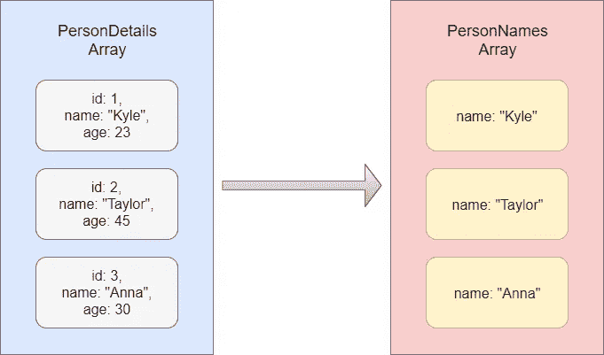

# 了解 React.js 中的 map()函数

> 原文：<https://medium.com/analytics-vidhya/understanding-the-map-function-in-react-js-1d211916fea7?source=collection_archive---------4----------------------->

## 让我们学习如何将一个数组转换成另一个数组。


克里斯汀·休姆在 [Unsplash](https://unsplash.com?utm_source=medium&utm_medium=referral) 上拍摄的照片

JavaScript 中的 Array map()函数用于创建一个具有给定数组的新数组，方法是对给定数组中的所有元素执行一个函数。考虑下图。



这里我们有一个名为 PersonDetails 数组的对象数组。例如，假设您想要获得一个类似 person names 数组的人名数组。为此，我们可以使用 JavaScript 中的 map()函数。它会将 PersonDetails 数组转换为 PersonNames 数组。

下面是 PersonDetails 数组。

```
const PersonDetails = [
           {id: 1, name: "Kyle", age: 23},
           {id: 2, name: "Taylor", age: 45},
           {id: 3, name: "Anna", age: 30}
]
```

现在让我们把这个数组转换成 PersonNames 数组。

```
const PersonNames = PersonDetails.map(person => person.name);
```

这是如何在 JavaScript 中使用 map()函数的基本概述。现在让我们继续学习如何在 React.js 中使用它。

```
import React from 'react';function Details() {
   const PersonDetails = [
            {id: 1, name: "Kyle", age: 23},
            {id: 2, name: "Taylor", age: 45},
            {id: 3, name: "Anna", age: 30}
   ] const PersonNames = PersonDetails.map(person => 
                         <li key={person.id}>{person.name}</li>) return(
      <div>
         <ul>{PersonNames}</ul>
      </div>
   )
}export default Details;
```

这里应该提供属性键，以便给数组元素一个稳定的标识。键很重要，因为它让 React 识别已更改、新添加或删除的项目。

当数据在另一个 js 文件中时，需要在 js 文件中导出 PersonDetails 数组。

```
export const PersonDetails = [
          {id: 1, name: "Kyle", age: 23},
          {id: 2, name: "Taylor", age: 45},
          {id: 3, name: "Anna", age: 30}
]
```

然后，您可以像下面这样在组件中导入数组。

```
import {PersonDetails} from './PersonDetails'
```

如果您想将数据文件导出为默认文件，您可以按如下方式进行。

```
const PersonDetails = [ 
          {id: 1, name: "Kyle", age: 23},
          {id: 2, name: "Taylor", age: 45},
          {id: 3, name: "Anna", age: 30}
]export default PersonDetails;
```

然后，您可以在组件中导入数据文件。

```
import PersonDetails from './PersonDetails'
```

现在让我们试试另一种方法。

我们甚至可以在 map()函数中返回组件。如前所述，考虑数据在另一个文件中。

下面是组件文件。您需要将道具传递给组件。这里，我将个人详细信息作为一个对象(p)传递，而不是传递个人详细信息的每个属性。现在我可以通过 props.p. {属性名称}访问属性。

```
import React from 'react';function Details(props) {
   return(
      <div>
         <ul>
            <li>{props.p.name}</li>
         </ul>
      </div>
   )
}export default Details;
```

在 App.js 文件中，让我们用 map()函数返回细节组件。

```
import React from 'react';
import Details from './Details';
import PersonDetails from './PersonDetails'
import './App.css';function App() {
   const PersonNames = PersonDetails.map(person => 
                          <Details key={person.id} p={person} />) return (
      <div>
         {PersonNames}
      </div>
   )
}export default App;
```

我希望您能从这篇文章中很好地理解 React.js 中的 map()函数。

编码快乐！