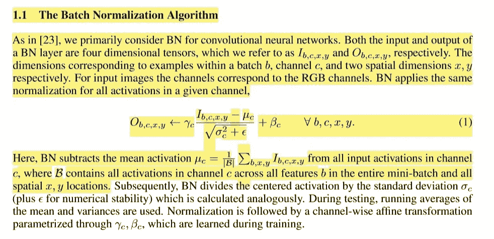
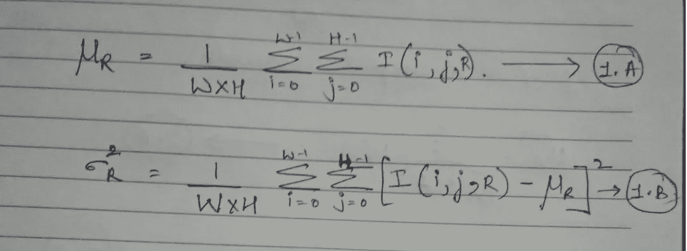
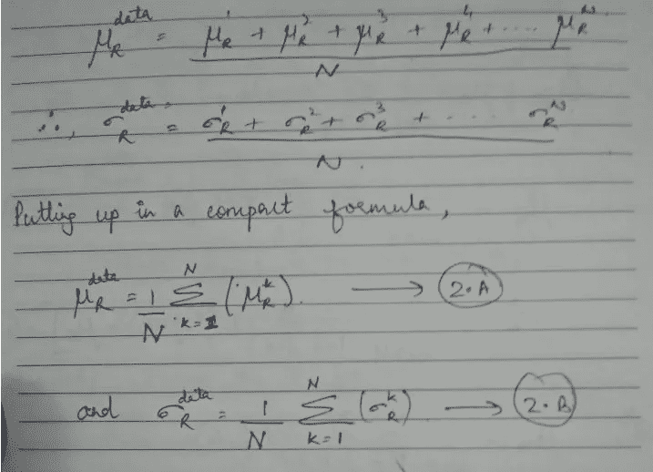
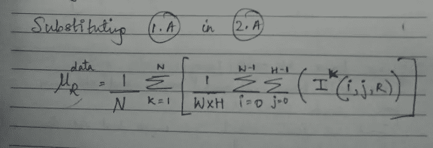
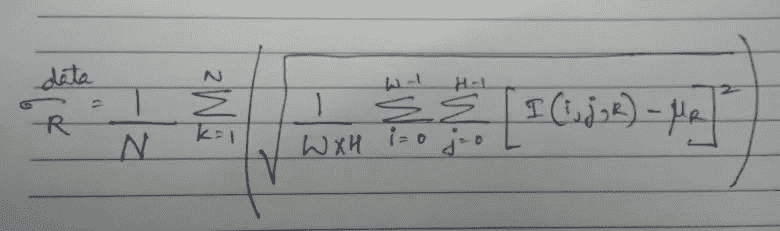
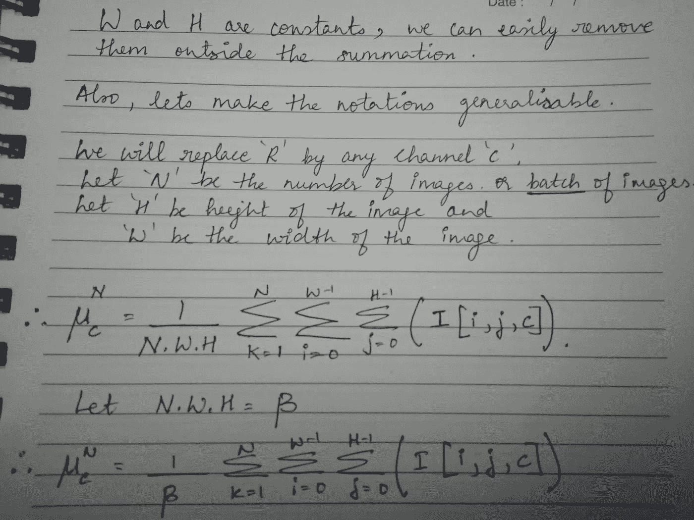
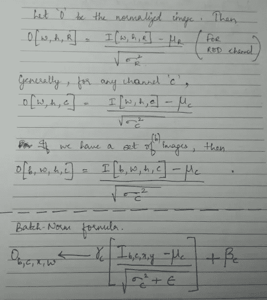

# 理解批处理规范化算法背后的数学原理。

> 原文：<https://medium.com/analytics-vidhya/understanding-the-math-behind-batch-normalization-algorithm-part-1-ad5948631ab7?source=collection_archive---------5----------------------->

注意文中的平均激活公式，我们将在本文中得出这个(或推导出)精确的公式。

> 在我告诉你批处理范数数学之前，我想推导出一个数据标准化(或规范化)的公式，我们通常在大多数深度学习任务中作为预处理步骤来做，并尝试将这个标准化公式与批处理规范化公式联系起来。

假设我们有一个大小为(400，600，3)的图像，对应于它的高度、宽度和通道。参数‘c’对应于红色、绿色和蓝色通道，表示我们想要标准化该图像。
现在，每当我们想要正常化一个 RGB 图像，我们就用通道方式，对吗？为了标准化 RGB 图像，我们需要每个通道的均值和标准差，在本例中，是指红色、绿色和蓝色通道。

如果我们想计算红色通道的平均值，我们只需对 R 通道中的所有像素求和，然后除以它的像素数。如果我们想找到它的标准差，我们只需取整个通道的平均平方差及其均值，然后再求平方根。在数学符号中，我们可以用下面的方法来写。

**计算图像红色通道均值和方差的公式。**

在上图中，我们有一个计算红色通道的均值和方差的公式。然而，我们需要的是标准差，而不是方差，所以只需求方差的平方根，我们最终会得到红色通道的标准差。请注意，我只向您展示了红色通道的公式。别担心，我们可以将相同的公式应用于蓝色和绿色通道的查找平均值和标准差。

一旦我们有了每个通道的平均值和标准差，我们只需简单地取图像，用其对应的平均值减去每个通道，然后除以其对应的标准差，最后我们将得到一个归一化的图像。

> **本质上，我想说的是，每当我们想要归一化图像数据时，我们总是按通道方式进行。例如，我将此图像传递到 VGG-16 网络，并提取特征图 af 大小(50，50，128)-(T8)(h，w，c)，并且(出于某种目的)我想标准化此特征图，我将应用相同的公式。
> 不用说，我将获得 128 个通道中每一个的平均值和标准差，用对应的平均值减去每个通道，再除以标准差，得到一个归一化的特征图。**

上述归一化公式仅适用于一幅图像。通常，我们总是有一个大的 RGB 图像集(比如 N 个这样的*训练*图像),我们希望将它们全部归一化。
一种方法是通过相应的平均值和标准差来标准化每个 RGB 图像。但这没有意义。
因此，通常，我们所做的是计算每幅图像的平均值和标准差，并取平均值(称之为全局平均值和标准差)。在这种情况下，我们的全局方法和 Std-dev 拥有所有图像的信息。下一步是用这一组平均值和标准差来标准化我们的每一幅图像。
我们可以很容易地将这一步总结成一个很好的公式(2。a 和 2。b)如下所示。

请注意等式 2。a 和 2。b 和等式 1。a 和 1。b 来自之前的图像。我们将把这两个方程合并成一个庞大的公式。

> 让我们把等式 1。a 内线 2.A。

这里，R 代表红色通道。这是红色通道的全球平均值。现在，我希望你知道如何计算蓝色和绿色通道的全局平均值。

这是红色通道的整体标准差。你可以用同样的公式计算蓝色和绿色通道。

> 接下来是精彩的部分，我将重构上面所示的通道均值公式(同样的重构也可以用于通道方差，非常简单。！)**并将跳转到批量正常化**。

**最后一个方程看起来与任何通道“c”的平均激活方程完全一样**

> 请注意，图片末尾显示的等式与研究论文中提到的等式完全相似。
> 为了澄清这两个等式是相似的，让我们总结一下 ***我是从什么主题开始的，以及我是如何结束的*** 。
> **1。**
> 2。后来，我们想要标准化的不是一个单独的图像，而是一批图像(比如 N 个图像)。所以我们想出了一个寻找全局通道的方法，只是通过对 N 批图像的单个通道进行平均，并找到了一个公式。
> 3。现在，我们看到这个公式类似于批量定额论文中的公式。

在结束之前，让我再次提醒你，我们首先想要标准化我们的数据，这就是为什么我们提出了均值和方差(*我们还提出了 Std-Dev 的公式，但我们不会使用它，你过一会儿就会知道*)。
所以，让我们用均值和方差来标准化我们的数据，看看公式会是什么样子。
我已经推导出归一化图像的公式，并且写下了批量归一化的公式。

**看。！**输入归一化和批量归一化公式看起来非常相似。

> 从上面的图像中，我们注意到两个方程看起来很相似，除了有一个 **γc，βc，**和一个**ε**参数
> 如果我们将这些参数分别设置为 1，0 和 0，我们将得到我所推导的精确方程。

我们再总结一下。
1。我们提出了一个输入数据标准化的公式，通过调整 Batch_Normalization 方程中的一些参数，我们得到了类似的方程。 ***那么输入数据-归一化和批量-归一化有什么区别和相似之处。？？？？？*** 一个相似，两个不同。

> 相似性 1。通道方式均值和通道方式方差的计算方法与我们计算 R、G 和 B 通道的通道方式均值和方差的方法完全相同。然而，在 BN 中，通道通常是巨大的，宽度和高度相当小。
> **区别 1** 。我们将只对输入数据进行一次规范化。然而，在 BN 中，由于小批量是随机抽样的，因此会计算每个小批量的平均值和标准差。
> **差 2** 。有三个额外的参数，Gamma(可学习的标准差)、Beta(可学习的平均值)和 Epsilon(通常保持不变(0.00001)，因为如果我们的标准差变为零，这将是一个巨大的难题)。
> **区别 3 和最重要的区别** :-考虑我们通过标准化输入数据并在一些卷积层之间使用批处理标准化层来训练分类模型。现在，当谈到推理时，我们需要规范化我们的输入，因为我们已经在训练步骤中完成了这一步。因此，我们将使用在训练阶段获得的全局平均值和 Std-dev。
> 好吧，那么我们的批次标准层的均值和方差呢？
> 我们没有批次标准层的全局平均值和方差，事实上它们总是随每个小批次而变化，那么使用哪个小批次的平均值和标准差呢？？？？
> 这又引出了一个叫做移动平均线和移动方差的概念。我们将使用这些移动平均值和方差作为批量定额。
> 简单地说，我们将取一个完整时期的平均值和方差的累积值，并除以小批量的数量。
> 还有另一种方法叫做**指数加权平均**方法，大多数深度学习库使用这种方法作为找到这些移动平均值和移动标准差的默认方法。

结论:-批处理规范化就像我们的输入数据规范化的核心。正是这些细微的细节使它成为一个全新的概念。

我使用过的资源[https://arxiv.org/abs/1806.02375](https://arxiv.org/abs/1806.02375)

呆在家里，注意安全。！:-)