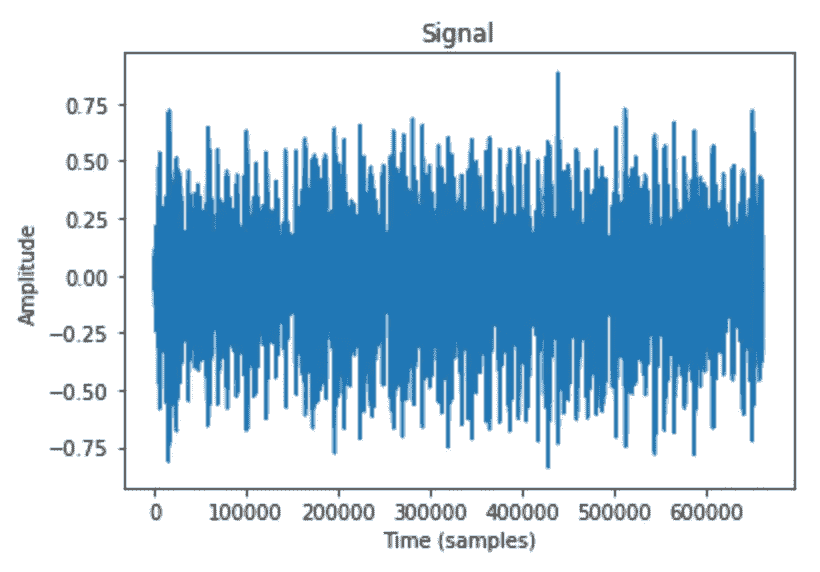
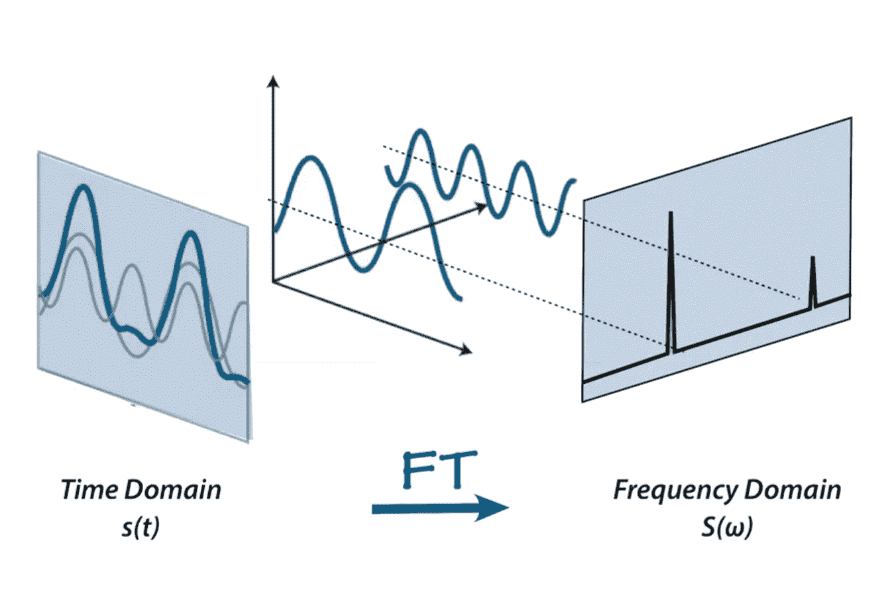
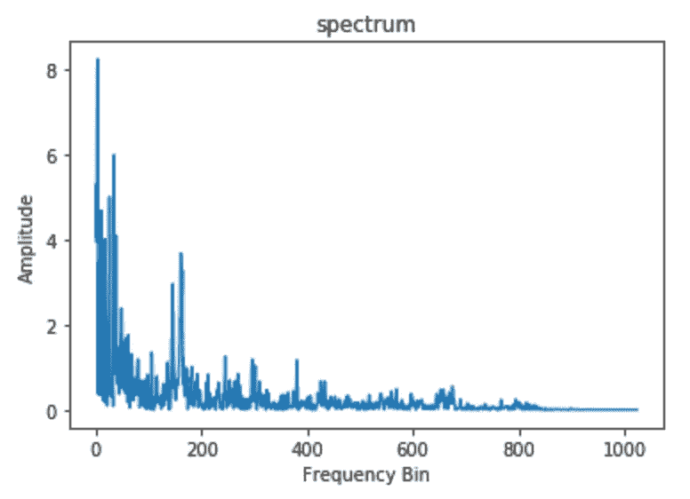
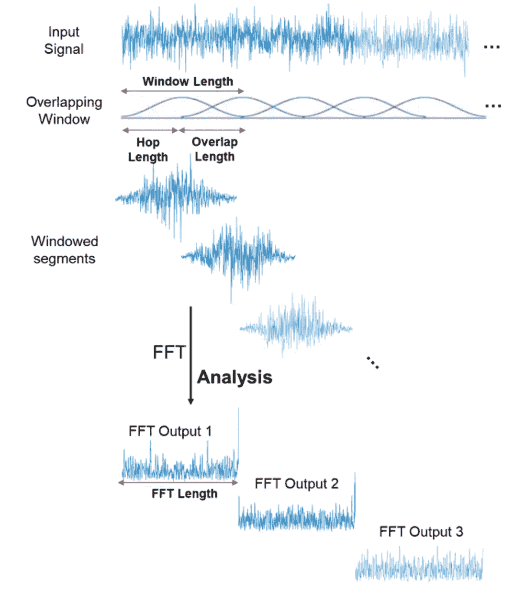
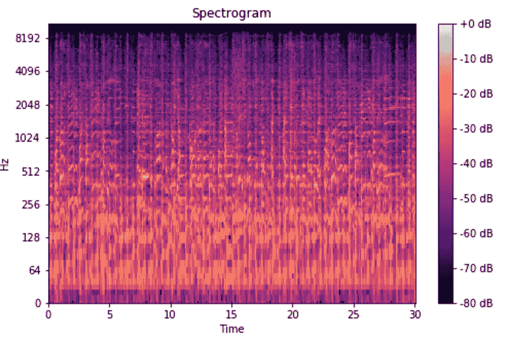
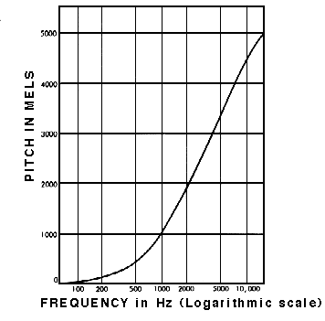
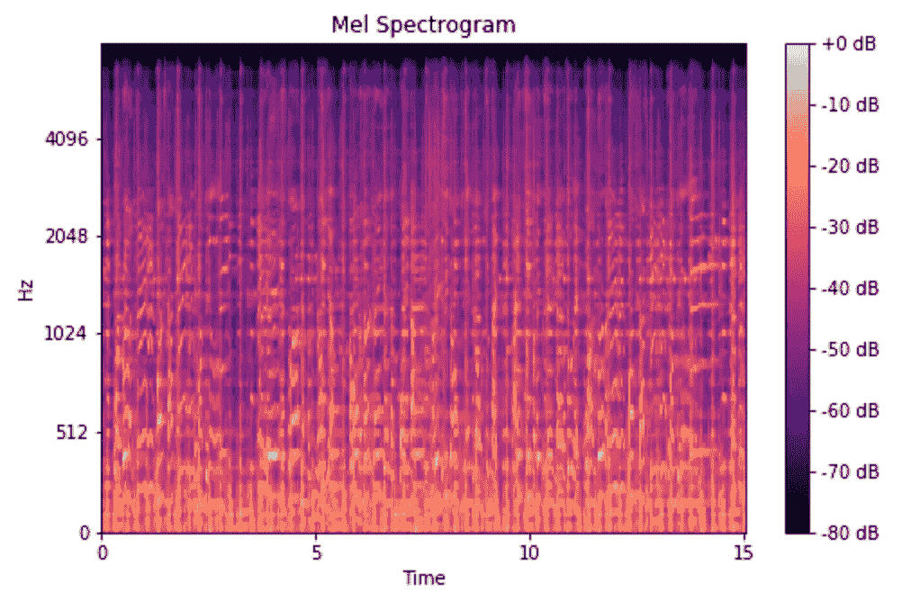

# 了解 Mel 光谱图

> 原文：<https://medium.com/analytics-vidhya/understanding-the-mel-spectrogram-fca2afa2ce53?source=collection_archive---------0----------------------->


图片来自 [Gradiom](https://gradiom.ch/project/signal-processing/)

如果你和我一样，试图理解 mel 光谱图并不是一件容易的事情。你读一篇文章只是为了引向另一篇…另一篇…另一篇…继续下去。我希望这个简短的帖子能够澄清一些困惑，并从头开始解释 mel 光谱图。

# 信号

一个**信号**是一个特定量随时间的变化。对于音频，变化的量是空气压力。我们如何以数字方式获取这些信息？我们可以采集一段时间内的气压样本。我们采样数据的速率可以变化，但最常见的是 44.1kHz，即每秒 44，100 个样本。我们捕捉到的是信号的**波形**，这可以用计算机软件进行解释、修改和分析。

```
import librosa
import librosa.display
import matplotlib.pyplot as plty, sr = librosa.load('./example_data/blues.00000.wav')plt.plot(y);
plt.title('Signal');
plt.xlabel('Time (samples)');
plt.ylabel('Amplitude');
```



这太棒了！我们有一个音频信号的数字表示，我们可以使用它。欢迎来到信号处理领域！你可能想知道，我们如何从中提取有用的信息？它看起来像一团乱麻。这就是我们的朋友傅立叶的作用。

# 傅立叶变换

音频信号由几个单频声波组成。当随着时间的推移对信号进行采样时，我们只捕获结果幅度。**傅立叶变换**是一个数学公式，它允许我们将信号分解成其单独的频率和频率的振幅。换句话说，它将信号从时域转换到频域。结果被称为**光谱**。



图片来自[阿沃斯国际](https://aavos.eu/glossary/fourier-transform/)

这是可能的，因为每一个信号都可以分解成一组正弦和余弦波，叠加起来就是原始信号。这是一个著名的定理，被称为**傅立叶定理。**点击[这里](https://youtu.be/UKHBWzoOKsY)如果你想要一个很好的直觉，为什么这个定理是正确的。如果你想在这里了解更多，还有一个由 3Blue1Brown 制作的关于傅立叶变换的视频。

**快速傅立叶变换(FFT)** 是一种可以高效计算傅立叶变换的算法。它广泛应用于信号处理。我将在示例音频的加窗片段上使用该算法。

```
import numpy as npn_fft = 2048
ft = np.abs(librosa.stft(y[:n_fft], hop_length = n_fft+1))plt.plot(ft);
plt.title('Spectrum');
plt.xlabel('Frequency Bin');
plt.ylabel('Amplitude');
```



# 声谱图

快速傅立叶变换是一种强大的工具，可以让我们分析信号的频率成分，但如果信号的频率成分随时间而变化呢？诸如音乐和语音的大多数音频信号就是这种情况。这些信号被称为**非周期性**信号。我们需要一种方法来表示这些信号随时间变化的频谱。你可能会想，“嘿，我们不能通过对信号的几个加窗段执行 FFT 来计算几个频谱吗？”是啊！这正是我们所做的，它被称为**短时傅立叶变换。**FFT 是在信号的重叠窗口段上计算的，我们得到了所谓的**频谱图。**哇！有太多要理解的了。这里发生了很多事。一个好的视觉是有序的。



图片来自 [MathWorks](https://www.mathworks.com/help/dsp/ref/dsp.stft.html)

你可以把频谱图想象成一堆叠在一起的 FFT。这是一种直观表示信号响度或幅度的方式，因为信号以不同频率随时间变化。在计算声谱图时，还有一些额外的细节在幕后进行。y 轴转换成对数刻度，颜色维度转换成分贝(你可以把这个当成振幅的对数刻度)。这是因为人类只能感知非常小且集中的频率和振幅范围。

```
spec = np.abs(librosa.stft(y, hop_length=512))
spec = librosa.amplitude_to_db(spec, ref=np.max)librosa.display.specshow(spec, sr=sr, x_axis='time', y_axis='log');
plt.colorbar(format='%+2.0f dB');
plt.title('Spectrogram');
```



瞧啊。只用几行代码，我们就创建了一个声谱图。好的。我们快到了！我们已经牢牢掌握了“声谱图”部分，但“梅尔”呢他是谁？

# 熔融标度

研究表明，人类不会在线性尺度上感知频率。与高频相比，我们更擅长检测低频中的差异。例如，我们可以轻松分辨 500 Hz 和 1000 Hz 之间的差异，但我们几乎无法分辨 10，000 Hz 和 10，500Hz 之间的差异，即使两对之间的距离相同。

1937 年，史蒂文斯、沃尔克曼和纽曼提出了一种音高单位，使得音高的相等距离对听者来说听起来是相等的距离。这被称为**梅尔标度。**我们对频率进行数学运算，将其转换为 mel 标度。



图片来自[西蒙弗雷泽大学](https://www.sfu.ca/sonic-studio-webdav/handbook/Mel.html)

# 梅尔光谱图

**梅尔频谱图**是一个频谱图，其中频率被转换为梅尔标度。我知道，对吧？谁会想到呢？令人惊讶的是，在经历了所有这些精神体操来试图理解 mel 谱图之后，它只需要几行代码就可以实现。

```
mel_spect = librosa.feature.melspectrogram(y=y, sr=sr, n_fft=2048, hop_length=1024)
mel_spect = librosa.power_to_db(spect, ref=np.max)librosa.display.specshow(mel_spect, y_axis='mel', fmax=8000, x_axis='time');
plt.title('Mel Spectrogram');
plt.colorbar(format='%+2.0f dB');
```



# 概括起来

这需要吸收大量信息，尤其是像我这样的信号处理新手。然而，如果你继续回顾这篇文章中阐述的概念(并花足够的时间盯着墙角思考它们)，它将开始变得有意义！让我们简单回顾一下我们都做了些什么。

1.  我们采集了一段时间内的气压样本，以数字方式表示音频信号
2.  我们使用**快速傅立叶变换**将音频信号从时域映射到频域，并对音频信号的重叠窗口段执行此操作。
3.  我们将 y 轴(频率)转换为对数标度，将颜色维度(振幅)转换为分贝，形成了**声谱图**。
4.  我们将 y 轴(频率)映射到**梅尔标度**上，形成**梅尔谱图**。

就是这样！听起来很简单，对吧？嗯，不完全是，但我希望这篇文章能让梅尔光谱图不那么吓人。我花了很长时间才理解它。不过，在那天结束时，我发现梅尔并不是那么冷漠。

> 如果你想看看这个主题的一个很酷的应用，可以看看我关于音乐流派分类的帖子，在那里我使用 mel spectrograms 来训练一个卷积神经网络来预测歌曲的流派。它做得怎么样？在这里了解！