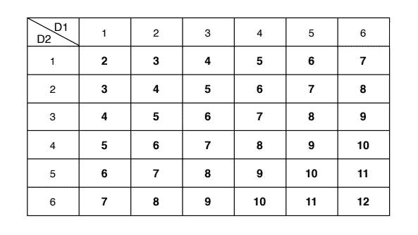
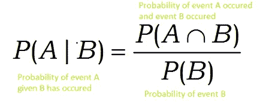
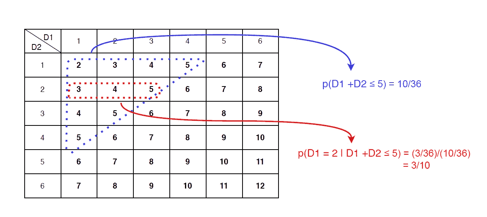

# 理解朴素贝叶斯分类器第 1 部分:条件概率

> 原文：<https://medium.com/analytics-vidhya/understanding-the-naive-bayes-classifier-part-1-conditional-probability-47b44a00228c?source=collection_archive---------34----------------------->

你需要理解机器学习算法背后的数学，才能成为一名真正的数据科学家。开始机器学习之旅的工程师和开发人员迟早会意识到，要想在该领域取得成功，必须对机器学习背后的数学有很好的理解。如果你用正确的方法学习，数学会非常有趣和直观。

最后，我的博客帖子的主要目的是给出一个善意的建议，关于数学在机器学习中的重要性，以及掌握这些主题的必要主题和有用资源。对于初学者来说，你不需要大量的数学知识来开始机器学习，当你掌握更多的技术和算法时，你可以在移动中学习数学。

好吧，我们开始吧。

这篇文章讨论了概率中的一个概念，称为 ***条件概率*** ，它最终成为称为**朴素贝叶斯分类器**的强大分类器集的基本构件之一。

在统计学中，**朴素贝叶斯分类器**来自基于应用**贝叶斯定理**的*‘概率分类器’*家族。

这种模式的美妙之处在于它的简单和快速。这使得朴素贝叶斯分类器在诸如垃圾邮件检测、天气预报等文本分类应用中更受欢迎。

# 朴素贝叶斯分类器的工作原理

现在让我们看看朴素贝叶斯分类器是如何工作的。

为了理解朴素贝叶斯分类器是如何工作的，我们应该知道什么是条件概率。

## 条件概率— P(A|B)

我们试着用一个例子来理解条件概率。

假设我们掷出一组 2 个骰子，然后取出现的所有面的和。

让 D1:在滚动模具 1 上获得的值，和

D2:在滚压模 2 上获得的值。

答:D1 + D2

事件 A 的示例空间如下所示:

假设我们需要找出当 D1+D2≤ 5 时，D1 = 2 的概率是多少。

这个问题在统计学上可以表述为寻找' *P(D1 = 2 |(D1 + D2≤ 5))'* 。

我们通过寻找条件概率直观地做的是，我们在寻找一个事件发生的概率，给定另一个事件已经发生的条件。

条件概率的公式是:

假设事件 B 已经发生，这个公式给出了事件 A 发生的概率。

所以上述问题表述为在 D1+D2 ≤ 5 的条件下，求 *P(D1 = 2)* 。因此，这个问题的样本空间减少到 D1+D2 ≤ 5 的出现几率。

所以，*p(D1 = 2 |(D1+D2≤5))= p((D1 = 2)*⋂*(D1+D2≤5))/p(D1+D2≤5)*

*这样，P(D1 = 2 |(D1+D2≤5))=(3/36)/(10/36)= 3/10*

为了完全理解朴素贝叶斯算法，条件概率是非常基本的步骤。在接下来的博客中，我们将深入探讨最终为我们设计朴素贝叶斯分类器的更多概念。