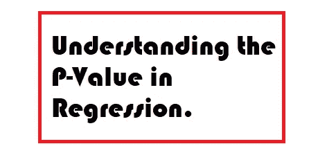
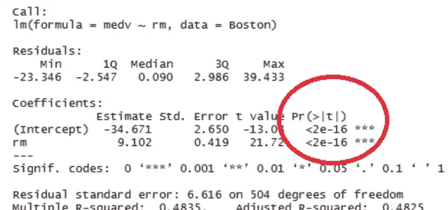
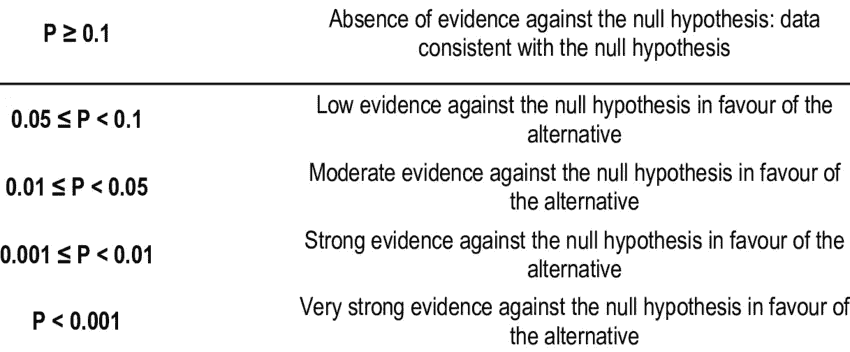

# 理解回归中的 P 值。

> 原文：<https://medium.com/analytics-vidhya/understanding-the-p-value-in-regression-1fc2cd2568af?source=collection_archive---------0----------------------->

## 什么是 P 值？

p 值是一种统计检验，它确定统计假设检验的极端结果的概率，认为零假设是正确的。

它主要用作拒绝点的替代，提供了拒绝零假设的最小显著性水平。

> 在 R 中，当您对模型 stars 或 astrix 应用**summary()**函数时，该函数会出现在 P 值旁边。P 值旁边的星数越多，变量越显著。如下图所示。

## 如何解读线性模型的 P 值？

如您所知，P 值提供了假设检验的概率，因此在回归模型中，每个自变量的 P 值检验自变量和因变量之间“不相关”的零假设，这也有助于确定在样本中观察到的关系也存在于更大的数据中。

因此，如果 P 值小于显著性水平(通常为 0.05)，那么您的模型与数据非常吻合。

> 显著性水平是当零假设为真时拒绝零假设的概率。

**但是为什么 P 值应该小于 0.05 呢？**

显著性水平为 0.05 表示当没有实际差异时，得出变量之间存在差异的结论的风险为 5%。换句话说，如果一个变量的 P 值小于您的显著性水平，那么样本数据提供了足够的证据来拒绝整个总体的零假设。或者，大于 0.05 的 P 值表示弱证据，不能拒绝零假设。

有关 P 值背后的数学，请查看链接(h[ttps://www . wall street mojo . com/P-Value-formula/](https://www.wallstreetmojo.com/p-value-formula/))

喜欢我的文章？请为我鼓掌并分享它，因为这将增强我的信心。此外，我每周日都会发布新文章，所以请保持联系，以了解数据科学和机器学习基础系列的未来文章。

另外，如果你想的话，可以在 linkedIn 上联系我。

照片由 [Alex](https://unsplash.com/@alx_andru?utm_source=medium&utm_medium=referral) 在 [Unsplash](https://unsplash.com?utm_source=medium&utm_medium=referral) 上拍摄