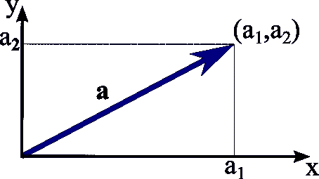

# 理解向量在自然语言处理中的作用

> 原文：<https://medium.com/analytics-vidhya/understanding-the-role-of-vectors-in-natural-language-processing-55f1632e17ff?source=collection_archive---------12----------------------->

**自然语言处理:**

由机器来处理、理解和分析人类语言是人工智能的子领域。在自然语言处理中有大量的应用，如机器翻译、语音到文本、文本到语音识别、垃圾信息分类等…


在这个博客中，我们将看到向量在自然语言处理中的作用。

在深入 NLP 之前，让我们看看线性代数中的向量是什么

# **矢量:**

Vector 是一个对象的属性列表。简单来说，就是一串数字。这是识别空间(可能是二维或多维空间)中一个点的方法



二维坐标中的向量(a1，a2)

# **矩阵:**

矩阵是包含一组向量的对象。

如果我有两个向量，形式为
2x + 3y
&
4x + 5y
，那么矩阵将会是这样的

现在我们将看到为什么我们在自然语言处理中使用向量空间的概念。

# **为什么在自然语言处理中使用向量？**

我们无法将单词输入到机器学习或深度学习建模的算法中。反过来，我们必须将文本数据转换成数字数据的形式。所以矢量的概念开始发挥作用。为此，文本数据被转换成矢量形式的数值。自然语言处理中有许多预处理技术，以便将文本数据输入到算法中。

# **特征表示:**

在机器学习算法中，在我们将数据输入算法之前，我们以多种方式对数据进行预处理，如插补、归一化、标准化和特征工程。我们稍后将详细讨论它们。同样，在 NLP 中，我们必须对数据进行预处理，提取重要的单词，并从句子中删除不太重要的单词(如 and、of、are、is 等)。)

在所有这些过程之后，我们有一些提取出来的词叫做语料库。从语料库中，我们将构建一个嵌入矩阵，如下图所示。


嵌入矩阵

在上图中，值是矩阵的形式，每一列是一个向量。每个列值代表语料库中的单词(单词向量)，行代表特征。每个列值下面的数字(Man-5391)表示该单词在词汇表中的索引位置。

如果我们在那个矩阵里观察清楚，在第一排性别里，男人和女人，国王和王后，有相反的符号，表示他们的关系和性别，但是苹果和橘子之间没有发生这样的值相似性。如果我们拿下一排皇室成员来说，国王和王后比男人和女人有更高的价值。如果我们看到最后一行的 food，apple 和 orange 的值比其他单词的值高。因此，通过这样做，嵌入矩阵有助于将文本数据转换成数字形式，而不改变单词之间的实际意义和关系。

# 二维表示

如果我们以二维空间的形式画出这些向量，我们将更好地了解这些向量在嵌入矩阵中的位置。

就像是，


嵌入矩阵的 2D 表示

在图中，我们可以看到国王和王后在附近，在一定距离后，有男人和女人。苹果、橘子和葡萄是分组的，同样地，数字和动物也在图中被很好地分类。

这样，我们将通过使用向量对文档或段落中的文本数据进行预处理，以便屈服于各种算法，用于垃圾邮件分类、推文情感分析等目的。

# **应用:**

为了理解 python 中的实现，让我们看一个 NLP 的实际应用。

我们将研究使用文本数据集进行假新闻分类的例子。

一旦我们将 CSV 数据加载到 panda 的数据框中，我们将继续进行文本预处理。它会像

```
**from** **nltk.corpus** **import** stopwords
**import** **re**
ps=PorterStemmer()
corpus=[]

**for** i **in** range(0,len(message)):
    review=re.sub('[^a-zA-Z]',' ',message['title'][i])
    review=review.lower()
    review=review.split()
    review=[word **for** word **in** review **if** **not** word **in**     stopwords.words('english')]
    review=' '.join(review)
    corpus.append(review)
```

Nltk 是用于 NLP 预处理文本数据的 python 库，re 是正则表达式库。

在上面的代码中，首先我们在 for 循环中使用正则表达式只提取文本数据。

```
review=re.sub('[^a-zA-Z]',' ',message['title'][i])
```

它只接受包含 a-z 和 A-Z 的单词，其中 message 是包含数据的数据帧。

接下来，我们使用 lower 函数来小写所有的文本。

```
review=review.lower()
review=review.split()
```

以便算法不会以不同的方式对待小写和大写单词(GOOD = good)。然后我们把每个单词从句子中分离出来。

然后，我们必须删除不太重要的单词，这些单词用下面的代码称为停用词。

```
review=[word **for** word **in** review **if** **not** word **in**     stopwords.words('english')]
```

一些停用词是，像，of，is，and，are，was，were，这些词被认为对句子没有任何意义。然后，我们将所有这些单词添加到一个列表中，形成语料库。

接下来，我们将使用下面的代码构建嵌入矩阵

```
cv=CountVectorizer(max_features=5000,ngram_range=(1,3))
x=cv.fit_transform(corpus).toarray()
```

其中 x 是嵌入矩阵

```
x.shape
// (18285, 5000)
```

其中 18285 代表语料库的数量，5000 是我们在上面的代码中提到的特征的数量。

我们还可以看到那些特征是什么。我们不需要指定这些特性，它们内置在 CountVectorizer 中。

```
cv.get_feature_names()[50:75]
//OUTPUT:
['administration',
 'admiral',
 'admit',
 'admits',
 'admitted',
 'ads',
 'adults',
 'advance',
 'advice',
 'adviser',
 'advisor',
 'advocates',
 'affair',
 'affairs',
 'affordable',
 'afghan',
 'afghanistan',
 'africa',
 'african',
 'african american',
 'ag',
 'age',
 'agencies',
 'agency',
 'agenda']
```

然后，我们将这些 x 数据和 y 标签输入到朴素贝叶斯算法中进行分类。

你可以在这里查看假新闻分类器[的完整 python 代码](https://github.com/bagavathypriyanavaneethan/Natural-Language-Processing/blob/master/fake-news-classifier-nlp.ipynb)

感谢阅读，欢迎反馈

# 问候，
巴格拉维亚 N

# **参考:**

[https://www . coursera . org/learn/class ification-vector-spaces-in-NLP](https://www.coursera.org/learn/classification-vector-spaces-in-nlp)