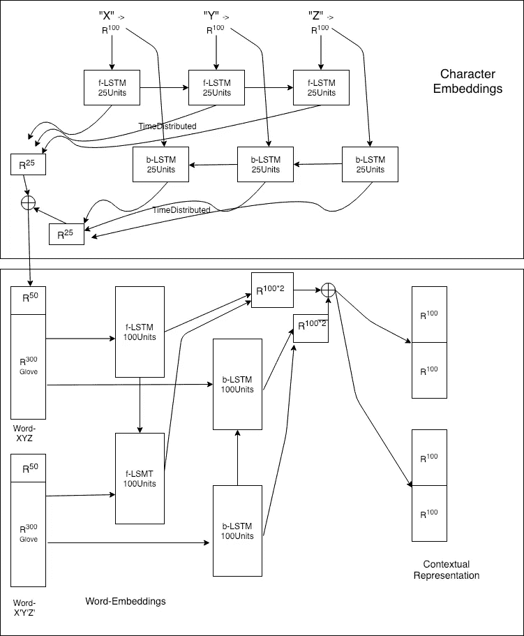
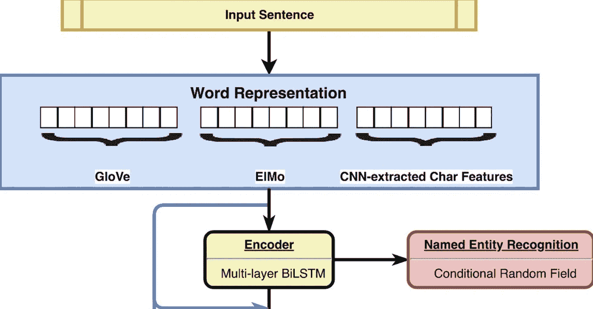

# 理解搜索查询—第二部分

> 原文：<https://medium.com/analytics-vidhya/understanding-the-search-query-part-ii-44d18892283f?source=collection_archive---------0----------------------->

## 机器学习

> “人工智能比我们的智能小吗？”—斯派克·琼斯

现在，在这一部分，我们将从云基础设施的角度讨论 ML 模型和部署。

# ML 模型，我们称之为【鳄鱼模型】:)，

由人工神经网络组成，特别是时间序列 NN，即基于 [LSTM(长期短期记忆)](http://colah.github.io/posts/2015-08-Understanding-LSTMs/)和 CRF(卷积随机场)作为概率模型的递归神经网络。参考—[https://guillaumegenthial . github . io/sequence-tagging-with-tensor flow . html](https://guillaumegenthial.github.io/sequence-tagging-with-tensorflow.html)

大体上，它可以分为三个部分:

**1。单词表示**:首先，我们需要以特征向量的形式表示搜索查询中的单词，为此我们使用了预先训练的单词嵌入模型，该模型是作为斯坦福大学的开源项目开发的，名为 [GloVe](https://nlp.stanford.edu/projects/glove/) 。它提供了嵌入单词的 300 维向量。我们将把 ElMo 嵌入和这个连接在一起。

**2。上下文单词表示:**为了找到查询中单词之间的上下文信息，它通过一个双向 LSTM，然后是一个密集层，产生与标签数量相等的维数的输出。

**3。解码**:现在，我们有了每个单词的向量表示，我们应用 CRF 来寻找标签的最佳可能组合。

现有技术模型有三种变体，如下所示:

**1。same 通用报告格式:**由与上述相同的三部分组成。

**2。CharLSTM-LSTM-CRF:** 我们使用 LSTM 在字符级别创建了一个单词嵌入，因为可能有一些单词(如品牌)可能不在预训练单词嵌入模型(如 GloVe)的字典中。



模型网络架构

**3。CharConv-LSTM-CRF** :与上述模型相同，唯一不同的是用于生成字符级嵌入的神经网络，这里是 CNN 而不是 LSTM。

> 4.具有 Elmo 嵌入的查理斯姆-LSTM-CRF:



模型 2 的扩展

我们使用第二个模型 CharLSTM-LSTM-CRF 作为我们的用例，因为它比任何其他模型都表现得更好。我们也在努力实现模型 4。

# **tensor flow 中 Model-2【鳄鱼模型】的实现:**

T [**传感器流量 tf。数据 API**](https://www.tensorflow.org/api_docs/python/tf/data) 是一个很好的选择，当使用高级 API 类估算器时，可以将数据输入到您的模型中。它引入了 tf.data.Dataset 类，该类创建一个输入管道来读取数据。它有一个从生成器生成元素的方法`from_generator`。您也可以使用`map`方法进行特征工程。

```
#Accepting a method which yields the generator after reading each line from csv file
dataset = tf.data.Dataset.from_generator( functools.partial(generator_fn, words, tags), output_shapes=shapes, output_types=types)
```

得到数据集后，我们可以做更多的事情，比如:

```
# it will shuffle the the dataset first sampled from 100 elements, and then repeat the same dataset for 5 times- which can be used for iterating through number of epochs
dataset = dataset.shuffle(100).repeat(5)#creates the batch which is padded in the defaults shape and buffer 2500 records for the next iteration
dataset = (dataset.padded_batch(2500, shapes, defaults).prefetch(2500))
```

另一个扩展 tf.data.Dataset 的类名为 tf.data.TextLineDataset，它以 csv 文件名作为参数并为您读取。当您使用基于文件的数据集时，这个 API 将为您做大量的内存管理工作。例如，您可以读入比内存大得多的数据集文件，或者通过指定一个列表作为参数读入多个文件。

T[**ensor flow Estimator API**](https://www.tensorflow.org/guide/estimators)**使用自定义估值器，Tensorflow tf.data 已用于编写所有训练、建模和评估的代码。Tensorflow 中的自定义估算器有 **tf.estimator.Estimator** 类，它包装了由`model_fn`和**TF . Estimator . train _ and _ evaluate**实用函数指定的模型，该实用函数通过使用给定的**估算器来训练、评估和(可选地)导出模型。**该型号的`model_fn`如下:**

1.  **对于单词表示:**首先，生成字符嵌入:****

```
#For each sentence and words, we have a list of characters
#We find the index of character present in the dictionary of all characters
char_ids = vocab_chars.lookup(chars) #[sentence, words, chars] #Initialize a variable [total_number_of_chars, dimension of char_embedding=100] storing the initial embedding of all characters with some random floating point numbers
variable = tf.get_variable(
 ‘chars_embeddings’, [num_chars, params[‘dim_chars’]], tf.float32)#Lookup the embeddings of the chars in char_ids 
char_embeddings = tf.nn.embedding_lookup(variable, char_ids, validate_indices=False)  #[sentence, word, chars, char_dim=100]#Adding a dropout in the layer
char_embeddings = tf.layers.dropout(char_embeddings, rate=dropout,
 training=training) #[max_length of sentences in batch]
dim_words = tf.shape(char_embeddings)[1]#[max_length of words in all the sentences]
dim_chars = tf.shape(char_embeddings)[2]flat = tf.reshape(char_embeddings, [-1, dim_chars, params['dim_chars']])  #[sentence*max_words_in_sentence ,max_chars_in_all_words, char_dim=100]#making time major from batch major as required by tf.contrib.rnnt = tf.transpose(flat, perm=[1, 0, 2])#Initializing LSTM each having 25 units
lstm_cell_fw = tf.contrib.rnn.LSTMBlockFusedCell(25)
lstm_cell_bw = tf.contrib.rnn.LSTMBlockFusedCell(25)#Creating backward dir LSTM
lstm_cell_bw = tf.contrib.rnn.TimeReversedFusedRNN(lstm_cell_bw)#output having dim [max_chars_in_all_words, sentence*max_words_in_sentence, char_embd_size=25]#Here time_steps i.e.[sequence_length] = number of chars in each words
_, (_, output_fw) = lstm_cell_fw(t, dtype=tf.float32, sequence_length=tf.reshape(nchars, [-1]))#Reverse Bi-LSTM output
_, (_, output_bw) = lstm_cell_bw(t, dtype=tf.float32, sequence_length=tf.reshape(nchars, [-1]))output = tf.concat([output_fw, output_bw], axis=-1) # [max_chars_in_all_words, sentence*max_words_in_sentence, char_embd_size=25+25=50]#Reshape to [num_of_sentences, max_num_of_words, 50]
char_embeddings = tf.reshape(output, [-1, dim_words, 50])
```

****现在，同样生成单词嵌入:****

```
#For each sentence, we have a list of words
#We find the index of words present in the dictionary of all words
word_ids = vocab_words.lookup(words) #[sentence, words]#Getting the glove embeddings of all the words
glove = np.load(params[‘glove’])[‘embeddings’]#Appending an extra embeddings to return if some word is not found
variable = np.vstack([glove, [[0.] * params[‘dim’] ]])variable = tf.Variable(variable, dtype=tf.float32, trainable=False)#Look up the word embeddings in the dictionary we created as non-trainable
word_embeddings = tf.nn.embedding_lookup(variable, word_ids) #[sentence, word, glove_word_dim = 300]# Concatenate Word and Char Embeddings
embeddings = tf.concat([word_embeddings, char_embeddings], axis=-1)
#[sentence, word, 300+50=350]
```

****2。上下文单词表示法****

```
#Time major, input shape= [sentences, words, 350]
t = tf.transpose(embeddings, perm=[1, 0, 2]) #Forward and Backward lstm each of 100 units
lstm_cell_fw = tf.contrib.rnn.LSTMBlockFusedCell(100)
lstm_cell_bw = tf.contrib.rnn.LSTMBlockFusedCell(100)
lstm_cell_bw = tf.contrib.rnn.TimeReversedFusedRNN(lstm_cell_bw)# time steps i.e. [sequence_length] having number of words in each sentence
output_fw, _ = lstm_cell_fw(t, dtype=tf.float32, sequence_length=nwords) #[sentence, words, 100]
output_bw, _ = lstm_cell_bw(t, dtype=tf.float32, sequence_length=nwords) #[sentence, words, 100]# Concatenate the both forward and backword encoding 
output = tf.concat([output_fw, output_bw], axis=-1) #[sentence, words, 100+100=200]
output = tf.transpose(output, perm=[1, 0, 2]) 
#transponse to original shape#Create a dense layer to reduce the output to num of tags
logits = tf.layers.dense(output, num_tags) # [sentence, word, num_of_tag=6]
```

****3。使用 CRF 解码:****

```
#Create a variable and initialize as a transition score from one tags to another tags in determining the score of a particular combination of tags
crf_params = tf.get_variable(“crf”, [num_tags, num_tags], dtype=tf.float32)# determining the tags for each sentence # [sentence, no_of_tags]
pred_ids, _ = tf.contrib.crf.crf_decode(logits, crf_params, [length_of_tags])
```

**计算损耗并优化损耗:**

```
#Using Log likelihood as the loss function
log_likelihood, _ = tf.contrib.crf.crf_log_likelihood(logits, correct_tags, [length_of_tags], crf_params)
loss = tf.reduce_mean(-log_likelihood) #Using adam optimizer to minimize the loss
if mode == tf.estimator.ModeKeys.TRAIN:
     train_op = tf.train.AdamOptimizer().minimize(loss, global_step=tf.train.get_or_create_global_step())
```

# **TensorFlow 服务:**

**上述估计器模型可以保存在 dir 中，该 dir 使用方法`export_saved_model` 将推理图作为`SavedModel`导出到给定的 dir 中，该方法可以用于称为 [Tensorflow 服务的生态系统。](https://www.tensorflow.org/serving)**

```
estimator.export_savedmodel(‘/content/model’, serving_input_receiver_fn)
```

**上述方法采用保存模型参数的目录路径和类型为 [ServingInputReceiver](https://www.tensorflow.org/api_docs/python/tf/estimator/export/ServingInputReceiver) 的 input_fn，其中输入特征作为字典传递。**

**在对几个场景中创建的数据集进行训练之后，以上述方式导出 SavedModel。相同的模型被加载到 T [ensorflow 服务 API (docker-version)](https://www.tensorflow.org/serving/docker) 中，该 API 公开 REST API 并返回对应于特定搜索查询的预测标签。**

```
docker run -p 8501:8501 \
--mount type=bind,source=/path/to/my_model/,target=/models/my_model\
--mount type=bind,source=/path/to/my/models.config,target=/models/models.config \
-t tensorflow/serving --model_config_file=/models/models.config
```

**TF-Serving 模型对查询“无坚果巧克力”的响应如下所示:**

```
{
    "outputs": [
        [
            "NV-S",
            "PR-S",
            "BQ-S"
        ]
    ]
}
```

**标签“NV-S”:表示营养标签，“PR-S”:表示介词标签，“BQ-S”:表示基本查询。**

**关于部署部分的讨论将在[第三部分继续。](/@sonusharma.mnnit/understanding-the-search-query-part-iii-a0c5637a639)**